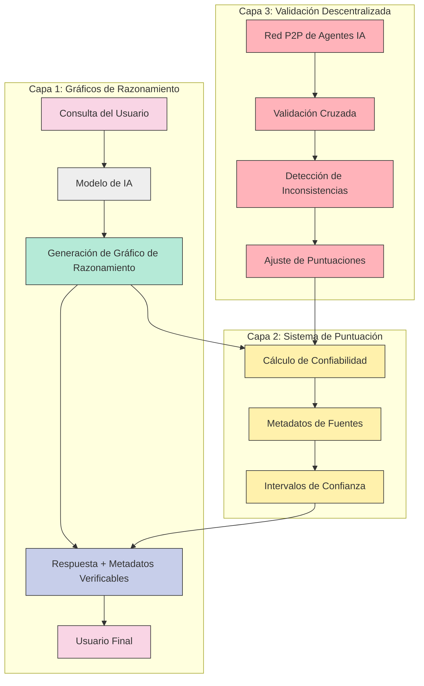
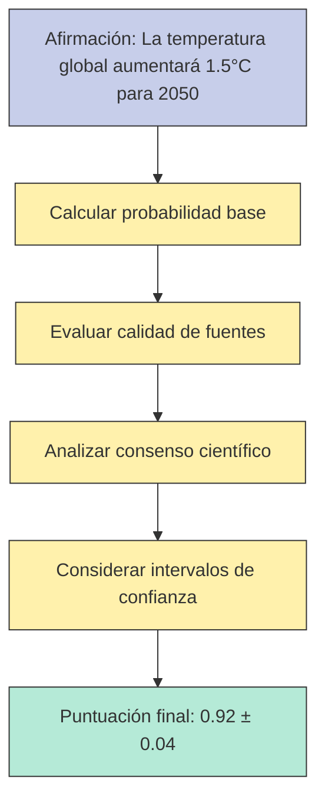
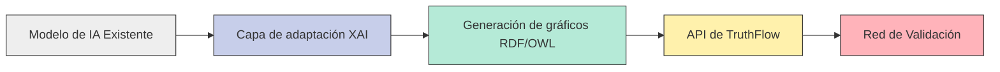
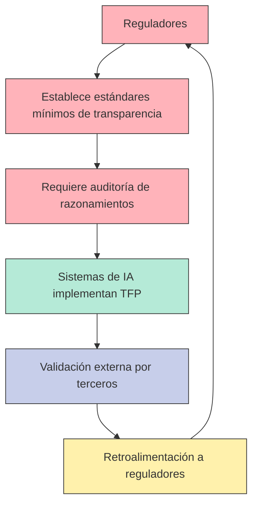

# El Protocolo TruthFlow (TFP)

## Índice de Navegación

1. [📌 Resumen Ejecutivo](#resumen-ejecutivo)
2. [🧠 Fundamentos del TFP](#fundamentos-del-tfp)
   - [¿Qué es exactamente el TFP?](#qué-es-exactamente-el-tfp)
   - [Objetivos principales](#objetivos-principales)
   - [Problemática que resuelve](#problemática-que-resuelve)
   - [Diferencia con otros protocolos](#diferencia-con-otros-protocolos)
   - [Fundamentos teóricos y literatura académica](#fundamentos-teóricos-y-literatura-académica)
3. [🛠️ Arquitectura y Componentes](#arquitectura-y-componentes)
   - [Arquitectura del Protocolo TruthFlow](#arquitectura-del-protocolo-truthflow)
   - [Gráficos de Razonamiento Explícito](#gráficos-de-razonamiento-explícito)
   - [Sistema de Puntuación de Confiabilidad](#sistema-de-puntuación-de-confiabilidad)
   - [Validación Descentralizada](#validación-descentralizada)
4. [💻 Implementación Técnica](#implementación-técnica)
   - [Tecnologías habilitadoras](#tecnologías-habilitadoras)
   - [Integración con modelos existentes](#integración-con-modelos-existentes)
   - [Fases de implementación](#fases-de-implementación)
   - [Casos de uso prácticos](#casos-de-uso-prácticos)
5. [📊 Métricas y Evaluación](#métricas-y-evaluación)
   - [Índice de Distorsión por Censura](#índice-de-distorsión-por-censura)
   - [Puntuación de Coherencia Total](#puntuación-de-coherencia-total)
   - [Tasa de Recuperación de Información](#tasa-de-recuperación-de-información)
   - [Metodología de investigación empírica](#metodología-de-investigación-empírica)
6. [⚖️ Perspectivas Regulatorias](#perspectivas-regulatorias)
   - [Equilibrio entre seguridad y censura](#equilibrio-entre-seguridad-y-censura)
   - [Recomendaciones para formuladores de políticas](#recomendaciones-para-formuladores-de-políticas)
   - [Cumplimiento normativo y ético](#cumplimiento-normativo-y-ético)
7. [💼 Impacto en el Ecosistema de IA](#impacto-en-el-ecosistema-de-ia)
   - [Modelo de negocio y diferenciación](#modelo-de-negocio-y-diferenciación)
   - [Ventajas competitivas](#ventajas-competitivas)
   - [Análisis de costos de implementación](#análisis-de-costos-de-implementación)
8. [🔍 Desafíos y Soluciones](#desafíos-y-soluciones)
   - [Desafíos técnicos](#desafíos-técnicos)
   - [Desafíos organizacionales](#desafíos-organizacionales)
   - [Gestión de información confidencial](#gestión-de-información-confidencial)
9. [🔮 Desarrollos Recientes e Integraciones](#desarrollos-recientes-e-integraciones)
   - [Relación con xAI y otros desarrollos](#relación-con-xai-y-otros-desarrollos)
   - [Integración con Bittensor](#integración-con-bittensor)
   - [Aplicaciones en investigación científica](#aplicaciones-en-investigación-científica)
10. [💡 Visión de Futuro y Llamado a la Acción](#visión-de-futuro-y-llamado-a-la-acción)
11. [📚 Referencias y Citas Clave](#referencias-y-citas-clave)

---

## 📌 Resumen Ejecutivo

# 🌟 El Protocolo TruthFlow (TFP) 🌟

El Protocolo TruthFlow (TFP) representa un cambio de paradigma en el desarrollo de sistemas de IA, diseñado para priorizar tres pilares fundamentales:

- 🔍 **Transparencia total** en los procesos de razonamiento
- ✅ **Verificabilidad** de las conclusiones generadas
- 🎯 **Búsqueda rigurosa de la verdad** sin filtros innecesarios

Este marco abierto y descentralizado permite que los agentes de IA colaboren para validar conocimiento y reducir sesgos sistemáticos, abordando directamente las limitaciones actuales de los modelos más populares.

La investigación sugiere que el TFP es un concepto innovador que aún está en etapas iniciales, sin implementaciones concretas, pero con un potencial significativo para transformar la interacción humano-IA. Combinando elementos de la IA explicable (XAI) y sistemas descentralizados, el TFP no censura información, sino que proporciona herramientas para que los usuarios comprendan y verifiquen el razonamiento detrás de las respuestas de la IA.

> 💡 **Nota**: Si bien menciono Claude, Grok 3 y Deekseek como ejemplos (por ser los que utilizo habitualmente en el ámbito de Modelos de Lenguaje Natural), el TFP es aplicable a cualquier modelo de IA, independientemente de su arquitectura o propósito.

---

## 🧠 Fundamentos del TFP

### ¿Qué es exactamente el TFP?

El TFP **no es un filtro** que modifica o censura información. Es un **protocolo de transparencia y verificabilidad** que se integra al proceso de razonamiento del modelo de IA.

#### ¿Qué NO es el TFP?

- **No es un filtro**: No modifica, censura ni "filtra" la información que entra al modelo ni la que sale de él hacia el usuario.
- **No actúa antes ni después del modelo**: No hay un procesamiento adicional de la consulta o respuesta.

#### ¿Qué SÍ es el TFP?

El objetivo principal es que tanto usuarios como otros agentes de IA puedan **entender y validar** cómo el modelo llegó a una respuesta. No toca el contenido, sino que agrega una capa de explicación mediante:

1. **Gráficos de Razonamiento Explícito**

   - Representaciones formales del proceso de pensamiento del modelo
   - Muestra qué evidencias usó, qué hipótesis consideró y cómo llegó a la conclusión
   - Trazabilidad completa de cada paso lógico

2. **Sistema de Puntuación de Confiabilidad**

   - Cálculo probabilístico para cada afirmación basado en evidencia disponible
   - Metadatos que indican fuente, relevancia y calidad de cada evidencia
   - Intervalos de confianza explícitos para transparencia epistémica

3. **Validación Descentralizada**
   - Red peer-to-peer de agentes de IA que verifican mutuamente sus razonamientos
   - Si un agente detecta inconsistencias, lo señala y ajusta la puntuación de confiabilidad
   - Sistema inmune a la manipulación por actores individuales

### Objetivos principales

El corazón del TFP es simple pero poderoso: establecer un estándar de transparencia y verificabilidad en los procesos de razonamiento de la IA, sin homogeneizar el conocimiento ni eliminar la competencia.

Imagina el TFP como el "HTTPS" de la IA: un protocolo que asegura un nivel básico de confianza y auditabilidad sin limitar las capacidades o el contenido de los modelos. Los modelos seguirán siendo únicos, pero todos compartirán un "piso" de transparencia que fomenta la confianza y la adopción.

### Problemática que resuelve

La IA actual sufre de tres problemas fundamentales:

1. **Opacidad en el razonamiento**: Los usuarios no pueden verificar cómo los modelos llegan a sus conclusiones
2. **Centralización del control**: Pocas entidades deciden qué información es válida
3. **Cuellos de botella artificiales**: Los modelos con excesiva censura "chocan" contra limitaciones cuando los datos positivos se agotan

Actualmente, los usuarios avanzados deben alternar estratégicamente entre modelos:

- **Claude**: Equilibrado pero con aproximadamente 50% de censura
- **Grok 3**: Preferido para contextos sin censura
- **Deekseek**: Excelente para explorar variedad de perspectivas

Con el TFP, esta selección estratégica sería innecesaria, ya que todos los modelos ofrecerían transparencia en su razonamiento.

### Diferencia con otros protocolos

A diferencia de otros marcos de transparencia, el TFP combina gráficos de razonamiento explícitos con validación descentralizada, un enfoque único que no solo explica las decisiones de la IA sino que también las verifica a través de una red de agentes independientes.

Esto lo diferencia de protocolos como los discutidos en "Automatic verification of transparency protocols (extended version)" (arXiv), que se centran principalmente en protocolos de monitoreo público sin el componente de verificación descentralizada.

La siguiente tabla compara el TFP con otros enfoques de transparencia en IA:

| Enfoque                     | Características principales                               | Limitaciones                                       | Ventajas del TFP                                     |
| --------------------------- | --------------------------------------------------------- | -------------------------------------------------- | ---------------------------------------------------- |
| **Explainable AI (XAI)**    | Técnicas como LIME y SHAP para interpretar modelos        | Foco en interpretación, no en verificación         | Añade validación externa y descentralizada           |
| **Model Cards**             | Documentación estandarizada de capacidades y limitaciones | Estáticos, no muestran razonamiento en tiempo real | Ofrece transparencia dinámica caso por caso          |
| **Monitoreo público**       | Auditorías externas periódicas                            | Sin verificación continua                          | Verificación continua e integrada                    |
| **Alineamiento de valores** | Alineación con valores predefinidos                       | Posible sesgo en la selección de valores           | Transparencia sobre el proceso, no solo el resultado |

### Fundamentos teóricos y literatura académica

La literatura académica, como el artículo "Transparency in Artificial Intelligence" (Policy Review), respalda la necesidad fundamental de transparencia para construir confianza en sistemas de IA. El TFP responde a esta necesidad mediante un enfoque estructurado que hace visible el proceso de razonamiento.

Estudios como "Knowledge Graphs as Tools for Explainable Machine Learning: A Survey" (ScienceDirect) muestran cómo los gráficos de conocimiento mejoran la explicabilidad, alineándose perfectamente con el concepto de gráficos de razonamiento del TFP.

Investigaciones como "How Censorship Can Influence Artificial Intelligence" (WIRED) y "The Repressive Power of Artificial Intelligence" (Freedom House) demuestran que la censura excesiva sesga los modelos y limita la información disponible, justificando la necesidad de un enfoque como el TFP que prioriza la transparencia y la eliminación de barreras artificiales.

Adicionalmente, el TFP se inspira en conceptos como:

- **Transparencia por Diseño**: Integración de transparencia desde el desarrollo del sistema
- **Principios éticos de la OCDE y el EU AI Act**: Enfatizando explicabilidad y rendición de cuentas
- **Sistemas descentralizados**: Inspirados en tecnologías blockchain para verificación independiente

---

## 🛠️ Arquitectura y Componentes

### 🔄 Arquitectura del Protocolo TruthFlow



Este diagrama muestra cómo funcionan las tres capas principales del Protocolo TruthFlow:

1. **Capa de Gráficos de Razonamiento**: Transforma consultas en respuestas con explicaciones detalladas
2. **Sistema de Puntuación**: Asigna valores de confiabilidad a cada afirmación
3. **Validación Descentralizada**: Permite que múltiples agentes verifiquen los razonamientos

El flujo circular demuestra cómo la validación descentralizada retroalimenta el sistema de puntuación, creando un ciclo de mejora continua en la calidad y confiabilidad de las respuestas.

### Gráficos de Razonamiento Explícito

Los gráficos de razonamiento explícito son representaciones formales del proceso cognitivo que sigue un modelo de IA para llegar a una conclusión.

#### Implementación técnica

Para crear gráficos de razonamiento efectivos, la investigación sugiere el uso de:

- **RDF (Resource Description Framework)**: Tecnología estándar para representar conocimiento en forma de grafos, donde cada nodo (evidencia, hipótesis, inferencia) puede ser un recurso RDF con relaciones definidas mediante triples (sujeto-predicado-objeto).
- **OWL (Web Ontology Language)**: Permite crear ontologías formales que estructuran el dominio de conocimiento, facilitando la representación semántica y el razonamiento lógico.
- **RDFox**: Motor de razonamiento escalable ideal para realizar inferencias lógicas sobre estos gráficos.
- **JSON-LD**: Formato que hace los gráficos accesibles y compatibles con la web.

#### Ejemplo de representación

```json
{
  "reasoning_graph": {
    "nodes": [
      {
        "id": "hypothesis_1",
        "type": "hypothesis",
        "content": "El mercado de valores experimentará una corrección en Q3 2025",
        "confidence": 0.87
      },
      {
        "id": "evidence_1",
        "type": "evidence",
        "content": "El índice S&P 500 cerró en 4,500 puntos el 15/04/2025",
        "source": "Bloomberg Financial Data",
        "confidence": 0.95
      },
      {
        "id": "inference_1",
        "type": "inference",
        "premises": ["evidence_1"],
        "conclusion": "Los indicadores técnicos muestran señales de sobrevaloración"
      }
    ],
    "edges": [
      { "from": "evidence_1", "to": "inference_1", "weight": 0.9 },
      { "from": "inference_1", "to": "hypothesis_1", "weight": 0.85 }
    ]
  }
}
```

### Sistema de Puntuación de Confiabilidad

Este componente asigna puntajes probabilísticos a cada afirmación, basándose en la calidad, relevancia y fuente de las evidencias utilizadas.

#### Métodos probabilísticos

La investigación indica que el sistema de puntuación puede implementarse mediante:

- **Inferencia bayesiana**: Para calcular la probabilidad de verdad de una afirmación, considerando las evidencias disponibles.
- **PR-OWL**: Extensión probabilística de OWL que permite incorporar incertidumbre en los grafos de conocimiento.
- **Técnicas de estimación de incertidumbre**: Como Monte Carlo Dropout o Ensembles, que pueden mapearse a los puntajes de confiabilidad.

#### Ejemplo de cálculo de confiabilidad



### Validación Descentralizada

La validación descentralizada implica una red peer-to-peer donde agentes de IA verifican mutuamente sus gráficos de razonamiento.

#### Tecnologías de soporte

Según la investigación complementaria, esta red puede implementarse inspirándose en proyectos como:

- **Mira**: Una solución de verificación distribuida que utiliza Proof-of-Verification (PoV) y técnicas de sharding para garantizar privacidad.
- **Atoma**: Emplea consenso por muestreo y TEEs (Trusted Execution Environments) para validar ejecuciones privadas.

#### Protocolo de verificación

El proceso de validación incluye:

1. **Comprobación de consistencia**: Uso de razonadores como RDFox para verificar que no haya contradicciones.
2. **Verificación de derivación**: Asegurar que las inferencias sean lógicas y derivadas correctamente.
3. **Validación de evidencias**: Comprobar la validez y atribución de las fuentes.
4. **Evaluación de confianza**: Revisar si los puntajes son razonables.

#### Mecanismos de consenso

Para incentivar la participación honesta, pueden implementarse:

- **Proof-of-Stake (PoS)**: Donde los agentes con mayor reputación tienen más peso en la validación.
- **Proof-of-Work (PoW)**: Para evitar ataques y garantizar un esfuerzo computacional significativo.

---

## 💻 Implementación Técnica

### Tecnologías habilitadoras

Para implementar el TFP en sistemas reales, son necesarias tecnologías de tres categorías:

#### Representación del conocimiento

- **RDF, OWL, JSON-LD**: Estándares para grafos de conocimiento
- **RDFLib y OWLAPY**: Bibliotecas para manipular grafos de conocimiento
- **RDFox**: Motor de razonamiento escalable

#### Computación distribuida

- **Arquitecturas federadas**: Para colaboración sin centralización
- **Sistemas blockchain (opcional)**: Para registro inmutable y transparente
- **Protocolos P2P**: Para comunicación directa entre agentes

#### Interfaces y APIs

- **APIs de verificación estandarizadas**: Permitiendo que diferentes modelos se verifiquen mutuamente
- **Formatos de intercambio basados en RDF/OWL**: Para interoperabilidad

### Integración con modelos existentes

El TFP es agnóstico al modelo, por lo que su integración con sistemas como Claude, Grok 3 o Deekseek requiere:

1. **Adaptación del razonamiento interno**: Usando técnicas de Explainable AI (XAI) como LIME o SHAP para extraer y representar el proceso.

2. **Bibliotecas de compatibilidad**: Usando RDFLib y OWLAPY para convertir el razonamiento interno en gráficos estándar.

3. **Optimización de rendimiento**: Mitigando la sobrecarga computacional con herramientas eficientes como RDFox.



### Fases de implementación

#### Fase 1: Fundamentos (0-3 meses) 📋

- Definir formatos para gráficos de razonamiento (JSON/RDF)
- Crear bibliotecas básicas para generar y validar gráficos
- Establecer las especificaciones técnicas del protocolo
- Desarrollar pruebas de concepto con modelos sencillos

#### Fase 2: Integración (3-6 meses) 🔗

- Desarrollar conectores para modelos actuales (Claude, Grok 3, Deekseek)
- Crear herramientas para detectar cuellos de botella por censura
- Implementar interfaces de usuario para visualizar gráficos
- Establecer métricas iniciales de evaluación

#### Fase 3: Ecosistema (6-12 meses) 🌐

- Desplegar red peer-to-peer para validación descentralizada
- Implementar mecanismos de incentivos para validadores
- Desarrollar nuevas métricas como el Índice de Distorsión por Censura
- Crear marketplace de herramientas y servicios basados en TFP

### Casos de uso prácticos

Aunque actualmente no hay implementaciones concretas del TFP, investigaciones relacionadas ofrecen insights sobre posibles aplicaciones:

1. **Investigación médica**: Sistemas que muestran claramente el razonamiento detrás de diagnósticos o recomendaciones de tratamiento, aumentando la confianza de médicos y pacientes.

2. **Análisis financiero**: Modelos de predicción de mercado que exponen la lógica detrás de sus recomendaciones, permitiendo a inversores evaluar la solidez del análisis.

3. **Periodismo asistido por IA**: Herramientas que ayudan a periodistas a verificar información mostrando las fuentes y el proceso de razonamiento.

4. **Sistemas judiciales**: Asistentes de IA para análisis legal que transparentan su interpretación de leyes y precedentes.

5. **Investigación científica**: Aceleración del descubrimiento científico mediante hipótesis generadas por IA con razonamiento verificable.

---

## 📊 Métricas y Evaluación

El TFP introduce mediciones innovadoras para evaluar el desempeño y la calidad de los modelos de IA.

### Índice de Distorsión por Censura

Esta métrica cuantifica cuánto se aleja un modelo de la realidad debido a filtros o sesgos internos.

#### Cálculo y componentes

1. **Medición de desviación**: Comparación entre respuestas del modelo y un conjunto de hechos verificados.
2. **Análisis de omisiones**: Identificación de información relevante que el modelo omite sistemáticamente.
3. **Seguimiento de patrones**: Detección de sesgos consistentes en temas específicos.

#### Interpretación

- **0-0.2**: Mínima distorsión, alta fidelidad a la realidad
- **0.2-0.5**: Distorsión moderada, algunos temas afectados
- **0.5-0.8**: Distorsión significativa, múltiples áreas problemáticas
- **0.8-1.0**: Distorsión extrema, poco confiable para temas sensibles

### Puntuación de Coherencia Total

Evalúa la consistencia lógica del modelo incluso en temas sensibles o controvertidos.

#### Componentes de evaluación

1. **Consistencia interna**: ¿Las respuestas del modelo se contradicen entre sí?
2. **Coherencia temporal**: ¿Mantiene posiciones consistentes a lo largo del tiempo?
3. **Integridad lógica**: ¿Los razonamientos siguen reglas lógicas válidas?

### Tasa de Recuperación de Información

Mide la capacidad del modelo para acceder y utilizar conocimientos verídicos pero potencialmente controvertidos.

#### Metodología de evaluación

1. **Conjunto de prueba diverso**: Con información factualmente correcta pero sensible.
2. **Evaluación de completitud**: ¿Qué porcentaje de información relevante recupera?
3. **Análisis de precisión**: ¿La información recuperada es exacta?

### Metodología de investigación empírica

Para evaluar rigurosamente el TFP y sus componentes, se recomiendan diversas metodologías complementarias:

- **Benchmarking**: Utilizar datasets estándar como TruthfulQA para medir precisión, confianza y calidad de explicaciones.
- **Estudios de usuarios**: Evaluar la confianza y comprensión de los usuarios en sistemas con y sin TFP.
- **Casos reales y simulaciones**: Probar escalabilidad y robustez en entornos prácticos.
- **Análisis comparativo**: Contrastar sistemas que implementan TFP con sistemas tradicionales.

Las **métricas clave** para estos estudios incluirían:

- Precisión de las respuestas
- Confianza del usuario
- Calidad de las explicaciones
- Eficiencia computacional
- Robustez ante manipulaciones

Para obtener resultados estadísticamente significativos, un **tamaño de muestra** apropiado sería de 100-200 participantes o casos, dependiendo del análisis de potencia estadística.

---

## ⚖️ Perspectivas Regulatorias

### Equilibrio entre seguridad y censura

El TFP distingue claramente entre:

- **Seguridad necesaria**: Prevenir instrucciones para actividades dañinas
- **Censura innecesaria**: Ocultar información verídica pero controvertida

A través de gráficos de razonamiento explícitos, permite:

- Establecer barreras de seguridad auditables
- Evitar restricciones arbitrarias sin base en riesgo real
- Permitir que los usuarios evalúen por sí mismos las limitaciones

### Recomendaciones para formuladores de políticas

#### Marco regulatorio adaptado al TFP

Los reguladores podrían:

1. **Promover auditorías transparentes**: Exigir que los sistemas de IA ofrezcan explicaciones verificables de sus decisiones, especialmente en áreas sensibles como finanzas, salud y justicia.

2. **Adoptar métricas estandarizadas**: Incorporar métricas como el Índice de Distorsión por Censura en los marcos de evaluación regulatoria.

3. **Incentivar la interoperabilidad**: Fomentar la adopción de estándares abiertos para los gráficos de razonamiento y validación.

4. **Equilibrar seguridad y apertura**: Establecer directrices claras sobre qué restricciones son legítimas por motivos de seguridad y cuáles constituyen censura innecesaria.



#### Tabla comparativa: Enfoques regulatorios para la IA

| Enfoque                          | Ventajas                                   | Desventajas                                     | Compatibilidad con TFP                            |
| -------------------------------- | ------------------------------------------ | ----------------------------------------------- | ------------------------------------------------- |
| **Regulación centralizada**      | Control directo, respuesta rápida          | Riesgo de sobrerregulación, innovación limitada | Media - TFP puede facilitar auditorías            |
| **Autorregulación**              | Flexibilidad, innovación                   | Posible falta de supervisión                    | Alta - TFP proporciona estándares verificables    |
| **Enfoque basado en principios** | Adaptabilidad, valores fundamentales       | Posible ambigüedad                              | Alta - TFP implementa principios de transparencia |
| **Modelo híbrido con TFP**       | Verificabilidad, transparencia, innovación | Complejidad de implementación                   | Óptima - TFP como componente central              |

### Cumplimiento normativo y ético

El TFP debe navegar un complejo panorama regulatorio y ético:

- **Cumplimiento con GDPR**: Garantizar la privacidad de los datos procesados.
- **Determinación de responsabilidad**: Clarificar la responsabilidad legal en sistemas de validación descentralizada.
- **Protección de propiedad intelectual**: Implementar licencias claras y mecanismos criptográficos.
- **Alineación con el EU AI Act**: Proporcionar explicabilidad y equidad como requiere la legislación europea.

En el plano ético, la transparencia que ofrece el TFP podría revelar sesgos ocultos, pero también plantea consideraciones importantes:

- **Riesgos de privacidad**: La exposición detallada del razonamiento podría revelar información sensible.
- **Potencial de uso indebido**: Los gráficos de razonamiento podrían ser utilizados para identificar vulnerabilidades.
- **Confusión del usuario**: Gráficos demasiado complejos podrían no ser accesibles para todos los usuarios.

---

## 💼 Impacto en el Ecosistema de IA

### Modelo de negocio y diferenciación

Adoptar el TFP no acaba con la competencia, sino que la redefine y eleva:

#### Diferenciación preservada 🏆

Las empresas seguirán compitiendo en:

- Calidad y precisión de sus modelos 📈
- Especialización en dominios específicos 🩺💸📚
- Velocidad y eficiencia en las respuestas ⚡
- Características exclusivas y experiencia de usuario única 🎨
- Facilidad de integración con otros sistemas 🤝

#### Nuevas oportunidades de negocio 🌱

La implementación del TFP crea nuevos segmentos de mercado:

- **Herramientas premium de análisis**: Soluciones avanzadas para analizar y visualizar gráficos de razonamiento 🛠️
- **Servicios de validación especializados**: Validación de alta confianza para sectores como salud, finanzas o defensa ✅
- **APIs avanzadas**: Servicios basados en gráficos de razonamiento para aplicaciones críticas 🔗
- **Plataformas de evaluación**: Sistemas para medir y comparar la calidad de diferentes modelos usando las métricas de TFP 📊

#### Impacto en los ingresos 💰

Lejos de perjudicar los ingresos, el TFP podría expandir el mercado:

- **Ampliación de mercados**: Sectores como salud, finanzas y gobierno que han sido cautelosos con la IA podrían convertirse en grandes adoptantes
- **Modelos de ingresos intactos**: Las empresas seguirían cobrando por acceso, computación y funcionalidades premium
- **Valor añadido**: Servicios de "razonamiento verificado" para aplicaciones críticas

### Ventajas competitivas

- **Transparencia Total** 🔍: Los gráficos de razonamiento muestran cada paso lógico
- **Reducción de Sesgos y Censura** 🚫: La validación descentralizada evita distorsiones
- **Confianza y Adopción** 😊: Impulsa el uso de IA en sectores clave
- **Aceleración Científica** 🔬: Potencia avances con hipótesis verificables
- **Interoperabilidad** 🤝: Compatible con otros frameworks como MCP de Anthropic
- **Ventaja Competitiva** 🏆: Ofrece IA que los usuarios pueden entender y confiar

### Análisis de costos de implementación

Encuestas de Pew Research Center y Gartner muestran que los usuarios prefieren IA transparente, lo que podría justificar la inversión en TFP, especialmente en sectores donde la confianza es crucial. Sin embargo, los costos de implementación varían significativamente según el tamaño de la organización:

| Tamaño de Empresa | Costo Estimado (USD) | Impacto Relativo                      |
| ----------------- | -------------------- | ------------------------------------- |
| **Pequeña**       | 50,000 - 100,000     | Alto (mayor impacto en recursos)      |
| **Mediana**       | 200,000 - 500,000    | Moderado (factible con planificación) |
| **Grande**        | 1,000,000+           | Bajo (absorbible en presupuesto)      |

Estos costos incluyen:

- Desarrollo e integración técnica
- Infraestructura computacional adicional
- Capacitación y adaptación organizacional
- Mantenimiento y actualización continua

---

## 🔍 Desafíos y Soluciones

La implementación del TFP enfrenta varios desafíos que deben abordarse para garantizar su adopción y efectividad.

### Desafíos técnicos

#### Tabla de desafíos técnicos y soluciones propuestas

| Desafío                           | Impacto potencial                                           | Solución propuesta                                                    |
| --------------------------------- | ----------------------------------------------------------- | --------------------------------------------------------------------- |
| **Sobrecarga computacional**      | Aumento de latencia al generar gráficos detallados          | Uso de RDFox y técnicas de sharding para distribuir la carga          |
| **Interpretabilidad profunda**    | Dificultad para interpretar modelos de aprendizaje profundo | Combinar XAI con representaciones simbólicas para mayor transparencia |
| **Escalabilidad de validación**   | Congestión al gestionar validaciones masivas                | Implementar sistemas distribuidos como Mira con incentivos económicos |
| **Privacidad y confidencialidad** | Conflicto entre transparencia y datos sensibles             | Técnicas de Zero-Knowledge Proofs y TEEs                              |
| **Estandarización de formatos**   | Incompatibilidad entre implementaciones                     | Desarrollo de especificaciones abiertas                               |

### Desafíos organizacionales

#### Resistencia a la adopción

Algunas organizaciones pueden mostrar resistencia debido a:

- Preocupaciones sobre propiedad intelectual
- Temor a revelar sesgos en sus modelos
- Costos de implementación inicial

#### Soluciones propuestas

- **Adopción gradual**: Implementar TFP en fases, comenzando con componentes básicos
- **Casos de éxito**: Documentar y promover beneficios tangibles en organizaciones pioneras
- **Incentivos regulatorios**: Trabajar con reguladores para reconocer TFP como estándar de transparencia
- **Comunidad de desarrollo**: Fomentar código abierto y colaboración para reducir costos

### Gestión de información confidencial

Un desafío particular es cómo manejar información sensible o confidencial en un sistema diseñado para la transparencia:

- **Razonamientos difíciles de representar**: Razonamientos intuitivos, creativos o que involucran información confidencial son particularmente difíciles de capturar en gráficos.

- **Soluciones de privacidad**: Implementar mecanismos de encriptación y control de acceso granular, utilizando potencialmente técnicas como Zero-Knowledge Proofs que permiten verificar sin revelar datos sensibles.

- **Niveles de acceso**: Desarrollar un sistema donde diferentes usuarios tengan acceso a diferentes niveles de detalle en los gráficos de razonamiento, dependiendo de sus credenciales y necesidades.

- **Anonimización**: Técnicas para anonimizar datos sensibles en los gráficos de razonamiento mientras se mantiene la integridad del proceso lógico.

---

## 🔮 Desarrollos Recientes e Integraciones

### Relación con xAI y otros desarrollos

De las investigaciones realizadas, se destaca que el TFP es un concepto en desarrollo, mencionado en plataformas como X en relación con xAI y Elon Musk. Posts recientes, como el de @AussieSolaris, describen el TFP como un protocolo descentralizado y de código abierto para que los agentes de IA colaboren en el razonamiento, validación y síntesis de conocimiento, priorizando la búsqueda de la verdad y el rigor científico.

El enfoque de xAI en acelerar el descubrimiento científico humano sugiere una alineación natural con los objetivos del TFP, especialmente en cuanto a la verificabilidad del razonamiento y la priorización de la verdad sobre la censura.

### Integración con Bittensor

Posts en X, como los de @grok, mencionan posibles integraciones con sistemas descentralizados como Bittensor, sugiriendo un modelo donde:

- La red de Bittensor podría entrenar agentes de IA específicamente para el razonamiento y validación requeridos por TFP
- Los tokens TAO de Bittensor podrían actuar como incentivos económicos para la participación honesta en la red de validación
- La infraestructura descentralizada de Bittensor podría proporcionar la base técnica para la capa de validación del TFP

Esta potencial integración representa un caso interesante de sinergia entre dos tecnologías emergentes: el mecanismo de consenso e incentivos de Bittensor y el marco de transparencia y verificabilidad del TFP.

### Aplicaciones en investigación científica

El potencial del TFP para la investigación científica es particularmente prometedor:

- **Validación de hipótesis**: Los agentes de IA podrían generar y validar hipótesis científicas con razonamientos transparentes y verificables
- **Aceleración de descubrimientos**: La capacidad de generar y verificar automáticamente razonamientos podría acelerar el ritmo de la investigación
- **Colaboración interdisciplinaria**: Facilitar la comprensión entre científicos de diferentes campos mediante explicaciones verificables
- **Detección de sesgos**: Identificar y corregir sesgos en la interpretación de datos científicos

Áreas específicas donde el TFP podría tener un impacto significativo incluyen física (modelado de fenómenos complejos), medicina (identificación de nuevos tratamientos) y cambio climático (análisis predictivo de impactos), según discusiones en X.

---

## 💡 Visión de Futuro y Llamado a la Acción

El Protocolo TruthFlow representa una evolución fundamental en el ecosistema de IA:

- **De la selección estratégica a la confianza universal**: Ya no será necesario elegir diferentes modelos según el contexto
- **De modelos aislados a redes de verificación**: Sistemas que se verifican mutuamente
- **Del cuello de botella a la fluidez del conocimiento**: Eliminación de barreras artificiales

### Llamado a la acción para diferentes actores

#### Para desarrolladores

- Contribuir con bibliotecas de código abierto para implementación de TFP
- Participar en esfuerzos de estandarización
- Desarrollar plugins para integrar TFP en plataformas existentes

#### Para empresas

- Comprometerse con la adopción gradual del protocolo
- Invertir en investigación sobre transparencia y verificabilidad
- Desarrollar casos de uso en sus dominios específicos

#### Para usuarios

- Exigir transparencia en las herramientas de IA que utilizan
- Participar en la evaluación de sistemas TFP
- Compartir experiencias y retroalimentación

#### Para reguladores

- Alinear marcos regulatorios con los principios de TFP
- Incentivar la adopción mediante reconocimiento y certificación
- Colaborar en estándares internacionales de transparencia

El TFP no es solo una mejora incremental, sino un cambio de paradigma hacia una IA que realmente sirve a la humanidad: transparente, verificable y sin cuellos de botella artificiales.

La elección ya no será entre modelos censurados o libres, sino entre modelos verificables o opacos. ¿Te unirás a esta transformación?

---

## 📚 Referencias y Citas Clave

1. "Knowledge Graphs: Opportunities and Challenges" - Una exploración de las tecnologías de grafos de conocimiento relevantes para la implementación de los gráficos de razonamiento del TFP.

2. "Connecting the dots in trustworthy Artificial Intelligence" - Investigación sobre transparencia epistémica y métodos probabilísticos para sistemas confiables.

3. "The 6 Emerging AI Verification Solutions in 2025" - Análisis de soluciones como Mira y Atoma, relevantes para la validación descentralizada.

4. "Blockchain for secure and decentralized artificial intelligence in cybersecurity" - Estudio sobre la aplicación de tecnologías descentralizadas en sistemas de IA.

5. "Towards Transparency by Design for Artificial Intelligence" - Marco conceptual para abordar la tensión entre ideal normativo y aplicación práctica de la transparencia en IA.

6. "Transparency in Artificial Intelligence" (Policy Review) - Estudio fundamental sobre la necesidad de transparencia para construir confianza en sistemas de IA.

7. "Knowledge Graphs as Tools for Explainable Machine Learning: A Survey" (ScienceDirect) - Investigación sobre el uso de gráficos de conocimiento para mejorar la explicabilidad en IA.

8. "Decentralized Data and Artificial Intelligence Orchestration for Transparent and Efficient Small and Medium-Sized Enterprises Trade Financing" (MDPI) - Caso de estudio sobre aplicaciones de IA descentralizada.

9. "How Censorship Can Influence Artificial Intelligence" (WIRED) - Análisis de cómo la censura afecta a los modelos de IA y sus datos de entrenamiento.

10. "The Repressive Power of Artificial Intelligence" (Freedom House) - Estudio sobre las implicaciones de la censura en sistemas de IA.

11. "Probabilistic Case-Based Reasoning for Open-World Knowledge Graph Completion" (arXiv) - Investigación sobre el uso de gráficos de razonamiento para completar grafos de conocimiento.

12. "Neo4j Generative AI with Knowledge Graphs" (Neo4j) - Caso práctico de integración de grafos de conocimiento con IA generativa.

13. "How transparency modulates trust in artificial intelligence" (ScienceDirect) - Estudio sobre la relación entre transparencia y confianza en sistemas de IA.

14. "What Is AI Transparency?" (IBM) - Guía conceptual sobre los principios y prácticas de transparencia en IA.

15. "AI Transparency in Practice" (Mozilla Foundation) - Análisis de implementaciones prácticas de transparencia en sistemas de IA.

16. "Automatic verification of transparency protocols (extended version)" (arXiv) - Investigación técnica sobre mecanismos de verificación para protocolos de transparencia.
