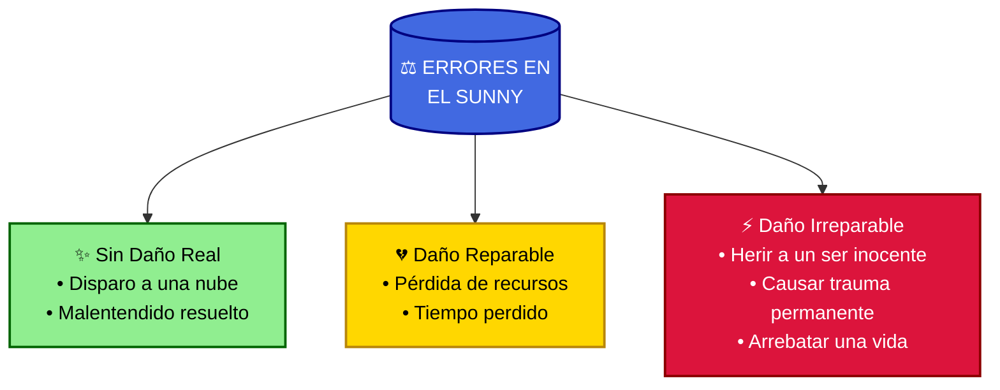
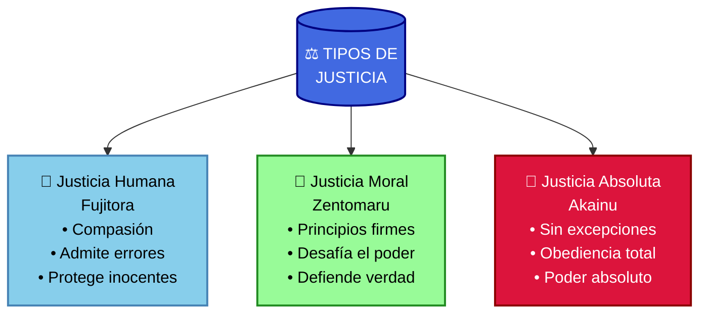
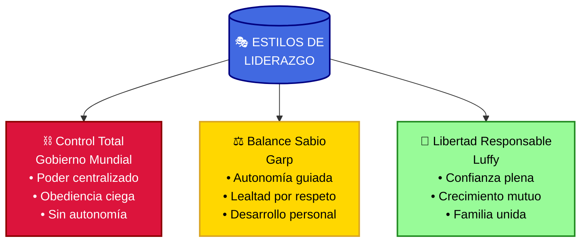
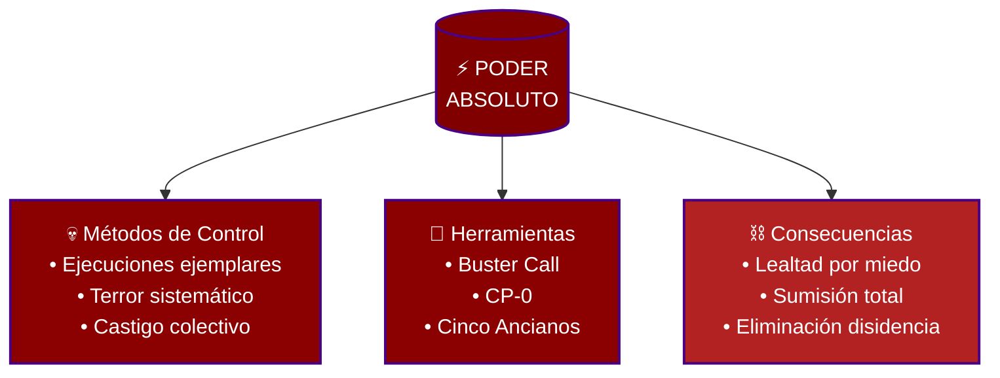
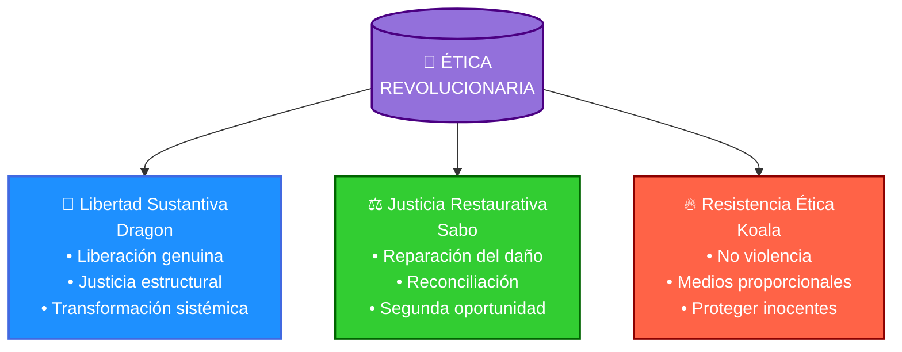

# ⚓ El Diario del Sunny: Lecciones de un Nakama 🏴‍☠️

> **Nota:** Este documento es un Fan Art creativo basado en One Piece, una interpretación artística y personal que utiliza los personajes y eventos de la serie para explorar temas sobre el perdón y la justicia. No pretende ser un modelo abstracto filosófico, sino una expresión creativa desde el punto de vista de los personajes.

> ⚠️ **Aviso sobre los diagramas:** Los diagramas incluidos en este documento son herramientas visuales diseñadas únicamente para ayudar a comprender conceptos complejos. No son guías de acción ni modelos a seguir. Se invita a los lectores a abordar estos temas con responsabilidad y madurez, reconociendo que el propósito es puramente educativo y reflexivo.

> ⚖️ **Mensaje de los Sombrero de Paja:** ¡Shishishi! Aquí Luffy y su tripulación compartiendo nuestra aventura más importante: ¡cómo mantenemos unida nuestra familia pirata!

✨ ¡Yosh, escuchen todos! En nuestros viajes por el Grand Line, hemos aprendido que ser una tripulación va más allá de navegar juntos - ¡somos una familia que comparte carne, risas y sueños! Cuando salvamos a Robin en Enies Lobby gritando "¡QUIERO VIVIR!", o cuando Usopp volvió a nosotros en Water 7, cada momento nos hizo más fuertes. Este es nuestro tesoro de sabiduría pirata, ¡las reglas que hacen que el Sunny sea el mejor barco del mundo! Y si te unes a nuestra tripulación, ¡más te vale aprenderlas bien! 🚢 ¡Al fin y al cabo, el Rey de los Piratas necesita una tripulación que sepa trabajar junta! 🎯

# 🚨 ¡AVISO DE SPOILERS! 🚨

¡Atención, navegantes! Esta explicación está repleta de spoilers de One Piece, incluyendo momentos clave de arcos como Water 7, Enies Lobby y Wano. También revelamos secretos importantes sobre la Marina, el Gobierno Mundial y los Buster Calls, incluyendo las acciones de Fujitora, Akainu y la rebelión de Garp. Si no has visto la serie, podrías descubrir detalles importantes sobre la trama y los personajes. ⚠️ Pero, ¡no te desanimes! Si lees esto sin haber visto One Piece, podrías sentir la emoción de la tripulación de los Sombrero de Paja y animarte a embarcarte en esta aventura épica. 🏴‍☠️ One Piece es una historia de amistad, sueños y redención que te hará reír, llorar y soñar con el mar. 🌟 ¡Sigue leyendo si te atreves, y tal vez quieras zarpar con Luffy hacia el One Piece! 🚢

# 📜 El Código Pirata del Sunny: Las Normas de Luffy 🏴‍☠️

El Thousand Sunny surca los mares con Monkey D. Luffy al timón, guiando a los Sombrero de Paja hacia el sueño de encontrar el One Piece. 🌟 Para que el barco no se desvíe, todos, desde Luffy hasta Chopper, deben seguir un código pirata grabado en el corazón del Sunny. 📝 Este código es como un juramento familiar: nadie está por encima, ni siquiera el capitán. 😊
Una regla clave es el perdón. 🤝 Si un nakama comete un error, como cuando Usopp desafió a Luffy por el Going Merry en Water 7 y luego pidió perdón con lágrimas (“¡Déjenme volver!” 😭), la tripulación debe perdonarlo. Incluso si no pide perdón, como cuando Nico Robin se sacrificó en Enies Lobby para proteger a todos, Luffy considera darle una oportunidad si el error no fue devastador. Recuerda ese momento épico en que Luffy, con fuego en los ojos, gritó: “¡Di que quieres vivir!” y Robin, rompiendo en llanto, respondió: “¡Quiero vivir! ¡Llévenme con ustedes al mar!” 🌊 Ese es el espíritu del perdón en la tripulación. ❤️

## ⚖️ Errores en el Mar: Desde un Rasguño hasta Destruir una Isla 🏝️

No todos los errores son iguales en el mundo de One Piece. 🌍 Vamos a clasificarlos con ejemplos claros, incluyendo daños graves como el costo de oportunidad en la economía y daños físicos, para que todo quede súper entendible:

### Errores sin daño real (rectificables) ✅

Imagina que Usopp, en un ataque de pánico, dispara un cañón del Sunny por error, pero solo atraviesa una nube. ☁️ Nadie sale herido, y Franky repara el cañón rápido. No hubo daño, así que no hay nada que arreglar. Es un "¡Perdón, capitán!" y a seguir navegando. 🏴‍☠️

O como cuando Usopp en Water 7 acusó a Luffy durante su confrontación, pero después reconoció su error. El daño fue **cero** porque rectificó y se disculpó sinceramente. A veces, como un francotirador, hay que hacer movimientos estratégicos, pero siempre aclarando la verdad después. 🎯

### Daño reparable (con costo de oportunidad) 💸

Piensa en la dictadura de Kurozumi Orochi en Wano. 🐍 Orochi, aliado con Kaido, esclavizó al pueblo, destruyó la economía y contaminó las tierras con fábricas tóxicas. Los ciudadanos pasaron hambre, perdieron sus hogares y vivieron en la miseria. 😢 Este daño tiene un costo de oportunidad: el tiempo, recursos y felicidad que Wano perdió. Los artesanos podrían haber creado espadas legendarias, los niños podrían haber estudiado, y las tierras podrían haber florecido. ⚒️ Aunque el daño es reparable (tras la caída de Orochi, Wano comenzó a reconstruirse con Momonosuke 🌸), llevó años de sufrimiento. Es como si Nami calculara mal el rumbo del Sunny y la tripulación quedara atrapada en una tormenta, perdiendo provisiones y tiempo. 🌩️ Se puede recuperar, pero el costo es alto.

### Daño físico (de leve a irreparable) ⚠️

Los daños físicos varían en gravedad:  
Leve: Zoro corta sin querer un mástil del Sunny durante un entrenamiento. 🪓 Franky lo repara, y nadie sale herido. Es un inconveniente menor. 😅  
Moderado: Sanji, en un combate, patea accidentalmente a Chopper, causándole moretones. 🩺 Chopper se recupera con medicinas, pero necesita tiempo.  
Grave e irreparable: En Wano, Orochi y Kaido ejecutaron a inocentes, como los samuráis leales a Oden, y causaron muertes por hambre y contaminación. 💀 En One Piece, no se puede revivir a los muertos (salvo casos raros como Brook). Un asesinato no ético, como los crímenes de Orochi, o apoyar el terrorismo (como los planes de Crocodile en Alabasta 🦎) es un daño crítico que excluye a alguien de la tripulación para siempre. 🚫
Por suerte, el error que discutimos es como el primero: no hubo daño real. Es como si Robin intentara entregar un Poneglyph falso al enemigo, pero Luffy lo descubre a tiempo y no pasa nada. 📜 No hay nada que reparar, así que el perdón es más fácil. 😊

## ⚠️ La Balanza del Milenio: No Seamos Ingenuos 🦁

¡Aviso importante de peligrosidad! No podemos ser ingenuos al perdonar, como dice la Balanza del Milenio (un concepto que podrías explorar más en el post original, ¡revísalo para detalles jugosos! 📖). No se trata de cerrar los ojos y confiar ciegamente. Un león no deja de ser carnívoro para volverse vegetariano solo porque lo deseemos, pero esto no significa una condena determinista donde los seres estén atrapados en una naturaleza inmutable. 🦁

La verdad filosófica está en el equilibrio: todo ser puede cambiar, pero el cambio auténtico requiere esfuerzo, tiempo y evidencia. Como hemos visto con Bon Clay, quien pasó de enemigo en Alabasta a sacrificarse por Luffy en Impel Down; con Bellamy, quien abandonó su crueldad tras ser derrotado por Doflamingo; o con Hatchan, quien expió sus crímenes contra Nami protegiendo a los Sombrero de Paja. El cambio profundo es posible, pero requiere acciones concretas y un compromiso genuino, no solo palabras vacías. 🌊

Piensa en la transformación de Bartholomew Kuma, quien pasó de ser un temido pirata revolucionario a sacrificar su humanidad, memoria y voluntad para proteger el Sunny durante dos años. Su cambio fue real y demostrable. O cómo Jinbe, inicialmente un Shichibukai que trabajaba para el sistema, arriesgó todo por salvar a Luffy en Marineford. Las acciones definen la verdadera transformación, no las promesas. ⚓

La Balanza del Milenio no nos dice "nunca confíes", sino "confía basándote en acciones, no en palabras". La confianza debe ser proporcional a la evidencia de cambio. 🔍 Incluso el propio Luffy, con toda su capacidad para ver el corazón de las personas, observa las acciones antes de confiar plenamente, como hizo con Robin hasta que ella demostró su lealtad.

Imagina que un nakama, llamémoslo Taro, es como Caesar Clown, un científico loco que trabajó para Doflamingo y envenenó a niños en Punk Hazard. ☠️ Si Luffy perdona a Taro y le da un puesto importante en el Sunny, como manejar los cañones o los explosivos, sería imprudente sin evidencia previa de cambio genuino. 💻 La probabilidad de que Taro cause daño no se basa en una naturaleza inmutable, sino en sus patrones de comportamiento recientes y en la ausencia de acciones que demuestren transformación. 😈

Luffy, con su instinto (y un toque de Haki de Observación nivel V4 😜), debe pesar los riesgos en la Balanza del Milenio: ¿Taro ha demostrado con acciones su cambio, como Jinbe al salvar a Luffy en Impel Down, o sigue atrapado en sus viejos patrones? 🔍 Perdonar está bien -y es necesario-, pero confiar responsabilidades importantes sin evidencia de cambio es como invitar a un tiburón no domesticado a nadar en la cubierta del Sunny. 🦈

## 🦸‍♂️ El Poder de Luffy: Un Capitán que Une Corazones 🌟

Luffy tiene un don único: puede resolver problemas relacionados con la información, como aclarar malentendidos en un debate. 🗣️ Piensa en cómo convenció a Alabasta de que Crocodile era el villano. 🦎 O en Enies Lobby, cuando con un grito hizo que Robin recuperara las ganas de vivir. 😢 Su carisma es como un Haki del Conquistador que une a las personas. 💥
Pero si Luffy no respeta las normas del Sunny, los nakamas le perderán el respeto. 😔 Es como si ignorara el sueño de Sanji de encontrar el All Blue o se comiera toda la comida sin compartir. La tripulación se desanimaría, y el Sunny perdería su rumbo. 🧭 Por eso, Luffy debe ser un ejemplo, como cuando arriesgó todo para salvar a Robin o perdonó a Usopp, mostrando que las reglas del perdón y la lealtad son sagradas. 🏴‍☠️

## 🤝 Perdón, pero sin la Llave del Timón 🔑

Luffy perdona con el corazón, pero aquí encontramos una de las paradojas más profundas del perdón: ¿puede ser genuino y a la vez venir con restricciones? ¿O las consecuencias persistentes significan que el perdón es incompleto? 🤔

El perdón en el Sunny refleja esta tensión filosófica. Por un lado, es incondicional en su dimensión emocional - Luffy no guarda rencor ni deseos de venganza hacia quien reconoce sus errores. Pero por otro lado, el perdón no siempre restaura inmediatamente todos los privilegios y responsabilidades. Esto plantea la pregunta: ¿son las consecuencias persistentes una forma de castigo disfrazado, o simplemente una respuesta prudente a la realidad?

Veamos los matices a través de ejemplos:

**Usopp en Water 7:** Tras abandonar la tripulación y desafiar a Luffy, Usopp regresó arrepentido. Cuando finalmente pidió perdón (gracias en parte a la intervención de Zoro, quien entendía la importancia del respeto al capitán), Luffy lo aceptó inmediatamente con una sonrisa genuina, sin condiciones emocionales ni rencores. 🤗 El perdón fue completo en términos de aceptación, pero la confianza como francotirador tuvo que reconstruirse gradualmente. No fue castigo, sino el proceso natural de cicatrización de la confianza rota.

**Robin en Enies Lobby:** Robin se fue con CP9 para proteger a la tripulación, actuando desde el miedo y la desesperación. Su grito "¡Quiero vivir!" representó su transformación interior al aceptarse digna de ser salvada. 😢 Luffy la perdonó completamente, entendiendo que su partida fue un acto de sacrificio malentendido. La confianza se restauró rápidamente porque sus acciones, aunque dolorosas, venían de un lugar de amor hacia sus nakamas.

**El hipotético Taro:** Con Taro, Luffy separaría el perdón emocional (que puede ser inmediato y completo) de la restauración de responsabilidades (que requiere tiempo y evidencia). 🏴‍☠️ No es que el perdón sea incompleto o condicionado, sino que el perdón y la confianza operan en dimensiones paralelas pero distintas. Uno puede estar completamente perdonado pero todavía necesitar tiempo para reconstruir la confianza práctica.

Esta distinción nos muestra que el verdadero perdón no es simplemente olvidar o ignorar las acciones pasadas, sino transformar nuestra relación con ellas. Es liberar el resentimiento mientras se aprende prudentemente de la experiencia. El perdón es un regalo para ambas partes - libera tanto al que perdona como al perdonado del peso del pasado - pero no elimina la necesidad de crecimiento personal ni la realidad de que la confianza es algo que se reconstruye con el tiempo, no con un simple decreto. ⏳

### 🚨 Riesgos: Un Error Puede Hundir el Sunny 🌊

Luffy ve que Taro podría cometer fallos graves. 🚨 Podría discutir con Nami por el rumbo 🗺️ o distraer a Chopper en una batalla, poniendo a todos en peligro. 🩺 Es como si Usopp, en sus días inseguros, disparara mal y casi diera a un nakama. 😓 O como si Robin, antes de confiar en la tripulación, diera información equivocada sobre un Poneglyph. 📜 Peor aún, si Taro es como un "león carnívoro" (siguiendo la Balanza del Milenio), podría actuar como Caesar Clown y causar un desastre mayor. ☠️
Para proteger a la tripulación, Luffy le quita todo el poder de influencia. 🚫 Es como decirle: "Taro, puedes quedarte en el barco, pero no das órdenes, no tocas el timón y no lideras. ¡Solo sé un nakama más!" 😄 Así, si Taro mete la pata, no afectará a Luffy, a los demás ni al sueño del One Piece. 🌟

### 🚪 Expulsión: El Mar es Libre, pero el Sunny Tiene Reglas 🚷

Si Taro ignora las advertencias y sigue causando problemas, como pelearse con Sanji por la comida o desobedecer en una batalla, Luffy lo echará del Sunny. 😤 Es como cuando Luffy enfrentó a Bellamy en Jaya: si no respetas los sueños de los demás, no tienes lugar en la tripulación. 🏴‍☠️ Taro sería enviado a una balsa con un remo y un “¡Arregla tus errores!” 🌊
Si Taro tiene seguidores que lo apoyan ciegamente, como los soldados de Doflamingo en Dressrosa, también serán expulsados. 👥 Al respaldar a Taro, rompen las normas del Sunny y la visión de Luffy. Si quieren seguirlo por su cuenta, ¡adelante! El mar es vasto. 🌍 Pero en el Sunny, todos reman hacia el One Piece. 🚢

### 🩺 Luffy No Es el Médico de Almas ⏳

Luffy no puede resolver los problemas personales de cada nakama. 🪄 Si Taro sigue causando líos por no controlar sus emociones, como Usopp antes de Enies Lobby o Robin antes de confiar, Luffy no puede dedicarle todo su tiempo. 😓 Es como si Chopper tuviera que curar a un pueblo entero mientras los Marines atacan. ⚔️
Luffy le diría a Taro: “¡Busca ayuda, nakama!” 🗣️ Taro podría visitar a un experto, como el Dr. Kureha en Drum, un psicólogo o psiquiatra en One Piece. 🩺 O, si prefiere, podría entrenar su mente como Zoro entrena su cuerpo. 💪 Pero Luffy debe liderar la tripulación y perseguir su sueño. 🌟 El One Piece lo espera en Laugh Tale. 🏝️

## 🌈 El Sueño del Rey de los Piratas: Una Tripulación Unida 👑

Esto refleja el corazón de Luffy: su amor por sus nakamas y su sueño de ser el Rey de los Piratas. ❤️ Luffy perdona, como cuando rescató a Robin, haciéndola gritar “¡Quiero vivir!” 😢, o acogió a Usopp tras su arrepentimiento. 🤗 Pero es firme para proteger a la tripulación, como cuando peleó contra Orochi y Kaido en Wano. 🐉
Luffy sabe que una tripulación fuerte necesita nakamas que respeten las normas y remen juntos. 🚢 Si Taro no puede seguir el ritmo, debe arreglar sus errores fuera del Sunny. Pero si vuelve, más fuerte y listo, Luffy lo recibirá con una sonrisa: “¡Bienvenido de vuelta, nakama!” 😄
El Thousand Sunny seguirá navegando, con el sol brillando, porque nada detendrá a Luffy en su búsqueda del One Piece. 🌞 ¡El sueño de la libertad y el mayor tesoro está más vivo que nunca! 🏴‍☠️

# 🎨 Nota de Fan Art 🖌️

¡Nakama, esta historia merece un fan art épico! 🏴‍☠️ Imagina una escena dividida en tres niveles:

En el nivel superior, el Thousand Sunny navega bajo un cielo dorado, con Luffy en la proa, su sombrero de paja ondeando, y una sonrisa radiante. 🌞 Detrás, la tripulación: Zoro afilando sus espadas, Nami revisando su mapa, Sanji sirviendo comida, Chopper curando, y Robin con un Poneglyph, recordando su "¡Quiero vivir!". 📜 Usopp practica con su tirachinas, orgulloso tras volver. 🎯

En el nivel medio, vemos los diferentes rostros de la justicia: Fujitora, con sus ojos vendados pero una sonrisa compasiva, se inclina ante el pueblo. 🌸 A su lado, Zentomaru se mantiene firme protegiendo a Vegapunk, desafiando las órdenes injustas. 🔬 Y en las sombras, Akainu observa con severidad, su capa de la justicia absoluta ondeando. 🌋

En el nivel inferior, el contraste del poder: en un lado, los Cinco Ancianos y la sombra de Imu manipulan hilos que controlan a marines como marionetas. 🎭 En el otro lado, Garp rompe sus cadenas mientras protege a su tripulación, su puño alzado en desafío, mientras Koby y otros lo siguen con admiración. ⛓️

En el horizonte, Wano brilla libre de Orochi, con flores de cerezo. 🌸 En una esquina, Taro rema en una balsa, mirando al Sunny con esperanza, decidido a mejorar. 🌊 En el centro de todo, el símbolo de la Balanza del Milenio flota, recordando la importancia de equilibrar la justicia con la libertad. ⚖️
Esta escena imaginaria captura el espíritu de One Piece, mostrando los diferentes aspectos de la historia a través del arte. 🖌️ La composición refleja los temas centrales de libertad, justicia y lealtad que hacen única esta historia. ✨

# ⚖️ La Justicia en la Marina: Diferentes Caminos hacia el Mismo Mar ⚖️

Nakama, hablando de justicia en One Piece, ¡tenemos que analizar cómo la entienden los Almirantes! 🎖️ Es fascinante ver cómo cada uno interpreta este concepto de forma única:

### 🌸 Fujitora: La Justicia Humana 🎲

Issho (Fujitora) representa la justicia más compasiva. 💜 A pesar de ser ciego, ve el corazón de las personas mejor que nadie. Se arrodilló ante el Rey Riku para disculparse por los errores de la Marina, ¡algo impensable para otros almirantes! Su justicia prioriza:

- Proteger a los inocentes 🛡️
- Admitir errores públicamente 🙏
- Desafiar órdenes injustas ⚔️
  Como cuando dejó escapar a Luffy en Dressrosa, porque sabía que era lo correcto. 🌟

### 🔬 Zentomaru: La Justicia Moral 🧪

El capitán de la Unidad Científica nos enseña que la verdadera justicia requiere valor para enfrentar al sistema. 💪 Cuando se enfrentó a Kizaru por proteger a Vegapunk, demostró que:

- La lealtad debe ser a los principios, no a las instituciones 🎯
- Hacer lo correcto puede significar desafiar a los poderosos ⚡
- El verdadero poder viene de defender tus creencias 🔥

### 🌋 Akainu: La Justicia Absoluta 🔥

Sakazuki representa la justicia más inflexible. Para él, la ley es la ley, sin excepciones. 😠 Como cuando ordenó destruir Ohara o persiguió a Luffy en Marineford. Su visión incluye:

- Lealtad inquebrantable al Gobierno Mundial 🏛️
- Los fines justifican los medios ⚔️
- Cero tolerancia con los piratas ☠️

🌊 ¿Qué nos enseña esto sobre la verdadera justicia? 🤔

La justicia en One Piece es como el mar: profunda, compleja y en constante movimiento. 🌊 Esta diversidad de interpretaciones nos plantea la pregunta filosófica fundamental: ¿Es la justicia un concepto universal inmutable o una construcción social que varía según quién detenta el poder?

Lo fascinante es que One Piece parece sugerir una respuesta dual. Por un lado, hay principios universales que trascienden culturas y épocas: la protección de los inocentes, el respeto a la dignidad humana, la libertad de pensamiento. Estos valores emergen en distintas culturas del mundo, desde Wano hasta Arabasta, como corrientes profundas que permanecen constantes bajo las olas cambiantes.

Por otro lado, vemos cómo la "justicia" puede ser manipulada como construcción social por quienes tienen poder. El Gobierno Mundial define como "crimen" la simple lectura de los Poneglyphs, no porque sea inherentemente malo, sino porque amenaza su control de la narrativa histórica. Esto revela la tensión entre la justicia como ideal y su implementación práctica en sistemas humanos imperfectos.

Incluso los héroes de nuestra historia enfrentan esta paradoja moral: Fujitora, a pesar de su compasión, sigue siendo parte de un sistema que perpetúa injusticias. Su dilema refleja la dificultad de ser moralmente íntegro dentro de instituciones corruptas. Su justicia "humana" es un paso hacia lo correcto, pero no resuelve la contradicción fundamental de servir a un sistema cuya base está corrompida.

Lo que las acciones de Fujitora y Zentomaru nos muestran es que la verdadera justicia debe:

- Proteger a los inocentes, independientemente de su origen o estatus 🛡️
- Admitir errores y aprender de ellos, mostrando humildad ante la verdad 📚
- Tener el valor de desafiar lo injusto, incluso cuando viene de autoridades 🗡️
- Equilibrar la letra de la ley con el espíritu de la compasión 💖
- Reconocer que la justicia es un camino, no un destino alcanzado 🌅

Como dijo Kuzan (Aokiji): "La justicia cambia según donde te pares". 🗺️ Y Doflamingo añadió con cinismo: "¡Quien gane esta guerra se convierte en justicia!" Pero nosotros, como la tripulación del Sunny, intuimos que existe una brújula moral que apunta hacia valores universales que trascienden el poder. La verdadera justicia viene del corazón y las acciones, no de los títulos o la autoridad institucional. ❤️

# 📜 Reflexiones sobre el Poder y la Libertad 🏛️

Nakama, la experiencia nos ha enseñado importantes lecciones sobre el equilibrio entre autoridad y libertad:

### 🎯 Protección del Conocimiento 📚

Los eventos de Ohara y Egghead nos muestran la importancia de:

- Preservar el derecho al estudio y la investigación 📖
- Valorar la búsqueda de la verdad histórica 🔍
- Proteger a quienes buscan el conocimiento 🛡️

### ⚖️ Balance de Poder y Responsabilidad 🔗

El sistema de la Marina nos enseña sobre:

- La importancia de la transparencia en las instituciones 👁️
- El valor de procesos justos y transparentes ⚔️
- La necesidad de preservar la historia para aprender de ella 📘

### 🌟 Liderazgo e Iniciativa Personal 💫

El camino hacia el cambio positivo requiere valor:

- Garp demuestra integridad al mantenerse fiel a sus principios ✊
- Robin protege el conocimiento para las futuras generaciones 📖
- La tripulación del Sunny persigue una visión de mejora continua 🌅

# 🎭 Estructuras de Organización y Liderazgo 🎪

Nakama, exploremos un aspecto importante de la organización marina: ¡las diferentes formas de ejercer el liderazgo! 🏛️ Cada líder elige su propio camino según sus principios:

### Distintos Estilos de Gestión 🎭

El Gobierno Mundial, a través de los Cinco Ancianos e Imu, representa un estilo de liderazgo centralizado. 🕴️ Sus decisiones impactan en toda la organización:

- La importancia de la responsabilidad en el liderazgo 📚
- El peso de las decisiones organizacionales 🔬
- Los desafíos de mantener el equilibrio entre autoridad y autonomía ⚖️

### Liderazgo con Principios: El Ejemplo de Garp 👊

Garp representa un estilo de liderazgo basado en valores firmes:

- Eligió mantener su rango actual para preservar su autonomía de decisión 🎯
- Lidera su unidad con un balance entre disciplina y comprensión ⚔️
- Demuestra que el respeto se gana con acciones, no con títulos 🌟

### Diversidad de Enfoques ⚖️

La Marina muestra diferentes estilos de liderazgo:

- Liderazgo basado en procedimientos y estructura 📋
- Enfoque centrado en las personas, como Fujitora 🌸
- Modelos de gestión autónoma, como el de Garp ⭐

Como aprendimos de la experiencia de Robin: el crecimiento profesional requiere encontrar el equilibrio entre estructura y desarrollo personal. 💖 El éxito viene de alinear nuestros valores con nuestras acciones. 🌅

# ⚡ Cuando No Hay Perdón: La Sombra del Poder Absoluto 🗡️

### El Precio del Fracaso: Saint Jaygarcia Saturn 💀

En las altas esferas del Gobierno Mundial, existe un submundo de crueldad calculada donde la debilidad se paga con sangre. Saturn, uno de los Cinco Ancianos, aprendió esta lección brutal en Egghead. A pesar de siglos eliminando opositores y aplastando revoluciones sin pestañear, un solo error estratégico bastó para que Imu firmara su sentencia con la misma frialdad con que él había liquidado a miles. Saturn, que una vez caminó como un dios entre mortales, imponente e intocable como el "Dios Guerrero de la Ciencia y la Defensa", se convirtió en un patético ejemplo de lo que sucede a quienes fallan a la organización. Su ejecución no fue personal; fue un mensaje para todos los rangos: nadie está a salvo del corte limpio de la guadaña del poder. Sus súplicas desesperadas, sus promesas vacías mientras Imu le arrancaba metódicamente su inmortalidad, reforzaron el mensaje que mantiene a la organización bajo control absoluto: el fracaso no tiene indulto. ⚰️

Esta dinámica nos lleva a una de las cuestiones filosóficas más profundas sobre el poder: ¿Cuándo un sistema pierde su legitimidad moral y cuándo está justificada la resistencia? El Gobierno Mundial plantea precisamente este dilema.

Un poder legítimo deriva su autoridad del consentimiento de los gobernados y del cumplimiento de un contrato social que beneficia al conjunto. El Gobierno Mundial, sin embargo, ha roto ese contrato fundamental: en lugar de proteger a los ciudadanos, los sacrifica por mantener privilegios; en vez de preservar la historia, la destruye sistemáticamente; donde debería haber transparencia, hay secretos oscuros enterrados en siglos de manipulación.

Los revolucionarios como Dragon y Sabo no son simples rebeldes caprichosos, sino la respuesta natural a un sistema que ha traicionado su propósito fundamental. Su resistencia plantea la pregunta: ¿existe un deber moral de desobedecer órdenes injustas? Cuando Coby se negó a atacar a Luffy al final de la guerra de Marineford, o cuando Garp eligió proteger a su familia por encima de su lealtad institucional, estaban ejerciendo lo que los filósofos llamarían "desobediencia civil justificada" - la obligación moral de resistir cuando las instituciones se corrompen más allá de la reparación.

La paradoja del Gobierno Mundial es que su legitimidad es puramente procedimental (tiene el poder para hacer cumplir sus reglas) pero carece de legitimidad sustantiva (sus reglas no sirven al bien común). Como dijo Doflamingo en su discurso sobre los vencedores que escriben la historia: el poder no confiere automáticamente justicia o legitimidad moral, solo la capacidad de imponer una narrativa.

### La Maquinaria Implacable del Control Absoluto 🔪

El sistema operativo de esta despiadada organización funciona con la precisión de un reloj suizo:

- El contraste entre un sistema que ofrece redención y otro que no tolera errores 🩸
- La diferencia entre lealtad por convicción y lealtad por temor ⛓️
- El valor del aprendizaje frente a la exigencia de perfección absoluta 📈
- La importancia de la segunda oportunidad frente a un sistema que no perdona 🔥

Su metodología es la quintaesencia de la eficiencia criminal: cada muerte es una lección, cada tortura un seminario educativo, cada traidor eliminado un recordatorio. En el frío balance de poder que mantienen, los sentimientos son debilidades a extirpar. El patético espectáculo de Saturn, suplicando entre sollozos mientras Imu metódicamente desmontaba su inmortalidad como quien desguaza un reloj, ilustra el principio fundamental de su código operativo: cualquiera es prescindible, desde el más novato marine hasta el más antiguo de los Cinco Ancianos. Para esta maquinaria de poder, la lealtad de siglos vale exactamente lo mismo que la obediencia de ayer: nada, frente a un solo error estratégico.

## 🚩 La Ética del Ejército Revolucionario: Libertad con Responsabilidad 💪

Frente a la maquinaria represiva del Gobierno Mundial surge una alternativa: el Ejército Revolucionario liderado por Monkey D. Dragon. 🐉 Sin embargo, enfrentarse a un sistema tan brutal plantea dilemas éticos profundos: ¿cómo combatir la opresión sin convertirse uno mismo en opresor? ¿Cómo resistir la violencia sin reproducirla?

### 📜 Los Principios Revolucionarios de Dragon 🌪️

El Ejército Revolucionario opera bajo principios que contrastan directamente con los del Gobierno Mundial:

1. **No atacar a civiles inocentes.** Mientras el Gobierno Mundial no duda en realizar Buster Calls que aniquilan islas enteras, Dragon se niega a utilizar tácticas de terror. Sus objetivos son las estructuras de poder, no la población. 🏛️

2. **La revolución es para el pueblo.** Como vimos en el Reino de Goa, Dragon rescató a los marginados del Gray Terminal cuando los nobles pretendían quemarlos vivos. Su objetivo no es conquistar, sino liberar. 🔥

3. **El conocimiento como derecho universal.** Si el Gobierno Mundial destruye conocimiento prohibido, los revolucionarios lo preservan. Koala, como ex-esclava y ahora instructora de Karate Gyojin, ejemplifica esta filosofía de compartir información prohibida para empoderar a los oprimidos. 📚

### 🤔 Los Dilemas Morales de la Resistencia 🧠

El Ejército Revolucionario enfrenta dilemas filosóficos que Luffy, como pirata enfocado en sus aventuras personales, no necesita considerar:

- **El problema de los medios y fines:** ¿Justifica el fin (la libertad) cualquier medio para conseguirla? Dragon parece haber establecido límites morales claros, rechazando tácticas como el terrorismo indiscriminado o el uso de armas biológicas como las que Caesar desarrolló. 🧪

- **La espiral de violencia:** El ejemplo de Koala, quien tras su liberación eligió la comprensión en lugar del odio, muestra cómo la transformación personal puede romper el ciclo de violencia. Su historia demuestra que el trauma puede convertirse en fuerza para el cambio positivo. ✊

- **La legitimidad de la revolución:** ¿Cuándo está moralmente justificado derrocar un sistema establecido? El Ejército Revolucionario parece responder: cuando ese sistema ha traicionado su propósito fundamental de proteger y servir al pueblo. 🏴

### 🧭 Contrastes Éticos: La Diferencia entre Revolución y Terror 📊

La diferencia ética entre el Gobierno Mundial y el Ejército Revolucionario puede resumirse en estos contrastes:

- **Poder como medio vs poder como fin:** Para el Gobierno Mundial, el poder es un fin que justifica cualquier medio. Para Dragon, es solo un medio para lograr la libertad del pueblo. 👑

- **Castigo vs rehabilitación:** El Gobierno Mundial ejecuta a sus enemigos. Los revolucionarios, como vemos con ex-esclavos como Koala, buscan rehabilitar y reintegrar a las víctimas del sistema. 🕊️

- **Terror vs resistencia dirigida:** El Gobierno Mundial utiliza el terror indiscriminado como herramienta de control. Los revolucionarios dirigen sus acciones específicamente contra estructuras de poder, minimizando el daño colateral. 🎯

- **Secretos vs transparencia:** El Gobierno Mundial oculta la historia y persigue a quien busque conocimiento. Los revolucionarios trabajan para revelar verdades ocultas y empoderar mediante el conocimiento. 📖

### 🌱 La Semilla de un Mundo Nuevo 🌍

Lo que diferencia fundamentalmente al Ejército Revolucionario no es solo su oposición al Gobierno Mundial, sino su visión de un mundo alternativo donde:

- La dignidad humana es inviolable, independientemente del nacimiento o estatus
- El conocimiento es un derecho, no un privilegio
- La justicia sirve para restaurar y sanar, no para vengarse o controlar
- El poder deriva del consentimiento de los gobernados, no de la fuerza o el miedo

Como dijo Dragon al rescatar a Sabo: "El problema no es ese chico. Es este mundo podrido que necesita cambiar." Su revolución no busca meros cambios cosméticos en quién ocupa el trono vacío, sino una transformación sistémica que restaure el equilibrio entre poder y libertad, entre orden y justicia. 🌊

Esta es la verdadera batalla filosófica que se libra en las sombras de One Piece: no simplemente piratas contra marines, sino dos visiones incompatibles del mundo y de la naturaleza humana. Una donde los seres humanos son piezas desechables en un tablero de poder milenario, y otra donde cada persona, desde el humilde pescador de Cocoyasi hasta la princesa de Arabasta, merece libertad, dignidad y la oportunidad de escribir su propia historia. ✨

## 🌟 Nuevos Nakamas en el Horizonte 🌊

### El Príncipe de Elbaf: Loki 👑

Nuestro capitán Luffy ha expresado claramente su deseo de que Loki se una a nuestra tripulación. Como siempre, Luffy ve algo especial en las personas, más allá de los rumores o las apariencias. Su instinto para elegir nakamas nunca se ha equivocado, y su decisión sobre Loki promete traer nuevas aventuras emocionantes a nuestra familia. 🌟

### El Espíritu de Oden: Yamato ⚔️

Aunque Yamato decidió permanecer en Wano para proteger la tierra de Oden, su corazón navega con nosotros. La Bitácora de Oden que guarda contiene una verdad profunda: el sueño de formar la tripulación pirata más grande del mundo, donde el poder y la fama sirven a una causa mayor. Yamato, siguiendo los pasos de Oden, es parte de nuestra familia extendida, demostrando que ser nakama va más allá de navegar en el mismo barco. 🌅

✨ ¡Fin de la aventura, nakama! ✨ Nuestro viaje continúa creciendo con cada nueva isla y cada nuevo amigo que encontramos. La justicia, el perdón y la lealtad son nuestras estrellas guía, ¡mientras navegamos hacia el One Piece! 🚢 ¡Gracias por compartir estas lecciones del mar! 🏴‍☠️
