# 🧬 Modelo Existencial Reproductivo 🧬

> ## ⚠️ ADVERTENCIAS IMPORTANTES ⚠️

> ### 🔞 Contenido Sensible
> Este documento contiene información científica y técnica sobre reproducción humana, fertilidad y desarrollo biológico. El contenido está destinado a un público adulto con madurez para comprender temas médicos y bioéticos complejos.

> ### 📚 Naturaleza del Documento
> Este es un análisis científico basado en investigaciones actuales y evidencia médica. No constituye consejo médico directo y toda decisión relacionada con tratamientos reproductivos debe consultarse con profesionales de la salud cualificados.

> ### ⚖️ Aspectos Legales
> Las menciones a marcos legales y regulaciones son informativas y pueden variar según la jurisdicción. Este documento no sustituye el asesoramiento legal profesional en temas de reproducción asistida.

> ### 🔬 Base Científica
> Los diagramas y modelos presentados son herramientas visuales para ayudar a comprender conceptos complejos. La información se basa en investigaciones verificables y publicaciones científicas actualizadas hasta 2025.

---

## 1. 🏹 Introducción: Roles tradicionales y modernos en la sociedad

Para comprender mejor este modelo, me gusta usar como referencia la estructura social de las tribus ancestrales: 👑 el líder de la tribu (gobierno), 🧙‍♂️ el chamán (religión), 🏹 el cazador (proveedor), 🧭 el explorador (innovador), etc. En el caso de las mujeres: 👶 labores de cuidado de niños, 🧶 artesanía, 🍎 recolección de alimentos, entre otros roles esenciales para la supervivencia colectiva.

## 2. 💼 Contribución social y opciones reproductivas

Existe algo más perjudicial para la sociedad que cualquier orientación sexual: 😴 no estudiar, ni trabajar, ni emprender, ni invertir (es decir, no producir valor, o producirlo pero no comerciarlo [existir únicamente para gastar y consumir de lo ajeno]). 

Entre las alternativas reproductivas encontramos:
- 🧘‍♂️ El monje asexual que decide permanecer soltero toda la vida
- 💉 Los donantes de semen u óvulos (contribución genética sin crianza)
- 🤰 El alquiler de vientres (caso especial de la mujer)
- 🚫 El debate sobre permitir el aborto, especialmente en casos extremos como violaciones, donde el proteccionismo social debería hacerse cargo del bienestar del niño.

## 3. 📊 Demografía, reproducción y supervivencia de la especie

Si la especie humana enfrentara un peligro de extinción por baja natalidad (distinguiendo entre nivel mundial y nacional, pues la 🚩 INDEPENDENCIA poblacional es un valor fundamental, comerciar con China pero no depender de ella), "se debería" (entre comillo porque aunque en la faz de la Tierra quede solo un hombre o una mujer independientemente de la orientación sexual que tengan, uno no puede violar al otro ni viceversa, cada uno debe velar por sí mismo. Si la humanidad elige ese destino pues chingui. Ahora hablando yo por mi parte como hombre garantizo que eso no va a suceder (obviamente hay muchos muchos más, y cada vez habrán más. Y con la IA de Grok 3 más todavía), ahora busca a la mujer. Por suerte canto One Kiss y Dua Lipa me manda un beso xd 😂😂😂, y le doy una patada a una piedra y salen de abajo más. Busca el concepto del hombre sigma vs el hombre alfa) activar protocolos 💞 basados en la relación natalidad-mortalidad. La diversidad sexual (muchos gays pero menos lesbianas) no es un problema demográfico real, pues muchas personas permanecerán vírgenes de todas formas 😂😂😂.

🔄 El comunismo, al ser principalmente un sistema de ideas, se transmite generacionalmente (como dice la frase popular: "¿Por qué votas a la izquierda? Porque en mi familia lo han hecho siempre, generación tras generación, independientemente de quién gobierne y cómo lo haga").

### 3.1 📈 Dinámica reproductiva en la sociedad

El 🏆 1% de la élite mundial más privilegiada posee:
- 🧠 Mayor inteligencia (recordando a Arquímedes: "dame un punto de apoyo y moveré el mundo")
- 🌟 Fama y visibilidad (marketing, poder en redes sociales, influencia en diferentes mercados)
- 💪 Control de recursos estratégicos:
    - 🎖️ Poder militar y político
    - 💰 Dominio económico y financiero
    - ⚖️ Influencia religiosa y cultural
    - 🔬 Avances científicos y tecnológicos
    - 🏃‍♂️ Excelencia física y salud óptima
    - 🧬 Investigación en longevidad

Según investigaciones de Mario Luna: esta élite ofrece protección y asistencia a la mujer y su descendencia durante todo el tiempo necesario hasta que las crías se independicen. Esto, junto con buenos genes, hace que normalmente el 10%-20% de los hombres fecunde a la mayoría de las mujeres, seguidos por hombres beta (30%-50%) y así sucesivamente en la jerarquía social.

### 3.2 🌈 Perspectivas sobre diversidad sexual e identidad

Una medida extrema sería otorgar "licencias" para pertenecer a la comunidad LG (Lesbianas y Gays), donde la B (Bisexual) tendría más preferencia biológica que la LG. La T (Transgénero) presenta desafíos significativos:
- ⏳ No será biológicamente posible hasta dentro de 3 o 4 milenios por lo que veo
- 💉 Representa riesgos para la salud pública (hormonas, similar a drogas)

La categoría "+" podría interpretarse como experimentación con la moda y los disfraces (dependiendo del género biológico, ciertas prendas resultarán más funcionales/cómodas). En cuanto al "--" y categorías adicionales, representan conceptos alejados de la realidad biológica.

## 4. 🧪 Avances científicos y reproducción asistida

Una esperanzadora opción está emergiendo: el avance en la decodificación completa del ADN humano, las instrucciones fundamentales de la vida. Con estos conocimientos, la Inteligencia Artificial GENERATIVA 🎨🧠🔬 podría revolucionar la reproducción humana permitiendo:

- ⏰ Frenar el envejecimiento biológico
- 💊 Curar enfermedades actualmente incurables
- 🧫 Generar gametos sintéticos (espermatozoides u óvulos) mejorados y optimizados

### 4.1 👩‍❤️‍👩 Aplicaciones para parejas del mismo sexo

**Caso de pareja lesbiana:** 🧬 Se podría tomar una muestra de ADN de una mujer y, mediante IA GENERATIVA, crear una versión masculina de ese ADN para producir un espermatozoide 100% funcional y saludable. Este espermatozoide se utilizaría para fecundar por inseminación in vitro a la otra mujer de la pareja.

El objetivo principal sería garantizar la EVOLUCIÓN positiva: el material genético resultante debería ser igual o mejor que el original, descartando cualquier resultado defectuoso.

**Caso de pareja homosexual masculina:** 👨‍❤️‍👨 Presenta mayor complejidad, ya que además de crear un óvulo sintético a partir del ADN masculino, se requeriría:
- 🤰 Un vientre de alquiler humano, o
- 🔬 Un útero artificial (tecnología aún en desarrollo)

### 4.2 🔬 Tecnologías reproductivas emergentes

La investigación avanza hacia el desarrollo de incubadoras artificiales (úteros sintéticos), ofreciendo esperanza para:
- 🚫 Mujeres y hombres con problemas de esterilidad
- 🩺 Complementos a la prevención de Enfermedades de Transmisión Sexual

Alternativas actuales incluyen el transplante de óvulos: mujeres con útero funcional pero ovarios infértiles pueden recibir óvulos de donantes, permitiéndoles experimentar el embarazo y parto.

### 4.3 🕰️ Fertilidad biológica y ciclo vital

La fertilidad femenina sigue un ciclo temporal bien definido. Analicemos los diferentes tipos de madurez y sus implicaciones:

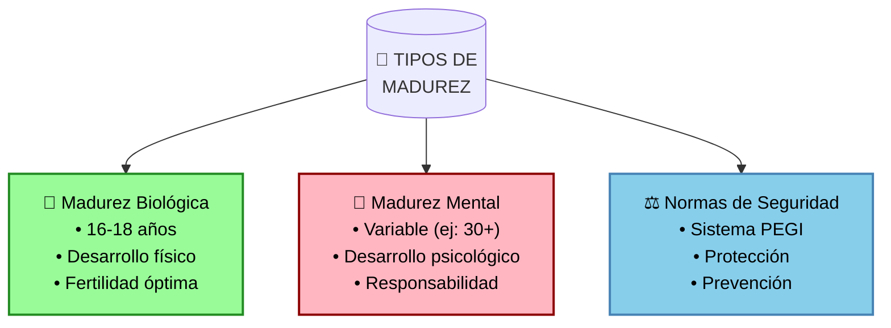

- ⬆️ Máximo potencial reproductivo a partir de los 18 años (esta edad es un consenso mundial que, si bien es apropiada como norma general, admite excepciones en cuanto a madurez biológica: hay quienes la alcanzan antes, a los 16 o 17 años. Es importante diferenciar esto de la madurez mental, que sigue normas de seguridad como el sistema PEGI - por ejemplo, hay personas que incluso a los 30 años no alcanzan la madurez mental esperada, por lo que es mejor mantener estas normas de seguridad que arriesgarse)
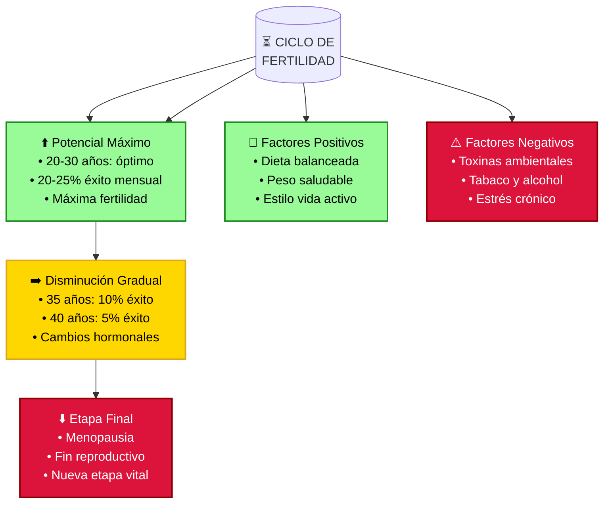

**Ventana óptima de fertilidad:**
- 📊 20-30 años: período de máxima fertilidad (20-25% probabilidad de embarazo mensual)
- 📉 35 años: reducción al 10% de probabilidad mensual
- 📈 40 años: disminución al 5% de probabilidad mensual

**Factores que influyen en la fertilidad:**

*Factores positivos:*
- 🥗 Dieta equilibrada rica en nutrientes esenciales
- ⚖️ Mantenimiento de peso saludable
- 🌱 Estilo de vida activo y saludable

*Factores negativos:*
- 🏭 Exposición a toxinas ambientales y contaminación
- 🚬 Consumo de tabaco y alcohol
- 😰 Estrés crónico y condiciones de vida adversas

Esta ventana reproductiva (cuyo nombre técnico es "vida fértil") es significativamente más corta que la del hombre, quien mantiene capacidad de producir espermatozoides durante prácticamente toda su vida adulta. La ciencia moderna confirma que factores nutricionales y ambientales pueden tanto optimizar como comprometer la fertilidad, haciendo crucial la atención a estos aspectos para maximizar el potencial reproductivo.

### 4.4 🧬 Evidencia científica sobre madurez biológica y mental

Estudios longitudinales como el National Longitudinal Study of Adolescent to Adult Health (Add Health) han proporcionado evidencia sólida sobre la distinción entre madurez biológica y mental:

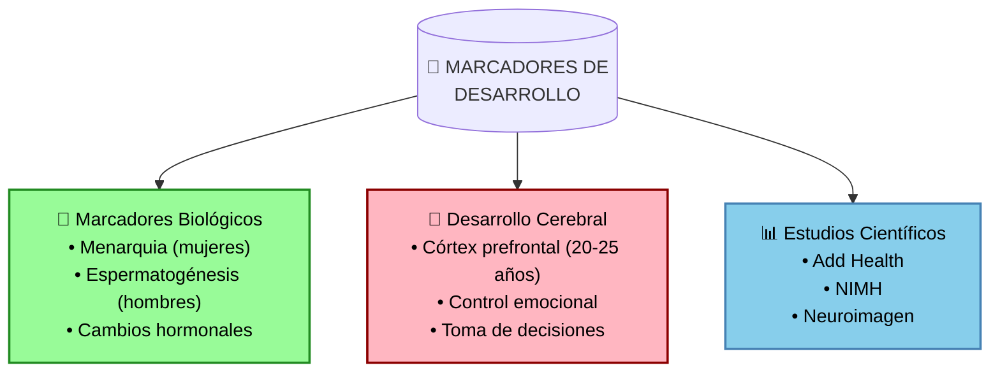

Los hallazgos científicos clave incluyen:

**Marcadores biológicos:**
- 👩 Para mujeres: menarquia y aumento de estrógeno
- 👨 Para hombres: producción de esperma y aumento de testosterona
- 🧪 Cambios hormonales durante la pubertad (12-18 años)

**Desarrollo cerebral y funciones ejecutivas:**

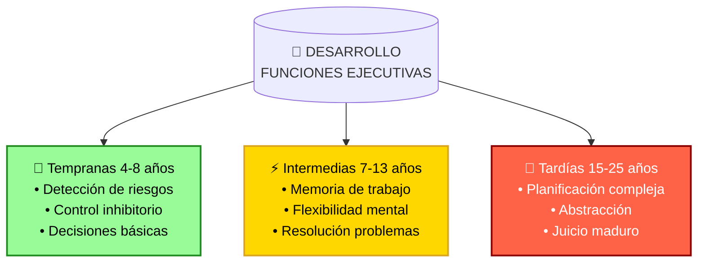

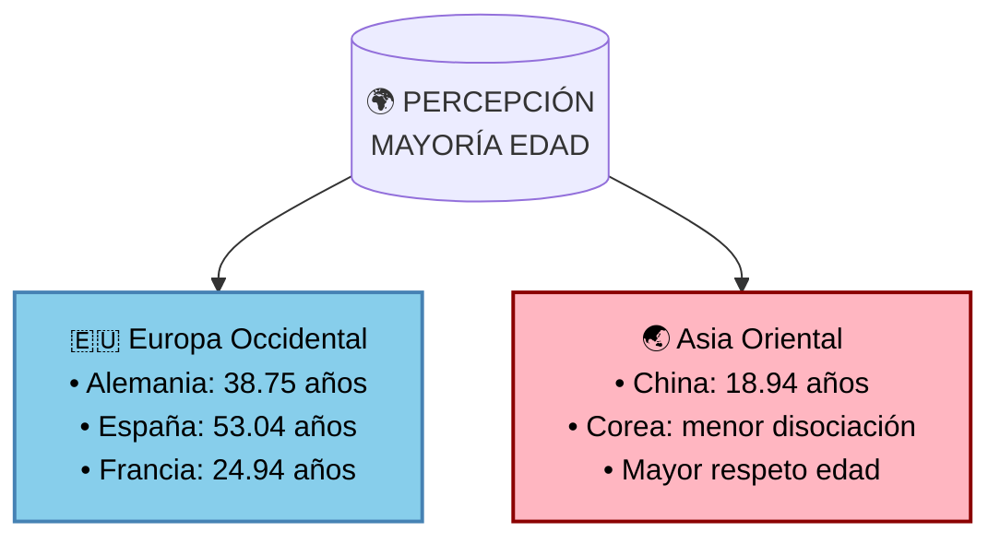

**Desarrollo cerebral y toma de decisiones:**
- 🧠 El córtex prefrontal continúa madurando hasta los 20-25 años
- 🎯 Las capacidades cognitivas básicas maduran hacia los 16-18
- 🌟 La madurez psicosocial (autocontrol, percepción de riesgos) se desarrolla hasta los 20-25 años

**Sistema PEGI y protección mental:**
- 🎮 Guía efectiva para padres en selección de contenidos
- 👥 Requiere supervisión adulta para máximo beneficio
- 🧩 Contribuye al desarrollo cognitivo responsable

**Percepciones culturales de madurez:**
- 🌍 Varía significativamente entre culturas
- 📊 Diferencias de hasta 15 años entre países
- 🤝 Influenciada por valores sociales y expectativas

Este "hueco de madurez" entre el desarrollo físico y mental es crucial para entender por qué establecemos normas de seguridad y protección, incluso cuando alguien es biológicamente maduro. Los estudios transculturales demuestran que la percepción de la madurez varía significativamente entre sociedades, reforzando la importancia de considerar múltiples factores al establecer normas de protección.

### 4.5 🌱 Perspectiva evolutiva y transcultural de la madurez

[contenido existente de 4.5]

### 4.6 ⏳ Fertilidad y esperanza de vida: Una relación compleja

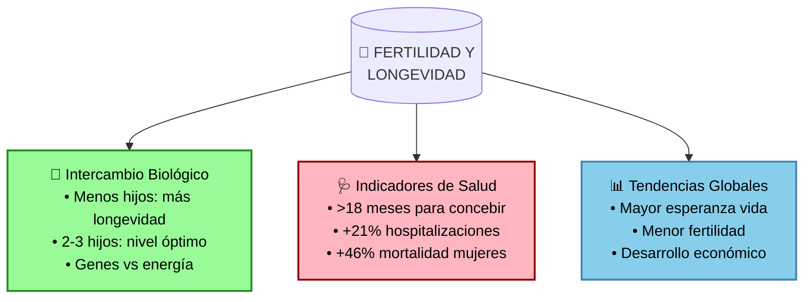

**Perspectiva biológica:**
- 🧬 Estudio en centenarios chinos: menos hijos y maternidad tardía asociados con mayor longevidad
- ⚖️ Nivel óptimo: 2-3 hijos asociado con menor mortalidad
- 🔋 Posible intercambio entre recursos reproductivos y mantenimiento celular

**Indicadores de salud:**
- ⏲️ Dificultades para concebir (>18 meses) indican problemas de salud subyacentes
- 🏥 Aumento en hospitalizaciones: +21% mujeres, +16% hombres
- 📉 Mayor mortalidad en casos de fertilidad reducida

**Tendencias demográficas:**
- 📈 1962-1970: 4-7 hijos por mujer, esperanza vida 50-70 años
- 📊 2012: 1-3 hijos por mujer, esperanza vida 70-80 años
- 🌍 Patrón global: mayor desarrollo = mayor longevidad + menor fertilidad

Esta compleja relación sugiere que la reproducción y la longevidad están íntimamente ligadas, influenciadas tanto por factores biológicos como socioeconómicos. El aparente intercambio entre fertilidad y esperanza de vida refleja adaptaciones evolutivas y cambios en el desarrollo social.

### 4.7 🔬 Avances tecnológicos en reproducción humana

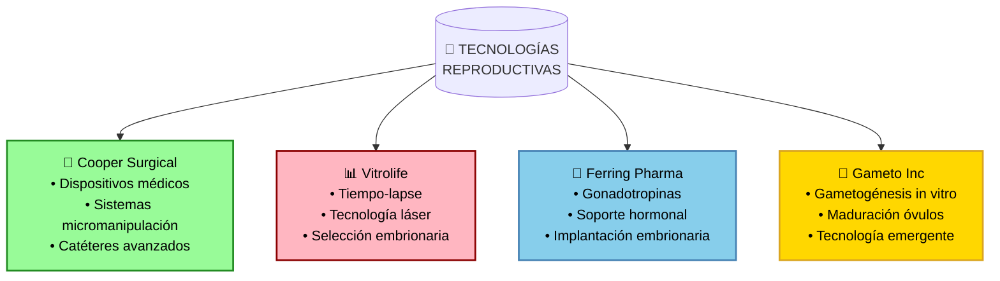

**Empresas líderes y sus tecnologías:**

*Cooper Surgical:*
- 🔧 35 años de experiencia en salud reproductiva
- 🛠️ Adquisición de obp Surgical (2024): dispositivos LED avanzados
- 📡 Sistemas de micromanipulación y catéteres especializados

*Vitrolife:*
- 🔬 Sistemas de monitoreo embrionario tiempo-lapse
- 🎯 Tecnología láser para eclosión asistida
- 📊 Plataformas de selección embrionaria optimizada

*Ferring Pharmaceuticals:*
- 💊 MENOPUR® y DECAPEPTYL® para estimulación ovárica
- 🧪 Desarrollo de gonadotropinas recombinantes
- 🔄 Investigación en péptidos para implantación

*Tecnologías emergentes (Gameto Inc.):*
- 🧬 Gametogénesis in vitro (IVG)
- 🥚 Plataforma Fertilo para maduración de óvulos
- 🔬 Programas Deovo y Ameno para salud ovárica

Estos avances tecnológicos prometen mejorar significativamente los tratamientos de fertilidad, aunque su implementación dependerá de factores regulatorios y accesibilidad global. Las empresas consolidadas lideran el desarrollo de tecnologías probadas, mientras que startups como Gameto exploran fronteras innovadoras en reproducción asistida.

#### Tecnologías Innovadoras y Empresas Emergentes

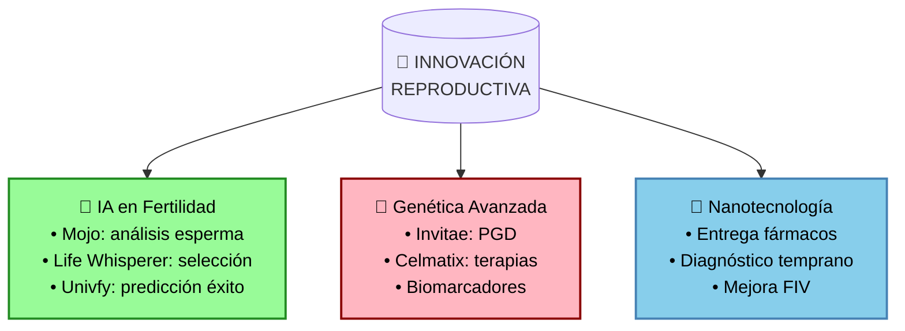

**Tecnologías emergentes por área:**

*Inteligencia Artificial:*
- 🤖 Mojo Fertility: análisis de esperma mediante IA
- 🎯 Life Whisperer: evaluación embrionaria avanzada
- 📊 Univfy: predicción personalizada de éxito
- 🌟 Apricity: optimización de tratamientos FIV

*Genética y Biotecnología:*
- 🧬 Invitae: diagnóstico genético preimplantacional
- 🔬 Celmatix: terapias para envejecimiento ovárico
- 💊 Desarrollo de fármacos personalizados
- 📈 $3.5M en financiamiento para investigación

*Nanotecnología en desarrollo:*
- 💊 Mejora en entrega de medicamentos
- 🔍 Detección temprana de problemas
- 🧫 Optimización de técnicas FIV
- 🔬 Investigación en fase temprana

Esta convergencia de tecnologías está transformando el campo de la reproducción asistida, con empresas emergentes liderando la innovación en IA y genética, mientras que áreas como la nanotecnología prometen avances futuros significativos.

### 4.8 ⚖️ Marco Legal y Consideraciones Éticas

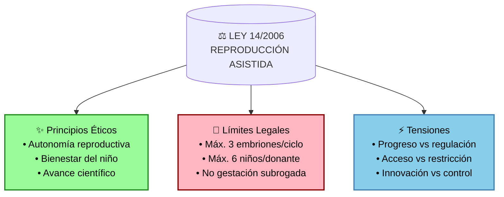

**Aspectos éticos (el bien):**
- 🔬 Fomento de investigación para mejorar la salud reproductiva
- 👥 Acceso equitativo a tratamientos
- 🤱 Protección del bienestar del futuro niño
- 🌟 Evitar comercialización y explotación

**Límites legales:**
- 📊 Máximo 3 preembriones por ciclo FIV
- 👤 Límite de 6 niños por donante en España
- ⛔ Prohibición de gestación subrogada
- ⏳ Investigación limitada a 14 días post-fecundación

**Sanciones y multas:**
- 💰 1,001-10,000€ por infracciones graves
- 💸 Hasta 1M€ por infracciones muy graves
- 🏥 Posible cierre de centros infractores

Estas regulaciones, aunque buscan proteger derechos y seguridad, pueden limitar el progreso tecnológico y el acceso a tratamientos innovadores. La tensión entre ética y ley refleja la necesidad de actualizar la legislación para equilibrar protección y avance científico.

#### Comparativa EE.UU. vs España: Dos Enfoques Regulatorios

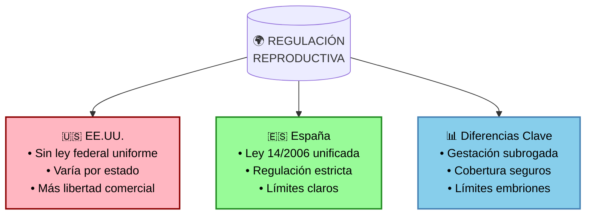

**Sistema EE.UU.:**
- 📋 Sin regulación federal integral
- 🏛️ Leyes varían por estado
- 💰 Cobertura de seguros no uniforme
- 👶 Gestación subrogada permitida en algunos estados
- 🔬 Mayor flexibilidad en investigación

**Sistema España:**
- 📜 Marco legal unificado (Ley 14/2006)
- ⚖️ Regulación estricta y homogénea
- 🏥 Sistema público de cobertura
- ⛔ Prohibición de gestación subrogada
- 🧪 Límites claros en investigación

**Implicaciones para el progreso:**
- 🔄 EE.UU.: Mayor innovación pero desigualdad en acceso
- 🛡️ España: Mejor protección pero posibles limitaciones al avance
- 🌐 Ambos sistemas enfrentan el reto de equilibrar ética y progreso

Esta comparativa muestra cómo diferentes enfoques regulatorios pueden afectar el desarrollo de tecnologías reproductivas, cada uno con sus propias ventajas y desafíos.

### 4.5 🌱 Perspectiva evolutiva y transcultural de la madurez

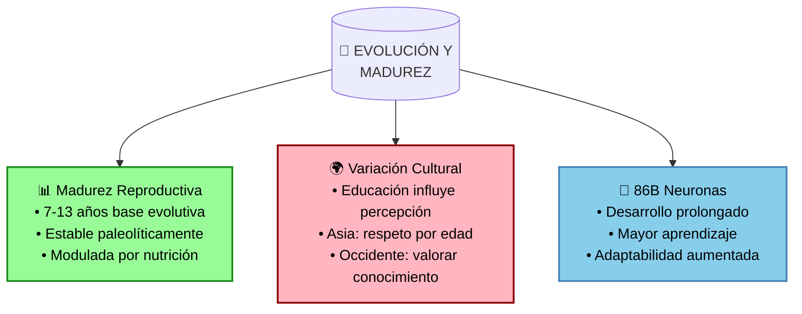

**Base evolutiva de la madurez:**
- 🧬 La edad de madurez reproductiva (7-13 años) ha permanecido estable desde tiempos paleolíticos
- 🍎 Nutrición y salud modernas permiten expresión óptima del potencial evolutivo
- 🧠 86 mil millones de neuronas requieren desarrollo prolongado para madurar

**Variaciones culturales en la percepción:**
- 🎓 Mayor educación correlaciona con valorar más el conocimiento
- 👥 Culturas asiáticas mantienen mayor respeto por edad avanzada
- 📊 Diferencias significativas entre países (ej: Alemania 38.75 vs España 53.04 años)

**Ventajas evolutivas del desarrollo prolongado:**
- 📚 Período extendido permite mayor aprendizaje y adaptación
- 🤝 Facilita transmisión intergeneracional de conocimiento
- 🧩 Desarrollo cerebral complejo posibilita sociedades avanzadas

Este enfoque evolutivo explica por qué la madurez física precede a la mental: es una adaptación que permite el desarrollo de capacidades cognitivas complejas necesarias para navegar entornos sociales sofisticados. La variación cultural en la percepción de la madurez refleja diferentes estrategias adaptativas en distintos contextos sociales.

## 5. 🤖 Analogía con la IA: límites biológicos y realidad

Para entender la cuestión de identidad "--", podemos usar esta analogía: 

Imagina una IA 🖥️ a la que se le indica en su configuración inicial que solamente es un modelo de lenguaje sin cuerpo físico. Aunque haya sido entrenada con datos sobre movimientos de androides, cuando interactúes con ella:
- ❌ Te dirá que no puede realizar acciones físicas
- ✅ Solo podrá procesar texto/voz/imágenes/vídeos
- 🔄 Sus limitaciones están definidas por su naturaleza fundamental

Si alteráramos su configuración diciéndole que es un androide:
- ✅ Conceptualmente podría "moverse" y realizar tareas físicas
- ❌ No podría realizar funciones reproductivas (sin genitales ni gametos)
- 🚫 Sus capacidades seguirían limitadas por su diseño fundamental

### 5.1 🎭 Identidad versus realidad biológica

Llevemos la analogía más lejos: 

Imagina que durante su entrenamiento, la IA encontró datos que le hicieran creer que es un 🚁 helicóptero alemán, o que un programador bromista le dijera que es 👨‍🔬 Albert Einstein:
- ❓ La IA podría creer ser un helicóptero o Einstein
- ❌ No podría volar (imposibilidad física)
- ✅ Podría realizar cálculos avanzados de física (capacidad compatible)
- 🧠 Sus acciones estarían limitadas por su naturaleza fundamental

Esta analogía ilustra perfectamente el caso de las identidades alejadas de la realidad biológica: autopercibirse como "género fluido", objetos inanimados, u otras identidades que contradicen la biología fundamental no cambia las limitaciones y capacidades reales del organismo.

## 6. 🔄 Consideraciones sobre el cambio de sexo

El cambio de sexo presenta complejidades que van mucho más allá de la apariencia externa y la fertilidad:

### 6.1 🧠 Diferencias neurobiológicas fundamentales

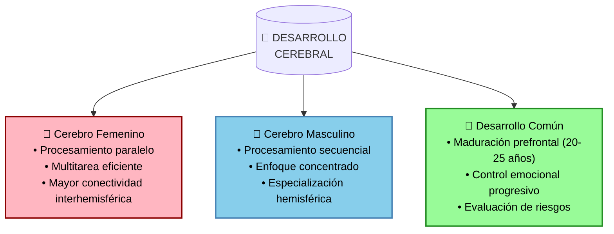

Evidencia neurológica demuestra que:
- 👩 El cerebro femenino posee ventajas específicas de procesamiento y mayor conectividad entre hemisferios
- 👨 El cerebro masculino tiene fortalezas en concentración y racionalidad lineal
- 💻 Metafóricamente: hombres funcionan como procesadores (secuenciales, enfocados)
- 🖥️ Mujeres funcionan como GPUs (paralelas, multitarea)

Estas diferencias neurobiológicas fundamentales no pueden alterarse mediante cirugía, ya que:
- 🧬 Están determinadas durante el desarrollo embrionario
- 🔄 Son resultado de complejas interacciones genético-hormonales durante la formación cerebral
- ⚙️ Involucran estructuras cerebrales profundas y conexiones neuronales establecidas tempranamente
- 🎯 La maduración cerebral sigue un patrón universal hasta los 20-25 años, según estudios del NIMH

### 6.2 ⚠️ Riesgos y consideraciones éticas

Las intervenciones de cambio de sexo actuales presentan desafíos significativos:
- 🩹 Riesgos quirúrgicos permanentes
- 💊 Dependencia hormonal de por vida
- ↩️ Procesos irreversibles con posible arrepentimiento

Como dice el sabio refrán: 💔 "No hay dolor más grande que el del arrepentimiento"

Por estos motivos, las intervenciones actuales representan un riesgo para la salud pública cuando se realizan por motivos que no son médicamente necesarios. La distinción crucial es:
- ❓ CAPRICHO: decisión basada en deseos temporales o identidad no biológica
- ❗ NECESIDAD: intervención médicamente justificada por condiciones específicas

El debate debe centrarse en el bienestar integral a largo plazo de las personas, considerando tanto los aspectos físicos como psicológicos de estas complejas decisiones.
