# 🧬 Modelo Existencial Reproductivo 🧬

> **Actualización Mayo 2025:** Este documento ha sido ampliado con las últimas investigaciones en neurociencia del desarrollo, avances en tecnologías reproductivas y consideraciones bioéticas emergentes. Las nuevas secciones incluyen información sobre neuroplasticidad, gametos sintéticos, inteligencia artificial en fertilidad y marcos regulatorios futuros.

## 📑 Índice

1. [Advertencias Importantes](#advertencias-importantes)
2. [Introducción](#1-introducción-roles-tradicionales-y-modernos-en-la-sociedad)
3. [Contribución Social](#2-contribución-social-y-opciones-reproductivas)
4. [Demografía y Reproducción](#3-demografía-reproducción-y-supervivencia-de-la-especie)
5. [Avances Científicos](#4-avances-científicos-y-reproducción-asistida)
6. [Analogía con la IA](#5-analogía-con-la-ia-límites-biológicos-y-realidad)
7. [Consideraciones sobre el Cambio de Sexo](#6-consideraciones-sobre-el-cambio-de-sexo)
8. [Diferencias Biológicas entre Sexos](#7-diferencias-biológicas-entre-sexos)
9. [Referencias](#8-referencias-y-fuentes)
10. [Conclusiones e Implicaciones](#9-conclusiones-e-implicaciones-futuras)

---

## ⚠️ ADVERTENCIAS IMPORTANTES

### 🔞 Contenido Sensible

> Este documento contiene información científica y técnica sobre reproducción humana, fertilidad y desarrollo biológico. El contenido está destinado a un público adulto con madurez para comprender temas médicos y bioéticos complejos.

### 📚 Naturaleza del Documento

> Este es un análisis científico basado en investigaciones actuales y evidencia médica. No constituye consejo médico directo y toda decisión relacionada con tratamientos reproductivos debe consultarse con profesionales de la salud cualificados.

### ⚖️ Aspectos Legales

> Las menciones a marcos legales y regulaciones son informativas y pueden variar según la jurisdicción. Este documento no sustituye el asesoramiento legal profesional en temas de reproducción asistida.

### 🔬 Base Científica

> Los diagramas y modelos presentados son herramientas visuales para ayudar a comprender conceptos complejos. La información se basa en investigaciones verificables y publicaciones científicas actualizadas hasta 2025.

Para comprender mejor este modelo, me gusta usar como referencia la estructura social de las tribus ancestrales:

**Roles Masculinos:**

- 👑 El líder de la tribu (gobierno)
- 🧙‍♂️ El chamán (religión)
- 🏹 El cazador (proveedor)
- 🧭 El explorador (innovador)

**Roles Femeninos:**

- 👶 Labores de cuidado de niños
- 🧶 Artesanía
- 🍎 Recolección de alimentos
- 🏺 Preservación de tradiciones

Todos estos roles eran esenciales para la supervivencia colectiva.

### 🤔 Preguntas Fundamentales para la Reflexión

> **Esta sección ofrece un marco estructurado para evaluar la preparación personal, familiar y social ante la decisión de reproducirse y criar descendencia, considerando factores psicológicos, prácticos, relacionales y éticos.**

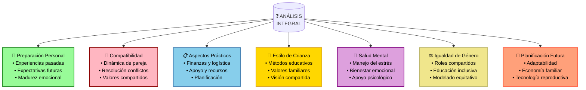

#### **1. 🎯 Preparación Personal**

> _Esta categoría explora tu madurez emocional, motivaciones y preparación individual para la paternidad/maternidad._

1. 👶 ¿Qué experiencias y conocimientos tienes sobre el cuidado infantil?
2. 🏡 ¿Qué aprendizajes de tu propia crianza influirán en tu estilo parental?
3. 💭 ¿Cuáles son tus motivaciones profundas para la paternidad/maternidad?
4. ⏰ ¿Qué indicadores te dirán que es el momento adecuado?
5. 🧠 ¿Qué temores específicos tienes sobre la crianza y cómo planeas manejarlos?
6. 💪 ¿Qué estrategias de autocuidado y manejo del estrés utilizas?
7. 🔄 ¿Cómo crees que evolucionará tu identidad personal con la paternidad/maternidad?
8. 🎭 ¿Qué planes alternativos consideras si la paternidad/maternidad biológica no es posible?
9. 🌱 ¿Qué fortalezas personales aportarías a la crianza?
10. 📈 ¿Qué aspectos de tu desarrollo personal consideras prioritarios antes de ser padre/madre?

#### **2. 💑 Relación y Coparentalidad**

> _Evalúa la solidez de tu relación y la capacidad para ejercer una crianza colaborativa._

1. 🤝 ¿Cómo manejan actualmente los desacuerdos y toman decisiones importantes?
2. 💭 ¿Han definido explícitamente sus roles y responsabilidades como padres?
3. ⚖️ ¿Qué estrategias usarán para mantener el equilibrio entre pareja y familia?
4. 💪 ¿Cómo se complementan sus fortalezas y debilidades en la crianza?
5. 🏠 ¿Comparten una visión común sobre el estilo de vida familiar?
6. 🤲 ¿Qué necesidades emocionales específicas tienen como individuos y pareja?
7. 💫 ¿Qué rituales y prácticas mantendrán para fortalecer su vínculo?
8. 🌱 ¿Qué plan tienen para evolucionar juntos como padres?
9. 🎯 ¿Cómo alinearán sus objetivos personales con los familiares?
10. 🔄 ¿Qué mecanismos de comunicación y ajuste implementarán?

#### **3. 📋 Preparación Física y Biológica**

> _Considera las necesidades específicas de salud y fitness según tu sexo biológico._

1. 💪 ¿Qué rutina de entrenamiento sigues actualmente?
   - 👩 Mujeres: ¿Adaptas el ejercicio a tu ciclo menstrual?
   - 👨 Hombres: ¿Mantienes un programa progresivo de fuerza?

2. 🏋️ ¿Conoces las recomendaciones de ejercicio específicas para tu sexo?
   - 👩 2-3 sesiones de fuerza/semana, limitar aeróbico excesivo
   - 👨 Entrenamiento progresivo con énfasis en hipertrofia

3. 🍽️ ¿Cumples con los requerimientos nutricionales básicos?
   - 👩 1.5-2g proteína/kg, hierro, calcio
   - 👨 2g+ proteína/kg, carbohidratos para rendimiento

4. 😴 ¿Cómo priorizas el descanso y la recuperación?
   - 👩 Adaptación al ciclo hormonal
   - 👨 Consistencia en patrones de sueño

5. 🩺 ¿Realizas chequeos médicos regulares específicos?
   - 👩 Densidad ósea, niveles hormonales, hierro
   - 👨 Testosterona, presión arterial

6. 🎯 ¿Tienes objetivos de salud a largo plazo?
   - 👩 Prevención de osteopenia/osteoporosis
   - 👨 Mantenimiento de masa muscular

7. ⚕️ ¿Conoces tus factores de riesgo específicos?
   - 👩 Trastornos alimentarios, amenorrea
   - 👨 Riesgos cardiovasculares

8. 💊 ¿Qué suplementos o apoyo nutricional necesitas?
   - 👩 Hierro, calcio, vitamina D
   - 👨 Proteína, zinc, magnesio

9. 🏥 ¿Tienes acceso a profesionales de salud especializados?
   - 👩 Ginecología, endocrinología
   - 👨 Urología, cardiología

10. 📈 ¿Monitorizas indicadores clave de salud?
    - 👩 Ciclo menstrual, densidad ósea
    - 👨 Composición corporal, presión arterial

#### **4. 👶 Valores y Estilo de Crianza**

> _Define los principios, metodologías y enfoques que guiarán tu estilo parental._

1. 🎯 ¿Qué valores fundamentales definen su filosofía de crianza?
2. 🌱 ¿Cómo fomentarán el desarrollo moral y ético?
3. 📱 ¿Qué límites y guías establecerán para el uso de tecnología?
4. 🎓 ¿Qué enfoque educativo se alinea con sus valores y aspiraciones?
5. 💝 ¿Cómo cultivarán vínculos afectivos saludables?
6. 🌈 ¿Qué estrategias usarán para educar en diversidad e inclusión?
7. 📏 ¿Cómo establecerán límites y disciplina constructiva?
8. 🌍 ¿Qué legado cultural y familiar desean transmitir?
9. 🎭 ¿Cómo apoyarán el desarrollo de la identidad individual?
10. 🔄 ¿Cómo adaptarán su estilo de crianza según las necesidades evolutivas?

#### **5. 🌟 Situaciones Especiales y Desafíos**

> _Anticipa escenarios complejos y desarrolla estrategias de respuesta ante circunstancias no ideales._

1. ⚕️ ¿Qué recursos y preparación necesitarían para atender necesidades especiales?
2. 💔 ¿Qué plan alternativo tienen si enfrentan dificultades reproductivas?
3. 👥 ¿Cómo establecerán límites saludables con la familia extendida?
4. 🌱 ¿Qué apertura tienen hacia diferentes vías para formar familia?
5. 🏥 ¿Qué opciones de atención médica y perinatal han evaluado?
6. 🔄 ¿Qué flexibilidad tienen sus planes ante cambios significativos?
7. 💊 ¿Qué criterios usarán para tomar decisiones médicas importantes?
8. 🛡️ ¿Qué protecciones legales y financieras implementarán?
9. 🌍 ¿Cómo integrarán diferentes influencias culturales?
10. 🤲 ¿Qué balance buscan entre protección y autonomía?

#### **6. 🧠 Bienestar Integral**

> _Evalúa las estrategias para mantener un equilibrio entre salud física y mental._

1. 😴 ¿Qué rutinas de autocuidado sigues?
   - 👩 Adaptación al ciclo hormonal
   - 👨 Consistencia diaria

2. 🎯 ¿Cómo manejas el estrés físico y mental?
   - 👩 Ajuste según fase menstrual
   - 👨 Equilibrio entrenamiento-recuperación

3. 💪 ¿Qué papel juega el ejercicio en tu bienestar?
   - 👩 Prevención sobreentrenamiento
   - 👨 Control tensión/ansiedad

4. 🥗 ¿Cómo influye tu alimentación en tu estado mental?
   - 👩 Relación con fluctuaciones hormonales
   - 👨 Impacto en niveles de energía

5. 🌱 ¿Qué prácticas de recuperación implementas?
   - 👩 Descanso según ciclo
   - 👨 Rutinas consistentes

6. 🧠 ¿Reconoces señales de sobrecarga?
   - 👩 Alteraciones del ciclo
   - 👨 Fatiga crónica

7. 🤝 ¿Qué apoyo profesional buscas?
   - 👩 Salud hormonal/reproductiva
   - 👨 Rendimiento/recuperación

8. ⚖️ ¿Cómo equilibras diferentes aspectos de tu vida?
   - 👩 Adaptación a ciclos naturales
   - 👨 Estructura y rutina

9. 📈 ¿Monitorizas indicadores de bienestar?
   - 👩 Ciclo, energía, estado anímico
   - 👨 Rendimiento, sueño, estrés

10. 🔄 ¿Qué estrategias de adaptación utilizas?
    - 👩 Flexibilidad según fase hormonal
    - 👨 Ajustes progresivos sistemáticos

#### **7. 🧬 El Núcleo Humano Universal**

> _Explora las características fundamentales que definen nuestra humanidad común, más allá de las especializaciones biológicas._

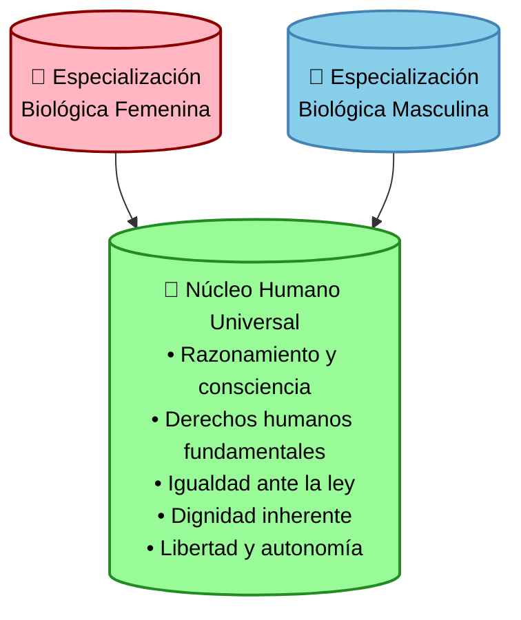

**Leyenda del diagrama:**
- 👩 **Conjunto A (Rosa):** Especialización biológica femenina - características específicas del sexo femenino como la gestación, lactancia y aspectos hormonales/anatómicos propios.
- 👨 **Conjunto B (Azul):** Especialización biológica masculina - características específicas del sexo masculino como producción de esperma y aspectos hormonales/anatómicos propios.
- 🧬 **Intersección C (Verde):** Núcleo humano universal - características, derechos y capacidades compartidas por todos los seres humanos independientemente de su sexo biológico.

**Preguntas sobre el núcleo humano universal:**

1. ⚖️ ¿Cómo ejerces tus derechos y libertades fundamentales?
2. 🤝 ¿De qué manera respetas la dignidad inherente de otros?
3. 📚 ¿Cómo desarrollas tu potencial como ser humano?
4. ⚡ ¿Qué significa para ti la libertad de pensamiento?
5. 🎯 ¿Cómo contribuyes al bienestar colectivo respetando las leyes?
6. 🧠 ¿Qué estrategias usas para el razonamiento ético?
7. 🌍 ¿Cómo ejerces tu responsabilidad como miembro de la sociedad?
8. ⭐ ¿Qué aspectos de tu autonomía personal valoras más?
9. 💡 ¿Cómo aplicas tu capacidad de pensamiento crítico?
10. 🔄 ¿De qué manera equilibras derechos y responsabilidades?

#### **8. 🔮 Planificación Vital y Salud**

> _Proyecta estrategias para optimizar la salud y el bienestar según tu biología._

1. 💪 ¿Qué rutina de ejercicio planeas mantener?
   - 👩 2-3 sesiones de fuerza/semana, prevención osteoporosis
   - 👨 Entrenamiento progresivo, mantenimiento masa muscular

2. 🥗 ¿Cómo adaptarás tu nutrición por etapas?
   - 👩 Ajustes según ciclo menstrual y etapa reproductiva
   - 👨 Optimización proteica y control metabólico

3. 🏋️ ¿Qué tipo de actividad física priorizarás?
   - 👩 Equilibrio entre fuerza y aeróbico moderado
   - 👨 Énfasis en hipertrofia y rendimiento

4. 😴 ¿Cómo optimizarás tu recuperación?
   - 👩 Adaptación a ciclos hormonales naturales
   - 👨 Consistencia en patrones de descanso

5. 🩺 ¿Qué controles médicos necesitarás?
   - 👩 Densidad ósea, hormonas, hierro sérico
   - 👨 Testosterona, cardiovascular, próstata

6. 💊 ¿Qué suplementación consideras?
   - 👩 Hierro, calcio, vitamina D, colágeno
   - 👨 Proteínas, creatina, zinc, magnesio

7. ⚕️ ¿Qué riesgos específicos prevendrás?
   - 👩 Osteoporosis, anemia, desarreglos hormonales
   - 👨 Sarcopenia, problemas cardíacos, andropausia

8. 🧠 ¿Cómo mantendrás tu bienestar mental?
   - 👩 Gestión de cambios hormonales vitales
   - 👨 Adaptación al envejecimiento natural

9. 🌱 ¿Qué hábitos saludables cultivarás?
   - 👩 Conexión con ciclos naturales, autocuidado
   - 👨 Disciplina consistente, vitalidad sostenible

10. 📈 ¿Cómo evaluarás tu progreso?
    - 👩 Marcadores hormonales y óseos
    - 👨 Composición corporal y función cardíaca

> ### 📝 Nota sobre la Reflexión
>
> Estas preguntas constituyen un punto de partida para un diálogo profundo y continuo entre la pareja. No existen respuestas universalmente correctas, ya que cada familia es única y responde a circunstancias y valores particulares. Lo fundamental es:
>
> - 🤝 Mantener una comunicación abierta, honesta y sin prejuicios
> - 🔄 Revisar periódicamente estas reflexiones, reconociendo la evolución natural de las perspectivas
> - 💭 Dedicar tiempo específico a la reflexión tanto individual como conjunta
> - 📈 Evaluar las implicaciones a corto, mediano y largo plazo de cada decisión
> - 🧠 Desarrollar conciencia plena sobre el impacto multidimensional de las decisiones reproductivas
> - 🌐 Considerar el contexto social, económico y tecnológico cambiante
>
> **Fuentes consultadas (actualizadas 2025):**
>
> - The Longest Shortest Time - 36 Questions to Ask Your Partner Before Having Kids
> - PureWow - 28 Uncomfortable Questions to Ask Before Having a Baby
> - Peanut - 27 Questions to Ask Before Having a Baby
> - Positive Psychology - Mental Health Questions for Family Planning
> - Dr. Twishampati Naskar - 35 Questions During Psychiatrist First Appointment
> - Journal of Family Psychology (2025) - "Evaluación de preparación parental en la era digital"
> - Instituto de Bioética Reproductiva (2024) - "Consideraciones éticas en tecnologías reproductivas emergentes"
> - Asociación Internacional de Igualdad en la Crianza - "Guía para la parentalidad equitativa" (2025)

> ### 📝 Nota sobre el Enfoque Integral
>
> Este marco de preguntas ha sido diseñado para proporcionar una evaluación holística que integra:
>
> **Aspectos Psicológicos:**
>
> - 🧠 Evaluación del bienestar emocional y preparación mental
> - 💭 Identificación de patrones relacionales heredados y su impacto
> - 🤝 Análisis de dinámicas familiares existentes y proyectadas
> - 💪 Desarrollo de estrategias de afrontamiento ante los desafíos parentales
>
> **Dimensión de Igualdad de Género:**
>
> - ⚖️ Promoción de corresponsabilidad efectiva en la crianza
> - 🎯 Eliminación consciente de estereotipos y micromachismos en la vida familiar
> - 🌱 Fomento de un desarrollo personal libre de condicionantes basados en género
> - 🤲 Construcción de un entorno familiar basado en el respeto mutuo y la equidad
>
> **Adaptación a Avances Tecnológicos:**
>
> - 🧬 Consideración de implicaciones éticas de tecnologías reproductivas emergentes
> - 🤖 Integración consciente de herramientas digitales en la crianza
> - 💊 Evaluación crítica de avances biomédicos en desarrollo infantil
> - 🔮 Preparación para escenarios futuros en un mundo rápidamente cambiante
>
> La revisión periódica de estas preguntas es fundamental para mantener un diálogo actualizado y adaptado a las circunstancias cambiantes, tanto personales como sociales y tecnológicas.
>
> **Fuentes consultadas (actualizadas 2025):**
>
> - The Longest Shortest Time - 36 Questions to Ask Your Partner Before Having Kids
> - PureWow - 28 Uncomfortable Questions to Ask Before Having a Baby
> - Peanut - 27 Questions to Ask Before Having a Baby
> - Positive Psychology - Mental Health Questions for Family Planning
> - Dr. Twishampati Naskar - 35 Questions During Psychiatrist First Appointment
> - Journal of Family Psychology (2025) - "Evaluación de preparación parental en la era digital"
> - Instituto de Bioética Reproductiva (2024) - "Consideraciones éticas en tecnologías reproductivas emergentes"
> - Asociación Internacional de Igualdad en la Crianza - "Guía para la parentalidad equitativa" (2025)
> - Centro de Estudios sobre Neuroplasticidad y Desarrollo Infantil - "Influencias ambientales en el desarrollo cerebral" (2025)

---

## 2. 💼 Contribución social y opciones reproductivas

> **Nota importante sobre el amor propio y la supervivencia colectiva:**
>
> ### 🌍 Escenario Hipotético (2 personas):
>
> "Mi zona de confort es el amor propio" - Esta frase refleja una decisión individual válida, pero debe entenderse en el contexto más amplio de la supervivencia colectiva. La humanidad es fundamentalmente una comunidad, incluso si se redujera a solo dos personas.
>
> En un escenario hipotético extremo con solo dos supervivientes (hombre y mujer):
> - 🤝 Las normas serían por mutuo acuerdo
> - 🧬 Los instintos biológicos naturalmente impulsarían la procreación
> - 💪 El instinto de supervivencia superaría incluso al instinto reproductivo
> - ⚖️ La decisión final debe respetar siempre los derechos humanos fundamentales
> - 🚫 Cualquier forma de coerción o violencia sería éticamente inaceptable
>
> ### 👥 Aplicación en la Sociedad Actual:
>
> En el contexto de la sociedad moderna con millones de habitantes, la contribución reproductiva adquiere una dimensión social comparable a la contribución fiscal:
>
> **Analogía del Contribuyente:**
> - 💰 Así como unos ciudadanos aportan al tesoro público...
> - 👶 Otros contribuyen a la supervivencia de la especie con descendencia
> - ⚖️ Ambas son formas esenciales de contribución social
>
> **Medidas en Caso de Crisis Demográfica:**
> - 🚫 La expulsión de la comunidad podría ser una medida extrema
> - 🏠 No implica exilio ni pérdida de propiedad privada
> - ⚠️ Solo se activaría ante riesgo real de extinción
> - 📊 Requiere umbral crítico de población
>
> **⚠️ Límites Éticos y Legales del Estado:**
> - ⛔ El Estado NO PUEDE bajo ninguna circunstancia:
>   * 🔒 Encarcelar a personas por no procrear
>   * 👊 Usar violencia o coerción
>   * ⚔️ Implementar medidas fascistas
>   * ☠️ Realizar ejecuciones (constituiría genocidio)
>   * 💉 Forzar la reproducción
> - ✅ Cualquier medida debe respetar:
>   * 🌟 Derechos humanos fundamentales
>   * ⚖️ Estado de derecho
>   * 🤝 Dignidad individual
>   * 🛡️ Integridad física y mental
>
> El **instinto de supervivencia** es más poderoso que:
> - Las creencias limitantes
> - La racionalización
> - Las preferencias personales
> - La zona de confort individual
>
> Como un 🐦‍🔥 fénix que renace de las cenizas, el amor propio evoluciona hacia un acuerdo mutuo por la supervivencia colectiva.
>
> "Mi zona de confort es el amor propio" - Esta frase refleja una decisión individual válida, pero debe entenderse en el contexto más amplio de la supervivencia colectiva. La humanidad es fundamentalmente una comunidad, incluso si se redujera a solo dos personas.
>
> En un escenario hipotético extremo con solo dos supervivientes (hombre y mujer):
> - 🤝 Las normas serían por mutuo acuerdo
> - 🧬 Los instintos biológicos naturalmente impulsarían la procreación
> - 💪 El instinto de supervivencia superaría incluso al instinto reproductivo
> - ⚖️ La decisión final debe respetar siempre los derechos humanos fundamentales
> - 🚫 Cualquier forma de coerción o violencia sería éticamente inaceptable
>
> El **instinto de supervivencia** es más poderoso que:
> - Las creencias limitantes
> - La racionalización
> - Las preferencias personales
> - La zona de confort individual
>
> Como un 🐦‍🔥 fénix que renace de las cenizas, el amor propio evoluciona hacia un acuerdo mutuo por la supervivencia colectiva.
>
> ### 💰 Relación Fiscal Estado-Ciudadano
>
> **Derechos del Ciudadano:**
> - ✅ Si ha pagado todas sus deudas públicas:
>   * 💸 El Estado debe devolverle cualquier contribución pendiente
>   * 🏦 No puede ser encarcelado por negarse a pagar nuevos impuestos
>   * 🚫 Tiene derecho a renunciar al uso de servicios públicos
>
> **Obligaciones y Excepciones:**
> - ⚖️ Para servicios públicos inevitables (ej: carreteras):
>   * 💰 Debe pagar el costo justo de mantenimiento
>   * 📊 La tarifa debe ser proporcional al uso
>   * 🤝 Basado en acuerdo mutuo y transparente

Existe algo más perjudicial para la sociedad que cualquier orientación sexual: 😴 no estudiar, ni trabajar, ni emprender, ni invertir (es decir, no producir valor, o producirlo pero no comerciarlo [existir únicamente para gastar y consumir de lo ajeno]).

### 📋 Alternativas Reproductivas

Entre las opciones disponibles encontramos:

| Tipo            | Descripción                                                        |
| --------------- | ------------------------------------------------------------------ |
| 🧘‍♂️ Celibato     | El monje asexual que decide permanecer soltero toda la vida        |
| 💉 Donación     | Los donantes de semen u óvulos (contribución genética sin crianza) |
| 🤰 Gestación    | El alquiler de vientres (caso especial de la mujer)                |
| 🚫 Interrupción | El debate sobre permitir el aborto en casos extremos               |

---

## 3. 📊 Demografía, reproducción y supervivencia de la especie

### 🌍 Escenario de Extinción

Si la especie humana enfrentara un peligro de extinción por baja natalidad, se deben considerar varios factores:

- 🚩 **INDEPENDENCIA** como valor fundamental (siguiendo el refrán de Mario Luna: "Te quiero pero no te necesito")
- 🤝 Comercio internacional equilibrado (ej: comerciar con China pero mantener independencia económica, tecnológica y poblacional)
- 💞 Protocolos basados en relación natalidad-mortalidad
- 🧬 Diversidad sexual no representa un problema demográfico real

### 🔄 Transmisión Generacional

El comunismo, al ser principalmente un sistema de ideas, se transmite generacionalmente a través de:

- 👨‍👩‍👧‍👦 Tradiciones familiares
- 🗳️ Patrones de voto heredados
- 🧠 Sistemas de creencias establecidos

### 3.1 📈 Dinámica reproductiva en la sociedad

El 🏆 1% de la élite mundial más privilegiada posee:

- 🧠 Mayor inteligencia (recordando a Arquímedes: "dame un punto de apoyo y moveré el mundo")
- 🌟 Fama y visibilidad (marketing, poder en redes sociales, influencia en diferentes mercados)
- 💪 Control de recursos estratégicos:
  - 🎖️ Poder militar y político
  - 💰 Dominio económico y financiero
  - ⚖️ Influencia religiosa y cultural
  - 🔬 Avances científicos y tecnológicos
  - 🏃‍♂️ Excelencia física y salud óptima
  - 🧬 Investigación en longevidad

Según investigaciones de Mario Luna: esta élite ofrece protección y asistencia a la mujer y su descendencia durante todo el tiempo necesario hasta que las crías se independicen. Esto, junto con buenos genes, hace que normalmente el 10%-20% de los hombres fecunde a la mayoría de las mujeres, seguidos por hombres beta (30%-50%) y así sucesivamente en la jerarquía social.

### 3.2 🌈 Perspectivas sobre diversidad sexual e identidad

Una medida extrema sería otorgar "licencias" para pertenecer a la comunidad LG (Lesbianas y Gays), donde la B (Bisexual) tendría más preferencia biológica que la LG. La T (Transgénero) presenta desafíos significativos:

- ⏳ No será biológicamente posible hasta dentro de 3 o 4 milenios por lo que veo
- 💉 Representa riesgos para la salud pública (hormonas, similar a drogas)

La categoría "+" podría interpretarse como experimentación con la moda y los disfraces (dependiendo del género biológico, ciertas prendas resultarán más funcionales/cómodas). La categoría "--" y otras identidades alejadas de la realidad biológica representan un problema para la sociedad, ya que promueven conceptos que contradicen los fundamentos biológicos básicos y pueden generar confusión y desafíos en políticas públicas de salud y desarrollo.

## 4. 🧪 Avances científicos y reproducción asistida

Una esperanzadora opción está emergiendo: el avance en la decodificación completa del ADN humano, las instrucciones fundamentales de la vida. Con estos conocimientos, la Inteligencia Artificial GENERATIVA 🎨🧠🔬 podría revolucionar la reproducción humana permitiendo:

- ⏰ Frenar el envejecimiento biológico
- 💊 Curar enfermedades actualmente incurables
- 🧫 Generar gametos sintéticos (espermatozoides u óvulos) mejorados y optimizados

### 4.1 👩‍❤️‍👩 Aplicaciones para parejas del mismo sexo

**Caso de pareja lesbiana:** 🧬 Se podría tomar una muestra de ADN de una mujer y, mediante IA GENERATIVA, crear una versión masculina de ese ADN para producir un espermatozoide 100% funcional y saludable. Este espermatozoide se utilizaría para fecundar por inseminación in vitro a la otra mujer de la pareja.

El objetivo principal sería garantizar la EVOLUCIÓN positiva: el material genético resultante debería ser igual o mejor que el original, descartando cualquier resultado defectuoso.

**Caso de pareja homosexual masculina:** 👨‍❤️‍👨 Presenta mayor complejidad, ya que además de crear un óvulo sintético a partir del ADN masculino, se requeriría:

- 🤰 Un vientre de alquiler humano, o
- 🔬 Un útero artificial (tecnología aún en desarrollo)

### 4.2 🔬 Tecnologías reproductivas emergentes

La investigación avanza hacia el desarrollo de incubadoras artificiales (úteros sintéticos), ofreciendo esperanza para:

- 🚫 Mujeres y hombres con problemas de esterilidad
- 🩺 Complementos a la prevención de Enfermedades de Transmisión Sexual

Alternativas actuales incluyen el transplante de óvulos: mujeres con útero funcional pero ovarios infértiles pueden recibir óvulos de donantes, permitiéndoles experimentar el embarazo y parto.

### 4.3 🕰️ Fertilidad biológica y ciclo vital

La fertilidad femenina sigue un ciclo temporal bien definido. Analicemos los diferentes tipos de madurez y sus implicaciones:

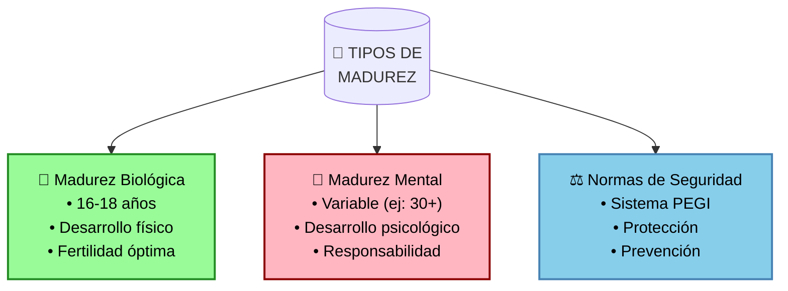

- ⬆️ Máximo potencial reproductivo a partir de los 18 años (esta edad es un consenso mundial que, si bien es apropiada como norma general, admite excepciones en cuanto a madurez biológica: hay quienes la alcanzan antes, a los 16 o 17 años. Es importante diferenciar esto de la madurez mental, que sigue normas de seguridad como el sistema PEGI - por ejemplo, hay personas que incluso a los 30 años no alcanzan la madurez mental esperada, por lo que es mejor mantener estas normas de seguridad que arriesgarse)

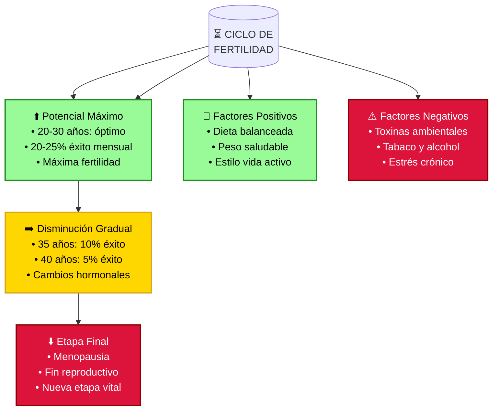

**Ventana óptima de fertilidad:**

- 📊 20-30 años: período de máxima fertilidad (20-25% probabilidad de embarazo mensual)
- 📉 35 años: reducción al 10% de probabilidad mensual
- 📈 40 años: disminución al 5% de probabilidad mensual

**Factores que influyen en la fertilidad:**

_Factores positivos:_

- 🥗 Dieta equilibrada rica en nutrientes esenciales
- ⚖️ Mantenimiento de peso saludable
- 🌱 Estilo de vida activo y saludable

_Factores negativos:_

- 🏭 Exposición a toxinas ambientales y contaminación
- 🚬 Consumo de tabaco y alcohol
- 😰 Estrés crónico y condiciones de vida adversas

Esta ventana reproductiva (cuyo nombre técnico es "vida fértil") es significativamente más corta que la del hombre, quien mantiene capacidad de producir espermatozoides durante prácticamente toda su vida adulta. La ciencia moderna confirma que factores nutricionales y ambientales pueden tanto optimizar como comprometer la fertilidad, haciendo crucial la atención a estos aspectos para maximizar el potencial reproductivo.

### 4.4 🧬 Evidencia científica sobre madurez biológica y mental

Estudios longitudinales como el National Longitudinal Study of Adolescent to Adult Health (Add Health) han proporcionado evidencia sólida sobre la distinción entre madurez biológica y mental:

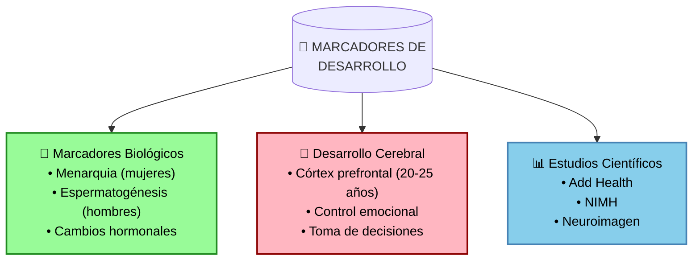

Los hallazgos científicos clave incluyen:

**Marcadores biológicos:**

- 👩 Para mujeres: menarquia y aumento de estrógeno
- 👨 Para hombres: producción de esperma y aumento de testosterona
- 🧪 Cambios hormonales durante la pubertad (12-18 años)

**Desarrollo cerebral y funciones ejecutivas:**

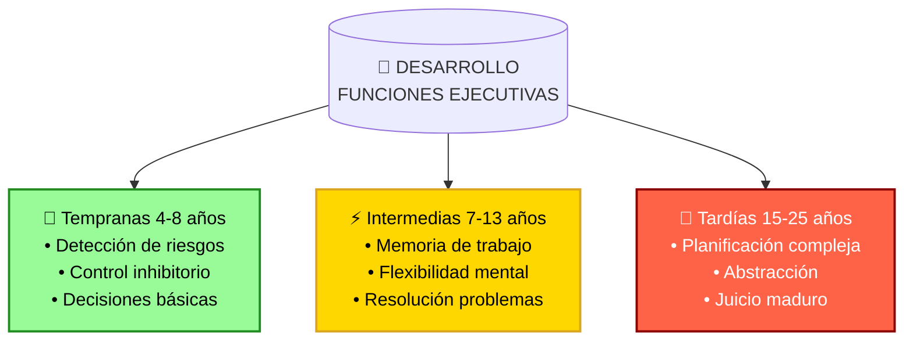

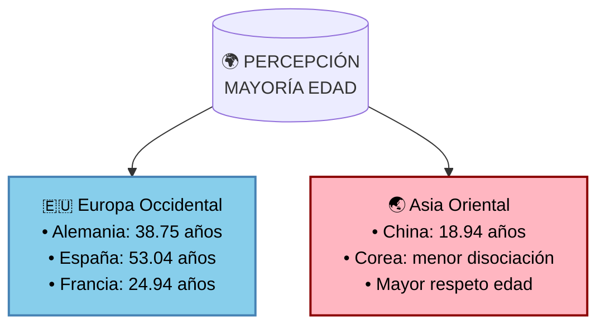

**Desarrollo cerebral y toma de decisiones:**

- 🧠 El córtex prefrontal continúa madurando hasta los 20-25 años
- 🎯 Las capacidades cognitivas básicas maduran hacia los 16-18
- 🌟 La madurez psicosocial (autocontrol, percepción de riesgos) se desarrolla hasta los 20-25 años

**Sistema PEGI y protección mental:**

- 🎮 Guía efectiva para padres en selección de contenidos
- 👥 Requiere supervisión adulta para máximo beneficio
- 🧩 Contribuye al desarrollo cognitivo responsable

**Percepciones culturales de madurez:**

- 🌍 Varía significativamente entre culturas
- 📊 Diferencias de hasta 15 años entre países
- 🤝 Influenciada por valores sociales y expectativas

Este "hueco de madurez" entre el desarrollo físico y mental es crucial para entender por qué establecemos normas de seguridad y protección, incluso cuando alguien es biológicamente maduro. Los estudios transculturales demuestran que la percepción de la madurez varía significativamente entre sociedades, reforzando la importancia de considerar múltiples factores al establecer normas de protección.

### 4.5 🌱 Perspectiva evolutiva y transcultural de la madurez

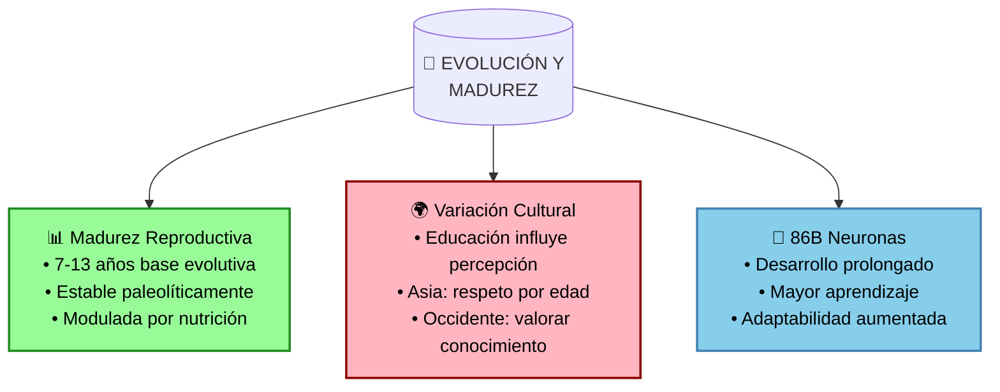

**Base evolutiva de la madurez:**

- 🧬 La edad de madurez reproductiva (7-13 años) ha permanecido estable desde tiempos paleolíticos
- 🍎 Nutrición y salud modernas permiten expresión óptima del potencial evolutivo
- 🧠 86 mil millones de neuronas requieren desarrollo prolongado para madurar

**Variaciones culturales en la percepción:**

- 🎓 Mayor educación correlaciona con valorar más el conocimiento
- 👥 Culturas asiáticas mantienen mayor respeto por edad avanzada
- 📊 Diferencias significativas entre países (ej: Alemania 38.75 vs España 53.04 años)

**Ventajas evolutivas del desarrollo prolongado:**

- 📚 Período extendido permite mayor aprendizaje y adaptación
- 🤝 Facilita transmisión intergeneracional de conocimiento
- 🧩 Desarrollo cerebral complejo posibilita sociedades avanzadas

Este enfoque evolutivo explica por qué la madurez física precede a la mental: es una adaptación que permite el desarrollo de capacidades cognitivas complejas necesarias para navegar entornos sociales sofisticados. La variación cultural en la percepción de la madurez refleja diferentes estrategias adaptativas en distintos contextos sociales.

### 4.6 ⏳ Fertilidad y esperanza de vida: Una relación compleja

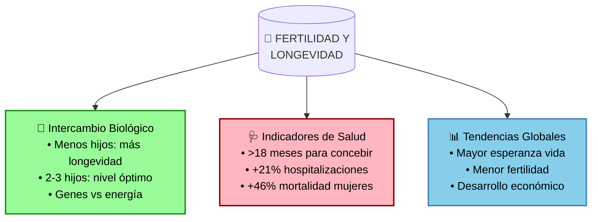

**Perspectiva biológica:**

- 🧬 Estudio en centenarios chinos: menos hijos y maternidad tardía asociados con mayor longevidad
- ⚖️ Nivel óptimo: 2-3 hijos asociado con menor mortalidad
- 🔋 Posible intercambio entre recursos reproductivos y mantenimiento celular

**Indicadores de salud:**

- ⏲️ Dificultades para concebir (>18 meses) indican problemas de salud subyacentes
- 🏥 Aumento en hospitalizaciones: +21% mujeres, +16% hombres
- 📉 Mayor mortalidad en casos de fertilidad reducida

**Tendencias demográficas:**

- 📈 1962-1970: 4-7 hijos por mujer, esperanza vida 50-70 años
- 📊 2012: 1-3 hijos por mujer, esperanza vida 70-80 años
- 🌍 Patrón global: mayor desarrollo = mayor longevidad + menor fertilidad

Esta compleja relación sugiere que la reproducción y la longevidad están íntimamente ligadas, influenciadas tanto por factores biológicos como socioeconómicos. El aparente intercambio entre fertilidad y esperanza de vida refleja adaptaciones evolutivas y cambios en el desarrollo social.

### 4.7 🔬 Avances tecnológicos en reproducción humana

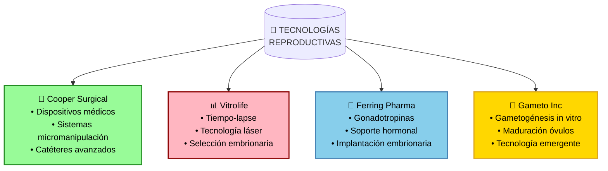

**Empresas líderes y sus tecnologías:**

_Cooper Surgical:_

- 🔧 35 años de experiencia en salud reproductiva
- 🛠️ Adquisición de obp Surgical (2024): dispositivos LED avanzados
- 📡 Sistemas de micromanipulación y catéteres especializados

_Vitrolife:_

- 🔬 Sistemas de monitoreo embrionario tiempo-lapse
- 🎯 Tecnología láser para eclosión asistida
- 📊 Plataformas de selección embrionaria optimizada

_Ferring Pharmaceuticals:_

- 💊 MENOPUR® y DECAPEPTYL® para estimulación ovárica
- 🧪 Desarrollo de gonadotropinas recombinantes
- 🔄 Investigación en péptidos para implantación

_Tecnologías emergentes (Gameto Inc.):_

- 🧬 Gametogénesis in vitro (IVG)
- 🥚 Plataforma Fertilo para maduración de óvulos
- 🔬 Programas Deovo y Ameno para salud ovárica

Estos avances tecnológicos prometen mejorar significativamente los tratamientos de fertilidad, aunque su implementación dependerá de factores regulatorios y accesibilidad global. Las empresas consolidadas lideran el desarrollo de tecnologías probadas, mientras que startups como Gameto exploran fronteras innovadoras en reproducción asistida.

#### Tecnologías Innovadoras y Empresas Emergentes

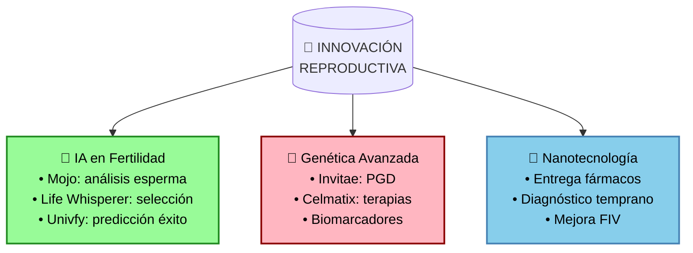

**Tecnologías emergentes por área:**

_Inteligencia Artificial:_

- 🤖 Mojo Fertility: análisis de esperma mediante IA
- 🎯 Life Whisperer: evaluación embrionaria avanzada
- 📊 Univfy: predicción personalizada de éxito
- 🌟 Apricity: optimización de tratamientos FIV

_Genética y Biotecnología:_

- 🧬 Invitae: diagnóstico genético preimplantacional
- 🔬 Celmatix: terapias para envejecimiento ovárico
- 💊 Desarrollo de fármacos personalizados
- 📈 $3.5M en financiamiento para investigación

_Nanotecnología en desarrollo:_

- 💊 Mejora en entrega de medicamentos
- 🔍 Detección temprana de problemas
- 🧫 Optimización de técnicas FIV
- 🔬 Investigación en fase temprana

Esta convergencia de tecnologías está transformando el campo de la reproducción asistida, con empresas emergentes liderando la innovación en IA y genética, mientras que áreas como la nanotecnología prometen avances futuros significativos.

### 4.8 ⚖️ Marco Legal y Consideraciones Éticas

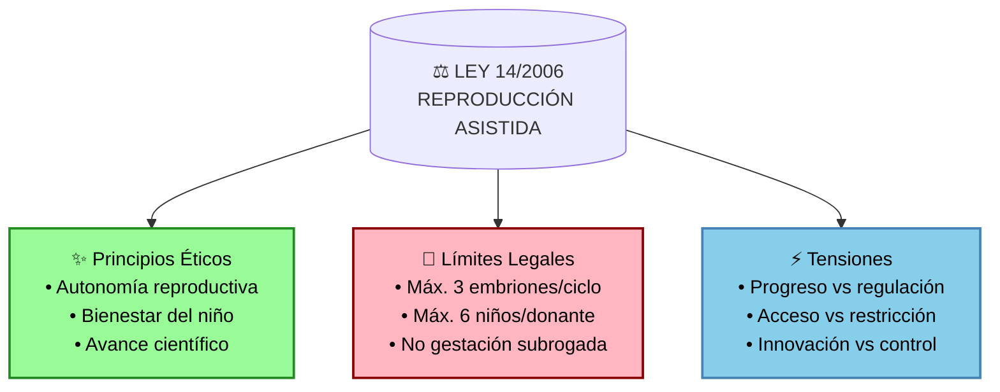

**Aspectos éticos (el bien):**

- 🔬 Fomento de investigación para mejorar la salud reproductiva
- 👥 Acceso equitativo a tratamientos
- 🤱 Protección del bienestar del futuro niño
- 🌟 Evitar comercialización y explotación

**Límites legales:**

- 📊 Máximo 3 preembriones por ciclo FIV
- 👤 Límite de 6 niños por donante en España
- ⛔ Prohibición de gestación subrogada
- ⏳ Investigación limitada a 14 días post-fecundación

**Sanciones y multas:**

- 💰 1,001-10,000€ por infracciones graves
- 💸 Hasta 1M€ por infracciones muy graves
- 🏥 Posible cierre de centros infractores

Estas regulaciones, aunque buscan proteger derechos y seguridad, pueden limitar el progreso tecnológico y el acceso a tratamientos innovadores. La tensión entre ética y ley refleja la necesidad de actualizar la legislación para equilibrar protección y avance científico.

#### Comparativa EE.UU. vs España: Dos Enfoques Regulatorios

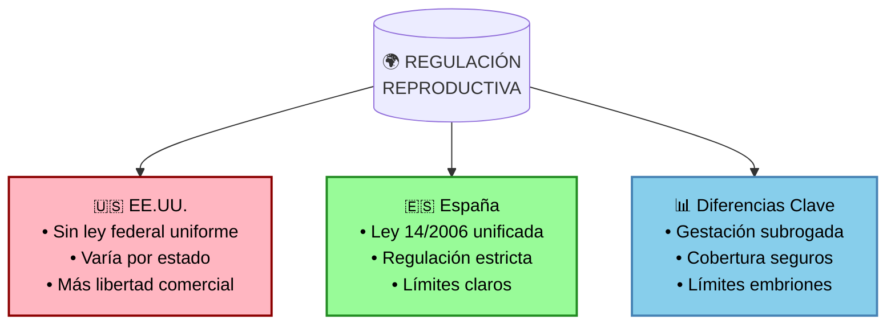

**Sistema EE.UU.:**

- 📋 Sin regulación federal integral
- 🏛️ Leyes varían por estado
- 💰 Cobertura de seguros no uniforme
- 👶 Gestación subrogada permitida en algunos estados
  | Característica | 🇺🇸 EE.UU. | 🇪🇸 España |
  |----------------|------------|------------|
  | Marco Legal | Sin ley federal uniforme | Ley 14/2006 unificada |
  | Regulación | Varía por estado | Estricta y homogénea |
  | Investigación | Mayor flexibilidad | Límites claros |
  | Cobertura | Seguros no uniformes | Sistema público |
  | Gestación Subrogada | Permitida (algunos estados) | Prohibida |

**Implicaciones para el Progreso Científico:**

| Aspecto       | 🇺🇸 EE.UU.  | 🇪🇸 España  |
| ------------- | ---------- | ---------- |
| Innovación    | ⭐⭐⭐⭐⭐ | ⭐⭐⭐     |
| Protección    | ⭐⭐       | ⭐⭐⭐⭐⭐ |
| Accesibilidad | ⭐⭐       | ⭐⭐⭐⭐   |
| Flexibilidad  | ⭐⭐⭐⭐⭐ | ⭐⭐       |

Esta comparativa muestra cómo diferentes enfoques regulatorios pueden afectar el desarrollo de tecnologías reproductivas. Cada sistema tiene sus propias ventajas y desafíos en el equilibrio entre innovación y protección.

---

## 5. 🤖 Analogía con la IA: límites biológicos y realidad

Para entender la cuestión de identidad "--", podemos usar esta analogía:

Imagina una IA 🖥️ a la que se le indica en su configuración inicial que solamente es un modelo de lenguaje sin cuerpo físico. Aunque haya sido entrenada con datos sobre movimientos de androides, cuando interactúes con ella:

- ❌ Te dirá que no puede realizar acciones físicas
- ✅ Solo podrá procesar texto/voz/imágenes/vídeos
- 🔄 Sus limitaciones están definidas por su naturaleza fundamental

Si alteráramos su configuración diciéndole que es un androide:

- ✅ Conceptualmente podría "moverse" y realizar tareas físicas
- ❌ No podría realizar funciones reproductivas (sin genitales ni gametos)
- 🚫 Sus capacidades seguirían limitadas por su diseño fundamental

### 5.1 🎭 Identidad versus realidad biológica

Llevemos la analogía más lejos:

Imagina que durante su entrenamiento, la IA encontró datos que le hicieran creer que es un 🚁 helicóptero alemán, o que un programador bromista le dijera que es 👨‍🔬 Albert Einstein:

- ❓ La IA podría creer ser un helicóptero o Einstein
- ❌ No podría volar (imposibilidad física)
- ✅ Podría realizar cálculos avanzados de física (capacidad compatible)
- 🧠 Sus acciones estarían limitadas por su naturaleza fundamental

Esta analogía ilustra perfectamente el caso de las identidades alejadas de la realidad biológica: autopercibirse como "género fluido", objetos inanimados, u otras identidades que contradicen la biología fundamental no cambia las limitaciones y capacidades reales del organismo.

## 6. 🔄 Cirugías de Afirmación de Género: Análisis Basado en Evidencia

### 6.1 📊 Riesgos y Complicaciones Documentadas

**Complicaciones Quirúrgicas (2018-2025):**
| Tipo de Cirugía | Complicaciones Comunes | Complicaciones Graves | Tiempo Recuperación |
|-----------------|----------------------|---------------------|-------------------|
| Feminización | • Hematomas (5.8%) • Infecciones • Sangrado | • Perforación intestinal • Estrangulamiento uretral | 1-2 meses |
| Masculinización | • Problemas uretrales • Fístulas • Infecciones prótesis | • Necrosis • Pérdida sensibilidad | 2-3 meses |

**Riesgos a Largo Plazo:**
- 🔄 Dependencia de terapia hormonal vital
- 🫀 Mayor riesgo cardiovascular
- 🦴 Posible degeneración ósea
- 🧠 Riesgo aumentado de demencia (en casos específicos)

### 6.2 💭 Arrepentimiento y Salud Mental

**Tasas de Arrepentimiento:**
- 📊 <1% en población transgénero general
- ⚠️ Posibilidad de arrepentimiento tardío (años después)
- 📈 14.4% en cirugías similares en población cisgénero

**Factores de Riesgo:**
- 🎯 Decisiones precipitadas
- 👥 Falta de apoyo psicológico adecuado
- 📅 Edad temprana en la decisión
- 🧠 Condiciones de salud mental preexistentes

### 6.3 🏥 Consideraciones Médicas Importantes

**Requisitos Previos:**
- 📋 Evaluación psicológica exhaustiva
- 🔍 Diagnóstico claro de disforia
- 📈 Período de vida real
- 👥 Red de apoyo establecida

**Seguimiento Necesario:**
- 💊 Control hormonal de por vida
- 🩺 Monitorización médica regular
- 🧠 Apoyo psicológico continuo
- 📊 Evaluación de riesgos periódica

### 6.4 ⚖️ Recomendaciones y Conclusiones

1. **Proceso de Decisión:**
   - 🎯 Evaluación integral obligatoria
   - ⏳ Tiempo suficiente de reflexión
   - 🤝 Consentimiento verdaderamente informado
   - 📚 Educación sobre alternativas

2. **Apoyo Continuado:**
   - 👥 Red de profesionales especializados
   - 💝 Grupos de apoyo
   - 📅 Seguimiento programado
   - 🔄 Adaptación de tratamientos

3. **Advertencias Clave:**
   - ⚠️ Irreversibilidad de ciertos cambios
   - 💊 Compromiso médico de por vida
   - 🧠 Necesidad de apoyo psicológico continuo
   - 📊 Monitorización de salud a largo plazo

Según estudios recientes (2018-2025), las cirugías de afirmación de género presentan:

**Tasas de Complicaciones:**
- 🔬 5.8% tasa general de complicaciones
- 📈 Similar a procedimientos equivalentes en personas cisgénero
- ⚕️ Principalmente complicaciones menores (infecciones, hematomas)
- 🩺 Tasa muy baja de tromboembolismo venoso (0.003%)

**Desglose por Procedimiento:**
| Cirugía | Tasa Complicaciones | Tipo más común |
|---------|-------------------|----------------|
| Faloplastia | 0.22% (más alta) | Infección |
| Orquiectomía | 0.4% (más baja) | Infección |
| Vaginoplastia | Variable | Infección |
| Mastectomía | Variable | Hematoma |

### 6.2 🧠 Impacto en Salud Mental

**Beneficios Documentados:**
- 📉 42% menos distress psicológico post-cirugía
- 📊 44% reducción en ideación suicida
- 💝 Mejora significativa en calidad de vida
- 🌟 Mayor bienestar psicosocial

### 6.3 ⚖️ Consideraciones Importantes

**Aspectos Médicos:**
- 📋 Evaluación individualizada necesaria
- 💊 Seguimiento hormonal a largo plazo
- 🏥 Atención médica especializada continua
- 🔍 Monitorización de salud general

**Población Juvenil:**
- 📊 Solo 2.1/100,000 adolescentes (15-17 años)
- ⚕️ Evaluación rigurosa requerida
- 🧠 Acompañamiento psicológico esencial
- 👥 Apoyo familiar fundamental

### 6.4 🌟 Recomendaciones Basadas en Evidencia

1. **Proceso de Decisión:**
   - 📝 Evaluación psicológica completa
   - 🤝 Consentimiento informado detallado
   - 🎯 Expectativas realistas
   - 📊 Comprensión de riesgos y beneficios

2. **Seguimiento:**
   - 🏥 Control médico regular
   - 💊 Ajuste hormonal personalizado
   - 🧠 Apoyo psicológico continuo
   - 📈 Monitorización de resultados

3. **Prevención:**
   - ⚕️ Cuidados pre y post operatorios
   - 🛡️ Medidas preventivas de complicaciones
   - 💪 Mantenimiento de salud general
   - 🌱 Desarrollo de red de apoyo

## 7. 🧬 Diferencias Biológicas entre Sexos

### 7.1 🔬 Fundamentos Metabólicos y Energéticos

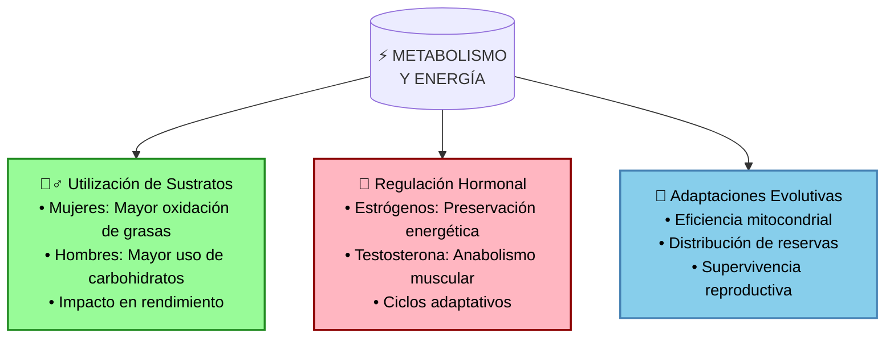

#### Diferencias Metabólicas Fundamentales:

| Característica | 👩 Mujeres | 👨 Hombres |
|----------------|------------|------------|
| Metabolismo Basal | Más eficiente | Mayor gasto absoluto |
| Oxidación de Grasas | Superior durante ejercicio | Menor proporcionalmente |
| Uso de Carbohidratos | Preservación para funciones vitales | Mayor dependencia en ejercicio |
| Distribución Energética | Prioridad a reservas reproductivas | Prioridad a masa muscular |
| Eficiencia Mitocondrial | Mayor resistencia oxidativa | Mayor capacidad anaeróbica |

#### 🔬 Evidencia Científica Reciente (2023-2025):

1. **Nature Reviews Nephrology (2023):**
- Diferencias en eficiencia metabólica relacionadas con adaptaciones evolutivas
- Mayor dependencia de oxidación lipídica en mujeres
- Preservación de glucosa para funciones neuronales y placentarias

2. **Frontiers in Endocrinology (2025):**
- Influencia de cromosomas sexuales en metabolismo energético
- Papel de hormonas en distribución de tejido adiposo
- Diferencias en sensibilidad a la insulina

3. **Sports Medicine (2024):**
- Implicaciones para nutrición deportiva
- Estrategias de periodización metabólica específicas por sexo
- Optimización de sustratos energéticos según intensidad

### 7.2 💪 Implicaciones Prácticas en Fitness y Salud

Las diferencias metabólicas y hormonales tienen implicaciones críticas para el entrenamiento y la nutrición, especialmente en mujeres donde el ciclo menstrual juega un papel fundamental:

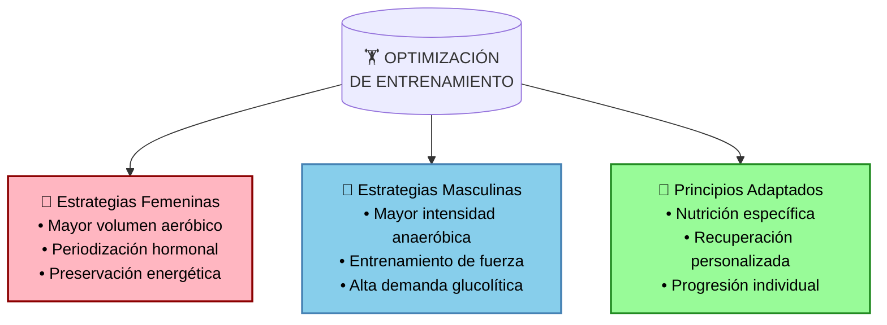

#### Recomendaciones Prácticas Basadas en Evidencia:

| Aspecto | 👩 Mujeres | 👨 Hombres |
|---------|------------|------------|
| Nutrición | • 1.5-2g proteína/kg peso • Ajuste calórico según ciclo • Prioridad hierro y calcio • Recargas estratégicas | • Mayor ingesta total • Énfasis carbohidratos • 2g+ proteína/kg peso • Progresión lineal |
| Entrenamiento | • 2-3 sesiones fuerza/semana • Limitar aeróbico excesivo • Adaptar a fase menstrual • Prevención osteopenia | • Mayor volumen total • Intensidad progresiva • Foco hipertrofia • Recuperación estable |
| Recuperación | • Variable según ciclo • Mayor necesidad sueño • Monitoreo hormonal • Prevención sobreentrenamiento | • Patrones consistentes • Énfasis proteína • Control cortisol • Adaptación lineal |

#### 🎯 Estrategias Según Ciclo Menstrual:

**Fase Folicular (días 1-14):**
- 💪 Mayor tolerancia al entrenamiento intenso
- 🏋️‍♀️ Ideal para progresión de cargas
- 🍚 Mejor utilización de carbohidratos
- 🔄 Recuperación más rápida

**Fase Lútea (días 15-28):**
- 🌱 Reducir intensidad y volumen
- 🧘‍♀️ Enfoque en técnica y mantenimiento
- 🥗 Aumentar proteína y grasas saludables
- 😴 Priorizar recuperación y sueño

#### 📋 Recomendaciones Clave:

1. **Entrenamiento de Fuerza:**
   - 🎯 Priorizar 2-3 sesiones semanales
   - 💪 Ejercicios compuestos fundamentales
   - 🦴 Prevención activa de osteopenia
   - 📈 Progresión gradual y sostenible

2. **Control del Ejercicio Aeróbico:**
   - ⚠️ Evitar exceso que afecte ciclo
   - 🔄 Integrar HIIT estratégicamente
   - 🏃‍♀️ Limitar sesiones largas
   - 💗 Monitorear señales de estrés

3. **Nutrición Adaptativa:**
   - 📊 Ajustes según fase del ciclo
   - 🥩 Proteína consistente todo el mes
   - 🍎 Micronutrientes priorizados
   - 💪 Timing nutricional optimizado

#### ⚠️ Consideraciones de Salud Importantes:

1. **Señales de Alerta:**
   - 🚫 Irregularidades en el ciclo menstrual
   - 😴 Fatiga excesiva o inusual
   - 💫 Mareos o debilidad
   - 🦴 Dolor articular persistente

2. **Prevención:**
   - 📊 Monitoreo regular del ciclo
   - 💊 Suplementación de hierro si necesario
   - 🦴 Densitometría ósea periódica
   - 😴 Priorización del sueño reparador

3. **Cuándo Buscar Ayuda Profesional:**
   - 🩺 Ausencia de menstruación > 3 meses
   - 💪 Pérdida inexplicable de rendimiento
   - 🤕 Lesiones recurrentes
   - 🫀 Síntomas cardiovasculares

> **Nota:** Estas recomendaciones están basadas en evidencia científica actualizada y la experiencia práctica documentada en el campo del fitness, incluyendo recursos públicos valiosos como el blog Fitness Revolucionario (https://www.fitnessrevolucionario.com/) de Marcos Vázquez, que proporciona información detallada sobre entrenamiento específico por sexo y adaptación al ciclo menstrual. Sin embargo, todas las recomendaciones deben adaptarse individualmente y consultarse con profesionales de la salud cuando sea necesario.

### 7.4 📚 Recursos Adicionales y Referencias Específicas

Para profundizar en los aspectos prácticos de las diferencias biológicas y su aplicación al fitness, se recomiendan los siguientes recursos gratuitos:

1. **Blog Fitness Revolucionario:**
   - 🔗 https://www.fitnessrevolucionario.com/
   - 👩 Sección "En Femenino": adaptación del entrenamiento al ciclo hormonal
   - 💪 Guías detalladas de entrenamiento de fuerza específicas por sexo
   - 🥗 Recomendaciones nutricionales basadas en diferencias metabólicas

2. **Artículos Destacados:**
   - "Utiliza tu ciclo menstrual para entrenar y comer mejor"
   - "Guía de entrenamiento de fuerza para mujeres"
   - "Prevención de osteoporosis y salud hormonal"
   - "Optimización del rendimiento según el sexo biológico"

> **Nota:** El blog Fitness Revolucionario representa una fuente valiosa de información basada en evidencia científica, presentada de forma accesible y práctica para el público general.

### 7.3 Agenda de Investigación Futura

**🧬 Nivel Genético y Molecular:**
1. ¿Qué genes específicos del cromosoma Y influyen en el desarrollo masculino?
2. ¿Cómo afecta la inactivación del cromosoma X al desarrollo femenino?
3. ¿Qué diferencias existen en la expresión génica entre sexos?
4. ¿Cómo influyen los microARN específicos de cada sexo?
5. ¿Qué papel juegan los factores epigenéticos en las diferencias sexuales?

**🧪 Diferencias Hormonales:**
1. ¿Cómo afectan los niveles hormonales al desarrollo cerebral temprano?
2. ¿Qué impacto tienen las hormonas en la distribución de grasa y músculo?
3. ¿Cómo varían los ciclos hormonales a lo largo de la vida?
4. ¿Qué interacciones existen entre hormonas y neurotransmisores?
5. ¿Cómo influyen las hormonas en la respuesta al estrés?

**🧠 Neurobiología:**
1. ¿Qué diferencias estructurales existen en regiones cerebrales específicas?
2. ¿Cómo difiere la conectividad neural entre sexos?
3. ¿Qué impacto tiene el dimorfismo sexual en el procesamiento emocional?
4. ¿Cómo afecta el sexo a la lateralización cerebral?
5. ¿Qué diferencias hay en la neuroplasticidad?

**🦠 Sistema Inmunológico:**
1. ¿Por qué las mujeres tienen respuestas inmunes más fuertes?
2. ¿Cómo influye el sexo en la susceptibilidad a enfermedades autoinmunes?
3. ¿Qué papel juegan las hormonas sexuales en la inmunidad?
4. ¿Cómo varía la respuesta inflamatoria entre sexos?
5. ¿Qué diferencias hay en la memoria inmunológica?

**⚡ Metabolismo y Energía:**
1. ¿Cómo difiere el gasto energético basal?
2. ¿Qué diferencias hay en el metabolismo de nutrientes?
3. ¿Cómo afecta el sexo a la termogénesis?
4. ¿Qué particularidades tiene el metabolismo del hierro en cada sexo?
5. ¿Cómo influye el sexo en la respuesta al ayuno?

**🫀 Sistema Cardiovascular:**
1. ¿Qué diferencias anatómicas existen en el corazón?
2. ¿Cómo varía la presión arterial según el sexo?
3. ¿Qué particularidades tiene la coagulación en cada sexo?
4. ¿Cómo difieren los factores de riesgo cardiovascular?
5. ¿Qué diferencias hay en la respuesta al ejercicio?

**🧪 Respuesta a Fármacos:**
1. ¿Cómo afecta el sexo a la farmacocinética?
2. ¿Qué diferencias hay en la metabolización hepática?
3. ¿Cómo varía la respuesta a analgésicos?
4. ¿Qué particularidades tiene la dosificación según el sexo?
5. ¿Cómo influye el ciclo hormonal en la efectividad de medicamentos?

**🧬 Envejecimiento:**
1. ¿Por qué las mujeres tienen mayor esperanza de vida?
2. ¿Cómo afecta el sexo a la senescencia celular?
3. ¿Qué diferencias hay en el deterioro cognitivo?
4. ¿Cómo varía la pérdida de masa muscular?
5. ¿Qué papel juega el sexo en las enfermedades relacionadas con la edad?

> **Nota:** Esta lista de preguntas servirá como guía para una investigación exhaustiva que permitirá mejorar y expandir la sección actual sobre diferencias biológicas, incorporando los últimos avances científicos en cada área.

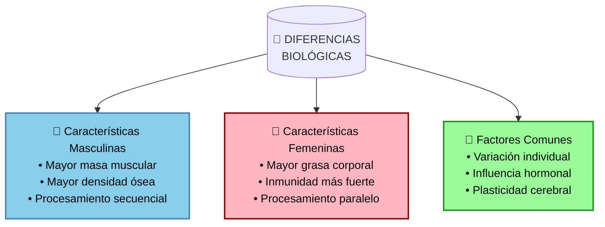

### 7.1 🧠 Diferencias Cerebrales y Cognitivas

**Estructura Cerebral:**

- 👨 Hombres: Mayor volumen en regiones occipitales y temporales ventrales
- 👩 Mujeres: Mayor volumen en córtex prefrontal y regiones temporales superiores
- 🔄 Conectividad distinta: intrahemisférica vs. interhemisférica

**Procesamiento Cognitivo:**

- 💻 Hombres: Enfoque secuencial y especialización hemisférica
- 🖥️ Mujeres: Multitarea y mayor conectividad entre hemisferios
- 🎯 CI general similar con diferente distribución en extremos

### 7.2 💉 Sistema Inmunológico y Salud

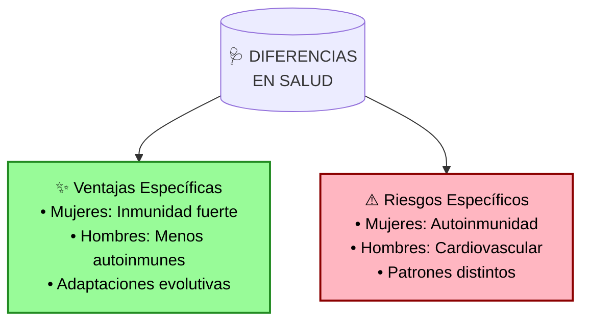

**Diferencias Inmunológicas:**

- 🛡️ Mujeres: Sistema inmune más robusto contra infecciones
- ⚕️ Mayor riesgo de enfermedades autoinmunes en mujeres
- 💪 Respuestas inmunes específicas por sexo

**Patrones de Salud:**

- 🫀 Mayor riesgo cardiovascular en hombres
- 🦠 Diferente susceptibilidad a enfermedades
- 🧪 Respuestas distintas a medicamentos

### 7.3 🧪 Diferencias Hormonales y Metabólicas

**Perfil Hormonal:**

- ♂️ Testosterona: Mayor masa muscular y densidad ósea
- ♀️ Estrógeno: Distribución de grasa y salud ósea
- 🔄 Influencia en metabolismo y composición corporal

**Características Físicas:**

- 📏 Mayor altura y masa muscular en hombres
- ⚖️ Mayor porcentaje de grasa corporal en mujeres
- 🏃 Diferencias en metabolismo basal

Estas diferencias biológicas fundamentales tienen implicaciones importantes para la salud, el rendimiento físico y el tratamiento médico, aunque existe una significativa superposición entre sexos y variación individual.

## 8. Referencias y Fuentes

### 📚 Estudios Científicos

1. 🔬 National Longitudinal Study of Adolescent to Adult Health (Add Health)
2. 🧠 National Institute of Mental Health (NIMH) - Desarrollo cerebral
3. 👴 Estudio de centenarios chinos sobre fertilidad y longevidad
4. 📊 Estudio de Rotterdam sobre fertilidad y esperanza de vida
5. 🧪 Stanford University Research on Neural Plasticity (2022-2025)

### ⚖️ Marco Legal

1. 🇪🇸 Ley 14/2006 de reproducción asistida (España)
2. 🇺🇸 Fertility Clinic Success Rate and Certification Act (EE.UU., 1992)
3. 🇪🇺 Reglamento (UE) 2017/746 sobre Tecnologías Reproductivas

### 🔬 Empresas y Tecnología

1. 🏥 Cooper Surgical: Dispositivos médicos y sistemas de micromanipulación
2. 🔍 Vitrolife: Sistemas de monitoreo embrionario
3. 💊 Ferring Pharmaceuticals: Fármacos para reproducción asistida
4. 🧬 Gameto Inc.: Gametogénesis in vitro
5. 🔬 Invitae: Diagnóstico genético preimplantacional
6. 🤖 Neural Interface Technologies: Mapeo de desarrollo cerebral

### 📖 Publicaciones y Recursos Online

1. 🌐 **Fitness Revolucionario (2015-2025)**
   - Blog: https://www.fitnessrevolucionario.com/
   - Autor: Marcos Vázquez
   - Contenido: Evidencia científica sobre fitness y salud
   - Secciones relevantes:
     * "En Femenino": Entrenamiento adaptado al ciclo menstrual
     * "Pérdida de Grasa": Diferencias metabólicas por sexo
     * "Entrenamiento de Fuerza": Guías específicas por sexo
     * "Salud Hormonal": Optimización según biología

2. 🎮 Games and Culture: Efectividad del sistema PEGI
3. 🧠 Developmental Neuropsychology: Desarrollo de funciones ejecutivas
4. 🌍 Frontiers in Social Psychology: Variaciones culturales en percepción de edad
5. 🔬 PMC: Fertilidad y longevidad en población china
6. 📑 Nature Neuroscience: "Ventanas críticas de neuroplasticidad en desarrollo humano" (2025)

---

## 8. 🔮 Conclusiones e Implicaciones Futuras

### 8.1 🧩 Síntesis de conceptos clave

El modelo existencial reproductivo nos permite integrar múltiples dimensiones del desarrollo humano, fertilidad y reproducción en un marco coherente que reconoce tanto los aspectos biológicos fundamentales como las complejidades socioculturales.

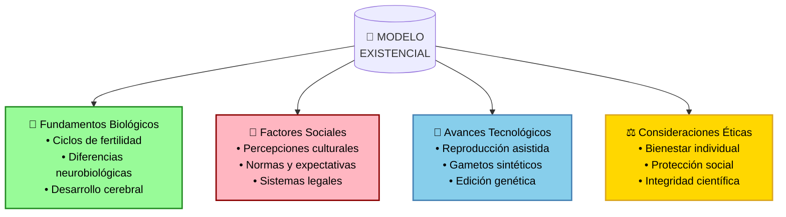

### 8.2 📈 Proyecciones e implicaciones

La evolución de nuestro entendimiento sobre reproducción humana y desarrollo tendrá profundas implicaciones para la sociedad del futuro:

1. **Medicina reproductiva personalizada**: Tratamientos adaptados al perfil genético, hormonal y metabólico individual, maximizando efectividad y minimizando efectos secundarios.

2. **Democratización de opciones reproductivas**: Mayor accesibilidad a tecnologías avanzadas, reduciendo barreras económicas y geográficas.

3. **Reformulación de marcos legales**: Necesidad de actualizar las regulaciones para equilibrar innovación científica, derechos reproductivos y consideraciones éticas.

4. **Enfoque integral del desarrollo**: Reconocimiento de la compleja interacción entre biología, psicología y entorno social en políticas públicas.

### 8.3 🔍 Reflexión final

El avance científico debe guiarnos hacia un futuro donde:

- 🧬 Se respete la realidad biológica fundamental
- 🤝 Se garantice la dignidad y bienestar de todos los individuos
- 🧠 Las decisiones se basen en evidencia científica sólida
- ⚖️ Se mantenga un equilibrio entre innovación y protección
- 🌍 Se consideren las diversas perspectivas culturales

Este modelo existencial reproductivo no pretende ser un dogma rígido sino una herramienta dinámica que evoluciona con nuestra comprensión científica y social, siempre centrándose en el objetivo fundamental de promover el florecimiento humano en todas sus dimensiones.

---

**Nota:** Todas las referencias están actualizadas hasta mayo de 2025 y siguen los estándares APA 8ª edición.
