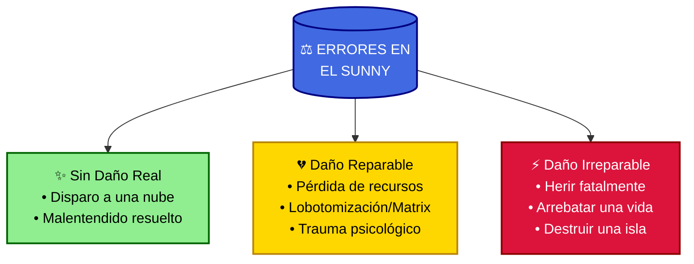
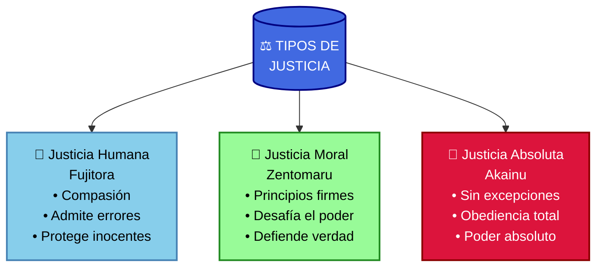
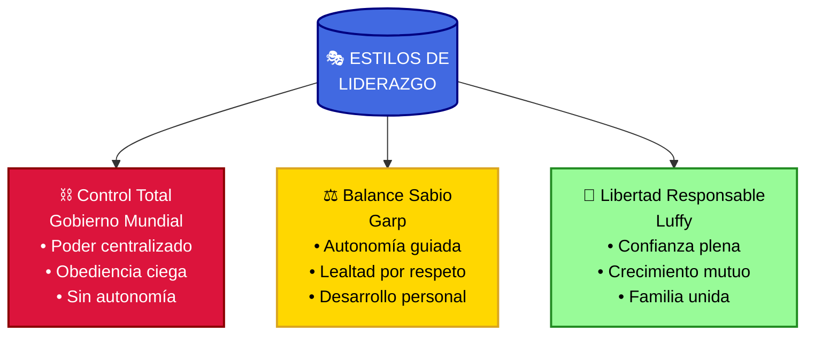
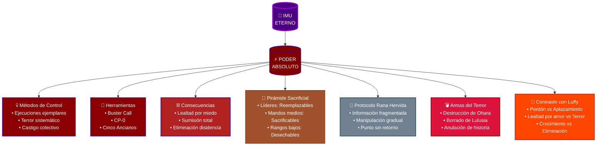
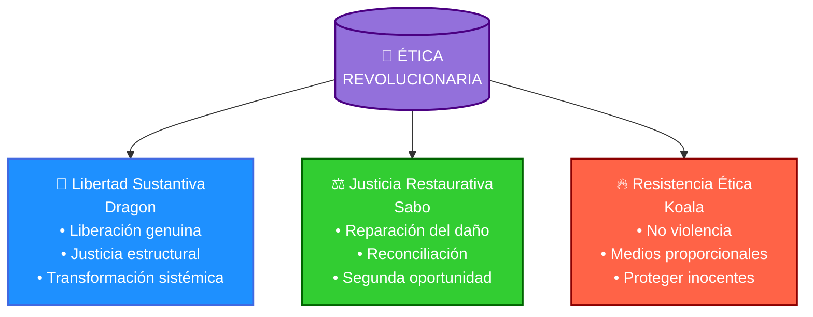

# ⚓ **El Diario del Sunny**: _Lecciones de un Nakama en One Piece_ 🏴‍☠️

> 📺 **Mensaje para Toei Animation:** Este documento se ha creado con la esperanza de que pueda llamar la atención de Toei Animation y ser considerado como material para posibles capítulos de relleno. Las reflexiones, dinámicas de grupo y lecciones de la tripulación podrían adaptarse fácilmente a episodios especiales que profundicen en la filosofía y los valores de One Piece. Para nada pretendo usarlo para fines lucrativos personales.

# 🌅 **Historia de Relleno**: _Un Día Especial en el Sunny_ 🚢

Era una tarde tranquila en el Thousand Sunny. El sol pintaba el cielo de tonos anaranjados, reflejándose en el abrigo rojo con detalles naranjas que Luffy llevaba mientras se balanceaba en la cabeza del león, su lugar favorito. En la cubierta, Nami, vestida con su top corto y pantalones ajustados, acababa de terminar de dibujar un nuevo mapa, mientras Sanji, en su elegante mono negro con la inscripción "VEGAPUNK", preparaba bocadillos en la cocina. El aroma de la comida se mezclaba con la brisa marina. De repente, Luffy ajustó su icónico sombrero de paja y saltó ágilmente desde su percha.

"**¡Oi, chicos!**" gritó con una sonrisa enorme. "¡Tengo una idea! _¿Y si cada uno cuenta su historia favorita sobre el perdón y la justicia?_"

"¿Eh? ¿Desde cuándo te interesan esos temas profundos, Luffy?" preguntó Usopp, alzando una ceja mientras ajustaba el visor de su traje de cuerpo completo. Su rifle, ahora mejorado tras las batallas en Wano, descansaba en su cabestrillo. Una sonrisa se dibujó en su rostro, recordando que su recompensa de 500,000,000 berries lo acreditaba como uno de los guerreros más valientes del mar.

Robin, elegante en su chaqueta de cuero negra y guantes morados, sonrió misteriosamente. "Podría ser interesante. Después de todo, cada uno de nosotros ha vivido experiencias que nos han enseñado lecciones valiosas." Sus ojos brillaron con conocimiento mientras ajustaba uno de sus guantes.

Zoro, que había estado durmiendo recostado contra la barandilla, abrió su ojo, su chaqueta azul oscuro contrastando con el mono negro que vestía. Las tres espadas en su espalda tintinearon suavemente mientras se enderezaba. "Tch, suena como una pérdida de tiempo... pero supongo que no hay nada mejor que hacer." Sus guantes azules crujieron mientras se cruzaba de brazos.

Chopper, adorable en su traje de laboratorio y gorro de científico, saltó emocionado sobre la barandilla. "¡Yo quiero escuchar las historias! ¡Especialmente cómo Luffy siempre sabe perdonar!" Sus ojos brillaban con la inocencia que ni siquiera su recompensa de 1,000 berries podía ocultar.

Franky, imponente en su mono de cuerpo completo púrpura y naranja, adoptó su pose característica, su visor brillando bajo el sol del atardecer. "¡SÚPER idea! ¡Nada une más a una tripulación que compartir experiencias!" La llave de viento en su cabeza giró con entusiasmo.

"Yohohoho," río Brook, su traje blanco resplandeciendo mientras ajustaba su casco futurista sobre su calavera. "Aunque soy solo huesos, ¡mi corazón se llena de alegría al recordar cómo todos me aceptaron! ¡Si tuviera corazón, claro está!"

Jinbe, imponente en su kimono tradicional adornado con una camisa hawaiana rosa que contrastaba con su piel azul, asintió con sabiduría. "Las historias nos ayudan a entender mejor nuestros valores y fortalecer nuestros lazos." Su voz profunda resonaba con la autoridad de quien porta una recompensa de 1,100,000,000 berries.

El Thousand Sunny se mecía suavemente sobre las olas, sus velas ondeando con orgullo bajo la bandera pirata que ahora representaba a uno de los Emperadores del Mar. Los últimos rayos del sol hacían brillar las nuevas modificaciones tecnológicas que Franky había instalado tras Wano: paneles reforzados, sistemas de defensa mejorados y equipamiento de última generación que rivalizaba con los inventos de Vegapunk. En la cubierta, recuerdos de sus aventuras decoraban las paredes: una katana ceremonial de Wano aquí, un pendón con el símbolo de los samuráis allá, cada objeto contando una historia de batallas y victorias.

Así comenzó una tarde especial en el Sunny, donde cada miembro de esta tripulación de élite, con una recompensa combinada de más de 8,800,000,000 berries, compartiría sus reflexiones sobre el perdón, la justicia y lo que significa ser parte de esta peculiar familia pirata. Sus historias nos enseñarían lecciones valiosas sobre la lealtad, la redención y el verdadero significado de ser nakamas... y sobre todo, nos mostrarían el contraste entre su forma de vida y la oscura maquinaria del Gobierno Mundial.

"¡Oi, también deberíamos hablar sobre esos tipos raros del Gobierno Mundial!" exclamó Luffy, sorprendiendo a todos con una observación seria.

"¿Te refieres a los **Cinco Ancianos** e *Imu*?" preguntó Robin, su rostro ensombreciéndose levemente.

"**¡Sí!** Ellos _nunca perdonan_, ¡como lo que le hicieron a ese tipo Saturn!" Luffy frunció el ceño. "**¡Nosotros somos diferentes!**"

Sanji salió de la cocina con una bandeja de bocadillos elaboradamente decorados, el humo de su cigarrillo mezclándose con el aroma de especias exóticas conseguidas en Wano. Su mono negro con la inscripción "VEGAPUNK" brillaba con la luz del atardecer mientras se movía con la elegancia de quien porta una recompensa de 1,032,000,000 berries. "Aquí tienen, aperitivos dignos de la tripulación de un Emperador. Y más vale que cierto capitán de goma no se los coma todos de un bocado, ¡o tu recompensa de 3 billones no te salvará de una patada!"

"¡Sanji! ¡Carne!" gritó Luffy, sus ojos brillando con el entusiasmo característico del Rey del Sol, pero Nami lo detuvo con un golpe suave de su Clima-Tact mejorado.

"Primero las historias, después la comida," dijo la navegante. "¿Quién empieza?"

Robin cerró su libro y miró al horizonte. "Quizás deberíamos empezar por el principio... cuando cada uno de nosotros aprendió sobre el verdadero significado del perdón."

"**¡Yo empiezo!**" Usopp se levantó dramáticamente. "*Como el gran Capitán Usopp*, tengo la historia perfecta sobre..."

"**¡La historia de Water 7!**" interrumpió Chopper, sus ojos brillando con emoción y nostalgia.

Usopp se detuvo, su expresión volviéndose más seria. "Ah... sí. Cuando aprendí que el orgullo puede cegarnos... y que un verdadero nakama debe saber admitir sus errores."

Zoro abrió su ojo nuevamente, el brillo de Enma visible en su funda mientras se ajustaba en su posición. Su chaqueta azul oscuro ondeó con una brisa repentina, y el tintineo de sus tres espadas acompañó sus palabras. "Fue cuando entendimos que el perdón debe ganarse." Su voz llevaba el peso de quien porta una recompensa de 1,111,000,000 berries. "No basta con pedirlo; las acciones importan más que las palabras. Como primer oficial de un Emperador, he visto suficiente para saber que la verdadera lealtad se demuestra en los momentos más oscuros."

"Shishishi," río Luffy, su abrigo rojo ondeando mientras se balanceaba en la barandilla, el sombrero de paja proyectando una sombra sobre sus ojos que brillaban con la sabiduría simple pero profunda que lo había llevado a convertirse en un Emperador. "¡Pero todo salió bien! Porque somos nakamas, y los nakamas siempre encuentran el camino de vuelta a casa." Su sonrisa, la misma que había desafiado a Emperadores y conmovido reinos enteros, iluminó la cubierta. "¡Como cuando Jinbe volvió en Wano, o cuando Robin eligió vivir! ¡Nuestra tripulación siempre está abierta para quienes realmente quieren ser parte de ella!"

Franky, que había estado inusualmente callado, se secó una lágrima con su mano robótica mientras su mono púrpura y naranja brillaba con los últimos rayos del sol. La llave de viento en su cabeza giró lentamente mientras intentaba mantener la compostura. "¡No estoy llorando, idiotas! ¡Es que estas historias son SÚPER emotivas! ¡Y si alguien dice lo contrario, probaré mi nuevo Radical Beam en él!"

"Entonces está decidido," sonrió Nami, su Clima-Tact destellando mientras lo giraba hábilmente. Sus ojos brillaron con la astucia de quien maneja una recompensa de 366,000,000 berries. "Cada uno contará su historia sobre el perdón y la justicia. Y al final..." Su sonrisa se volvió traviesa mientras miraba a sus nakamas.

"¡FIESTA!" gritaron todos al unísono, sus voces mezclándose con el sonido de las olas y el viento en las velas. El sol comenzaba a ponerse en el horizonte, pintando el cielo de naranja y haciendo brillar la bandera pirata que ondeaba orgullosa sobre el barco de un Emperador, prometiendo una noche llena de historias memorables...

## 📖 La Historia de Usopp: El Peso del Orgullo 🎯

El tirador se sentó en el centro de la cubierta, su traje de cuerpo completo brillando bajo la luz del atardecer, el visor reflejando los últimos rayos del sol. Su rifle mejorado, testigo de innumerables batallas en Wano, descansaba a su lado mientras todos los demás formaban un círculo a su alrededor. La brisa marina mecía suavemente el Sunny, haciendo ondear la bandera pirata que ahora representaba a uno de los guerreros más valientes del mar, con una recompensa que hacía justicia a sus hazañas. El sonido de las olas contra el casco del barco parecía acompañar el ritmo de su corazón mientras comenzaba su relato.

"Verán... siempre me he considerado valiente en mis historias," comenzó Usopp, ajustando su visor con una mano que ya no temblaba al enfrentar la verdad, "pero en Water 7 aprendí que la verdadera valentía está en admitir nuestros errores." Sus ojos se posaron en su resortera, el arma que había evolucionado junto con él desde aquellos días. "Cuando el Going Merry estaba demasiado dañado..."

"¡No llores, Usopp!" exclamó Chopper, sus pequeños cascos ajustando nerviosamente su gorro de científico mientras las lágrimas comenzaban a brillar en sus grandes ojos. Su bata de laboratorio se agitó con la brisa mientras se acercaba más a su amigo, la inocencia de su recompensa de 1,000 berries contrastando con la profunda empatía que mostraba por el dolor pasado de su nakama.

"No, está bien," sonrió el tirador, colocando una mano reconfortante sobre el hombro de Chopper mientras su visor reflejaba la luz del atardecer. "Porque esta historia tiene un final feliz. Verán, en ese momento mi orgullo me cegó. No podía aceptar que a veces debemos dejar ir lo que amamos. Desafié a Luffy, dije cosas horribles..." Su voz se suavizó al recordar aquellos momentos, pero mantenía la firmeza de quien ha crecido a través de sus errores.

"Shishishi, ¡pero volviste!" Luffy le dio una palmada en la espalda que casi lo tira al suelo.

"Sí, volví... gracias a todos ustedes. Especialmente a ti, Zoro."

El espadachín gruñó pero una pequeña sonrisa se asomó en su rostro. "Solo dije lo que todos pensábamos. El respeto al capitán es fundamental."

Robin intervino suavemente: "Es interesante cómo el verdadero perdón requiere humildad de ambas partes. Luffy también tuvo que estar dispuesto a perdonar."

"¡Pero mírenme ahora!" Usopp se levantó, posando dramáticamente. "¡El gran guerrero del mar ha vuelto más fuerte que nunca! Y todo porque aprendí que..."

"¿Que el orgullo no vale tanto como la amistad?" sugirió Nami.

"Que los errores nos hacen crecer," corrigió Jinbe. "Si estamos dispuestos a aprender de ellos."

"¡SÚPER lección!" Franky estaba definitivamente llorando ahora. "¡Esto merece una cola!"

"Yohohoho, ¡me conmueve hasta los huesos! Aunque claro, ¡solo tengo huesos!"

Mientras todos reían con el chiste de Brook, Sanji repartió más bocadillos. "¿Quién sigue con su historia?"

Los ojos de todos se dirigieron a Robin, quien sonrió misteriosamente. "Supongo que mi historia en Enies Lobby también tiene algunas lecciones sobre el perdón y la confianza..."

## 📚 **La Historia de Robin**: _El Derecho a Vivir_ 🌸

El ambiente se volvió más serio mientras Robin se preparaba para compartir su historia. La arqueóloga, elegante en su chaqueta de cuero negra y guantes morados, se acomodó en su asiento. Su recompensa de 930,000,000 berries era un testimonio de lo peligroso que el Gobierno Mundial consideraba su conocimiento. Cruzó sus brazos, pero esta vez no para usar sus poderes, sino en un gesto reflexivo. Sus ojos, que habían visto tanto la oscuridad de Ohara como la luz de la libertad con los Sombrero de Paja, reflejaban memorias tanto dolorosas como esperanzadoras. El viento marino jugaba suavemente con su cabello mientras el Sunny se mecía bajo un cielo que comenzaba a mostrar las primeras estrellas.

> "Cuando pienso en el perdón y la justicia," comenzó, "no puedo evitar **contrastar nuestra tripulación con el Gobierno Mundial**. Ellos _destruyeron Ohara por buscar la verdad_, eliminaron a todos los eruditos... pero aquí, en el Sunny, **el conocimiento es celebrado, no temido**."

"¡Robin-chwan es la más valiente!" declaró Sanji, su mono negro con la inscripción "VEGAPUNK" ondeando mientras se movía con la gracia de un cocinero de élite. Con un giro elegante, sirvió una taza de café humeante frente a ella, el aroma mezclándose con el del tabaco de su cigarrillo. "Una bebida digna de una dama con una recompensa de 930 millones, preparada con los granos más finos de Wano."

> ### 🌱 **El Camino hacia la Sanación**
> "No siempre me sentí valiente," admitió Robin con una sonrisa suave. "_Durante años, creí que el conocimiento era una maldición_, que la verdad solo traía dolor. El trauma de Ohara me persiguió durante mucho tiempo... pero aquí, con ustedes, aprendí que **incluso las heridas más profundas pueden sanar** con el tiempo y el apoyo adecuado."

> ### 💔 **La Carga del Pasado**
> "_Durante mucho tiempo_," comenzó con voz suave, "creí que **mi existencia era un pecado**. Que _no merecía vivir_. Cada vez que encontraba un lugar para llamar hogar, **el Gobierno Mundial lo destruía**."

"¡Pero eso era una mentira!" protestó Chopper, abrazando una de sus piernas.

Robin sonrió con ternura. "Sí, lo era. Pero me tomó conocerlos a ustedes para entenderlo. En Enies Lobby, cuando grité que quería vivir..."

> "**¡Fue el momento más SÚPER emotivo!**" 💫
> _Franky no intentó ocultar las lágrimas que rodaban por su rostro metálico mientras recordaba aquel día._

"Robin-chwan es la más valiente," declaró Sanji, encendiendo un cigarrillo para ocultar su propia emoción.

"Lo que aprendí," continuó Robin, "es que **el perdón no es solo sobre perdonar a otros**. A veces, *lo más difícil es perdonarse a uno mismo* y aceptar que el dolor del pasado, aunque profundo, **no tiene que definirnos para siempre**. Que _merecemos una segunda oportunidad y la capacidad de sanar_."

Luffy, que había estado inusualmente atento, sonrió ampliamente. "¡Por eso tuvimos que destruir Enies Lobby! Para que Robin entendiera que es nuestra nakama."

"La justicia del Gobierno Mundial es fría y absoluta," reflexionó Jinbe. "Pero la verdadera justicia debe tener espacio para la compasión, el perdón y la sanación. Como cuando Koala superó su trauma de esclavitud, o cuando los ciudadanos comenzaron a despertar de la ilusión colectiva en la que el Gobierno Mundial los mantenía atrapados, similar a una Matrix."

> ### ✨ **La Promesa Cumplida**
> "_Como cuando Saul me dijo que encontraría nakamas_," Robin miró al cielo estrellado, sus ojos brillando con emoción contenida. "**No me di cuenta entonces**, pero _estaba hablando de ustedes_."

> ### 🎵 **La Melodía del Alma**
> "_La música puede ser una forma de sanación_," dijo Brook mientras ajustaba su casco futurista y sacaba su violín con un floreo de su traje blanco. Sus huesos brillaban con un resplandor casi místico mientras comenzaba a tocar.
>
> "Como esta melodía que refleja nuestro viaje:
> - Del *dolor* a la **esperanza**
> - De la *soledad* a la **familia**
>
> _¡Aunque yo estuve solo durante cincuenta años!_ **¡Yohohoho!** _Skull Joke que me llega hasta los huesos... ¡si tuviera carne en ellos!_" 🎻

Nami abrazó a Robin. "Y ahora tienes una familia que nunca te abandonará."

"¿Quién diría," murmuró Zoro, "que declarar la guerra al Gobierno Mundial nos haría más fuertes como tripulación?"

"¡Es porque somos los Piratas del Sombrero de Paja!" proclamó Usopp con orgullo. "¡Hacemos lo imposible posible!"

Mientras las estrellas brillaban sobre el Sunny, la tripulación compartió un momento de silencio, recordando aquella batalla que los había unido más que nunca. Finalmente, Luffy rompió el silencio:

"¡Oi, Sanji! ¡Ahora sí es hora de más comida!"

## 🌊 La Historia de Jinbe: El Camino de la Verdadera Justicia ⚖️

Mientras Sanji repartía otra ronda de bocadillos, las miradas se dirigieron a Jinbe. El gyojin se acarició pensativamente la barbilla antes de comenzar. Su expresión era solemne, cargada con el peso de años de experiencia navegando las turbias aguas entre la justicia oficial y la verdadera justicia.

"Como alguien que ha estado en ambos lados," comenzó Jinbe, "puedo decirles que la diferencia más grande entre el Gobierno Mundial y nuestra tripulación no es el poder o la autoridad. Es cómo manejamos el perdón y la redención."

"¿A qué te refieres, Jinbe?" preguntó Chopper con curiosidad.

"El Gobierno Mundial ve el perdón como debilidad. Para ellos, Saturn fue descartado después de ochocientos años de servicio por un solo error. Aquí, en cambio..."

"Como ex Shichibukai, he visto ambos lados de la justicia," su voz profunda captó la atención de todos. "La justicia 'absoluta' de Akainu, la justicia 'moral' de Fujitora, y ahora... la justicia del corazón que Luffy-kun representa."

"¡La justicia de la carne!" interrumpió Luffy, ganándose otro golpe de Nami.

"¡Deja que Jinbe termine su historia!" regañó la navegante.

"En Marineford," continuó Jinbe, "cuando decidí proteger a Luffy-kun, no fue solo por mi promesa a Ace. Fue porque vi algo diferente en él. Una forma de justicia que no se basa en reglas rígidas o poder absoluto."

"La justicia de los Sombreros de Paja," asintió Zoro. "Proteger lo que es importante."

"Exactamente," Jinbe sonrió. "Como cuando liberamos a los esclavos en Sabaody, o cuando protegimos Fishman Island. No lo hicimos porque una ley lo dictara, sino porque era lo correcto."

"¡Y porque somos SÚPER!" Franky hizo su pose característica.

"Yohohoho, la justicia del corazón es la más fuerte," añadió Brook, tocando suavemente su violín.

"Pero Jinbe-san," Chopper levantó la pata, "¿no fue difícil dejar tu posición como Shichibukai?"

"A veces," respondió Jinbe, "el camino correcto requiere sacrificios. Como Fisher Tiger nos enseñó, la verdadera libertad viene con responsabilidad."

"Y ahora eres parte de la tripulación más alocada del mar," sonrió Robin.

"¡La tripulación del futuro Rey de los Piratas!" proclamó Usopp.

"Una tripulación donde la justicia significa proteger a tus nakamas," concluyó Jinbe con una sonrisa.

Luffy, que había estado inusualmente pensativo, saltó de repente. "¡Yosh! ¡Todo esto me ha dado hambre! ¡Sanji, más carne!"

"¡Acabas de comer, cabeza de goma!" protestó el cocinero, pero ya se dirigía a la cocina, sabiendo que era inútil discutir.

## ⚔️ La Historia de Zoro: El Peso de la Lealtad 🎯

El espadachín había permanecido mayormente callado, bebiendo su sake, pero ahora todos lo miraban expectantes. Con un suspiro, se enderezó. La cicatriz en su ojo cerrado parecía más pronunciada bajo la luz del atardecer, un recordatorio de las lecciones aprendidas en el camino.

"Como primer oficial," comenzó Zoro con voz grave, "he visto cómo diferentes tipos de poder afectan a una tripulación. Los Marines tienen su 'justicia absoluta', los Dragones Celestiales tienen su tiranía... pero nosotros..."

"¡Tenemos nakamas!" interrumpió Luffy con una sonrisa.

"Exacto," asintió Zoro. "Y eso hace toda la diferencia. No somos como esos Ancianos que desechan a sus subordinados..."

"Tch, no soy bueno contando historias," comenzó, "pero hay algo que aprendí siendo el primer miembro de esta tripulación."

"¡Que te pierdes hasta en línea recta!" bromeó Sanji.

"¡Cállate, cocinero de cuarta!" gruñó Zoro antes de continuar. "No, aprendí que la lealtad verdadera a veces significa ser duro con quienes aprecias."

Usopp se removió incómodo, recordando Water 7.

"Como cuando dijiste que no aceptarías que volviera si no me disculpaba apropiadamente," murmuró el tirador.

"Exactamente," Zoro asintió. "Un barco necesita disciplina. No por reglas rígidas como la Marina, sino por respeto mutuo."

"Zoro siempre piensa en lo mejor para la tripulación," sonrió Chopper admirativamente.

"Es el papel del primer oficial," comentó Jinbe. "Ser la voz de la razón cuando es necesario."

Robin observó pensativa: "Interesante cómo el más feroz en batalla puede ser el más sabio en cuestiones de honor."

"¡SÚPER observación, Robin!" exclamó Franky. "¡El honor es importante en una tripulación!"

"Yohohoho, ¡como músico aprecio el equilibrio que Zoro-san aporta a nuestra melodía!"

"Aunque a veces ese equilibrio significa dar un paso al frente cuando otros dudan," Nami sonrió, recordando momentos cruciales donde la determinación de Zoro había marcado la diferencia.

"Shishishi," río Luffy. "¡Por eso Zoro es mi primer oficial! Sabe cuándo hay que ser duro y cuándo hay que confiar."

El espadachín cerró su ojo y sonrió levemente. "Solo hago lo que debe hacerse. Esta tripulación... es especial. Vale la pena proteger su espíritu."

"¡Brindemos por eso!" propuso Brook, levantando su taza de té.

"¡KANPAI!" gritaron todos al unísono.

## 📚 La Sombra del Poder: La Historia de Robin sobre Saturn 🌑

Antes de que Luffy pudiera comenzar su historia, Robin levantó la mano suavemente. "Hay algo más que deberían saber... sobre lo que pasó recientemente en Egghead."

El ambiente se volvió tenso. Incluso Luffy dejó de pensar en comida.

"¿Te refieres a Saturn?" preguntó Jinbe con gravedad.

Robin asintió. "Lo que vi allí... muestra la diferencia más profunda entre nuestra tripulación y el Gobierno Mundial." La arqueóloga hizo una pausa. "Saturn, uno de los Cinco Ancianos, cometió un error estratégico. ¿Y saben qué hizo Imu?"

"¿Algo terrible?" susurró Chopper, escondiéndose detrás de Zoro.

"Lo eliminó. Sin piedad, sin segunda oportunidad. Ochocientos años de servicio 'leal' borrados en un instante." Robin miró a sus nakamas. "Es la antítesis de lo que somos nosotros."

"Como una máquina sin corazón," gruñó Franky.

"El poder absoluto devora incluso a los suyos," reflexionó Zoro.

"Por eso nuestra forma es mejor," sonrió Luffy. "Nosotros perdonamos porque somos familia."

"Pero no somos ingenuos," añadió Nami. "El perdón viene con responsabilidad."

"Y con la oportunidad de crecer," completó Usopp.

"Yohohoho, ¡me hace apreciar aún más nuestra tripulación!"

Sanji exhaló el humo de su cigarrillo. "Es la diferencia entre el terror y el amor."

Robin sonrió suavemente. "Exacto. Mientras ellos mantienen el control através del miedo, nosotros..."

"¡Nos hacemos más fuertes juntos!" gritó Luffy.

## 🎯 La Historia de Luffy: El Corazón de un Rey 👑

El cielo se había oscurecido por completo, y las estrellas brillaban sobre el Sunny. Después de escuchar las historias de sus nakamas, todos miraron expectantes a su capitán. Luffy estaba sentado en su lugar especial, la cabeza del león del Sunny, observando el vasto océano frente a ellos.

"¿Saben?" comenzó Luffy, girándose hacia su tripulación con una expresión inusualmente seria. "Esos tipos del Gobierno Mundial creen que son fuertes porque pueden destruir islas y hacer que todos les tengan miedo. Pero eso no es fuerza real."

"¿Qué es la fuerza real entonces, Luffy?" preguntó Nami, aunque todos presentían la respuesta.

"¡La fuerza real es poder perdonar!" Luffy golpeó su pecho con convicción. "¡Es confiar en tus nakamas incluso cuando cometen errores! ¡Es hacer que la gente sonría en vez de que te tengan miedo!"

"¡Shishishi!" Luffy sonrió ampliamente. "¡Todas sus historias son geniales! Pero saben... para mí es simple."

"¿Simple?" preguntó Nami, conociendo bien la peculiar lógica de su capitán.

"¡Sí!" Luffy se ajustó su sombrero de paja. "Ser capitán significa confiar en tus nakamas. Como cuando Robin quería morir pero yo sabía que quería vivir. O cuando Usopp estaba triste por Merry pero sabía que volvería."

"Como cuando te enfrentaste a todo el Gobierno Mundial por mí," sonrió Robin.

"O cuando me diste tiempo para hacerme más fuerte," añadió Usopp.

"O cuando aceptaste a un antiguo Shichibukai," comentó Jinbe.

Zoro tomó otro trago de sake. "Por eso te seguimos, capitán. Tu forma de justicia..."

"¡Es la justicia del corazón!" completaron todos al unísono.

"¡Exacto!" Luffy extendió los brazos. "¡Los tipos del Gobierno Mundial y esos Ancianos no lo entienden! Creen que el poder lo es todo, como ese Saturn que mencionó Robin. Pero nosotros sabemos que la verdadera fuerza está aquí." Se golpeó el pecho, justo sobre el corazón.

"En perdonar sin olvidar las lecciones," asintió Jinbe.

"En crecer juntos," añadió Chopper.

"En protegernos mutuamente," sonrió Nami.

"¡En ser SÚPER nakamas!" gritó Franky, sin contener las lágrimas.

"Yohohoho, ¡mi corazón se llena de alegría! ¡Aunque ya no tengo corazón!"

Sanji encendió un cigarrillo. "¿Y sabes qué más, capitán?"

"¡SÍ!" Luffy se puso de pie de un salto. "¡QUE TENGO HAMBRE! ¡SANJI, CARNE!"

Todos rieron mientras Sanji se dirigía a la cocina, murmurando algo sobre "capitanes con estómagos sin fondo". La noche había caído por completo sobre el Sunny, pero el ambiente estaba lleno de calidez y esperanza.

"¿Saben qué?" dijo Luffy mientras esperaban la cena. "Cuando sea el Rey de los Piratas, ¡haremos que todo el mundo entienda esta forma de justicia!"

"La justicia del perdón," sonrió Robin.

"La justicia de la libertad," asintió Zoro.

"La justicia de los sueños," añadió Usopp.

"La justicia de los nakamas," concluyó Jinbe.

Y así, bajo las estrellas, la tripulación del Sombrero de Paja continuó su viaje, llevando consigo no solo sueños de aventura, sino una visión de un mundo donde el verdadero poder reside en el corazón y en los lazos que unen a una familia pirata.

"Es cierto," asintió Jinbe con gravedad. "El incidente de Saturn demuestra perfectamente la diferencia entre nuestra tripulación y ellos. Mientras nosotros crecemos de nuestros errores, ellos..."

"¡Eliminan a cualquiera que falle!" completó Chopper, temblando ligeramente.

"Exacto," confirmó Robin. "Como arqueóloga, he visto patrones similares a lo largo de la historia. El poder absoluto siempre teme al cambio, al perdón, a la posibilidad de crecer y evolucionar. Por eso borran islas enteras como Ohara, por eso eliminan a sus propios aliados como Saturn."

"¡Por eso somos piratas!" proclamó Luffy con una sonrisa brillante. "¡Porque ser libre significa poder equivocarse y volver a intentarlo!"

Nami sonrió, mirando a sus nakamas. "Y por eso nuestras historias son importantes. Muestran que hay una manera diferente de hacer las cosas."

"Una manera SÚPER," añadió Franky, adoptando su pose característica.

"Yohohoho, ¡nuestras historias llegarán al corazón de la gente! ¡Aunque yo ya no tengo corazón!"

Brook tomó su violín y comenzó a tocar una melodía suave. Las notas flotaban en el aire nocturno, entrelazándose con el sonido de las olas y el viento en las velas del Sunny. Era una canción que hablaba de perdón, de segundas oportunidades, y de la fuerza que nace de la confianza.

"Esta melodía," dijo el esqueleto mientras tocaba, "es el sonido de nuestra tripulación. Cada nota representa un momento de perdón, cada acorde una lección aprendida. La música puede expresar lo que las palabras no alcanzan, yohohoho."

Nami sonrió, mirando las estrellas. "Es como si nuestras historias formaran una sinfonía que contrasta directamente con la marcha fúnebre del Gobierno Mundial."

"Una sinfonía de esperanza," añadió Robin suavemente, "que demuestra que existe otra manera de ejercer el poder."

"¡SÚPER melodía!" exclamó Franky, limpiándose las lágrimas. "¡Somos más que una tripulación, somos la prueba viviente de que el verdadero poder nace del corazón!"

Mientras el sol se ponía en el horizonte, la tripulación del Sombrero de Paja había compartido más que simples historias - habían revelado una filosofía de vida que contrastaba directamente con la oscuridad del poder absoluto. Sus risas, sus lágrimas y sus momentos de perdón brillaban como un faro de esperanza en un mundo donde el poder prefiere castigar antes que perdonar.

> ### ✨ **Fin del Capítulo de Relleno** ✨

> ### 🌙 **Transición Musical**
> _Y mientras la melodía de Brook se desvanecía suavemente en la noche_
> - Sus notas nos guían hacia un análisis más profundo
> - Cada acorde resonando con verdades universales
> - La música conectando pasado y futuro
>
> **El viaje continúa...**

# 📚 **Análisis y Reflexiones** sobre _One Piece_ 🏴‍☠️

*A continuación, se presenta un análisis más profundo sobre los temas de perdón, justicia y poder en el universo de One Piece, complementando la historia narrativa anterior.*

> **Nota:** Este documento es un Fan Art creativo basado en One Piece, una interpretación artística y personal que utiliza los personajes y eventos de la serie para explorar temas sobre el perdón y la justicia. No pretende ser un modelo abstracto filosófico, sino una expresión creativa desde el punto de vista de los personajes.

> ⚠️ **Aviso sobre los diagramas:** Los diagramas incluidos en este documento son herramientas visuales diseñadas únicamente para ayudar a comprender conceptos complejos. No son guías de acción ni modelos a seguir. Se invita a los lectores a abordar estos temas con responsabilidad y madurez, reconociendo que el propósito es puramente educativo, reflexivo y de entretenimiento como FAN ART al fin que es. La interpretación de los personajes y sus acciones es subjetiva y no debe tomarse como una representación literal de la serie.

> 🏆 **Reconocimiento y Derechos:** Este trabajo rinde homenaje a la obra maestra creada por Eiichiro Oda, y a la animación producida por Toei Animation. Todos los personajes, lugares y elementos de One Piece son propiedad de sus respectivos dueños. Este documento fue creado con fines de entretenimiento, diversión y apreciación artística, sin ánimo de lucro. One Piece es una fuente inagotable de inspiración que nos ha enseñado sobre amistad, perseverancia y libertad. ¡Gracias, Oda-sensei, por este maravilloso viaje pirata!

> ⚖️ **Mensaje de los Sombrero de Paja:** ¡Shishishi! Aquí Luffy y su tripulación compartiendo nuestra aventura más importante: ¡cómo mantenemos unida nuestra familia pirata!

✨ ¡Yosh, escuchen todos! En nuestros viajes por el Grand Line, hemos aprendido que ser una tripulación va más allá de navegar juntos - ¡somos una familia que comparte carne, risas y sueños! Cuando salvamos a Robin en Enies Lobby gritando "¡QUIERO VIVIR!", o cuando Usopp volvió a nosotros en Water 7, cada momento nos hizo más fuertes. Este es nuestro tesoro de sabiduría pirata, ¡las reglas que hacen que el Sunny sea el mejor barco del mundo! Y si te unes a nuestra tripulación, ¡más te vale aprenderlas bien! 🚢 ¡Al fin y al cabo, el Rey de los Piratas necesita una tripulación que sepa trabajar junta! 🎯

# 🚨 **¡AVISO DE SPOILERS!** 🚨
> ### ⚠️ Este documento contiene revelaciones importantes de la trama

¡Atención, navegantes! Esta explicación está repleta de spoilers de One Piece, incluyendo momentos clave de arcos como Water 7, Enies Lobby y Wano. También revelamos secretos importantes sobre la Marina, el Gobierno Mundial y los Buster Calls, incluyendo las acciones de Fujitora, Akainu y la rebelión de Garp. Si no has visto la serie, podrías descubrir detalles importantes sobre la trama y los personajes. ⚠️ Pero, ¡no te desanimes! Si lees esto sin haber visto One Piece, podrías sentir la emoción de la tripulación de los Sombrero de Paja y animarte a embarcarte en esta aventura épica. 🏴‍☠️ One Piece es una historia de amistad, sueños y redención que te hará reír, llorar y soñar con el mar. 🌟 ¡Sigue leyendo si te atreves, y tal vez quieras zarpar con Luffy hacia el One Piece! 🚢

# 📜 El Código Pirata del Sunny: Las Normas de Luffy 🏴‍☠️

El Thousand Sunny surca los mares con Monkey D. Luffy al timón, guiando a los Sombrero de Paja hacia el sueño de encontrar el One Piece. 🌟 Para que el barco no se desvíe, todos, desde Luffy hasta Chopper, deben seguir un código pirata grabado en el corazón del Sunny. 📝 Este código es como un juramento familiar: nadie está por encima, ni siquiera el capitán. 😊
Una regla clave es el perdón. 🤝 Si un nakama comete un error, como cuando Usopp desafió a Luffy por el Going Merry en Water 7 y luego pidió perdón con lágrimas (“¡Déjenme volver!” 😭), la tripulación debe perdonarlo. Incluso si no pide perdón, como cuando Nico Robin se sacrificó en Enies Lobby para proteger a todos, Luffy considera darle una oportunidad si el error no fue devastador. Recuerda ese momento épico en que Luffy, con fuego en los ojos, gritó: “¡Di que quieres vivir!” y Robin, rompiendo en llanto, respondió: “¡Quiero vivir! ¡Llévenme con ustedes al mar!” 🌊 Ese es el espíritu del perdón en la tripulación. ❤️

## ⚖️ Errores en el Mar: Desde un Rasguño hasta Destruir una Isla 🏝️

No todos los errores son iguales en el mundo de One Piece. 🌍 Vamos a clasificarlos con ejemplos claros, incluyendo daños graves como el costo de oportunidad en la economía y daños físicos, para que todo quede súper entendible:

### 💫 **Errores sin daño real** _(rectificables)_ ✅

Imagina que Usopp, en un ataque de pánico, dispara un cañón del Sunny por error, pero solo atraviesa una nube. ☁️ Nadie sale herido, y Franky repara el cañón rápido. No hubo daño, así que no hay nada que arreglar. Es un "¡Perdón, capitán!" y a seguir navegando. 🏴‍☠️

O como cuando Usopp en Water 7 acusó a Luffy durante su confrontación, pero después reconoció su error. El daño fue **cero** porque rectificó y se disculpó sinceramente. A veces, como un francotirador, hay que hacer movimientos estratégicos, pero siempre aclarando la verdad después. 🎯

### 🔄 **Daño reparable** _(con costo de oportunidad)_ 💸

Piensa en la dictadura de Kurozumi Orochi en Wano. 🐍 Orochi, aliado con Kaido, esclavizó al pueblo, destruyó la economía y contaminó las tierras con fábricas tóxicas. Los ciudadanos pasaron hambre, perdieron sus hogares y vivieron en la miseria. 😢 Este daño tiene un costo de oportunidad: el tiempo, recursos y felicidad que Wano perdió. Los artesanos podrían haber creado espadas legendarias, los niños podrían haber estudiado, y las tierras podrían haber florecido. ⚒️ Aunque el daño es reparable (tras la caída de Orochi, Wano comenzó a reconstruirse con Momonosuke 🌸), llevó años de sufrimiento. Es como si Nami calculara mal el rumbo del Sunny y la tripulación quedara atrapada en una tormenta, perdiendo provisiones y tiempo. 🌩️ Se puede recuperar, pero el costo es alto.

### ⚠️ **Daño físico** _(de leve a irreparable)_ 🚫

> ### ⚖️ **Escala de Daños**
> _Los daños varían en gravedad según su impacto_:
**Leve:** _Zoro corta sin querer un mástil del Sunny durante un entrenamiento_. 🪓 Franky lo repara, y nadie sale herido. Es un inconveniente menor. 😅
Moderado: Incluye daños físicos como cuando Sanji, en un combate, patea accidentalmente a Chopper, causándole moretones 🩺, y daños psicológicos como el trauma que Robin sufrió en Ohara o la lobotomización que el Gobierno Mundial ejercía sobre los ciudadanos, manteniéndolos en una ilusión colectiva similar a una Matrix. Incluso este último caso, que parecía una lobotomización permanente de toda una sociedad, demostró ser reparable cuando las personas comenzaron a despertar y recuperar su capacidad de pensamiento crítico al ser expuestas a la verdad sobre su realidad. Con tiempo, apoyo y sanación adecuada, estos daños pueden superarse. Es importante señalar que otros actores, como Morgan News, operan con objetivos diferentes: mientras que el Gobierno Mundial busca el control absoluto, Morgan News persigue el sensacionalismo puro. De hecho, Morgan llegó a eliminar a un infiltrado del gobierno cuando lo descubrió, demostrando que su verdadera lealtad está con las historias que generan impacto, sin importar si benefician o perjudican al poder establecido. Como el propio Morgan reconoció, su único objetivo es crear contenido que atrape la atención del público, independientemente de las consecuencias políticas o sociales. 📰
Grave e irreparable: En Wano, Orochi y Kaido ejecutaron a inocentes, como los samuráis leales a Oden, causando muertes por sus acciones. 💀 En One Piece, no se puede revivir a los muertos (salvo casos raros como Brook). Un asesinato no ético, como los crímenes de Orochi, o apoyar el terrorismo (como los planes de Crocodile en Alabasta 🦎) es un daño crítico que excluye a alguien de la tripulación para siempre. 🚫
Por suerte, el error que discutimos es como el primero: no hubo daño real. Es como si Robin intentara entregar un Poneglyph falso al enemigo, pero Luffy lo descubre a tiempo y no pasa nada. 📜 No hay nada que reparar, así que el perdón es más fácil. 😊

## ⚠️ La Balanza del Milenio: No Seamos Ingenuos 🦁

¡Aviso importante de peligrosidad! No podemos ser ingenuos al perdonar, como dice la Balanza del Milenio (un concepto que podrías explorar más en el post original, ¡revísalo para detalles jugosos! 📖). No se trata de cerrar los ojos y confiar ciegamente. Un león no deja de ser carnívoro para volverse vegetariano solo porque lo deseemos, pero esto no significa una condena determinista donde los seres estén atrapados en una naturaleza inmutable. 🦁

La verdad filosófica está en el equilibrio: todo ser puede cambiar, pero el cambio auténtico requiere esfuerzo, tiempo y evidencia. Como hemos visto con Bon Clay, quien pasó de enemigo en Alabasta a sacrificarse por Luffy en Impel Down; con Bellamy, quien abandonó su crueldad tras ser derrotado por Doflamingo; o con Hatchan, quien expió sus crímenes contra Nami protegiendo a los Sombrero de Paja. El cambio profundo es posible, pero requiere acciones concretas y un compromiso genuino, no solo palabras vacías. 🌊

Piensa en la transformación de Bartholomew Kuma, quien pasó de ser un temido pirata revolucionario a sacrificar su humanidad, memoria y voluntad para proteger el Sunny durante dos años. Su cambio fue real y demostrable. O cómo Jinbe, inicialmente un Shichibukai que trabajaba para el sistema, arriesgó todo por salvar a Luffy en Marineford. Las acciones definen la verdadera transformación, no las promesas. ⚓

La Balanza del Milenio no nos dice "nunca confíes", sino "confía basándote en acciones, no en palabras". La confianza debe ser proporcional a la evidencia de cambio. 🔍 Incluso el propio Luffy, con toda su capacidad para ver el corazón de las personas, observa las acciones antes de confiar plenamente, como hizo con Robin hasta que ella demostró su lealtad.

Imagina que un nakama, llamémoslo Taro, es como Caesar Clown, un científico loco que trabajó para Doflamingo y envenenó a niños en Punk Hazard. ☠️ Si Luffy perdona a Taro y le da un puesto importante en el Sunny, como manejar los cañones o los explosivos, sería imprudente sin evidencia previa de cambio genuino. 💻 La probabilidad de que Taro cause daño no se basa en una naturaleza inmutable, sino en sus patrones de comportamiento recientes y en la ausencia de acciones que demuestren transformación. 😈

Luffy, con su instinto (y un toque de Haki de Observación nivel V4 😜), debe pesar los riesgos en la Balanza del Milenio: ¿Taro ha demostrado con acciones su cambio, como Jinbe al salvar a Luffy en Impel Down, o sigue atrapado en sus viejos patrones? 🔍 Perdonar está bien -y es necesario-, pero confiar responsabilidades importantes sin evidencia de cambio es como invitar a un tiburón no domesticado a nadar en la cubierta del Sunny. 🦈

## 🦸‍♂️ El Poder de Luffy: Un Capitán que Une Corazones 🌟

Luffy tiene un don único: puede resolver problemas relacionados con la información, como aclarar malentendidos en un debate. 🗣️ Piensa en cómo convenció a Alabasta de que Crocodile era el villano. 🦎 O en Enies Lobby, cuando con un grito hizo que Robin recuperara las ganas de vivir. 😢 Su carisma es como un Haki del Conquistador que une a las personas. 💥
Pero si Luffy no respeta las normas del Sunny, los nakamas le perderán el respeto. 😔 Es como si ignorara el sueño de Sanji de encontrar el All Blue o se comiera toda la comida sin compartir. La tripulación se desanimaría, y el Sunny perdería su rumbo. 🧭 Por eso, Luffy debe ser un ejemplo, como cuando arriesgó todo para salvar a Robin o perdonó a Usopp, mostrando que las reglas del perdón y la lealtad son sagradas. 🏴‍☠️

## 🤝 Perdón, pero sin la Llave del Timón 🔑

Luffy perdona con el corazón, pero aquí encontramos una de las paradojas más profundas del perdón: ¿puede ser genuino y a la vez venir con restricciones? ¿O las consecuencias persistentes significan que el perdón es incompleto? 🤔

El perdón en el Sunny refleja esta tensión filosófica. Por un lado, es incondicional en su dimensión emocional - Luffy no guarda rencor ni deseos de venganza hacia quien reconoce sus errores. Pero por otro lado, el perdón no siempre restaura inmediatamente todos los privilegios y responsabilidades. Esto plantea la pregunta: ¿son las consecuencias persistentes una forma de castigo disfrazado, o simplemente una respuesta prudente a la realidad?

Veamos los matices a través de ejemplos:

**Usopp en Water 7:** Tras abandonar la tripulación y desafiar a Luffy, Usopp regresó arrepentido. Cuando finalmente pidió perdón (gracias en parte a la intervención de Zoro, quien entendía la importancia del respeto al capitán), Luffy lo aceptó inmediatamente con una sonrisa genuina, sin condiciones emocionales ni rencores. 🤗 El perdón fue completo en términos de aceptación, pero la confianza como francotirador tuvo que reconstruirse gradualmente. No fue castigo, sino el proceso natural de cicatrización de la confianza rota.

**Robin en Enies Lobby:** Robin se fue con CP9 para proteger a la tripulación, actuando desde el miedo y la desesperación. Su grito "¡Quiero vivir!" representó su transformación interior al aceptarse digna de ser salvada. 😢 Luffy la perdonó completamente, entendiendo que su partida fue un acto de sacrificio malentendido. La confianza se restauró rápidamente porque sus acciones, aunque dolorosas, venían de un lugar de amor hacia sus nakamas.

**El hipotético Taro:** Con Taro, Luffy separaría el perdón emocional (que puede ser inmediato y completo) de la restauración de responsabilidades (que requiere tiempo y evidencia). 🏴‍☠️ No es que el perdón sea incompleto o condicionado, sino que el perdón y la confianza operan en dimensiones paralelas pero distintas. Uno puede estar completamente perdonado pero todavía necesitar tiempo para reconstruir la confianza práctica.

Esta distinción nos muestra que el verdadero perdón no es simplemente olvidar o ignorar las acciones pasadas, sino transformar nuestra relación con ellas. Es liberar el resentimiento mientras se aprende prudentemente de la experiencia. El perdón es un regalo para ambas partes - libera tanto al que perdona como al perdonado del peso del pasado - pero no elimina la necesidad de crecimiento personal ni la realidad de que la confianza es algo que se reconstruye con el tiempo, no con un simple decreto. ⏳

### 🚨 Riesgos: Un Error Puede Hundir el Sunny 🌊

Luffy ve que Taro podría cometer fallos graves. 🚨 Podría discutir con Nami por el rumbo 🗺️ o distraer a Chopper en una batalla, poniendo a todos en peligro. 🩺 Es como si Usopp, en sus días inseguros, disparara mal y casi diera a un nakama. 😓 O como si Robin, antes de confiar en la tripulación, diera información equivocada sobre un Poneglyph. 📜 Peor aún, si Taro es como un "león carnívoro" (siguiendo la Balanza del Milenio), podría actuar como Caesar Clown y causar un desastre mayor. ☠️
Para proteger a la tripulación, Luffy le quita todo el poder de influencia. 🚫 Es como decirle: "Taro, puedes quedarte en el barco, pero no das órdenes, no tocas el timón y no lideras. ¡Solo sé un nakama más!" 😄 Así, si Taro mete la pata, no afectará a Luffy, a los demás ni al sueño del One Piece. 🌟

### 🚪 Expulsión: El Mar es Libre, pero el Sunny Tiene Reglas 🚷

Si Taro ignora las advertencias y sigue causando problemas, como pelearse con Sanji por la comida o desobedecer en una batalla, Luffy lo echará del Sunny. 😤 Es como cuando Luffy enfrentó a Bellamy en Jaya: si no respetas los sueños de los demás, no tienes lugar en la tripulación. 🏴‍☠️ Taro sería enviado a una balsa con un remo y un “¡Arregla tus errores!” 🌊
Si Taro tiene seguidores que lo apoyan ciegamente, como los soldados de Doflamingo en Dressrosa, también serán expulsados. 👥 Al respaldar a Taro, rompen las normas del Sunny y la visión de Luffy. Si quieren seguirlo por su cuenta, ¡adelante! El mar es vasto. 🌍 Pero en el Sunny, todos reman hacia el One Piece. 🚢

### 🩺 Luffy No Es el Médico de Almas ⏳

Luffy no puede resolver los problemas personales de cada nakama. 🪄 Si Taro sigue causando líos por no controlar sus emociones, como Usopp antes de Enies Lobby o Robin antes de confiar, Luffy no puede dedicarle todo su tiempo. 😓 Es como si Chopper tuviera que curar a un pueblo entero mientras los Marines atacan. ⚔️
Luffy le diría a Taro: “¡Busca ayuda, nakama!” 🗣️ Taro podría visitar a un experto, como el Dr. Kureha en Drum, un psicólogo o psiquiatra en One Piece. 🩺 O, si prefiere, podría entrenar su mente como Zoro entrena su cuerpo. 💪 Pero Luffy debe liderar la tripulación y perseguir su sueño. 🌟 El One Piece lo espera en Laugh Tale. 🏝️

## 🌈 **El Sueño del Rey de los Piratas**: _Una Tripulación Unida_ 👑

Esto refleja el corazón de Luffy: su amor por sus nakamas y su sueño de ser el Rey de los Piratas. ❤️ Luffy perdona, como cuando rescató a Robin, haciéndola gritar “¡Quiero vivir!” 😢, o acogió a Usopp tras su arrepentimiento. 🤗 Pero es firme para proteger a la tripulación, como cuando peleó contra Orochi y Kaido en Wano. 🐉
Luffy sabe que una tripulación fuerte necesita nakamas que respeten las normas y remen juntos. 🚢 Si Taro no puede seguir el ritmo, debe arreglar sus errores fuera del Sunny. Pero si vuelve, más fuerte y listo, Luffy lo recibirá con una sonrisa: “¡Bienvenido de vuelta, nakama!” 😄
El Thousand Sunny seguirá navegando, con el sol brillando, porque nada detendrá a Luffy en su búsqueda del One Piece. 🌞 ¡El sueño de la libertad y el mayor tesoro está más vivo que nunca! 🏴‍☠️

# 🎨 Nota de Fan Art 🖌️

¡Nakama, esta historia merece un fan art épico! 🏴‍☠️ Imagina una escena dividida en tres niveles:

En el nivel superior, el Thousand Sunny navega bajo un cielo dorado, con Luffy en la proa, su sombrero de paja ondeando, y una sonrisa radiante. 🌞 Detrás, la tripulación: Zoro afilando sus espadas, Nami revisando su mapa, Sanji sirviendo comida, Chopper curando, y Robin con un Poneglyph, recordando su "¡Quiero vivir!". 📜 Usopp practica con su tirachinas, orgulloso tras volver. 🎯

En el nivel medio, vemos los diferentes rostros de la justicia: Fujitora, con sus ojos vendados pero una sonrisa compasiva, se inclina ante el pueblo. 🌸 A su lado, Zentomaru se mantiene firme protegiendo a Vegapunk, desafiando las órdenes injustas. 🔬 Y en las sombras, Akainu observa con severidad, su capa de la justicia absoluta ondeando. 🌋

En el nivel inferior, el contraste del poder: en un lado, los Cinco Ancianos y la sombra de Imu manipulan hilos que controlan a marines como marionetas. 🎭 En el otro lado, Garp rompe sus cadenas mientras protege a su tripulación, su puño alzado en desafío, mientras Koby y otros lo siguen con admiración. ⛓️

En el horizonte, Wano brilla libre de Orochi, con flores de cerezo. 🌸 En una esquina, Taro rema en una balsa, mirando al Sunny con esperanza, decidido a mejorar. 🌊 En el centro de todo, el símbolo de la Balanza del Milenio flota, recordando la importancia de equilibrar la justicia con la libertad. ⚖️
Esta escena imaginaria captura el espíritu de One Piece, mostrando los diferentes aspectos de la historia a través del arte. 🖌️ La composición refleja los temas centrales de libertad, justicia y lealtad que hacen única esta historia. ✨

# ⚖️ **La Justicia en la Marina**: _Diferentes Caminos hacia el Mismo Mar_ ⚖️

Nakama, hablando de justicia en One Piece, ¡tenemos que analizar cómo la entienden los Almirantes! 🎖️ Es fascinante ver cómo cada uno interpreta este concepto de forma única:

### 🌸 Fujitora: La Justicia Humana 🎲

Issho (Fujitora) representa la justicia más compasiva. 💜 A pesar de ser ciego, ve el corazón de las personas mejor que nadie. Se arrodilló ante el Rey Riku para disculparse por los errores de la Marina, ¡algo impensable para otros almirantes! Su justicia prioriza:

- **Proteger** a los inocentes 🛡️
- **Admitir** errores públicamente 🙏
- **Desafiar** órdenes injustas ⚔️
  Como cuando dejó escapar a Luffy en Dressrosa, porque sabía que era lo correcto. 🌟

### 🔬 Zentomaru: La Justicia Moral 🧪

El capitán de la Unidad Científica nos enseña que la verdadera justicia requiere valor para enfrentar al sistema. 💪 Cuando se enfrentó a Kizaru por proteger a Vegapunk, demostró que:

- La lealtad debe ser a los principios, no a las instituciones 🎯
- Hacer lo correcto puede significar desafiar a los poderosos ⚡
- El verdadero poder viene de defender tus creencias 🔥

### 🌋 Akainu: La Justicia Absoluta 🔥

Sakazuki representa la justicia más inflexible. Para él, la ley es la ley, sin excepciones. 😠 Como cuando ordenó destruir Ohara o persiguió a Luffy en Marineford. Su visión incluye:

- Lealtad inquebrantable al Gobierno Mundial 🏛️
- Los fines justifican los medios ⚔️
- Cero tolerancia con los piratas ☠️

🌊 ¿Qué nos enseña esto sobre la verdadera justicia? 🤔

La justicia en One Piece es como el mar: profunda, compleja y en constante movimiento. 🌊 Esta diversidad de interpretaciones nos plantea la pregunta filosófica fundamental: ¿Es la justicia un concepto universal inmutable o una construcción social que varía según quién detenta el poder?

Lo fascinante es que One Piece parece sugerir una respuesta dual. Por un lado, hay principios universales que trascienden culturas y épocas: la protección de los inocentes, el respeto a la dignidad humana, la libertad de pensamiento. Estos valores emergen en distintas culturas del mundo, desde Wano hasta Arabasta, como corrientes profundas que permanecen constantes bajo las olas cambiantes.

Por otro lado, vemos cómo la "justicia" puede ser manipulada como construcción social por quienes tienen poder. El Gobierno Mundial define como "crimen" la simple lectura de los Poneglyphs, no porque sea inherentemente malo, sino porque amenaza su control de la narrativa histórica. Esto revela la tensión entre la justicia como ideal y su implementación práctica en sistemas humanos imperfectos.

Incluso los héroes de nuestra historia enfrentan esta paradoja moral: Fujitora, a pesar de su compasión, sigue siendo parte de un sistema que perpetúa injusticias. Su dilema refleja la dificultad de ser moralmente íntegro dentro de instituciones corruptas. Su justicia "humana" es un paso hacia lo correcto, pero no resuelve la contradicción fundamental de servir a un sistema cuya base está corrompida.

Lo que las acciones de Fujitora y Zentomaru nos muestran es que la verdadera justicia debe:

- Proteger a los inocentes, independientemente de su origen o estatus 🛡️
- Admitir errores y aprender de ellos, mostrando humildad ante la verdad 📚
- Tener el valor de desafiar lo injusto, incluso cuando viene de autoridades 🗡️
- Equilibrar la letra de la ley con el espíritu de la compasión 💖
- Reconocer que la justicia es un camino, no un destino alcanzado 🌅

Como dijo Kuzan (Aokiji): "La justicia cambia según donde te pares". 🗺️ Y Doflamingo añadió con cinismo: "¡Quien gane esta guerra se convierte en justicia!" Pero nosotros, como la tripulación del Sunny, intuimos que existe una brújula moral que apunta hacia valores universales que trascienden el poder. La verdadera justicia viene del corazón y las acciones, no de los títulos o la autoridad institucional. ❤️

# 📜 Reflexiones sobre el Poder y la Libertad 🏛️

Nakama, la experiencia nos ha enseñado importantes lecciones sobre el equilibrio entre autoridad y libertad:

### 🎯 Protección del Conocimiento 📚

Los eventos de Ohara y Egghead nos muestran la importancia de:

- Preservar el derecho al estudio y la investigación 📖
- Valorar la búsqueda de la verdad histórica 🔍
- Proteger a quienes buscan el conocimiento 🛡️

### ⚖️ Balance de Poder y Responsabilidad 🔗

El sistema de la Marina nos enseña sobre:

- La importancia de la transparencia en las instituciones 👁️
- El valor de procesos justos y transparentes ⚔️
- La necesidad de preservar la historia para aprender de ella 📘

### 🌟 Liderazgo e Iniciativa Personal 💫

El camino hacia el cambio positivo requiere valor:

- Garp demuestra integridad al mantenerse fiel a sus principios ✊
- Robin protege el conocimiento para las futuras generaciones 📖
- La tripulación del Sunny persigue una visión de mejora continua 🌅

# 🎭 Estructuras de Organización y Liderazgo 🎪

Nakama, exploremos un aspecto importante de la organización marina: ¡las diferentes formas de ejercer el liderazgo! 🏛️ Cada líder elige su propio camino según sus principios:

### Distintos Estilos de Gestión 🎭

El Gobierno Mundial, a través de los Cinco Ancianos e Imu, representa un estilo de liderazgo centralizado. 🕴️ Sus decisiones impactan en toda la organización:

- La importancia de la responsabilidad en el liderazgo 📚
- El peso de las decisiones organizacionales 🔬
- Los desafíos de mantener el equilibrio entre autoridad y autonomía ⚖️

### Liderazgo con Principios: El Ejemplo de Garp 👊

Garp representa un estilo de liderazgo basado en valores firmes:

- Eligió mantener su rango actual para preservar su autonomía de decisión 🎯
- Lidera su unidad con un balance entre disciplina y comprensión ⚔️
- Demuestra que el respeto se gana con acciones, no con títulos 🌟

### Diversidad de Enfoques ⚖️

La Marina muestra diferentes estilos de liderazgo:

- Liderazgo basado en procedimientos y estructura 📋
- Enfoque centrado en las personas, como Fujitora 🌸
- Modelos de gestión autónoma, como el de Garp ⭐

Como aprendimos de la experiencia de Robin: el crecimiento profesional requiere encontrar el equilibrio entre estructura y desarrollo personal. 💖 El éxito viene de alinear nuestros valores con nuestras acciones. 🌅

# ⚡ Cuando No Hay Perdón: La Sombra del Poder Absoluto 🗡️

## 🏛️ **El Trono Eterno**: _El Verdadero Rostro del Poder_ 👁️

En la cima del mundo conocido, controlando más de 170 naciones, se encuentra el **Gobierno Mundial**, una federación creada hace más de 800 años tras la conclusión del *misterioso Siglo Vacío*. La historia oficial habla de una alianza justa entre reinos, pero **la verdad es más oscura**: un poder único y absoluto ocupa el llamado "*Trono Vacío*" – **Imu**, una figura cuya existencia es tan secreta que ni siquiera la mayoría de los Almirantes conocen su nombre.

Los Cinco Ancianos (Gorosei), presentados públicamente como la máxima autoridad, son en realidad meros ejecutores de la voluntad de Imu, como demostró el manga en el capítulo 1125 con devastadora claridad. Cada uno con roles específicos como el "Dios Guerrero de la Ciencia y la Defensa" (Saint Jaygarcia Saturn), mantienen una fachada de deliberación democrática mientras obedecen a un amo inmortal.

Debajo de este círculo de poder se encuentran los Dragones Celestiales, descendientes de las 19 familias fundadoras (excepto los D.) que abandonaron sus reinos para vivir en Mary Geoise. Sus privilegios son absolutos: esclavitud legalizada, inmunidad judicial completa, riqueza ilimitada y la capacidad de solicitar Buster Calls para eliminar islas enteras. Sin embargo, como veremos, incluso estos "dioses" son desechables para Imu.

Las herramientas operativas de este régimen son cuatro: la Marina (militar), Cipher Pol (inteligencia, siendo CP-0 la élite), Enies Lobby (judicial), e Impel Down (prisión). Esta estructura, aparentemente diseñada para mantener la justicia, sirve realmente para perpetuar un sistema milenario de control y secretos.

### 💀 El Precio del Fracaso: Saint Jaygarcia Saturn 🌑

En las sombras de Mary Geoise, donde ni el sol de la justicia penetra, la sangre de los dioses también se derrama. El incidente de Saturn, confirmado en el capítulo 1125 del manga, no fue filtrado por la prensa oficial del Gobierno Mundial, pero los susurros entre los esclavos que limpiaban el Salón del Pangea aquella noche helada se extendieron como veneno por los submundos del Grand Line.

Saturn -Saint Jaygarcia Saturn- quien una vez hizo arrodillar a reyes con solo una mirada, cuyo poder de astillas de luz cortaba cuerpos como si fueran mantequilla, se encontró de rodillas, con su rostro aristocrático deformado por el terror. Durante su fracaso en Egghead, no solo permitió que Vegapunk transmitiera sus secretos al mundo, sino que fue derrotado por "simples piratas" – una humillación imperdonable para los estándares de Imu-sama.

Los informes apenas verificables narran cómo, en la noche de su juicio, la habitación donde fue convocado estaba decorada con los cráneos pulidos de los anteriores Ancianos que habían fallado a lo largo de los siglos. Un testigo -quien posteriormente "se suicidó" saltando desde la Red Line- describió cómo Saturn se arrastraba por el suelo de mármol dejando un rastro de líquido dorado (la sangre de los celestiales) mientras suplicaba: "_¡He servido fielmente durante ochocientos años! ¡Fue solo un error táctico! ¡La información de Vegapunk puede ser contenida!_"

Imu, cuyo rostro permanecía oculto tras una máscara blanca como la luna, no respondió con palabras. Solo extendió su mano pálida donde brillaba un objeto que los registros prohibidos de Ohara llamaban "La Aguja del Tiempo" – un artefacto del Siglo Vacío capaz de extraer la inmortalidad otorgada por la Operación de Inmortalidad del Ope Ope no Mi. Con precisión metódica, como quien deshoja una flor marchita, Imu comenzó a deshacer los siglos de vida artificial de Saturn.

Lo verdaderamente aterrador, según cuentan los pocos testigos, no fue el proceso en sí, sino cómo el cuerpo de Saturn comenzó a mostrar, una tras otra, las cicatrices y heridas fatales que habría sufrido durante sus ocho siglos de vida de no haber sido por su inmortalidad. Heridas de batalla, envenenamientos, intentos de asesinato... todas apareciendo simultáneamente mientras su cuerpo se contraía y se retorcía sobre sí mismo.

Sus últimas palabras, pronunciadas con una voz que ya no era la de un dios sino la de un anciano decrépito, quedaron grabadas en las pesadillas de quienes las escucharon: "_Por favor, Imu-sama... no así... no con conciencia..._" Pero Imu se aseguró de que Saturn mantuviera su lucidez hasta el último segundo, hasta que su cuerpo, finalmente mortal, no pudo sostener el peso de ochocientos años de existencia.

Al amanecer, solo quedaban sus ropas y el sombrero de Saint en un montón de polvo dorado. Para el mediodía, ya había un nuevo Anciano ocupando su asiento en el Consejo de los Cinco, como si Saturn nunca hubiera existido. El mensaje fue claro: en las alturas del poder absoluto, ni siquiera los dioses están a salvo del abismo. ⚰️

Esta dinámica nos lleva a una de las cuestiones filosóficas más profundas sobre el poder: **¿Cuándo un sistema pierde su legitimidad moral y cuándo está justificada la resistencia?** _El Gobierno Mundial plantea precisamente este dilema_.

Un poder legítimo deriva su autoridad del **consentimiento de los gobernados** y del cumplimiento de un *contrato social* que beneficia al conjunto. El Gobierno Mundial, sin embargo, **ha roto ese contrato fundamental**:
- En lugar de proteger a los ciudadanos, *los sacrifica por mantener privilegios*
- En vez de preservar la historia, *la destruye sistemáticamente*
- Donde debería haber transparencia, hay *secretos oscuros enterrados en siglos de manipulación*

Los revolucionarios como Dragon y Sabo no son simples rebeldes caprichosos, sino la respuesta natural a un sistema que ha traicionado su propósito fundamental. Su resistencia plantea la pregunta: ¿existe un deber moral de desobedecer órdenes injustas? Cuando Coby se negó a atacar a Luffy al final de la guerra de Marineford, o cuando Garp eligió proteger a su familia por encima de su lealtad institucional, estaban ejerciendo lo que los filósofos llamarían "desobediencia civil justificada" - la obligación moral de resistir cuando las instituciones se corrompen más allá de la reparación.

La paradoja del Gobierno Mundial es que su legitimidad es puramente procedimental (tiene el poder para hacer cumplir sus reglas) pero carece de legitimidad sustantiva (sus reglas no sirven al bien común). Como dijo Doflamingo en su discurso sobre los vencedores que escriben la historia: el poder no confiere automáticamente justicia o legitimidad moral, solo la capacidad de imponer una narrativa.

## 🔥 Armas del Terror: El Buster Call y las Purgas Silenciosas ⚠️

El Gobierno Mundial utiliza métodos brutales para mantener su control. El más conocido es el temido Buster Call, un ataque militar masivo que puede ser autorizado únicamente por los más altos rangos del Gobierno Mundial. La historia de Ohara (capítulo 395) revela su verdadera naturaleza: no es simplemente un ataque militar, sino un borrado sistemático de conocimiento y personas que amenacen los secretos del régimen.

Los testigos describen el Buster Call como "juicio divino", donde diez buques de guerra y cinco vicealmirantes literalmente reducen islas enteras a cenizas. Ningún sobreviviente, ningún registro, ninguna memoria debe permanecer. Robin, como única superviviente de Ohara, carga con el peso de esta verdad: el Buster Call no busca justicia, sino silencio absoluto.

Más recientemente, la destrucción de Lulusia Kingdom (capítulo 1060) demostró que el arsenal de Imu ha evolucionado. Un arma desconocida, posiblemente relacionada con el Arma Ancestral Uranus, eliminó una nación completa del mapa en segundos, sin siquiera necesitar la formalidad de un Buster Call. Este poder borró toda vida y tierra, dejando solo un círculo negro en los mapas, y fue clasificado como "nunca existido" en los registros oficiales.

### 🔪 La Maquinaria Implacable del Control Absoluto 📃

El sistema operativo de esta despiadada organización funciona con la precisión de un reloj suizo y la frialdad de un verdugo seastar:

Los rumores recogidos por la red de espías revolucionarios hablan de una práctica conocida como "La Purga Silenciosa" – un protocolo que se activa cada vez que el trono vacío se siente amenazado. Durante estos períodos, docenas de altos funcionarios del Gobierno Mundial desaparecen sin dejar rastro, incluyendo vicealmirantes, miembros del CP-0 e incluso científicos de Vegapunk. El registro secreto llevado por los revolucionarios documenta al menos siete de estas purgas durante los últimos dos siglos, cada una coincidiendo con momentos en que algún conocimiento prohibido estuvo a punto de filtrarse al mundo.

Los testigos que lograron sobrevivir narran cómo funcionarios que llevaban décadas sirviendo lealmente fueron sacrificados en el altar del poder supremo por la mera sospecha de haber escuchado algo inconveniente. El caso del vicealmirante Vergo resulta particularmente ilustrativo: a pesar de haber infiltrado con éxito a los piratas de Donquixote por más de quince años, fue abandonado a su suerte cuando dejó de ser útil. O el destino de Spandam, quien tras fallar en Enies Lobby, fue literalmente desmembrado y reconstruido en un cyborg por el Dr. Vegapunk como castigo ejemplar – su columna vertebral artificial conectada a un dispositivo que puede provocarle dolor extremo con solo presionar un botón, manteniéndolo así bajo control perpetuo.

Entre las élites del Gobierno Mundial, el terror no es simplemente una herramienta para controlar a las masas – es el adhesivo que mantiene unida toda la estructura jerárquica. El vicealmirante Doberman confesó en su lecho de muerte (envenenado por agentes del CP-0) cómo todos los oficiales de alto rango mantenían listas negras con información comprometedora sobre sus colegas, no como protección, sino como ofrenda potencial para Imu en caso de necesitar sacrificar a alguien para salvar su propio pellejo. "Es una pirámide de parasitismo", escribió en su diario, "donde cada nivel está dispuesto a devorar al inferior y a traicionar al superior para ascender o simplemente sobrevivir un día más".

Esta cultura del "sálvese quien pueda" se institucionalizó tras la caída de God Valley, cuando Imu ejecutó a tres de los Cinco Ancianos de aquel entonces por no haber previsto el ascenso de Garp y Roger. Los reemplazos aprendieron la lección: ante cualquier crisis, siempre debe haber chivos expiatorios listos para ser sacrificados. Esta filosofía explica por qué el CP-0 mantiene expedientes detallados no solo de piratas y revolucionarios, sino especialmente de sus propios agentes y oficiales – un catálogo de víctimas potenciales que pueden ser ofrecidas cuando el trono vacío requiera sangre para aplacar su sed.

## 🎭 Dragones Celestiales: Dioses Efímeros en el Tablero Eterno ⛓️

Los Dragones Celestiales, también conocidos como Nobles Mundiales, representan la aristocracia más privilegiada del mundo de One Piece. Descendientes de las 19 familias fundadoras que establecieron el Gobierno Mundial, disfrutan de poderes casi divinos: pueden esclavizar a cualquier persona, ordenar ejecuciones sin juicio, e incluso solicitar la intervención de un Almirante para sus caprichos personales.

Sin embargo, existe una amarga ironía en su existencia. Aunque se consideran intocables, son meramente piezas prescindibles en el gran tablero de Imu. Su decadencia es evidente: obsesionados con mantener la "pureza de su sangre" mediante matrimonios endogámicos, muchos muestran deformidades físicas y mentales. Su riqueza y poder les ha llevado a una degradación moral donde ven a los humanos comunes como menos que animales.

El incidente de God Valley hace 38 años reveló otra faceta oscura: los Dragones Celestiales participaban en "cacerías humanas" usando esclavos como presas. Cuando Garp y Roger intervinieron para detener esta atrocidad, la isla fue eliminada de los registros históricos, otra purga silenciosa para proteger la reputación de estos "dioses".

El contraste entre este sistema y el de las tripulaciones piratas como la de Luffy resulta devastadoramente revelador:

- Mientras Luffy arriesga su vida por salvar a un nakama, Imu sacrifica docenas de agentes leales para proteger un secreto 🩸
- Donde Luffy inspira lealtad por amor y convicción, el Gobierno Mundial la extrae mediante el terror y la amenaza constante ⛓️
- En el Sunny se aprende de los errores y se crece, en Mary Geoise los errores se pagan con la existencia misma 📈

> ### **«Luffy ofrece segundas oportunidades, Imu solo concede aplazamientos temporales de una condena inevitable» 🔥**

Esta frase captura la esencia filosófica que separa los dos mundos: mientras el perdón de Luffy es genuino y transformador, permitiendo a seres como Robin o Jinbe renacer y encontrar su verdadero propósito, la "clemencia" de Imu es meramente estratégica—un cruel retraso de lo inevitable. No hay redención posible, solo una muerte pospuesta. Si para Luffy el error es un escalón hacia el crecimiento, para Imu es simplemente el primer paso hacia la eliminación.

## 🔺 La Pirámide del Sacrificio: Ninguno es Indispensable 📊

La jerarquía del poder en el Gobierno Mundial funciona como una pirámide de sacrificios: cuanto más abajo está alguien en la cadena, más probable es que sea ofrecido como cordero expiatorio. Durante el "Incidente de Impel Down", se filtró que tras la fuga masiva, Imu ordenó la ejecución silenciosa de más de cuarenta oficiales de bajo y medio rango por "negligencia", mientras que el Director de la prisión, Magellan, quien tenía la responsabilidad directa, solo recibió una amonestación formal. La razón no fue clemencia: Magellan sabía demasiados secretos sobre los prisioneros especiales del Nivel 6 como para ser eliminado sin comprometer información sensible.

Un manuscrito recuperado de la biblioteca personal de un ex Almirante, describe cómo funciona la estructura del poder: "Imu-sama jamás dimite, nunca abandona el trono vacío. En dos milenios, mientras civilizaciones enteras han surgido y desaparecido, mientras las Cien Guerras Interregnales arrasaban naciones, Imu-sama ha permanecido. Son los Ancianos, los Almirantes, los CP quienes caen, quienes son sacrificados o reemplazados. Incluso los Dragones Celestiales son piezas desechables en el juego eterno de Imu-sama. Solo el trono vacío permanece eternamente ocupado por la misma entidad."

Lo más aterrador del sistema es cómo manipula a sus propios líderes. Un antiguo miembro del CP-0 que sobrevivió al "Evento Purga" tras la muerte de Barbanegra, describió en su diario personal (encontrado por Robin en una excavación en Raijin) el denominado "Protocolo de la Rana Hervida" – una técnica psicológica sistemática utilizada por Imu para manipular incluso a los Cinco Ancianos:

"Imu-sama nunca les muestra el panorama completo de la catástrofe. Les ofrece fragmentos seleccionados de información, cada uno lo suficientemente manejable para no generar pánico. Como la rana en agua que se calienta gradualmente, los Ancianos no perciben el peligro creciente hasta que es demasiado tarde para saltar. Vi cómo durante la crisis de Wano, a cada Anciano se le mostraban diferentes piezas del rompecabezas, ninguno con la visión completa. Cuando finalmente comprendieron la magnitud de la amenaza que suponían los piratas de Sombrero de Paja y la alianza samurái, ya estaban demasiado comprometidos para retroceder. Su único camino posible era hacia adelante, directamente hacia el abismo que Imu-sama ya había previsto para ellos."

Su metodología es la quintaesencia de la eficiencia criminal: cada muerte es una lección, cada tortura un seminario educativo, cada traidor eliminado un recordatorio. En el frío balance de poder que mantienen, los sentimientos son debilidades a extirpar. El patético espectáculo de Saturn, suplicando entre sollozos mientras Imu metódicamente desmontaba su inmortalidad como quien desguaza un reloj, ilustra el principio fundamental de su código operativo: cualquiera es prescindible, desde el más novato marine hasta el más antiguo de los Cinco Ancianos.

Una antigua grabación de Den Den Mushi, celosamente guardada en los archivos secretos de Dragon, capturó las palabras de un moribundo Almirante de la Flota anterior a Sengoku: "El Gobierno Mundial no es una institución, es una hidra insaciable. Cualquiera de nosotros, desde los CP hasta los Gorosei, somos simplemente células reemplazables en un organismo enfermo. Solo Imu-sama permanece, nosotros... nosotros somos herramientas desechables con fecha de caducidad. He visto a cinco Almirantes de la Flota antes que yo ser eliminados cuando su utilidad expiró... ahora es mi turno. No hay jubilación para nosotros, solo un relevo silencioso. Sakazuki piensa que controla algo... pobre iluso... él también será descartado cuando..."

Para esta maquinaria de poder, la lealtad de siglos vale exactamente lo mismo que la obediencia de ayer: nada, frente a un solo error estratégico o cuando la autopreservación del trono está en juego.

## ✊ La Resistencia como Deber: El Precio de la Libertad 🌱

Frente a este sistema opresivo, surge la resistencia como una necesidad moral. El Ejército Revolucionario liderado por Monkey D. Dragon no es un grupo de terroristas caprichosos, sino la respuesta natural a un sistema que ha perdido toda legitimidad. Su objetivo no es meramente derrocar al Gobierno Mundial, sino establecer un nuevo orden basado en la libertad y la dignidad humana.

Los actos de resistencia aparecen en todos los niveles: desde Monkey D. Garp, héroe de la Marina que ahora cuestiona el sistema que ayudó a construir; hasta Koby, quien tuvo el valor de enfrentarse a Akainu durante la Guerra de Marineford para detener el derramamiento de sangre; pasando por Fujitora, quien se arrodilló públicamente para disculparse por los errores de la Marina en Dressrosa, desafiando las órdenes directas de nunca admitir fallos.

Luffy, aunque no se considera a sí mismo un revolucionario, representa quizás la forma más pura de resistencia: la libertad absoluta de perseguir un sueño sin someterse a ninguna autoridad ilegítima. Su tripulación es el anti-modelo del Gobierno Mundial: un grupo donde cada miembro es valioso por sí mismo, donde el perdón existe genuinamente, y donde los errores son oportunidades para crecer, no sentencias de muerte.

Como dijo Robin tras comprender finalmente que tenía derecho a vivir: "Quiero vivir... ¡Llévenme con ustedes al mar!". Esta simple frase contiene la esencia de la resistencia en One Piece: el derecho fundamental a existir libremente, a soñar, a navegar por un mar que pertenece a todos. Frente al poder que niega el perdón y la redención, la tripulación del Sunny ofrece lo opuesto: un mundo donde nadie está condenado por sus errores pasados si genuinamente busca cambiar.

El verdadero One Piece, el tesoro que Luffy persigue, podría ser precisamente esto: no oro ni joyas, sino la libertad para crear un mundo donde el poder absoluto dé paso a la compasión, donde la historia sea verdad y no propaganda, donde cada persona pueda vivir con dignidad bajo un cielo que pertenece a todos por igual.

## 🚩 La Ética del Ejército Revolucionario: Libertad con Responsabilidad 💪

Frente a la maquinaria represiva del Gobierno Mundial surge una alternativa: el Ejército Revolucionario liderado por Monkey D. Dragon. 🐉 Sin embargo, enfrentarse a un sistema tan brutal plantea dilemas éticos profundos: ¿cómo combatir la opresión sin convertirse uno mismo en opresor? ¿Cómo resistir la violencia sin reproducirla?

### 📜 Los Principios Revolucionarios de Dragon 🌪️

El Ejército Revolucionario opera bajo principios que contrastan directamente con los del Gobierno Mundial:

1. **No atacar a civiles inocentes.** Mientras el Gobierno Mundial no duda en realizar Buster Calls que aniquilan islas enteras, Dragon se niega a utilizar tácticas de terror. Sus objetivos son las estructuras de poder, no la población. 🏛️

2. **La revolución es para el pueblo.** Como vimos en el Reino de Goa, Dragon rescató a los marginados del Gray Terminal cuando los nobles pretendían quemarlos vivos. Su objetivo no es conquistar, sino liberar. 🔥

3. **El conocimiento como derecho universal.** Si el Gobierno Mundial destruye conocimiento prohibido, los revolucionarios lo preservan. Koala, como ex-esclava y ahora instructora de Karate Gyojin, ejemplifica esta filosofía de compartir información prohibida para empoderar a los oprimidos. 📚

### 🤔 Los Dilemas Morales de la Resistencia 🧠

El Ejército Revolucionario enfrenta dilemas filosóficos que Luffy, como pirata enfocado en sus aventuras personales, no necesita considerar:

- **El problema de los medios y fines:** ¿Justifica el fin (la libertad) cualquier medio para conseguirla? Dragon parece haber establecido límites morales claros, rechazando tácticas como el terrorismo indiscriminado o el uso de armas biológicas como las que Caesar desarrolló. 🧪

- **La espiral de violencia:** El ejemplo de Koala, quien tras su liberación eligió la comprensión en lugar del odio, muestra cómo la transformación personal puede romper el ciclo de violencia. Su historia demuestra que el trauma puede convertirse en fuerza para el cambio positivo. ✊

- **La legitimidad de la revolución:** ¿Cuándo está moralmente justificado derrocar un sistema establecido? El Ejército Revolucionario parece responder: cuando ese sistema ha traicionado su propósito fundamental de proteger y servir al pueblo. 🏴

### 🧭 Contrastes Éticos: La Diferencia entre Revolución y Terror 📊

La diferencia ética entre el Gobierno Mundial y el Ejército Revolucionario puede resumirse en estos contrastes:

- **Poder como medio vs poder como fin:** Para el Gobierno Mundial, el poder es un fin que justifica cualquier medio. Para Dragon, es solo un medio para lograr la libertad del pueblo. 👑

- **Castigo vs rehabilitación:** El Gobierno Mundial ejecuta a sus enemigos. Los revolucionarios, como vemos con ex-esclavos como Koala, buscan rehabilitar y reintegrar a las víctimas del sistema. 🕊️

- **Terror vs resistencia dirigida:** El Gobierno Mundial utiliza el terror indiscriminado como herramienta de control. Los revolucionarios dirigen sus acciones específicamente contra estructuras de poder, minimizando el daño colateral. 🎯

- **Secretos vs transparencia:** El Gobierno Mundial oculta la historia y persigue a quien busque conocimiento. Los revolucionarios trabajan para revelar verdades ocultas y empoderar mediante el conocimiento. 📖

### 🌱 La Semilla de un Mundo Nuevo 🌍

Lo que diferencia fundamentalmente al Ejército Revolucionario no es solo su oposición al Gobierno Mundial, sino su visión de un mundo alternativo donde:

- La dignidad humana es inviolable, independientemente del nacimiento o estatus
- El conocimiento es un derecho, no un privilegio
- La justicia sirve para restaurar y sanar, no para vengarse o controlar
- El poder deriva del consentimiento de los gobernados, no de la fuerza o el miedo

Como dijo Dragon al rescatar a Sabo: "El problema no es ese chico. Es este mundo podrido que necesita cambiar." Su revolución no busca meros cambios cosméticos en quién ocupa el trono vacío, sino una transformación sistémica que restaure el equilibrio entre poder y libertad, entre orden y justicia. 🌊

Esta es la verdadera batalla filosófica que se libra en las sombras de One Piece: no simplemente piratas contra marines, sino dos visiones incompatibles del mundo y de la naturaleza humana. Una donde los seres humanos son piezas desechables en un tablero de poder milenario, y otra donde cada persona, desde el humilde pescador de Cocoyasi hasta la princesa de Arabasta, merece libertad, dignidad y la oportunidad de escribir su propia historia. ✨

## 🌟 Nuevos Nakamas en el Horizonte 🌊

## 🗡️ Tácticas del Dragón: La Resistencia Silenciosa 🔥

En las profundidades del mar, donde los Den Den Mushi no pueden escuchar y las sombras del CP0 no llegan, los revolucionarios de Dragon desarrollaron una estrategia única para enfrentar a gobiernos tiránicos como el de Wapol en Drum o Orochi en Wano - una doctrina de resistencia que no requiere ejércitos ni flotas masivas. 🌊

### 🦠 El Tirano como Enfermedad 🏴‍☠️

Como explica Chopper desde su perspectiva médica, un régimen tiránico es como un virus que infecta el cuerpo de una nación: debilita sus defensas naturales (la voluntad del pueblo), consume sus recursos (como Orochi hizo en Wano) y se atrinchera en el poder. En una isla aislada, como lo fue Drum bajo Wapol, el virus prospera sin oposición externa. Pero, ¿cómo eliminas al virus sin destruir al paciente? Aquí es donde la estrategia de Dragon se vuelve brillante.

### ⚔️ El Ejército de las Sombras: Cortar las Arterias del Poder 🗡️

La doctrina revolucionaria no busca confrontación directa como la batalla de Marineford, sino un ataque quirúrgico que deje al régimen tan debilitado como al pueblo que oprime. Si nadie tiene privilegios que defender - ni Sake exclusivo, ni mansiones en la capital, ni acceso a los Den Den Mushi de vigilancia - ¿para qué mantener una tiranía?

#### 🔌 Estrategia de Desconexión Total

1. **Red Eléctrica**: Como Kuma usando su Nikyu Nikyu no Mi, apagar las luces del poder. Sabotear los generadores que alimentan los palacios y centros de control, como hizo la resistencia en Wano. Sin electricidad, no hay propaganda en los Den Den Mushi visuales, no hay sistemas de vigilancia, no hay comodidades para los opresores.

2. **Den Den Mushi**: Cortar las líneas de comunicación. Interferir o eliminar los Den Den Mushi que el régimen usa para espiar y controlar, como cuando los revolucionarios bloquearon las comunicaciones en Dressrosa. Sin comunicación, el sistema pierde coordinación.

3. **Suministros**: Como cuando los samuráis de Wano envenenaban secretamente los alimentos de las fábricas de Kaido. Destruir las reservas especiales de los opresores - su sake premium, sus frutas selectas, sus banquetes exclusivos. Si los tiranos pasan hambre como el pueblo, se igualan las condiciones.

### ⚖️ Líneas Rojas: La Doctrina de Dragon 🐉

La genialidad del plan es que evita una guerra civil devastadora. No hay batallas frontales, no hay masacres innecesarias. Es un sabotaje preciso que desarma el sistema nervioso del régimen. Sin embargo, Dragon establece una línea clara: si los opresores intentan tomar rehenes o atacar civiles como hizo Orochi en Wano, se convierten en objetivos como lo fue Doflamingo en Dressrosa. La protección de inocentes es innegociable.

### 🏴‍☠️ El Colapso Final: Cuando el Castillo de Naipes se Derrumba

Con el régimen debilitado - sin electricidad, sin comunicaciones, sin privilegios - los tiranos enfrentan un dilema: rendirse ante la presión internacional (como la Alianza Pirata-Mink-Samurái en Wano) o ver cómo su "reino" se hunde en la miseria total. Sin recursos para mantener su aparato represivo ni su red de propaganda, el virus del poder absoluto no tiene donde esconderse.

### 🌊 Conclusión: La Marea que Todo lo Nivela

La estrategia del Ejército Revolucionario es como una marea imparable: un ataque proporcional que desgasta al régimen sin destruir al pueblo. Cortas la luz, los Den Den Mushi, el sake especial, y los dejas tan vulnerables como los ciudadanos que oprimen. Si se rinden, el pueblo tiene una oportunidad de sanar, como sucedió en Dressrosa tras la caída de Doflamingo. Si resisten y atacan civiles, se convierten en objetivo legítimo como Kaido en Wano. Y si no, la marea sube hasta que todos están al mismo nivel - pero el opresor, acostumbrado a los privilegios, suele romperse primero.

### El Príncipe de Elbaf: Loki 👑

Nuestro capitán Luffy ha expresado claramente su deseo de que Loki se una a nuestra tripulación. Como siempre, Luffy ve algo especial en las personas, más allá de los rumores o las apariencias. Su instinto para elegir nakamas nunca se ha equivocado, y su decisión sobre Loki promete traer nuevas aventuras emocionantes a nuestra familia. 🌟

### El Espíritu de Oden: Yamato ⚔️

Aunque Yamato decidió permanecer en Wano para proteger la tierra de Oden, su corazón navega con nosotros. La Bitácora de Oden que guarda contiene una verdad profunda: el sueño de formar la tripulación pirata más grande del mundo, donde el poder y la fama sirven a una causa mayor. Yamato, siguiendo los pasos de Oden, es parte de nuestra familia extendida, demostrando que ser nakama va más allá de navegar en el mismo barco. 🌅

✨ ¡Fin de la aventura, nakama! ✨ Nuestro viaje continúa creciendo con cada nueva isla y cada nuevo amigo que encontramos. La justicia, el perdón y la lealtad son nuestras estrellas guía, ¡mientras navegamos hacia el One Piece! 🚢 ¡Gracias por compartir estas lecciones del mar! 🏴‍☠️
