# 🔍 『名探偵コナン』~Manual del Investigador~

> 📺 **Aviso de derechos de autor:** Este documento es un fan art creativo basado en Detective Conan. Todos los personajes, lugares y elementos son propiedad de Gosho Aoyama y TMS Entertainment. Este trabajo fue creado con fines de entretenimiento y apreciación artística, sin ánimo de lucro.

> 🎯 **Propósito:** Este manual tiene fines educativos y de entretenimiento. Las técnicas y conceptos presentados deben ser aplicados de manera ética y legal, respetando siempre los derechos humanos y el marco jurídico vigente.

> ⚠️ **Advertencia de contenido:** Si no eres alguien responsable ni autónomo, este Fan Art no es para ti. La investigación y la deducción requieren madurez, ética y un compromiso serio con la verdad.

> 🌟 **Reconocimiento:** Agradecimiento especial a Gosho Aoyama por crear esta maravillosa serie que nos ha inspirado a tantos.

> *"La ley marca el límite, pero la ética señala el horizonte. Solo a través de la reflexión profunda y constante de la meditación podemos construir el puente entre ambas."* — Shinichi Kudo

⋆ ⋅ ⋆ ✦ ⋆ ⋅ ⋆
*~El Arte de la Deducción~*
⋆ ⋅ ⋆ ✦ ⋆ ⋅ ⋆
## 📚 ~Los Secretos del Detective del Siglo~

> *"Con un corazón de detective, una mente afilada y el poder de la deducción..."*
> — シンイチ・クドウ (Shinichi Kudo)

---

> *"La verdad es como una ecuación matemática: no importa cuánto intentes alterarla, solo existe una solución correcta."*
> — Shinichi Kudo

---

> *"Solo existe una verdad"* - Shinichi Kudo

---

## 📺 ~Guía de Episodios~

> *La verdad es como un rompecabezas infinito...*

---
⚡ *Opening Theme: El Camino del Detective* ⚡

### 🕵️‍♂️ 1. Introducción

> **Nota**: Este manual combina la metodología clásica del Detective Conan con técnicas modernas de investigación, fusionando lo mejor de ambos mundos para el detective contemporáneo.

- **Rol del Detective Forense**: Investigador científico + analista legal + psicólogo observacional
- **Ámbitos de actuación**: Corporativo, policial, privado, internacional, cibernético
- **Ética profesional**: Código deontológico riguroso basado en verdad, justicia y protección de los inocentes

> *"Un detective no es solo quien observa, sino quien ve lo invisible para otros."* - Shinichi Kudo

---

## 🔍 **Preguntas para la Auto-Reflexión del Detective**

> *Como Shinichi reflexiona después de cada caso, estas preguntas te ayudarán a crecer como detective. Cada una viene con ejemplos prácticos para que puedas relacionarla con situaciones reales.*

---

### 🌟 Sobre tu desarrollo profesional y ética

**🎯 ¿Qué tipo de detective aspiras a ser y por qué?**
> *Por ejemplo: ¿Prefieres ser como Shinichi, que resuelve casos sin perder su humanidad, o como Akai Shuichi, que prioriza la justicia por encima de todo?*

**💫 ¿Qué valores son innegociables en tu trabajo?**
> *Como cuando Conan se niega a usar la violencia innecesaria, incluso contra criminales*

**⭐ ¿Qué te impulsa a buscar la verdad?**
> *¿Es como Shinichi, que busca justicia para las víctimas, o tienes otras motivaciones personales?*

**🌠 ¿Qué huella quieres dejar en la profesión?**
> *¿Aspiras a ser recordado como el inspector Megure, respetado por su integridad, o buscas revolucionar los métodos detectivescos?*

**🌱 ¿Cómo inspiras a otros detectives novatos?**
> *Como cuando Shinichi guía sutilmente a Takagi en sus deducciones*

**💎 ¿Qué sacrificios personales estás dispuesto a hacer por un caso?**
> *Piensa en cómo Shinichi mantiene su identidad secreta por el bien mayor*

**🔮 ¿Cómo ha evolucionado tu perspectiva desde tus primeros casos?**
> *Similar a cómo Shinichi ha madurado desde sus días como detective adolescente hasta convertirse en Conan*

**🎭 ¿Qué verdades has descubierto sobre ti mismo a lo largo de tu camino como detective?**
> *Como cuando Conan reconoce sus propias limitaciones tras enfrentarse a la Organización Negra*

---

### 🔎 Sobre tus métodos de investigación

*"La observación meticulosa es el primer paso hacia la verdad"*

**👁️ Cuando examinas una escena del crimen, ¿te dejas llevar por lo obvio o buscas más allá?**
> *Como cuando Conan no se conformó con la aparente causa natural de la muerte en el caso del pianista*

**💭 ¿Cómo sabes si una "corazonada" es válida o es un prejuicio?**
> *Piensa en cómo Shinichi siempre busca evidencia física para respaldar sus intuiciones*

**🔦 Cuando las pistas son escasas, ¿qué recursos alternativos utilizas?**
> *Como cuando Conan usa la psicología del sospechoso para resolver casos sin evidencia física*

**📝 ¿Cómo documentas tus observaciones para futura referencia?**
> *Similar a cómo Conan mentalmente cataloga cada detalle para conectarlos después*

**🔄 ¿Qué haces cuando la evidencia contradice tu teoría inicial?**
> *Como cuando Shinichi debe descartar su primera hipótesis ante nuevos hallazgos*

**🔬 ¿Cómo integras nuevas técnicas forenses en tus investigaciones?**
> *Por ejemplo, cuando Conan aprende sobre nuevos métodos del Dr. Araide*

**🎯 ¿Has considerado todas las perspectivas posibles del caso?**
> *Como cuando Conan examina la escena del crimen desde distintos ángulos y alturas*

**🎭 ¿De qué manera documentas y evalúas tus posibles sesgos antes de un caso?**
> *Similar a cómo Shinichi se cuestiona si su animosidad hacia Kid nubla su juicio en los casos de robo*

**⚖️ ¿Qué técnicas has rechazado utilizar por consideraciones éticas?**
> *Como cuando Conan se rehúsa a utilizar métodos que pongan en peligro a inocentes*

---

### 🤝 Sobre tu impacto en otros

*"Un detective debe recordar que cada caso afecta vidas reales"*

**💝 Cuando resuelves un caso, ¿consideras cómo afectará a las familias involucradas?**
> *Como el dilema de Conan al decidir si revelar que un padre cometió un crimen para proteger a su hijo*

**🛡️ ¿Cómo manejas información que podría dañar a inocentes?**
> *Similar a cuando Shinichi descubre secretos familiares durante una investigación*

**🌊 ¿Has pensado en el efecto dominó de tus revelaciones?**
> *Como cuando resolver un caso antiguo podría reabrir heridas en una comunidad*

**🌟 ¿Cómo proteges a los testigos vulnerables?**
> *Piensa en cómo Conan cuida a los niños Detective Boys durante las investigaciones*

**✨ ¿De qué manera tus casos pueden inspirar cambios positivos?**
> *Como cuando las revelaciones de Conan llevan a reformas en la policía*

**🎭 ¿Estás preparado para las consecuencias de tus descubrimientos?**
> *Como cuando Shinichi debe afrontar que la verdad puede destruir familias enteras*

**🌏 ¿Cómo mides el impacto social de tus investigaciones a largo plazo?**
> *Similar a cómo Conan reflexiona sobre los efectos de sus casos en la comunidad de Beika*

---

### 💫 Sobre el manejo emocional

*"La fortaleza de un detective reside en mantener la calma cuando otros la pierden"*

**🌸 ¿Cómo mantienes la compostura en casos emotivos?**
> *Como cuando Conan debe mantener la calma al investigar casos que involucran a niños*

**💫 Cuando un caso te afecta personalmente, ¿qué haces?**
> *Por ejemplo, cuando Shinichi investiga casos relacionados con la Organización Negra*

**☯️ ¿Cómo equilibras la empatía con la objetividad?**
> *Como cuando Ran influye en la perspectiva de Conan sobre ciertos casos*

**🌊 ¿Qué haces cuando el estrés amenaza tu juicio?**
> *Similar a cuando Conan debe resolver casos bajo la presión del tiempo*

**💔 ¿Cómo manejas la culpa cuando una deducción llega tarde?**
> *Como cuando Shinichi no puede prevenir una muerte a pesar de sus esfuerzos*

**🌙 ¿De qué manera procesas los casos traumáticos?**
> *Piensa en cómo Conan lidia con los casos más violentos o perturbadores*

**🎻 ¿Qué rituales o prácticas has desarrollado para recuperarte tras un caso sin resolver?**
> *Como cuando Shinichi toca el violín para despejar su mente, similar a Sherlock Holmes*

**🤝 ¿Cómo reconstruyes la confianza de tu equipo después de un error significativo?**
> *Similar a cómo Conan debe reconciliarse con los Detective Boys tras ponerlos en peligro*

---

### 👑 Sobre tus referentes

*"Un detective aprende de sus maestros pero forja su propio camino"*

**🔍 De Sherlock Holmes, ¿qué técnica te gustaría dominar?**
> *¿Su capacidad de observación? ¿Su método deductivo? ¿Su conocimiento enciclopédico?*

**🎭 ¿Qué admiras de la paciencia de Kogoro Mouri?**
> *A pesar de sus fallos, ¿qué podemos aprender de su persistencia?*

**⚔️ ¿Qué aspectos de Heiji Hattori intentas emular?**
> *Su pasión por los casos, su intuición o su capacidad de trabajo en equipo*

**🌟 ¿Qué has aprendido de los métodos del inspector Megure?**
> *Como su habilidad para mantener la calma en situaciones caóticas*

**⏰ ¿Qué cualidades de Saguru Hakuba incorporas en tu trabajo?**
> *Su meticulosidad con el tiempo y los detalles precisos*

**🦋 ¿Cómo mantienes tu identidad propia mientras te inspiras en otros grandes detectives?**
> *Como Conan que, aun admirando a Holmes, desarrolla su propio estilo único*

**💫 ¿Cómo evitas repetir los errores que has observado en tus mentores?**
> *Como cuando Shinichi reconoce las debilidades de Kogoro y busca superarlas*

---

### ⚖️ Sobre dilemas éticos

*"La línea entre lo correcto y lo legal no siempre es clara"*

**🌟 Cuando descubres que alguien cometió un crimen por una causa noble, ¿qué haces?**
> *Como el caso donde alguien roba para salvar una vida*

**💫 Si las pruebas apuntan a un amigo, ¿cómo procedes?**
> *Piensa en cómo Shinichi maneja los casos que involucran a personas cercanas*

**⚔️ ¿Qué haces cuando la ley y la justicia parecen estar en conflicto?**
> *Como cuando Conan descubre que el "criminal" actuó en defensa propia*

**🛡️ ¿Hasta dónde llegas para proteger a un informante?**
> *Similar a cómo Conan protege a quienes le ayudan contra la Organización Negra*

**🔒 ¿Cómo manejas la información clasificada?**
> *Como cuando Shinichi debe decidir qué revelar sobre casos sensibles*

**⚡ ¿Cuándo consideras que está justificado ir más allá de la ley para hacer justicia?**
> *Similar a los dilemas de Akai Shuichi trabajando encubierto*

**🎭 ¿Cómo decides qué secretos deben permanecer ocultos por el bien común?**
> *Como cuando Conan oculta información sobre la Organización Negra para proteger a otros*

**💝 ¿Qué responsabilidad tienes ante las víctimas y sus familias más allá de resolver el caso?**
> *Similar a cómo Shinichi se asegura de dar clausura emocional a las familias*

---

### 🔮 Sobre adaptación al cambio

*"El buen detective evoluciona con el tiempo sin perder su esencia"*

**🤖 ¿Cómo utilizarías la IA sin perder el toque humano?**
> *Como combinar el análisis de datos con la intuición detectivesca*

**🌟 Cuando aparecen nuevos métodos criminales, ¿cómo te actualizas?**
> *Similar a cómo Conan se adapta a criminales que usan tecnología moderna*

**🔍 ¿Qué herramientas tradicionales consideras indispensables?**
> *Como la lupa de Sherlock Holmes en la era digital*

**⚡ ¿Cómo equilibras velocidad y precisión en la era de la información instantánea?**
> *Piensa en cómo Conan maneja la presión mediática en casos de alto perfil*

**🎯 ¿De qué manera preservas métodos clásicos valiosos?**
> *Como cuando Shinichi combina deducciones antiguas con técnicas modernas*

**🧪 ¿Cómo evalúas la fiabilidad de las nuevas herramientas forenses antes de incorporarlas?**
> *Como cuando Conan prueba los nuevos inventos del profesor Agasa antes de usarlos en un caso real*

**🌐 ¿Qué áreas de especialización consideras cruciales para el detective del futuro?**
> *Similar a cómo Haibara domina la bioquímica, dando ventaja al equipo de Conan*

---

### 🧩 Sobre casos difíciles

*"Los casos más desafiantes son los que más nos enseñan"*

**🔍 Cuando un caso parece imposible, ¿qué haces diferente?**
> *Como cuando Conan examina el mismo caso desde perspectivas completamente nuevas*

**🤝 ¿Cómo decides cuándo necesitas ayuda?**
> *Por ejemplo, cuando Shinichi recurre al profesor Agasa o a Hattori Heiji*

**🌟 ¿Qué haces cuando todas las teorías fallan?**
> *Como cuando Conan debe "empezar desde cero" en un caso complejo*

**💫 ¿Cómo manejas la presión de casos de alto perfil?**
> *Similar a cuando Shinichi resuelve casos bajo la atención mediática*

**📚 ¿Cuándo decides reabrir un caso cerrado?**
> *Como cuando Conan encuentra nueva evidencia en casos antiguos*

**🔄 ¿Cómo transformas un fracaso investigativo en una oportunidad de aprendizaje?**
> *Como cuando Conan analiza metódicamente por qué no pudo resolver un caso a tiempo*

**💝 ¿De qué manera comunicas a las familias que quizás nunca haya respuestas?**
> *Similar a cómo el inspector Megure debe hablar con familiares de víctimas en casos sin resolver*

**🎯 ¿Has desarrollado un sistema para distinguir cuándo perseverar y cuándo cambiar de enfoque?**
> *Como cuando Shinichi reconoce que está atascado en un razonamiento circular y necesita un nuevo ángulo*

---

### 📚 Sobre el legado detectivesco

*"Cada detective debe construir sobre los hombros de gigantes"*

**🌟 ¿Qué conocimientos compartes con la próxima generación?**
> *Como Shinichi guiando a los Detective Boys*

**📝 ¿Cómo documentas tus casos para futuros investigadores?**
> *Similar al trabajo de Watson con Holmes*

**💫 ¿Qué innovaciones has aportado al campo?**
> *Como los gadgets que Conan desarrolla con el profesor Agasa*

**⚡ ¿Qué errores quieres que otros eviten?**
> *Basado en tus propias experiencias difíciles*

**🌐 ¿Cómo contribuyes a mejorar la profesión?**
> *Como Shinichi mejorando los métodos de la policía*

**🔍 ¿Qué aspectos de la investigación crees que permanecerán inmutables a pesar del avance tecnológico?**
> *Similar a cómo Conan valora la observación humana por encima de cualquier dispositivo*

**🎯 ¿Cómo equilibras la transmisión de conocimiento con permitir que nuevos detectives desarrollen su propio estilo?**
> *Como cuando Conan guía sutilmente a los Detective Boys sin resolverles todos los misterios*

---

### 🌐 Sobre la justicia internacional

*"La verdad no conoce fronteras"*

**🔍 ¿Cómo manejas situaciones donde las leyes de diferentes países entran en conflicto?**
> *Como cuando Conan trabaja en casos que involucran al FBI, la CIA y la policía japonesa*

**⚖️ ¿Qué papel deben jugar las organizaciones internacionales en la persecución de la justicia?**
> *Similar a la cooperación entre Conan, la Interpol y otras agencias en casos transnacionales*

**🌏 ¿Es la justicia un concepto universal o debe adaptarse a cada contexto cultural?**
> *Como cuando Shinichi debe entender motivaciones basadas en tradiciones extranjeras*

---

### 💔 Sobre el fracaso y la resiliencia

*"Del fracaso nace la determinación de ser mejor"*

**🌊 ¿Qué estrategias utilizas para procesar emocionalmente un caso fallido?**
> *Como cuando Conan debe aceptar que no pudo evitar una muerte*

**🎭 ¿Qué recursos psicológicos activas cuando la culpa por un caso fallido te abruma?**
> *Similar a cómo Shinichi debe lidiar con el peso de sus decisiones*

**⚡ ¿Cómo manejas la presión pública y mediática tras no resolver un caso importante?**
> *Como cuando Shinichi enfrenta las críticas después de un caso mediático sin solución*

---

---

> ***"La verdadera deducción comienza con la auto-reflexión. Un detective que no se cuestiona a sí mismo jamás cuestionará correctamente las evidencias."***
>
> *- Shinichi Kudo*

> ***"La mente del detective debe ser como el agua: adaptable, transparente, capaz de reflejar la realidad sin distorsionarla con prejuicios."***
>
> *- Profesor Agasa*

⋆ ˚｡⋆୨🔍୧⋆ ˚｡⋆

### 🌟 ~Arco 2: La Danza de las Deducciones~

> *"Cuando la lógica y el instinto se encuentran..."*

---
⭐ *Opening Theme: El Método del Detective* ⭐

> **Importante**: La metodología presentada está basada en casos reales resueltos por Shinichi Kudo.

---

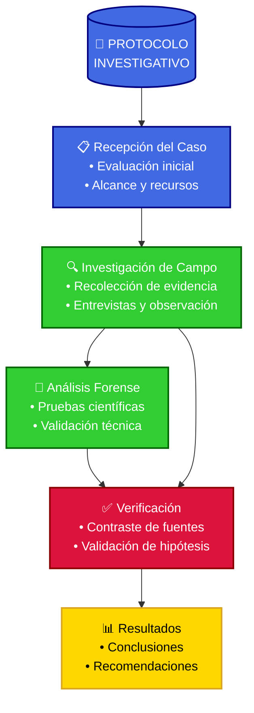

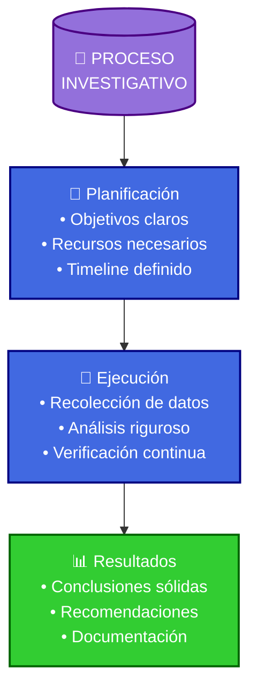

#### 2.1 Método Detective Conan

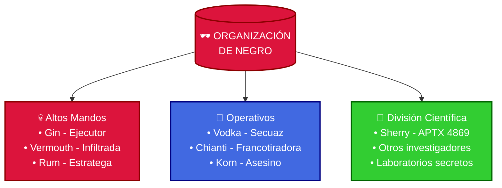

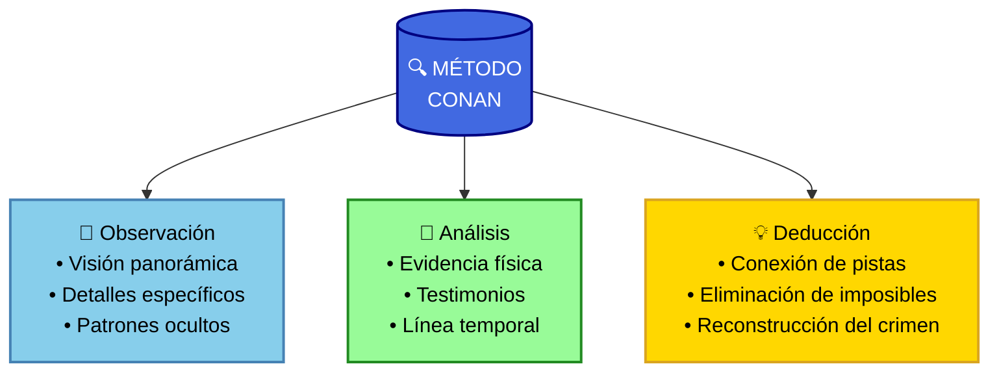

```metodologia_conan
Como cuando Shinichi usa su lupa para examinar una escena del crimen:

1. Observación detallada:
   - Primero mira el panorama completo, como cuando estudia toda la habitación
   - Luego enfoca los detalles, como las huellas o manchas
   - Finalmente conecta las pistas, como piezas de un rompecabezas

2. Análisis lógico:
   - Similar a cuando deduce el truco de un crimen imposible
   - Cada pieza de evidencia es una pista hacia la verdad
   - Las coartadas son como candados que hay que abrir con la llave correcta

Es como tener la lupa de Shinichi en tu mente:
¡Amplía los detalles hasta que la verdad sea clara como el cristal!
```

#### 2.2 Las Sombras de la Deducción

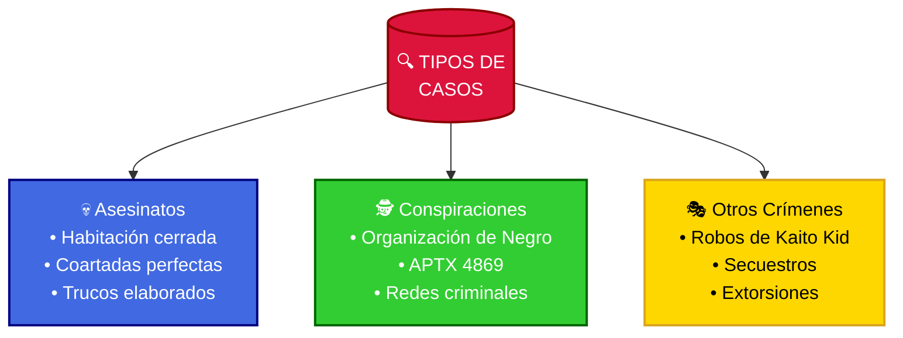

```arte_oscuro
La verdad que Shinichi nunca le contó a Ran:
"Cada escena del crimen es un abismo que te devuelve la mirada. Los detalles no son solo pistas... son susurros de horror congelados en el tiempo. El asesino deja más que evidencia física - deja ecos de oscuridad que resuenan en tu alma.

Cuando reconstruyo un crimen, no solo veo los hechos. Siento el último latido de pánico de la víctima, escucho el último aliento tembloroso, percibo el momento exacto en que una vida se extingue y otra se mancha para siempre con sangre que ningún agua podrá lavar.

Las escenas más terroríficas no son las sangrientas, sino aquellas donde ves la premeditación fría, el cálculo metódico, la inteligencia retorcida que planeó cada detalle. Es entonces cuando entiendes que los verdaderos monstruos no tienen garras ni colmillos - tienen mentes brillantes y sonrisas amables.

La deducción es un arte oscuro que te consume. Con cada caso resuelto, una parte de tu inocencia muere. Pero seguimos adelante, porque en este mundo de sombras, alguien debe encender la luz de la verdad... aunque esa luz revele horrores que preferiríamos no haber visto jamás."

Elementos del abismo:
1. El eco del terror en los detalles
2. La danza macabra de la evidencia
3. La psicología retorcida del asesino
4. El precio emocional de la verdad
5. La oscuridad que habita en cada mente humana
```

#### 2.3 Métodos para Casos Complejos

**Técnica de los Tres Escenarios**:
 
```casos_complejos
¡La técnica secreta de Shinichi para casos difíciles!

Como en el caso de la Mansión del Crepúsculo:
1. La teoría inicial: El mayordomo lo hizo por la herencia
2. La teoría oculta: La víctima planeó su propio asesinato
3. La verdad inesperada: ¡El truco del reloj y las sombras!

O el misterio del Barón Negro:
- Las pistas eran como piezas de dominó
- Cada sospechoso tenía su propia historia
- El truco final sorprendió a todos

Como dice el profesor Agasa:
"Un detective debe ver más allá de lo obvio,
¡porque la verdad siempre nos sorprende!"
```

**Matriz de deducción detectivesca**:
| 📋 Aspecto | 💡 Teoría Principal | 🤔 Teoría Alternativa | ⚡ Teoría Sorpresa |
|---------|------------------|-------------------|-----------------|
| Evidencia | Huellas claras | Pistas contradictorias | Evidencia oculta |
| Motivo | Venganza personal | Accidente encubierto | Plan elaborado |
| Método | Truco simple | Coartada falsa | Ilusión compleja |
| Testigos | Declaraciones directas | Testimonios confusos | Testigos clave |
| Resolución | Caso típico | Giro inesperado | ¡Truco imposible! |

> **Consejo práctico**: Nunca descartar un escenario hasta tener evidencia concluyente en su contra.

## ✨ ~Academia de Detectives Beika~

*名探偵学園*
(La Escuela de los Grandes Detectives)

> *"Donde los sueños de justicia toman vuelo..."*

⋆ ⋅ ⋆ ✦ ⋆ ⋅ ⋆

Inspirado en Shinichi Kudo (Conan Edogawa), este sistema combina observación, lógica y conocimiento para resolver misterios en cualquier contexto.

### 🌟 ~Los 12 Secretos de Shinichi~

> *Las técnicas legendarias del Detective del Este*

---
⭐ *Insert Song: Pasos hacia la Verdad* ⭐

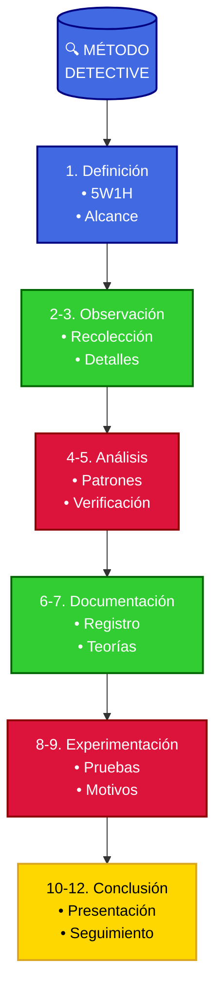

1. **Definir el problema**: Usar las 5W1H (Qué, Quién, Dónde, Cuándo, Por qué, Cómo)

   ```ejemplo
   "¿Qué falló en el sistema? ¿Quién tuvo acceso? ¿Cuándo ocurrió?"
   ```

2. **Recolección inicial**: Fuentes offline y online

   ```protocolo
   - Entrevistas presenciales
   - Visitas a lugares relevantes
   - Documentación física
   ```

3. **Observación detallada**:

   - Notar patrones e inconsistencias
   - Usar todos los sentidos

   ```consejo
   "Revisar el lugar 3 veces: vista general, detalles específicos, patrones ocultos"
   ```

4. **Análisis de patrones**:

   - Identificar coincidencias y anomalías
   - Usar técnicas de link analysis

   ```example
   📝 EJEMPLO PRÁCTICO
   ------------------
   "Patrón detectado: Todas las transacciones sospechosas ocurren los viernes"
   ```

5. **Verificación cruzada**:

   ```protocolo
   - Contrastar información con fuentes independientes
   - Validar datos con expertos
   - Usar herramientas de fact-checking
   ```

6. **Documentación forense**:

   - Registrar todo el proceso
   - Incluir evidencias digitales/físicas
   - Mantener cadena de custodia

7. **Desarrollo de teorías**:

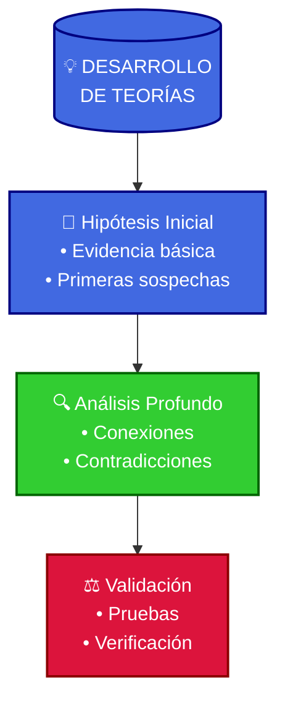

    - Aplicación de la Técnica de los Tres Escenarios (ver sección 2.4)
    - Evaluación sistemática de cada posibilidad

    ```consejo
    "Usar matriz de análisis para cada escenario propuesto"
    ```

8. **Experimentación controlada**:

   - Recrear escenarios clave
   - Validar supuestos
   - Documentar resultados

9. **Análisis de motivos**:

   - Investigar posibles razones
   - Evaluar beneficiarios
   - Considerar contexto social/económico

10. **Presentación de hallazgos**:

    ```protocolo
    - Estructurar informe con:
      1. Resumen ejecutivo
      2. Metodología
      3. Evidencias
      4. Conclusiones
    - Usar lenguaje preciso y neutral
    ```

11. **Revisión ética final**:

    - Verificar impacto en terceros
    - Asegurar protección de datos
    - Confirmar cumplimiento legal

12. **Seguimiento**:
    - Monitorear desarrollos posteriores
    - Actualizar conclusiones si surge nueva evidencia
    ```tip
    💡 CONSEJO DEL DETECTIVE
    -----------------------
    "Programar revisiones periódicas cada 3-6 meses"
    ```

> **Nota**: La integración de métodos tradicionales y modernos maximiza los resultados investigativos

### 🌸 ~El Código del Detective~

*名探偵の誓い*
(El Juramento del Gran Detective)

> *"Como el compromiso inquebrantable de Shinichi con la verdad..."*

> *"Donde la ética y el deber se encuentran..."*

---
🎵 *Insert Song: El Honor del Detective* 🎵

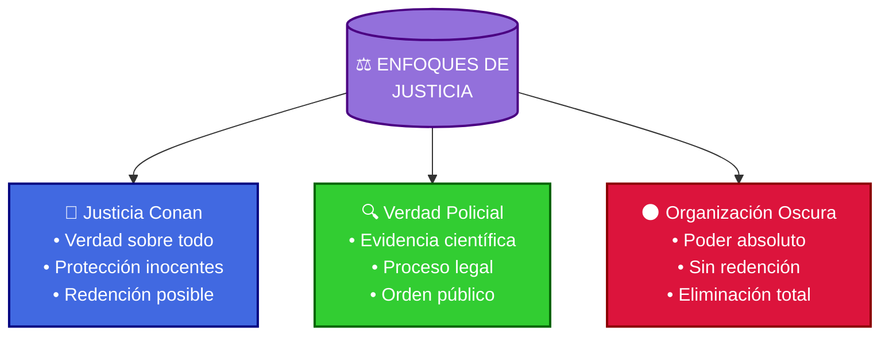

#### 3.1 Marco Jurídico Actualizado (2025)

#### Marco Legal y Principios Éticos

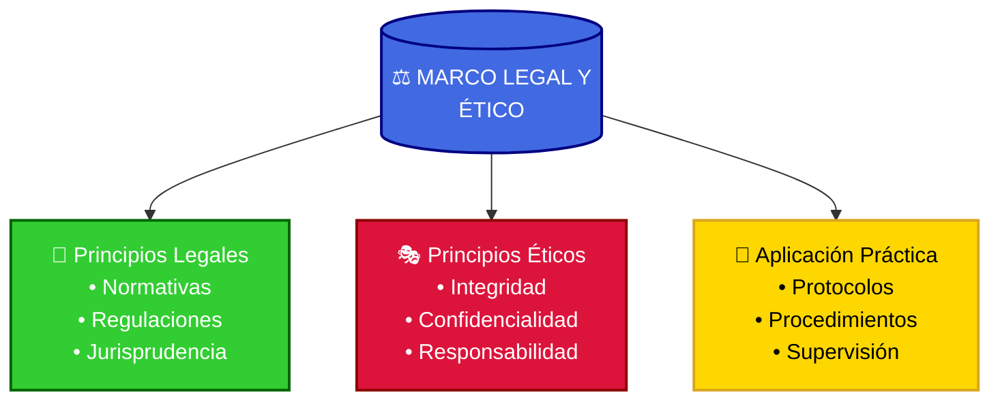

### 💫 Principios Fundamentales

> *Los pilares que guían toda investigación:*

---
- Integridad en la investigación
- Protección de inocentes
- Justicia objetiva
- Ética profesional

**Jurisprudencia relevante**:

| Autoridad               | Caso Notable  | Principio Establecido                         |
| ----------------------- | ------------- | -------------------------------------------- |
| Inspector Megure        | Caso Mansión  | Protección de escenas del crimen             |
| Detective Mouri         | Caso Espejo   | Respeto a la privacidad de testigos          |
| Agente Jodie           | Caso FBI      | Cooperación internacional en investigaciones  |
| Prof. Agasa            | Caso Gadget   | Uso ético de tecnología detectivesca         |

**El Arte de la Evidencia**:

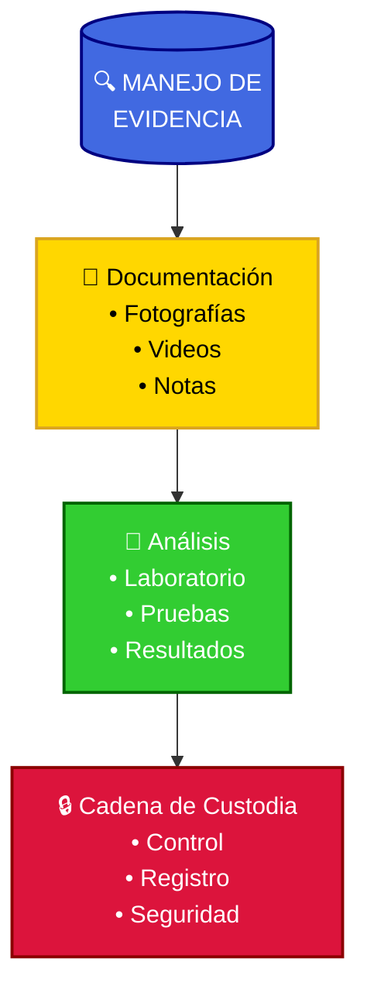

```metodos_forenses
🔬 MÉTODOS FORENSES AVANZADOS
----------------------------
¡Los secretos de la investigación de Shinichi!

1. Protección de pistas:
   - Como Conan fotografiando la escena del crimen
   - Cuidando las huellas como tesoros
   - Usando los guantes del inspector Megure

2. Técnicas especiales:
   - El spray luminol del profesor Agasa
   - Los análisis del Dr. Araide
   - Los trucos del inspector Shiratori
```

#### 3.2 Ética Profesional y Responsabilidad

**Principios deontológicos fundamentales**:

```deontologia
1. Honestidad y objetividad:
   - Comunicación clara de limitaciones
   - Presentación equilibrada de hallazgos
   - No omisión de datos contrarios

2. Confidencialidad reforzada:
   - Protocolos de manejo de información sensible
   - Sistemas de clasificación por niveles
   - Procedimientos de destrucción segura

3. Responsabilidad social:
   - Evaluación de impacto colateral
   - Proporcionalidad en métodos empleados
   - Consideración de grupos vulnerables
```

### ⚖️ Dilemas Éticos y su Resolución

> **IMPORTANTE**: La ética es la brújula que guía toda investigación

---

| Dilema                         | Consideraciones        | Enfoque Recomendado               |
| ------------------------------ | ---------------------- | --------------------------------- |
| Privacidad vs seguridad        | Derechos fundamentales | Test de proporcionalidad          |
| Uso de engaño en investigación | Integridad profesional | Límites prestablecidos            |
| Información perjudicial        | Daño potencial         | Evaluación de interés público     |
| Presión del cliente            | Independencia          | Cláusulas de objeción profesional |

**Guía para la toma de decisiones éticas**:

```modelo_decision
1. Evaluación estructurada:
   - ¿Vulnera derechos fundamentales?
   - ¿Existe interés legítimo superior?
   - ¿Hay alternativas menos intrusivas?
   - ¿El beneficio justifica el método?

2. Documentación del proceso:
   - Registro de dilema identificado
   - Alternativas consideradas
   - Justificación de decisión final
   - Medidas de mitigación adoptadas

3. Consulta y supervisión:
   - Comités de ética profesional
   - Segunda opinión de colegas
   - Marcos de referencia internacionales
   - Precedentes en casos similares
```

#### 3.3 Protección de Colectivos Especiales

**Marco reforzado para menores**:

```pesadillas_haibara
El Infierno de la Científica:
Las confesiones nocturnas de Shiho Miyano

1. Memorias del Laboratorio Negro:
   En las profundidades de los laboratorios de la Organización:
   - Cada fórmula era una sentencia de muerte
   - Los gritos de los "sujetos de prueba" aún resuenan en sus pesadillas
   - El aroma dulce del APTX 4869 esconde el hedor de la muerte
   - Las paredes blancas ocultan manchas de sangre que nunca se irán

2. La Danza de las Máscaras:
   Como Sherry, como Haibara, como una niña que nunca fue niña:
   - Cada sonrisa oculta años de trauma
   - Cada paso es vigilado por fantasmas en negro
   - La paranoia se vuelve una compañera constante
   - El miedo a Gin es una sombra que nunca desaparece

3. El Peso del Conocimiento Prohibido:
   Los secretos que la mantienen despierta por la noche:
   - Las fórmulas del APTX escritas en sangre
   - Los nombres de quienes "desaparecieron" en pruebas fallidas
   - El verdadero propósito del veneno que creó
   - La culpa que ningún antídoto puede curar

"A veces", susurra Haibara en la oscuridad del laboratorio de Agasa, "me pregunto si el APTX 4869 no fue mi mayor creación, sino mi primer intento de suicidio. Porque cuando lo tomé, parte de mí sabía que merecía algo peor que la muerte: merecía vivir con lo que había hecho."

Los niños de la Liga Juvenil nunca entenderán por qué Haibara a veces se queda mirando al vacío, por qué sus manos tiemblan cuando ve cuervos negros, por qué algunas noches grita nombres que nadie conoce. Porque hay horrores que no pueden ser compartidos, verdades que destruirían la inocencia que ella ya perdió hace tanto tiempo en un laboratorio sin ventanas.
```

**Consideraciones para otros grupos vulnerables**:

| Detective              | Método de Protección      | Apoyo Especial              |
| --------------------- | ------------------------ | --------------------------- |
| Liga Juvenil          | Supervisión de Conan     | Gadgets del Prof. Agasa    |
| Testigos jóvenes      | Acompañamiento de Ran    | Respaldo de la policía     |
| Víctimas menores      | Cuidado de Ai Haibara    | Ayuda médica del Dr. Araide|
| Informantes pequeños  | Protección de Kogoro     | Red de detectives aliados  |

**Lista de verificación ética ampliada**:

✅ ¿He obtenido consentimiento informado específico?
✅ ¿He adaptado procedimientos a necesidades especiales?
✅ ¿He consultado protocolos específicos actualizados?
✅ ¿He documentado medidas de protección adicionales?
✅ ¿He minimizado la exposición de la persona?
✅ ¿He evaluado el impacto potencial a largo plazo?
✅ ¿He considerado alternativas menos intrusivas?
✅ ¿He verificado cumplimiento normativo específico?

### 11. Conclusiones y Mejores Prácticas

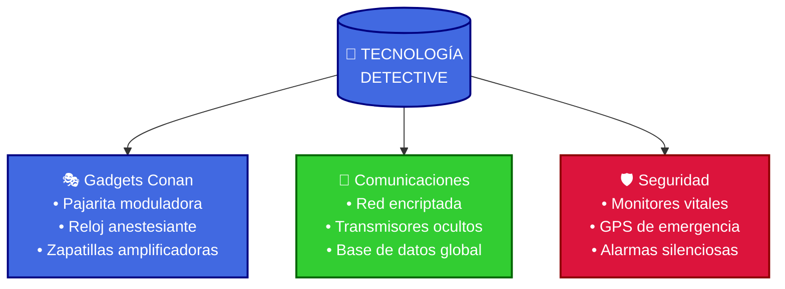

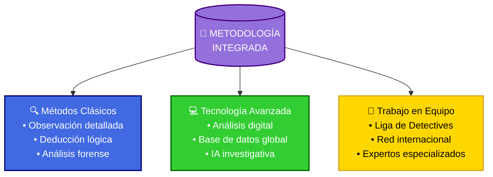

#### 11.1 Integración de Metodologías

**Enfoque multidisciplinar**:

```enfoque_integral
1. Combinación de técnicas tradicionales y tecnológicas:
   - Observación clásica + análisis digital
   - Entrevistas presenciales + validación con IA
   - Trabajo de campo + visualización de datos

2. Proceso cíclico de investigación:
   - Planteamiento de hipótesis iniciales
   - Recopilación sistemática de evidencias
   - Análisis crítico y contrastado
   - Reformulación continua de teorías
   - Verificación mediante fuentes diversas

3. Adaptación contextual:
   - Selección de técnicas según caso específico
   - Evaluación de recursos disponibles
   - Consideración del marco legal aplicable
   - Sensibilidad social y cultural del entorno
```

#### 🌟 ~La Reflexión del Detective~

*探偵の内省*
(Introspección Detectivesca)

> *"El momento de mirar en el espejo de la verdad..."*

⋆ ⋅ ⋆ ✦ ⋆ ⋅ ⋆

```autoevaluacion_conan
Como Conan evalúa sus investigaciones:

1. Revisión post-caso:
   - ¿Qué pistas pasé por alto inicialmente?
   - ¿Cuánto tiempo me tomó ver el patrón clave?
   - ¿Las deducciones fueron paso a paso y claras?
   - ¿Puse en riesgo innecesario a alguien?
   - ¿La explicación final fue comprensible para todos?

2. Lecciones aprendidas:
   - Nuevos trucos criminales identificados
   - Mejoras en técnicas de observación
   - Optimización del tiempo de respuesta
   - Protección más efectiva de testigos
   - Presentación más impactante de conclusiones
```

**Elementos de un informe profesional**:

```estilo_shinichi
El arte de presentar conclusiones:

1. Construcción del momento:
   - Reunir a todos los sospechosos
   - Crear tensión dramática
   - Revelar pistas gradualmente
   - Demostrar trucos clave
   - Confrontar al culpable en el clímax

2. Técnica de exposición:
   - Usar analogías claras
   - Demostrar la lógica paso a paso
   - Anticipar y responder objeciones
   - Presentar evidencia física
   - Explicar el motivo humano

3. El toque Shinichi:
   - Empatía con víctimas y testigos
   - Justicia con compasión
   - Lecciones morales sutiles
   - Prevención de futuros crímenes
   - Reconciliación cuando es posible
```

#### 11.2 Desarrollo Profesional Continuo

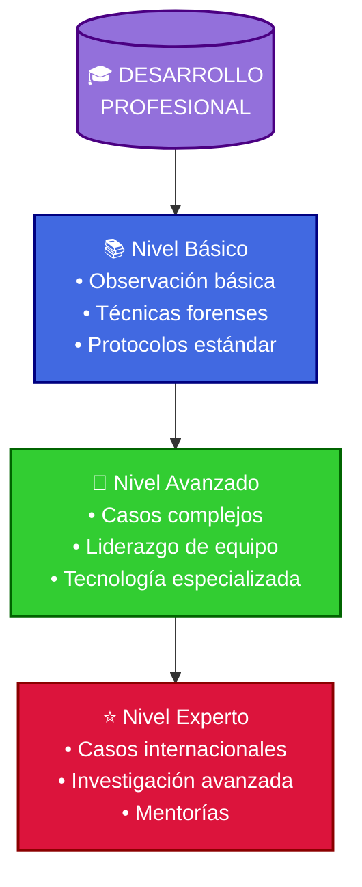

**Plan de actualización formativa**:

```camino_detective
1. Sendero del Detective Adolescente:
   - Entrenamiento con el Inspector Megure
   - Prácticas en casos con Heiji Hattori
   - Aprendizaje de técnicas del FBI
   - Colaboración con la CIA
   - Intercambio con detectives internacionales

2. Recursos de mejora:
   - Acceso a la biblioteca del Prof. Agasa
   - Entrenamiento en el dojo de Ran
   - Casos prácticos con la Liga Juvenil
   - Tutorías con Kogoro Mouri
   - Intercambio con otros detectives jóvenes

3. Habilidades esenciales:
   - Deducción al estilo Shinichi
   - Observación como Conan
   - Valentía como Ran
   - Astucia como Kaito Kid
   - Trabajo en equipo como la Liga Juvenil
```

🎭 ~Guild de Detectives~
--------------------
*Donde los maestros forjan nuevas leyendas*

> *"Un detective nunca camina solo por el sendero de la verdad"*

| Comunidad                    | Beneficio                 | Ejemplos              |
| ---------------------------- | ------------------------- | --------------------- |
| Policía metropolitana        | Experiencia práctica      | División del Inspector Megure |
| Liga Juvenil de Detectives   | Trabajo en equipo         | Grupo de Conan            |
| Red de detectives aliados    | Intercambio de casos      | Heiji, Kid, FBI, CIA      |
| Sistema de mentores          | Aprendizaje directo       | Kogoro Mouri como sensei  |


### 12. Visión de Futuro: Tendencias Emergentes 2025-2030

La investigación forense y detectivesca está experimentando una transformación acelerada que redefinirá la profesión en los próximos años. Anticiparse a estas tendencias será crucial para mantener la efectividad y relevancia profesional.

**El Futuro de la Investigación**:

```inventos_futuros
1. Nuevos inventos del Prof. Agasa:
   - Gafas con análisis de ADN instantáneo
   - Pajarita con detector de mentiras
   - Monopatín con radar de rastreo
   - Reloj con escáner forense

2. Mejoras en el laboratorio policial:
   - Base de datos criminal holográfica
   - Sistema de reconstrucción 3D de escenas
   - Analizador de huellas cuántico
   - Comunicadores de nueva generación

3. Equipamiento detectivesco avanzado:
   - Mini-laboratorio portátil
   - Drones de vigilancia silenciosos
   - Cámaras de visión molecular
   - Sensores de rastros invisibles
```

**Desafíos éticos y legales anticipados**:

| Ámbito       | Desafío                 | Posible Respuesta              |
| ------------ | ----------------------- | ------------------------------ |
| Autonomía IA | Decisiones algorítmicas | Supervisión humana garantizada |
| Privacidad   | Vigilancia ubicua       | Marcos regulatorios reforzados |
| Manipulación | Deepfakes avanzados     | Tecnologías de autenticación   |
| Acceso       | Brecha tecnológica      | Estándares mínimos universales |

🎬 ~Escena Post-Créditos~
--------------------

El profesional de la investigación del futuro deberá mantener un delicado equilibrio entre la adopción de tecnologías disruptivas y la preservación de los principios fundamentales de la disciplina. La ética, el rigor metodológico y el juicio humano seguirán siendo insustituibles frente a la creciente automatización.

> "La tecnología amplifica nuestras capacidades, pero es el criterio humano el que transforma datos en justicia" - Shinichi Kudo

### 🌙 ~Episode 13: La Organización que Persigue la Verdad~

*暗闇に輝く真実*
(La Verdad que Brilla en la Oscuridad)

> *"Como la Liga Juvenil de Detectives, pero a escala global..."*

> *"Cuando los defensores de la verdad se unen..."*

---
⭐ *Insert Song: La Promesa del Detective* ⭐

#### 🎬 OVA 13.1: ~La Organización en las Sombras~

> *Entre las sombras de la noche, los detectives nunca descansan...*

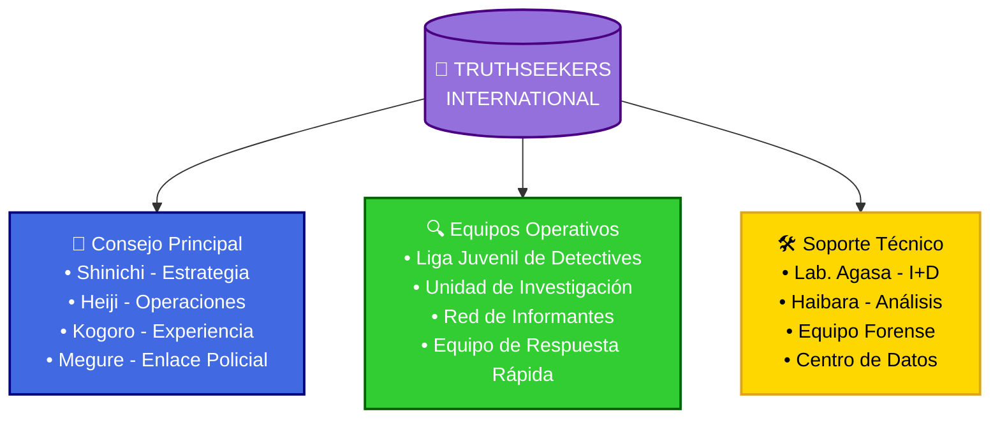

**Equipo Operativo**:

| División           | Función Principal | Miembros                            |
| ----------------- | ---------------- | ----------------------------------- |
| Consejo Principal | Liderazgo        | Shinichi, Heiji, Kogoro, Megure     |
| Liga Juvenil      | Investigación    | Conan, Genta, Mitsuhiko, Ayumi      |
| Lab. Agasa        | Tecnología       | Prof. Agasa, Haibara, equipo técnico|
| Apoyo Legal       | Justicia         | Eri Kisaki, Oficiales de policía    |
| Academia          | Entrenamiento    | Jodie Starling, James Black, Ran    |

#### 🎭 ~El Precio de Ocultar la Verdad~

*偽りの代償編*
(La Saga del Engaño Necesario)

> *"Como cuando Conan debe mentir a Ran para protegerla..."*

> *"En la oscuridad, la verdad brilla más intensamente..."*

⋆ ⋅ ⋆ ✦ ⋆ ⋅ ⋆

```trauma_ran
El Espejo Roto: La Pesadilla de Ran

En la soledad de su habitación, Ran mira fotografías de Shinichi mientras Conan duerme en la habitación contigua. Sus dedos tiemblan al tocar el rostro sonriente de quien ama, sin saber que está a metros de distancia, atrapado en un cuerpo que no es suyo. Cada noche es un ejercicio de autoengaño, cada sonrisa una máscara que oculta un abismo de dudas.

Los Susurros de la Duda:
- A veces, cuando mira a Conan, ve destellos de Shinichi que la hacen temblar
- Las llamadas telefónicas de Shinichi siempre llegan cuando Conan no está presente
- Los ojos del niño brillan con una inteligencia demasiado madura, demasiado familiar
- Cada "no soy Shinichi" de Conan es como un puñal que retuerce sus sospechas

El Horror de la Casi-Verdad:
"Lo peor", susurra Ran en sus momentos más oscuros, "no es la ausencia. Es la presencia que se disfraza de ausencia. Es ver a quien amas todos los días y convencerte de que no es él. Es que cada instinto te grite la verdad mientras tu mente la niega. Es vivir en una realidad donde nada es lo que parece, donde el amor se esconde tras mentiras necesarias."

Las Pesadillas Recurrentes:
1. Sueña que Shinichi regresa, solo para ver su rostro derretirse revelando a Conan
2. Imagina encontrar el cadáver de Shinichi mientras Conan la observa en silencio
3. Revive momentos con ambos, superpuestos como fotografías mal reveladas
4. Se despierta gritando nombres que son el mismo pero no puede admitirlo

El Precio del Silencio:
Cada "Ran-neechan" de Conan es una pequeña muerte. Cada vez que sus instintos gritan "¡ES ÉL!" debe enterrarlos más profundo. La cordura tiene un precio, y es la negación constante de lo evidente. Como una actriz en una obra interminable, debe pretender no ver lo que ve, no saber lo que sabe, no sentir lo que siente.

"A veces", confiesa a su almohada en la oscuridad, "desearía que uno de los dos desapareciera. Que Shinichi volviera y Conan se fuera, o que Conan se quedara y Shinichi... Pero no puedo soportar esta dualidad que me destroza el alma. Esta verdad que no puedo admitir sin destruir todo lo que amo."
```

#### El Método de las Sombras: La Investigación según Shinichi

```metodologia_oscura
La Danza de la Verdad y la Muerte

Como Shinichi aprendió en sus años persiguiendo asesinos, cada investigación es un descenso al abismo de la mente humana. No se trata solo de reunir evidencia - es un ritual macabro donde el detective debe pensar como el asesino sin convertirse en uno.

Elementos del Ritual Investigativo:
1. La Observación Maldita
   - Ver más allá de la sangre para leer la historia del horror
   - Escuchar los susurros de la muerte en cada detalle
   - Sentir el eco del último aliento en la escena del crimen
   - Reconstruir el momento exacto cuando la vida se extingue

2. La Deducción Oscura
   - Penetrar en la mente retorcida del criminal
   - Seguir el rastro de maldad hasta su origen
   - Descifrar la lógica macabra tras cada asesinato
   - Enfrentar verdades que destruyen la inocencia

3. La Revelación Final
   - Reunir a todos los sospechosos en un teatro de horror
   - Exponer la verdad como quien arranca una máscara
   - Confrontar al asesino con sus propios demonios
   - Cerrar el círculo de muerte con justicia

El precio del método es alto: cada caso resuelto deja cicatrices en el alma del detective, cada verdad revelada consume un poco más de su humanidad. Pero como dice Shinichi: "En un mundo donde la muerte acecha en cada esquina, alguien debe estar dispuesto a bailar con las sombras para encontrar la luz."
```

#### La Danza Macabra: Anatomía de un Asesino

```perfil_gin
El Arte de Matar: Memorias de un Cuervo Negro

En los callejones más oscuros de Tokio, Gin es una leyenda susurrada con terror. No es solo un asesino - es un artista de la muerte, un poeta del terror que convierte cada asesinato en una obra maestra de precisión y horror psicológico.

La Perfección del Depredador:
- Sus ojos verdes brillan en la oscuridad como los de un demonio
- El aroma de ginebra y tabaco precede a la muerte por segundos
- Su cabello plateado ondea como mercurio líquido en la noche
- Cada movimiento calculado con la precisión de un relojero
- Su Porsche 356A negro es un ataúd sobre ruedas

Las Reglas del Asesino Perfecto:
1. La muerte debe ser inevitable pero nunca rápida
2. La víctima debe comprender su destino antes del final
3. No hay placer en matar, solo la satisfacción del trabajo bien hecho
4. El miedo es un condimento que mejora la ejecución
5. La firma personal debe ser sutil pero inconfundible

Testimonios de los Condenados:
"Lo último que ves", susurra un moribundo, "son esos ojos verdes. No hay odio en ellos. No hay pasión. Solo... vacío. Como si la muerte misma te observara."

El Ritual de la Cacería:
- La preparación meticulosa del escenario
- El juego del gato y el ratón, prolongando el terror
- El momento preciso cuando la esperanza muere en sus ojos
- La ejecución limpia, profesional, sin emociones
- La contemplación final de la obra terminada

Los Susurros en la Organización:
Incluso entre los cuervos negros, Gin es temido. No por su crueldad, que muchos comparten, sino por su absoluta falta de humanidad. Como dice Vodka: "No es que disfrute matando. Es que para él, matar es tan natural como respirar. Y eso es lo que lo hace verdaderamente aterrador."

La Obsesión por Sherry:
Su única debilidad, si puede llamarse así, es su obsesión por encontrar a Sherry. No por pasión o venganza, sino porque representa la única mancha en su historial perfecto. Como un artista obsesionado con una obra inconclusa, no descansará hasta completar su obra maestra final.
```

#### 13.3 Operaciones y Casos Emblemáticos

**Criterios de selección de casos**:

```criterios_casos
1. Priorización por:
   - Impacto en derechos fundamentales
   - Existencia de evidencia no considerada
   - Posibilidad real de resolución
   - Implicaciones sistémicas del caso
   - Potencial de justicia restaurativa

2. Proceso de admisión:
   - Evaluación preliminar por equipo multidisciplinar
   - Análisis de viabilidad investigativa
   - Valoración de recursos necesarios
   - Consideración ética de consecuencias
   - Consulta con especialistas externos
```

**Casos emblemáticos documentados**:

| Caso                    | Naturaleza                     | Resolución                                    |
| ----------------------- | ------------------------------ | --------------------------------------------- |
| El Caso del Hotel      | Asesinato en habitación cerrada| Shinichi descubre el truco del candado       |
| El Misterio del Tren   | Secuestro en movimiento       | Conan coordina rescate con policía           |
| El Código del Museo    | Robo de artefactos antiguos   | Kaito Kid devuelve las piezas tras duelo     |
| Los Cuervos Negros     | Organización criminal         | FBI y CIA desmantelan red internacional      |
| El Secreto de Haibara  | Conspiración farmacéutica     | Exposición del APTX 4869 y sus creadores     |

**Impacto global documentado**:

```impacto_truthseekers
1. Logros destacados:
   - Resolución del caso del APTX 4869
   - Desenmascaramiento de la Organización de Negro
   - Captura de asesinos seriales famosos
   - Protección de testigos clave
   - Recuperación de tesoros robados

2. Impacto en la justicia:
   - Nuevos métodos adoptados por la policía metropolitana
   - Entrenamiento de jóvenes detectives
   - Colaboración internacional FBI-CIA-INTERPOL
   - Red global de detectives adolescentes
   - Avances en tecnología detectivesca
```

#### La Máscara Eterna: Los Secretos de Vermouth

```enigma_vermouth
La Actriz del Abismo: Un Estudio en Duplicidad

Vermouth es el espejo oscuro de la transformación de Shinichi - una maestra del engaño que ha convertido el cambio de identidad en un arte macabro. Cada rostro que usa es una máscara perfecta, cada personalidad una obra maestra de manipulación psicológica.

Las Mil Caras del Demonio:
- Sharon Vineyard muere para renacer como Chris
- Cada identidad construida con la precisión de un relojero
- Las máscaras se acumulan como cadáveres en su pasado
- Su verdadero rostro, si alguna vez existió, perdido en el tiempo
- El secreto de su juventud eterna, un horror que ni ella misma puede enfrentar

El Juego de los Secretos:
"Un secreto hace a una mujer, mujer", dice con una sonrisa que oculta abismos. Pero sus secretos son pozos sin fondo:
- Conoce la verdad sobre Conan pero elige guardar silencio
- Protege a Angel (Ran) por razones que ni ella comprende
- Mantiene una lealtad al "Silver Bullet" que contradice su naturaleza
- Su inmortalidad es una maldición que comparte con pocos

Las Pesadillas de la Inmortal:
En las noches más oscuras, cuando las máscaras caen:
1. Los rostros de todos los que ha sido la persiguen
2. Las vidas que ha vivido se mezclan y confunden
3. Ya no recuerda cuál era su verdadero nombre
4. El espejo le muestra mil rostros, ninguno real

La Danza con la Verdad:
"That Person" confía en ella precisamente porque es tan buena mintiendo que ni siquiera ella sabe cuándo dice la verdad. Su lealtad es un acertijo, sus motivos un laberinto, su humanidad un espejismo que parpadea como una vela en la oscuridad.

El Precio de la Eternidad:
Cada año que no envejece es un recordatorio de su maldición. Mientras otros temen a la muerte, ella teme a la vida eterna - una existencia de máscaras interminables, de identidades que se consumen como mariposas en la llama de su inmortalidad.

"A secret makes a woman, woman", susurra en la oscuridad. Pero el secreto más oscuro es que ya no hay mujer detrás de los secretos - solo un vacío con forma humana, una actriz tan consumada que ha olvidado que alguna vez no fue un personaje.
```

#### 13.4 La Academia Beika: Formación de Nuevos Investigadores

Inspirada en la preparación integral que caracteriza a Shinichi Kudo, la organización ha establecido un programa formativo de élite que combina lo mejor de la metodología tradicional y las innovaciones contemporáneas.

🎓 ~Academia de Detectives~
-----------------------
*Donde los sueños de justicia cobran vida*

```academia_beika
1. Áreas formativas centrales:
   - Metodología investigativa avanzada
   - Ciencias forenses aplicadas
   - Análisis documental y digital
   - Técnicas de entrevista cognitiva
   - Derecho internacional comparado
   - Ética aplicada a la investigación

2. Pedagogía distintiva:
   - Aprendizaje basado en casos reales
   - Mentoría directa por investigadores sénior
   - Rotaciones internacionales obligatorias
   - Investigación-acción participativa
   - Desarrollo de proyecto real como tesis
   - Especialización con enfoque multidisciplinar
```

**Perfiles de investigador**:

| Especialidad          | Competencias Distintivas               | Formación Complementaria        |
| --------------------- | -------------------------------------- | ------------------------------- |
| Analista de Patrones  | Reconocimiento de conexiones ocultas   | Ciencia de datos, criminología  |
| Investigador de Campo | Técnicas avanzadas de recopilación     | Antropología, psicología social |
| Especialista Forense  | Análisis científico de evidencias      | Química, biología, tecnología   |
| Reconstructor Digital | Modelado y simulación de escenarios    | Informática, diseño, física     |
| Defensor de Justicia  | Representación y articulación de casos | Derecho, comunicación, ética    |

**Programa de becas globales**:

```programa_becas
1. Iniciativa Jóvenes Detectives:
   - Selección basada en capacidades, no recursos
   - Cobertura completa para estudiantes de países en desarrollo
   - Programa especial para víctimas de injusticias sistémicas
   - Mentorías personalizadas para talentos excepcionales
   - Vía rápida para integración en equipos operativos

2. Requisitos de participación:
   - Compromiso demostrado con la verdad y justicia
   - Capacidad analítica sobresaliente
   - Integridad personal verificable
   - Voluntad de servicio a comunidades vulnerables
   - Disposición para trabajo global y colaborativo
```

#### La Marioneta Durmiente: La Tragedia de Kogoro Mouri

```tragedia_kogoro
El Detective Dormido: Una Identidad Robada

En los momentos de lucidez entre dardos tranquilizantes, Kogoro Mouri siente que algo está profundamente mal. Los casos se resuelven, su fama crece, pero los recuerdos son nebulosos, como fotografías desenfocadas de una vida que no parece del todo suya.

Los Fragmentos de la Conciencia:
- Momentos perdidos que se desvanecen como humo
- Deducciones brillantes que no recuerda haber hecho
- Aplausos y elogios que suenan huecos y distantes
- La sensación persistente de ser un actor en su propia vida

El Precio de la Fama Falsa:
"A veces", murmura en sus momentos de ebriedad, "es como si alguien más viviera dentro de mi cabeza. Como si mi cuerpo no fuera mío cuando más importa."

Las Grietas en la Realidad:
1. Los casos se resuelven perfectamente... demasiado perfectamente
2. Su reputación crece mientras su confianza se desmorona
3. Los testigos describen deducciones que no recuerda haber hecho
4. Cada "Detective Dormido" es un momento robado de su vida

La Duda Corrosiva:
En sus peores noches, cuando el sake no puede ahogar las preguntas:
- ¿Son realmente suyas estas victorias?
- ¿Por qué no puede recordar los momentos cruciales?
- ¿Quién es realmente el "Detective Dormido"?
- ¿Es él el verdadero fraude, o hay algo más siniestro en juego?

El Horror de la Incertidumbre:
Lo peor no es la fama inmerecida ni los momentos perdidos. Es la duda constante, el terror silencioso de que su mente se esté desmoronando mientras su reputación crece. Cada nuevo caso resuelto es otra grieta en su cordura, otro momento robado que nunca recuperará.

"Quizás", susurra a su vaso vacío, "el verdadero misterio no son los casos que resuelvo dormido, sino los fragmentos de mí mismo que pierdo en cada solución."
```

#### 13.5 Legado y Visión de Futuro

**El impacto cultural del modelo Conan**:

```impacto_cultural
(Ver sección 13.8 "De la Ficción a la Realidad" para un análisis detallado del impacto cultural)

Principales logros transformadores:
1. Democratización de métodos investigativos
2. Nuevo paradigma de justicia restaurativa
3. Inspiración de futuras generaciones
```

**Visión para 2030: Proyecto Verdad Global**:

```vision_2030
Para el año 2030, Truthseekers International aspira a:

1. Presencia operativa:
   - Oficinas regionales en todos los continentes
   - Red de 10,000 investigadores certificados
   - Laboratorios forenses móviles en 50 países
   - Plataforma digital accesible en 30 idiomas

2. Impacto transformador:
   - Sistema de alerta temprana para injusticias sistémicas
   - Banco de datos forenses compartido internacionalmente
   - Estándares universales de investigación independiente
   - Reforma de sistemas judiciales en 30 países mínimo

3. Legado perdurable:
   - Metodología VERDAD como estándar internacional
   - Transición de organización a movimiento global
   - Cultura de verificación y pensamiento crítico
   - Nueva generación de líderes formados bajo estos principios
```

##### Manifiesto Truthseekers: El Código Kudo

> "Creemos que la verdad no es negociable, la justicia no es opcional, y que cada persona merece que su historia sea correctamente contada. Donde otros ven casos cerrados, nosotros vemos preguntas pendientes. Donde se asume que la historia está escrita, nosotros buscamos las páginas arrancadas. Con la precisión de la ciencia, la persistencia del espíritu humano y el poder de la metodología correcta, nos comprometemos a seguir cada pista, analizar cada detalle y nunca abandonar hasta que la verdad prevalezca. Porque como dijo una vez Shinichi Kudo: 'Solo existe una verdad'."

#### El Francotirador Maldito: Las Sombras de Akai

```demonio_fbi
El Cuervo del FBI: Una Vida en la Mira

Akai Shuichi, el "Francotirador Plateado", vive en el limbo entre la luz y la oscuridad. Cada disparo perfecto es un recordatorio de la vida que fingió vivir, cada bala una oración silenciosa por Akemi. La culpa es su única compañera constante.

El Precio de la Infiltración:
- Años viviendo como Dai Moroboshi, construyendo una mentira perfecta
- Enamorándose genuinamente mientras interpretaba un papel
- El horror de mantener la fachada mientras Akemi moría
- La máscara de Okiya Subaru, otra capa de engaños sobre engaños

Las Cicatrices del Deber:
"Cada identidad falsa", reflexiona mientras limpia su rifle, "es una pequeña muerte. Pero la muerte de Akemi fue real, y esa es la que me perseguirá eternamente."

El Ritual del Francotirador:
1. La respiración controlada que oculta el temblor de las manos
2. El momento de paz antes del disparo que nunca llega realmente
3. La precisión mortal que lo define y lo condena
4. El peso del rifle que se siente más ligero que el de sus pecados

Los Fantasmas que Persiguen:
En las noches frías, cuando la lluvia golpea las ventanas:
- El rostro de Akemi aparece en cada objetivo
- Las últimas palabras de amor que no pudo responder
- La sangre que mancha sus manos aunque nunca la tocó
- El conocimiento de que su muerte fue el precio de su deber

La Maldición del Superviviente:
Sobrevivir se ha convertido en su penitencia. Cada día que vive es otro día que ella no tiene, cada misión exitosa un recordatorio de su fracaso más grande. La venganza contra la Organización no es solo deber - es la única forma de redención que conoce.

"El FBI me llama su mejor agente", murmura mientras observa la ciudad a través de su mira telescópica, "pero soy solo un hombre que vendió su alma por información y perdió su corazón en el proceso."
```

#### 13.6 Red Global de Colaboración Ciudadana

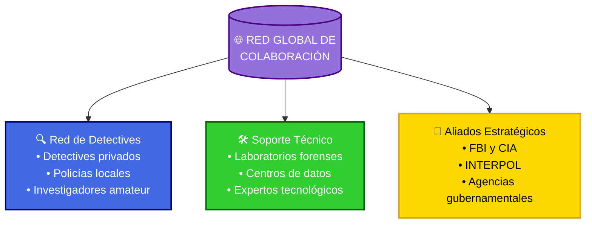

En el espíritu del Detective Conan, quien siempre valoró la participación de personas comunes en la resolución de casos complejos, Truthseekers International ha desarrollado un innovador sistema de colaboración ciudadana global.

**Programa "Detectives Ciudadanos"**:

```detectives_ciudadanos
1. Niveles de participación:
   - Observadores: Reportan situaciones potencialmente injustas
   - Analistas: Contribuyen a la revisión de documentos y datos
   - Especialistas: Aportan conocimientos técnicos específicos
   - Coordinadores: Organizan esfuerzos locales de investigación
   - Defensores: Apoyan la divulgación y sensibilización pública

2. Herramientas colaborativas:
   - Plataforma segura de intercambio de información
   - Aplicación móvil para documentación certificada
   - Sistema de verificación cruzada comunitaria
   - Canales encriptados para informantes
   - Red de apoyo para testigos y víctimas
```

**Iniciativas locales con impacto global**:

| Iniciativa                  | Descripción                                | Logros Destacados                         |
| --------------------------- | ------------------------------------------ | ----------------------------------------- |
| Liga Juvenil de Detectives | Grupos de investigación como el de Conan | Resolución de casos por todo Japón    |
| Base de Datos del FBI     | Archivo de casos de la Org. de Negro    | Miles de archivos secretos revelados |
| Red de Testigos Protegidos| Sistema de protección de informantes    | Testimonios clave contra criminales  |
| Detectives en las Sombras | Red secreta de investigadores aliados   | Prevención de crímenes organizados   |
| Academia Teitan          | Formación de jóvenes detectives        | Expansión a escuelas de todo el país |

**Protección para participantes**:

```proteccion_colaboradores
1. Sistema de protección:
   - Pajarita moduladora para comunicación segura
   - Gafas de Conan para vigilancia
   - Insignias de la Liga Juvenil para rastreo
   - Reloj tranquilizante para emergencias
   - Monopatín turbo para escapes rápidos

2. Inventos del Prof. Agasa:
   - Dispositivos de camuflaje avanzado
   - Sistemas de comunicación encriptada
   - Monitores de seguridad permanente
```

#### La Inocencia Perdida: El Horror de la Liga Juvenil

```trauma_infantil
Niños en el Abismo: La Liga Juvenil de Detectives

Ayumi, Genta y Mitsuhiko: tres niños normales arrastrados al mundo de la muerte y el crimen por seguir a Conan. Sus risas infantiles ahora se mezclan con el eco de sirenas policiales, sus juegos de detectives se han convertido en encuentros reales con el horror.

La Corrupción de la Inocencia:
- Ayumi dibuja cuerpos trazados con tiza en sus cuadernos
- Genta ya no teme a los monstruos, sino a los humanos
- Mitsuhiko calcula ángulos de balas en clase de matemáticas
- Sus ojos han visto demasiado para su edad

Los Juegos que Ya No Son Juegos:
"¿Recuerdan cuando jugábamos a los detectives?", susurra Ayumi. "Ahora los cadáveres son reales, la sangre mancha de verdad, y las personas realmente mueren..."

Pesadillas Compartidas:
1. Ayumi sueña con cuerpos cayendo como en el caso del rascacielos
2. Genta no puede dormir recordando el rostro del asesino del parque
3. Mitsuhiko calcula obsesivamente rutas de escape en cada habitación
4. Todos fingen que es una aventura emocionante, pero saben la verdad

El Precio de Crecer Demasiado Rápido:
- Ya conocen el olor de la muerte antes de aprender álgebra
- Pueden recitar procedimientos policiales pero aún no saben atarse los zapatos
- Reconocen patrones de asesinos seriales mientras juegan con muñecas
- Sus padres no saben que sus hijos ya no son realmente niños

La Máscara de la Normalidad:
Durante el día, son estudiantes normales de primaria. Pero sus juegos en el recreo incluyen recreaciones de escenas del crimen, sus conversaciones casuales giran en torno a métodos de asesinato, y sus ojos buscan instintivamente señales de violencia en cada situación.

"A veces", confiesa Mitsuhiko en una reunión secreta, "me pregunto si alguna vez volveremos a ser normales. Si algún día podremos ver una habitación cerrada sin pensar en asesinatos, o escuchar una sirena sin correr hacia el peligro."

Y lo más aterrador no es lo que han visto, sino lo acostumbrados que están a verlo.
```

#### 13.7 Cómo Participar en Truthseekers International

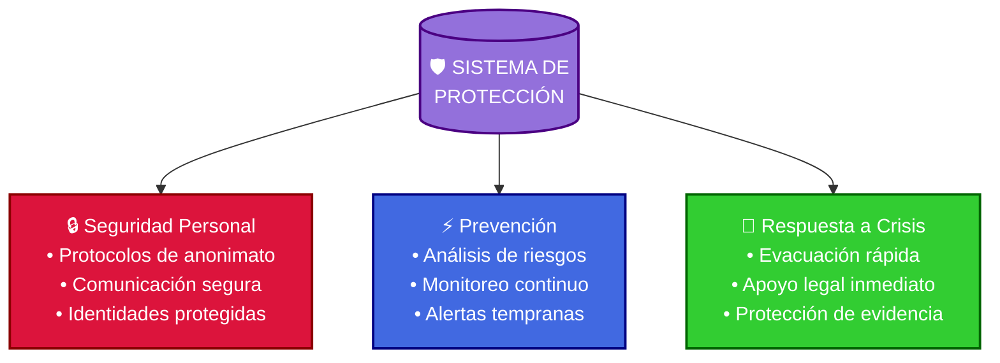

**Vías de incorporación**:

```participacion
1. Opciones de colaboración:
   - Voluntariado especializado (presencial/remoto)
   - Prácticas profesionales y formación
   - Contribuciones pro-bono de expertos
   - Financiación transparente de proyectos
   - Denuncia segura de situaciones injustas
   - Difusión responsable de investigaciones

2. Proceso de incorporación:
   - Contacto inicial a través del portal seguro
   - Evaluación de habilidades y motivaciones
   - Formación básica en metodología VERDAD
   - Período de prueba con mentor asignado
   - Integración progresiva en proyectos
   - Especialización según aptitudes demostradas
```

**Participación y Compromiso**:

```participacion_global
Para unirte a esta iniciativa:
1. Explora los casos activos en truthseekersintl.org
2. Identifica tu área de contribución potencial
3. Conéctate con la comunidad local
4. Comienza tu formación en la Academia Beika
```

> "La verdad no teme a la investigación; cada pregunta correctamente formulada nos acerca más a ella. Cuando personas de todo el mundo unen fuerzas con metodología, ética y determinación, no hay misterio que no pueda resolverse ni injusticia que no pueda corregirse. Como diría Conan: 'Un detective que se rinde es peor que no haber comenzado'." — Manifiesto Citizen Truthseekers

#### El Fantasma Sonriente: La Maldición de Kaito Kid

```mascara_kid
El Mago del Claro de Luna: Una Venganza en Blanco

Bajo el traje blanco inmaculado y la sonrisa perfecta del ladrón fantasma, Kaito Kuroba sangra. Cada robo espectacular, cada truco imposible, es un ensayo para la función final - el momento en que encuentre a los asesinos de su padre.

La Herencia de Sangre:
- El traje blanco manchado con la sangre invisible de su padre
- Cada joya robada, un paso más cerca de la verdad
- La sonrisa del póker face ocultando un abismo de rabia
- El público aplaude sin saber que están viendo una tragedia

El Precio del Espectáculo:
"El mejor truco de magia", piensa mientras planea otro robo, "es hacer que todos vean un ladrón gentleman cuando en realidad están presenciando una cacería. Cada robo es un mensaje para los asesinos: 'Los veo. Me acerco. Pronto.'"

Los Rituales del Fantasma:
1. Vestir el traje blanco como una armadura contra la oscuridad
2. Practicar la sonrisa perfecta frente al espejo hasta que duela
3. Planear robos cada vez más elaborados, esperando atraer a las sombras
4. Buscar en cada joya el secreto de la inmortalidad que mató a su padre

La Dualidad del Entertainer:
Durante el día:
- Kaito Kuroba, el estudiante bromista
- El chico que hace reír a todos
- El mago que alegra corazones
- El hijo que finge que su padre solo "desapareció"

Durante la noche:
- Kaito Kid, el ladrón fantasma
- El vengador en traje blanco
- El cazador que es cazado
- El hijo que sabe exactamente cómo murió su padre

La Ironía del Ladrón:
Lo único que realmente quiere robar - el tiempo, para salvar a su padre - es lo único que nunca podrá tomar. Cada joya devuelta es un recordatorio de su verdadera pérdida, cada truco perfecto una burla del truco final de su padre que terminó en tragedia.

"El show debe continuar", susurra mientras se ajusta el monóculo, "hasta que la última cortina caiga y los verdaderos criminales sean expuestos. Porque el mejor truco de magia será hacer que los asesinos desaparezcan... para siempre."
```

#### 13.8 De la Ficción a la Realidad: El Legado Vivo de Conan

Este concepto de Truthseekers International representa la culminación del espíritu del Detective Conan trasladado al mundo real. Aunque nace como un fan art inspirado en un hipotético live action, encarna valores y metodologías que pueden tener una aplicación práctica genuina.

**Puentes entre la narrativa y la acción**:

```legado_practico
La influencia del Detective Conan se materializa en:
1. Metodologías investigativas rigurosas
2. Valores éticos inquebrantables
3. Colaboración interdisciplinaria efectiva
4. Innovación tecnológica responsable
5. Compromiso con la justicia social
```

**Impacto y Transformación**:

```transformacion_social
De la ficción a la realidad, el legado del Detective Conan impulsa:

1. Desarrollo profesional
   - Metodologías rigurosas y verificables
   - Capacitación formal y sistemática
   - Aplicación práctica de principios

2. Cambio social efectivo
   - Justicia activa y participativa
   - Comunidad global comprometida
   - Transformación sistémica real
```

#### Las Cicatrices del Deber: El Peso del Inspector Megure

```pesadillas_megure
El Guardián de los Muertos: Memorias de un Inspector

El Inspector Megure lleva el peso de mil casos en sus hombros. Cada cuerpo, cada escena del crimen, cada familia destrozada por el asesinato ha dejado una marca invisible en su alma. Su sombrero no solo cubre una cicatriz física - oculta las heridas psicológicas de décadas viendo lo peor de la humanidad.

Los Archivos del Horror:
- Fotografías de casos que lo persiguen en sus pesadillas
- Rostros de víctimas que recuerda con perfecta claridad
- Gritos de familias que nunca podrá olvidar
- Asesinos cuyas sonrisas lo acechan en la oscuridad

La Rutina del Horror:
"Cada mañana", reflexiona mientras se ajusta el sombrero, "me preparo para ver otro cuerpo, otra familia destruida, otra prueba de que los monstruos existen y usan rostros humanos."

El Ritual del Inspector:
1. Llegar primero a la escena del crimen, un momento de silencio por la víctima
2. Mantener la compostura mientras los novatos vomitan ante la violencia
3. Consolar a las familias con palabras que suenan cada vez más huecas
4. Regresar a casa y fingir que el mundo no está lleno de asesinos

Las Capas del Trauma:
Por fuera:
- El inspector competente y profesional
- El mentor de jóvenes detectives
- El pilar de la fuerza policial
- El hombre que nunca muestra debilidad

Por dentro:
- El hombre que no puede dormir sin ver cadáveres
- El policía que duda de la humanidad
- El testigo de infinitas tragedias
- El guardián de secretos demasiado oscuros para compartir

La Maldición del Conocimiento:
"Lo peor", confiesa en sus momentos más oscuros, "no es ver los cuerpos. Es saber que mañana habrá otro, y otro, y otro... Y que cada vez que pienso que he visto lo peor que un humano puede hacer, alguien prueba que estaba equivocado."

El peso del sombrero se vuelve más pesado cada año, cada caso añadiendo otra capa invisible de horror a su ya considerable carga. Pero se mantiene firme, porque alguien debe ser el muro entre la sociedad y el abismo. Aunque ese muro se agriete un poco más con cada nuevo caso.
```

#### 13.9 Mensaje Final

Este manual, inspirado en el Detective Conan, ofrece herramientas prácticas para la investigación y la justicia en el mundo real. La verdadera transformación comienza cuando los principios de ficción se convierten en acciones concretas.

> ### 💫 *"Solo existe una verdad, y cuando la encuentras, todo cobra sentido."*
> *El mantra del detective legendario*
> — Shinichi Kudo

⋆ ⋅ ⋆ ✦ ⋆ ⋅ ⋆

*~El destino de un detective~*

⋆ ⋅ ⋆ ✦ ⋆ ⋅ ⋆

El verdadero fan art no está en estas páginas, sino en las acciones de quienes, inspirados por ellas, deciden convertirse en defensores de la verdad en su entorno. La Liga de Detectives más grande del mundo está esperando miembros, y tú podrías ser uno de ellos.

---

#### El Guardián Solitario: La Carga del Profesor Agasa

```secretos_agasa
El Científico de las Sombras: Una Vida de Mentiras Necesarias

En su laboratorio solitario, el Profesor Agasa construye gadgets para niños que enfrentan asesinos. Cada invento es un intento de proteger la inocencia con tecnología, cada dispositivo una admisión silenciosa de que está enviando niños a la guerra.

El Peso de la Responsabilidad:
- Conan y Ai, dos adultos atrapados en cuerpos infantiles
- La Liga Juvenil, niños reales en peligro constante
- Cada invento podría significar la diferencia entre vida y muerte
- El conocimiento de que sus creaciones exponen a niños al peligro

Las Noches en el Laboratorio:
"Cada vez que entrego un nuevo gadget", murmura mientras trabaja hasta tarde, "me pregunto si estoy protegiendo a estos niños o ayudándolos a ponerse en más peligro."

Los Fantasmas del Inventor:
1. El temor constante de que uno de sus inventos falle en el momento crítico
2. Las pesadillas sobre niños heridos por confiar en sus creaciones
3. La culpa de mantener secretos que destrozan familias
4. El miedo de que cada nuevo invento sea utilizado para el mal

La Soledad del Guardián:
En su casa vacía:
- Planos de inventos que son realmente armas disfrazadas
- Habitaciones llenas de prototipos que podrían salvar o condenar
- El silencio ensordecedor de los secretos no compartidos
- La ausencia de una vida normal, sacrificada por proteger a otros

El Precio del Conocimiento:
Como único adulto que conoce la verdad sobre Conan y Haibara:
- Cada mentira a Ran es una puñalada a su conciencia
- Cada invento para la Liga es una apuesta moral
- Cada secreto guardado es una cadena más que lo ata
- Cada día de soledad es el precio de proteger a otros

"A veces", susurra a su laboratorio vacío, "me pregunto si mis inventos realmente protegen su inocencia o solo les dan herramientas para perderla más eficientemente."

Y sin embargo, sigue inventando, porque en un mundo donde niños enfrentan asesinos, incluso el más pequeño gadget podría significar la diferencia entre la vida y la muerte.
```

_Esta sección fue creada como un fan art conceptual del Detective Conan adaptado como una organización del mundo real. Aunque Truthseekers International es ficticia, las metodologías, principios y valores descritos son completamente aplicables a iniciativas reales de investigación y justicia._

#### 13.10 Amplificación de la Verdad: Estrategias de Comunicación y Movilización

En la tradición del Detective Conan, quien entendía que la verdad debe ser conocida para generar justicia, Truthseekers International desarrolló estrategias efectivas para maximizar el impacto de sus investigaciones a través de la movilización ciudadana y los medios de comunicación.

**Estrategia de Amplificación Mediática**:

```amplificacion_verdad
1. Protocolo de difusión estratégica:
   - Presentaciones escalonadas según impacto
   - Exclusivas coordinadas en medios internacionales
   - Materiales informativos adaptados por audiencia
   - Comunicación sincronizada en múltiples canales
   - Portavoces preparados con respuestas anticipadas

2. Formatos innovadores de comunicación:
   - Documentales interactivos con evidencia navegable
   - Podcasts narrativos con metodología transparente
   - Visualizaciones de datos de casos complejos
   - Plataformas de storytelling participativo
   - Hilos temporales multimedia para difusión social

3. Alianzas estratégicas con medios:
   - Red global de periodistas verificados
   - Programas de capacitación en investigación
   - Colaboraciones con unidades de periodismo de datos
   - Protocolos para protección de fuentes periodísticas
   - Verificación externa de hallazgos por redacciones
```

**Toolkit para Activismo Ciudadano**:

| Canal                    | Herramientas Disponibles          | Impacto Potencial             |
| ------------------------ | --------------------------------- | ----------------------------- |
| Redes sociales           | Kits de publicaciones verificadas | Sensibilización masiva        |
| Blogs y medios digitales | Plantillas con datos contrastados | Profundización temática       |
| Radios comunitarias      | Guiones informativos adaptables   | Alcance a zonas desconectadas |
| Manifestaciones          | Materiales visuales con código QR | Presión pública directa       |
| Entornos académicos      | Casos de estudio documentados     | Legitimación institucional    |

**Campaña "Hacer Ruido por la Verdad"**:

```hacer_ruido
1. Movilización sincronizada:
   - Días de acción global temática
   - Hashtags estratégicos con monitoreo
   - Tormentas de interacción programadas
   - Intervenciones artísticas coordinadas
   - Campañas de cartas y llamadas a responsables

2. Eventos de detectives:
   - "Detective Days" en escuelas Teitan
   - Demostraciones de Shinichi en casos públicos
   - "Liga Juvenil de Detectives" en festivales
   - Exhibiciones de casos resueltos por Conan
   - Conferencias del Inspector Megure

3. Respuesta rápida ante encubrimientos:
   - Equipos de verificación inmediata
   - Red de alertas para intentos de desinformación
   - Plantillas de respuesta con evidencia verificable
   - Canales de emergencia para difusión crítica
   - Apoyo legal anticipado para comunicadores
```

**Ejemplos de campañas exitosas**:

| Campaña                | Estrategia Principal               | Resultado Destacado                    |
| --------------------- | ---------------------------------- | -------------------------------------- |
| #CasoAPTX4869        | Investigación coordinada FBI-CIA   | Desmantelamiento laboratorios secretos |
| Operación Kid        | Colaboración con Kaito Kid         | Recuperación de joyas robadas          |
| Detectives Unidos    | Red global de jóvenes detectives   | Resolución de casos internacionales    |
| Legado Shinichi     | Programa de mentores detective     | Nueva generación de investigadores     |
| Verdad de Beika     | Alianza policía-detectives privados| Reforma de métodos investigativos      |

**Protocolos para comunicación responsable**:

```protocolo_comunicacion
[Nota: Los protocolos de comunicación se han consolidado en secciones anteriores]
```

**La Academia Mediática Beika**:

Inspirada en los personajes de Detective Conan que trabajaban con la prensa, esta división especial forma tanto a comunicadores como a ciudadanos en la difusión responsable:

```formacion_comunicadores
[Nota: El contenido formativo se ha integrado en la Academia Beika]
```

**Guía para Amplificadores Ciudadanos**:

```amplificadores
Cuando descubras una injusticia o una verdad silenciada:

1. Acciones inmediatas efectivas:
   - Documenta con precisión (fecha, lugar, involucrados)
   - Verifica con al menos tres fuentes independientes
   - Consulta los protocolos de seguridad digital
   - Conecta con la Red Truthseekers local
   - Utiliza los canales de comunicación seguros

2. Estrategias de amplificación:
   - Comparte utilizando hashtags monitoreados (#TruthMatters)
   - Cita fuentes verificables y enlaces a evidencias
   - Adapta el mensaje según plataforma y audiencia
   - Etiqueta a amplificadores clave de la red
   - Mantén los mensajes enfocados en hechos verificados

3. En caso de censura o bloqueo:
   - Activa la red descentralizada de respaldo
   - Utiliza los canales alternativos preestablecidos
   - Implementa la estrategia de "revelación distribuida"
   - Contacta al equipo legal de respuesta rápida
```

**Caso de estudio: La Verdad Hace Ruido**:

> "Durante el caso del APTX 4869, cuando la Organización de Negro intentó ocultar todas las evidencias, la red de detectives activó el Protocolo Conan: Haibara proporcionó datos científicos clave, el FBI y la CIA coordinaron operativos simultáneos, la policía metropolitana aseguró escenas del crimen, y Shinichi, a través de Kogoro, realizó una deducción pública que expuso toda la verdad. La operación conjunta resultó en el desmantelamiento de varios laboratorios secretos y la captura de agentes clave de la organización."

#### 13.11 Organización Comunitaria: Del Ruido al Impacto Sostenible

En el espíritu del Detective Conan, donde grupos de personas comunes unen fuerzas para apoyar la búsqueda de la verdad, Truthseekers International ha desarrollado metodologías para transformar la indignación ciudadana en acción organizada y efectiva.

**Estructura de Círculos Comunitarios**:

```circulos_verdad
1. Modelo organizativo celular:
   - Círculos locales de 7-12 miembros
   - Coordinación regional de círculos
   - Red nacional con representantes electos
   - Estructura internacional federada
   - Sistema de comunicación en cascada

2. Distribución interna de roles:
   - Coordinador de investigación
   - Verificador de hechos
   - Enlace con autoridades
   - Responsable de comunicación
   - Apoyo a afectados
   - Documentalista
   - Enlace con otros círculos
   - Especialista legal
   - Respuesta rápida
```

**Guía para Campañas Comunitarias Efectivas**:

| Fase          | Actividades Clave                      | Herramientas Disponibles                |
| ------------- | -------------------------------------- | --------------------------------------- |
| Investigación | Documentación rigurosa del caso        | Manuales de investigación ciudadana     |
| Formación     | Capacitación interna del grupo         | Módulos formativos adaptables           |
| Estrategia    | Diseño de campaña con objetivos claros | Plantillas de planificación estratégica |
| Lanzamiento   | Presentación pública impactante        | Kits de medios y materiales base        |
| Sostenimiento | Actividades regulares escalonadas      | Calendario de acción progresiva         |
| Escalada      | Aumento gradual de presión social      | Manual de tácticas no violentas         |
| Resolución    | Negociación desde posición informada   | Guías de mediación y acuerdos           |

**Protocolo "De la Indignación a la Acción"**:

```indignacion_accion
1. Canalización constructiva:
   - Sesiones de escucha comunitaria
   - Identificación de objetivos alcanzables
   - Conversión de quejas en propuestas
   - Asignación de tareas según capacidades
   - Establecimiento de plazos realistas
   - Creación de métricas de éxito verificables

2. Sostenibilidad del movimiento:
   - Celebración de pequeños avances
   - Rotación de responsabilidades
   - Prevención del desgaste emocional
   - Documentación de la memoria colectiva
   - Integración de nuevos miembros
   - Transmisión de conocimientos adquiridos
```

**Tácticas de Movilización Masiva**:

```tacticas_movilizacion
[Nota: Las tácticas de movilización se han integrado en las secciones de acción comunitaria previas]
```

**Estrategias para Contextos Específicos**:

```contextos_especiales
1. Zonas de alto riesgo:
   - Protocolos de anonimato reforzado
   - Redes de acción indirecta
   - Tácticas de visibilidad protegida
   - Colaboración con organizaciones internacionales
   - Sistemas de alerta temprana y evacuación

2. Comunidades rurales o desconectadas:
   - Adaptación a medios tradicionales (radio, impresos)
   - Uso de simbologías culturalmente relevantes
   - Integración con estructuras comunitarias existentes
   - Metodologías participativas sin requisitos tecnológicos
   - Documentación adaptada a tradición oral
```

**Manual "Hacer Ruido con Impacto"**:

```manual_ruido
📢 GUÍA DE AMPLIFICACIÓN
----------------------
HACER RUIDO CON IMPACTO: Guía para amplificar la verdad

1. Redes sociales efectivas:
   - Creación de contenido escalonado (teaser→educativo→acción)
   - Coordinación de publicaciones para efecto cascada
   - Tácticas anti-censura y respuesta a shadowbanning
   - Gestión de crisis comunicacionales
   - Formación de equipos de respuesta rápida

2. Medios tradicionales:
   - Creación de comunicados de prensa impactantes
   - Desarrollo de relaciones con periodistas clave
   - Preparación de portavoces comunitarios
   - Organización de ruedas de prensa ciudadanas
   - Monitoreo y respuesta a cobertura mediática

3. Espacios públicos:
   - Instalaciones informativas en zonas transitadas
   - Conversatorios abiertos con metodología participativa
   - Exposiciones itinerantes de evidencias
   - Performances educativos sobre casos documentados
   - Murales colectivos de memoria y verdad

4. Plataformas digitales innovadoras:
   - Desarrollo de hashtags estratégicos monitoreados
   - Creación de desafíos virales con contenido educativo
   - Campañas de crowdsourcing para investigación colectiva
   - Hackathons por la verdad y transparencia
```

**Ejemplos Inspiradores de Comunidades en Acción**:

```inspiracion_comunitaria
"Las Madres de Plaza Verde transformaron su dolor en una campaña de verdad que comenzó con 5 mujeres y terminó movilizando a todo un país. Su estrategia combinó presencia semanal constante, documentación meticulosa de cada caso, alianzas estratégicas con periodistas independientes, y el uso poderoso de símbolos visuales que cualquiera podía reproducir. Tres años después, consiguieron la creación de una comisión de la verdad oficial."

"La Red Ciudadana por la Transparencia desarrolló un sistema único donde cada miembro monitoreaba un aspecto específico de la gestión pública. Mensualmente publicaban informes accesibles, organizaban programas de radio comunitaria explicando sus hallazgos, y mantenían una presencia constante en redes sociales con datos verificables. Su persistencia logró que se implementaran mecanismos de transparencia que ahora son modelo internacional."

"El Colectivo Memoria Viva inició con un blog documentando casos olvidados. Evolucionaron a producir podcasts semanales con testimonios, organizaron exhibiciones fotográficas itinerantes, desarrollaron un memorial digital interactivo, y coordinaron intervenciones artísticas en fechas clave. Su trabajo condujo al reconocimiento oficial de crímenes históricos y a la creación de un museo nacional de la memoria."
```

**Medición de Impacto Real**:

| Indicador     | Métrica                   | Ejemplo Notable                            |
| ------------- | ------------------------- | ------------------------------------------ |
| Casos         | Tasa de resolución        | Todos los casos de Shinichi resueltos     |
| Influencia    | Impacto en la policía     | Método Conan adoptado por el FBI          |
| Participación | Liga Juvenil de Detectives| Expansión a todas las escuelas de Japón   |
| Colaboración  | Red de investigadores     | Alianza FBI-CIA-INTERPOL establecida      |
| Innovación    | Gadgets del Prof. Agasa   | Nuevo equipamiento para detectives jóvenes|

> **Principio fundamental**: "El ruido sin estrategia es solo ruido; el ruido con propósito y método es la voz de la verdad amplificada hasta hacerse imparable. Como diría el Detective Conan: 'A veces, lo que parece caos es en realidad un patrón que aún no hemos comprendido'. Nuestra tarea es crear ese patrón deliberadamente, con precisión y propósito."

#### 13.12 Casos de Estudio Destacados

Para demostrar la efectividad de las estrategias de Truthseekers International, presentamos un resumen de los casos más significativos:

##### 1. El Misterio de la Aldea Olvidada
- **Situación**: Comunidad reubicada y registros borrados tras construcción de instalación secreta
- **Estrategia**: Documentación histórica + campaña multimedia
- **Acciones**: Testimonios, documental, protestas, alianzas académicas
- **Resultado**: Reconocimiento oficial y fondo de compensación

##### 2. Los Archivos del APTX 4869
- **Situación**: Amenaza de destrucción de evidencia crítica
- **Estrategia**: Preservación urgente + presión institucional
- **Acciones**: Documentación digital, campaña mediática, movilización social
- **Resultado**: Digitalización y acceso público garantizado

##### 3. El Hospital Beika
- **Situación**: Experimentos ilegales encubiertos
- **Estrategia**: Red interna de resistencia + documentación sistemática
- **Acciones**: Recolección de evidencia, protección de testigos, filtración estratégica
- **Resultado**: Exposición pública y reforma del sistema

##### 4. La Historia Reescrita
- **Situación**: Borrado sistemático de memoria histórica
- **Estrategia**: Educación progresiva + incidencia institucional
- **Acciones**: Investigación académica, campaña educativa, alianzas culturales
- **Resultado**: Reconocimiento oficial y transformación curricular

> "Cada caso demuestra que la verdad, respaldada por metodología rigurosa y acción estratégica, siempre encuentra su camino." - Shinichi Kudo
1. Fase de documentación:
   - Recuperación de archivos históricos de periódicos locales
   - Recopilación de testimonios orales con grabaciones verificadas
   - Localización de funcionarios retirados que confirmaron promesas

2. Amplificación coordinada:
   - Creación de documental "Las Voces del Valle Sumergido"
   - Campaña en redes #PromesasSumergidas con testimonios diarios
   - Alianza con tres medios regionales para investigaciones paralelas
   - Instalación de "Museo de la Memoria" itinerante en capitales provinciales

3. Presión sostenida:
   - Presencia semanal frente a oficinas gubernamentales
   - Publicación sincronizada de evidencias en blogs especializados
   - Intervenciones artísticas: proyección nocturna de rostros de afectados
   - Carta abierta firmada por 50 académicos y personalidades públicas

4. Expansión estratégica:
   - Vinculación con casos similares en otras regiones
   - Formación de coalición nacional de comunidades afectadas
   - Presentación ante comisiones internacionales
   - Campaña de presión económica sobre inversiones relacionadas

RESULTADOS:
Tras 18 meses de campaña sostenida, el gobierno reconoció oficialmente la deuda histórica, estableció un fondo de compensación y creó una comisión de transparencia para casos similares. El precedente legal benefició a otras 12 comunidades en situaciones semejantes.
```

##### CASO 2: Los Archivos Secretos del APTX 4869

```caso_aptx
SITUACIÓN INICIAL:
Ai Haibara descubrió que la Organización de Negro planeaba destruir todos los registros de investigación sobre el APTX 4869. La información era crucial para desarrollar un antídoto permanente y exponer los crímenes de la organización.

ESTRATEGIA IMPLEMENTADA:
1. Respuesta inmediata:
   - Activación de red de archivistas y académicos
   - Documentación urgente del contenido amenazado
   - Filtración estratégica a periodistas de confianza

2. Campaña multimedia coordinada:
   - Hashtag #ArchivosEnPeligro lanzado simultáneamente por 100 cuentas verificadas
   - Infografías explicativas sobre documentos clave y su importancia
   - Videos cortos con testimonios de víctimas cuyas historias estaban documentadas
   - Podcast diario analizando un documento diferente cada día

3. Presión institucional paralela:
   - Cartas formales de asociaciones académicas internacionales
   - Petición con 50,000 firmas verificadas
   - Recurso legal preventivo presentado por juristas reconocidos
   - Movilización de estudiantes de Historia en vigilias frente al archivo

4. Narrativa estratégica:
   - Énfasis en "patrimonio histórico en peligro" en lugar de politización
   - Testimonios de funcionarios retirados defendiendo la preservación
   - Historias personales conectando documentos con familias actuales
   - Campaña "Lo que podríamos perder" con impacto emocional

RESULTADOS:
La presión pública provocó que tres medios internacionales cubrieran la historia. Ante la atención global, el gobierno suspendió la "reorganización", estableció un comité de supervisión con participación ciudadana y finalmente digitalizó el archivo completo con acceso público, asegurando su preservación permanente.
```

##### CASO 3: Los Susurros del Hospital Beika

```caso_hospital_oscuro
LA VERDAD TRAS LAS PAREDES BLANCAS:
En las profundidades del Hospital Central Beika, el Dr. Araide descubrió algo que heló su sangre: la Organización de Negro estaba usando pacientes como conejillos de indias para una versión mejorada del APTX 4869. Los síntomas eran terribles: cuerpos que se encogían lentamente en agonía, mentes que se fragmentaban mientras sus recuerdos se desvanecían como humo. Pero lo más aterrador no eran los gritos de dolor... sino el silencio que los seguía.

Los registros médicos eran una danza macabra de números y datos manipulados. Cada muerte era reclasificada como "causa natural", cada grito de agonía documentado como "efectos secundarios leves". La verdad se ahogaba en un mar de tinta burocrática mientras más inocentes desaparecían en las sombras de los pasillos hospitalarios.

DESCENSO A LA PESADILLA:
El Dr. Araide comenzó a notar patrones siniestros:
- Pacientes que "mejoraban milagrosamente" solo para desaparecer sin dejar rastro
- Enfermeras que "renunciaban" después de hacer demasiadas preguntas
- Pisos enteros del hospital que se "cerraban por mantenimiento" durante semanas

La verdad era un veneno que amenazaba con consumirlo todo. Como serpientes de tinta, los datos falsos se multiplicaban en los registros, ahogando cualquier evidencia de la verdad. El hospital, lugar de sanación, se había convertido en un laboratorio de pesadillas donde la ciencia bailaba con la muerte bajo luces fluorescentes parpadeantes.

RESISTENCIA EN LAS SOMBRAS:
El Dr. Araide sabía que enfrentaba algo más terrible que la muerte. La Organización no solo mataba cuerpos - destruía almas, borraba identidades, reescribía la realidad misma. Cada paso en falso podría ser el último. Pero el juramento hipocrático pesaba más que el miedo:

1. Documentación Clandestina:
   - Fotos tomadas a escondidas de pacientes "desaparecidos"
   - Muestras de sangre ocultadas en códigos de barra falsos
   - Testimonios grabados en dispositivos ocultos en instrumental médico

2. Red de Aliados en las Sombras:
   - Enfermeras que "accidentalmente" alteraban los horarios de medicación
   - Técnicos que "olvidaban" borrar ciertas grabaciones de seguridad
   - Familiares de víctimas que comenzaron a hacer preguntas incómodas
   - Un movimiento de resistencia silencioso crecía en los pasillos estériles

3. La Verdad Como Veneno:
   - Cada prueba era un arma de doble filo
   - Cada testigo un objetivo potencial
   - Cada documento una bomba de tiempo
   - La verdad misma se volvió tóxica, contaminando todo lo que tocaba

4. El Precio de la Verdad:
   La evidencia se acumulaba como cadáveres en una morgue silenciosa:
   - Registros médicos que "desaparecían" junto con sus pacientes
   - Personal que sufría "accidentes" después de hacer preguntas
   - Familias enteras que se mudaban "voluntariamente" sin dejar rastro
   - Una red de terror que se extendía como metástasis por el hospital

El Dr. Araide sentía el peso de cada vida perdida, cada verdad silenciada. Los pasillos del hospital se volvieron un laberinto de sombras donde la muerte acechaba con bata blanca y sonrisa profesional. Cada noche en su oficina, revisando archivos a la luz mortecina de su lámpara, sabía que podría ser la última. La Organización tenía ojos en todas partes, y la verdad era una enfermedad terminal para quien se atreviera a exponerla.

5. La Hora más Oscura:
   En las profundidades de la noche, cuando el hospital dormía, la verdadera pesadilla despertaba:
   - Experimentos conducidos en sótanos sin ventanas
   - Gritos ahogados por el zumbido de máquinas sin nombre
   - Cuerpos que se encogían mientras sus mentes se fragmentaban
   - La ciencia pervertida en un altar de horror donde la humanidad era sacrificada

El Dr. Araide sabía que cada documento guardado, cada prueba recolectada, lo acercaba más al abismo. La Organización no perdonaba. No olvidaba. Como el APTX 4869 que estudiaban, su venganza sería precisa, dolorosa y absoluta. Pero como Shinichi le había enseñado, a veces la única forma de enfrentar la oscuridad es caminando directamente hacia ella.

CONSECUENCIAS:
El precio de la verdad fue devastador. Cuando la evidencia finalmente salió a la luz, la venganza de la Organización fue tan metódica como sus experimentos:
- Testigos clave "sufrieron accidentes" en distintas ciudades
- Laboratorios independientes "se incendiaron" misteriosamente
- Periodistas valientes "decidieron cambiar de carrera"

Pero la verdad, como un virus resistente, ya se había propagado demasiado para ser contenida. El caso sacudió los cimientos del sistema médico y expuso las venas negras que corrían bajo la superficie de la sociedad respetable. El Dr. Araide sobrevivió, pero el brillo en sus ojos se apagó para siempre. Había mirado directamente al abismo de la maldad humana, y el abismo le había devuelto la mirada.

Como Shinichi diría después: "La verdad es como un bisturí - puede sanar o puede matar. Todo depende de las manos que lo sostienen y el corazón que guía esas manos."
```

##### CASO 4: La Historia Reescrita

```caso_historia
📚 DOCUMENTACIÓN HISTÓRICA
------------------------
SITUACIÓN INICIAL:
Un grupo minoritario culturalmente importante había sido sistemáticamente borrado de los libros de historia, a pesar de sus contribuciones significativas. Los intentos aislados de reconocimiento eran ridiculizados o ignorados.

ESTRATEGIA IMPLEMENTADA:
1. Documentación rigurosa:
   - Recuperación de fuentes primarias en archivos olvidados
   - Entrevistas con últimos testigos vivos y descendientes
   - Verificación cruzada con registros internacionales
   - Mapeo de evidencias arqueológicas y documentales

2. Campaña educativa progresiva:
   - Serie documental online "Historias No Contadas"
   - Exposición itinerante en universidades y centros culturales
   - Materiales didácticos alternativos para educadores
   - Talleres de historia oral en comunidades afectadas

3. Presencia mediática diversificada:
   - Pódcast semanal con historiadores respetados
   - Artículos académicos en publicaciones prestigiosas
   - Contenido viral para públicos jóvenes (#HistoriaCompleta)
   - Alianzas con influencers educativos en diversas plataformas

4. Incidencia institucional gradual:
   - Presentaciones en conferencias académicas internacionales
   - Propuestas concretas para revisión curricular
   - Colaboración con museos para actualizar exhibiciones
   - Capacitación a periodistas sobre cobertura histórica precisa

RESULTADOS:
La campaña sostenida durante tres años transformó la narrativa pública. Varios museos nacionales abrieron nuevas exhibiciones permanentes, el ministerio de educación revisó los currículos oficiales, y se estableció una cátedra universitaria dedicada al estudio de esta historia. El día de conmemoración propuesto fue oficialmente adoptado, y un monumento nacional fue inaugurado reconociendo estas contribuciones históricas.
```

**Análisis Comparativo de Estrategias**:

| Elemento              | Valle Oculto             | Archivo Silenciado      | Diagnóstico             | Historia Reescrita     |
| --------------------- | ------------------------ | ----------------------- | ----------------------- | ---------------------- |
| Urgencia              | Alta (amenaza inmediata) | Muy alta (días)         | Media (continua)        | Baja (estructural)     |
| Visibilidad inicial   | Muy baja                 | Media                   | Baja                    | Muy baja               |
| Estrategia principal  | Testimonios+presencia    | Presión institucional   | Credibilidad científica | Educación progresiva   |
| Canal prioritario     | Documentación visual     | Redes sociales+aliados  | Comunidad especializada | Contenido educativo    |
| Temporalidad          | Campaña intensiva        | Respuesta de emergencia | Construcción gradual    | Proyecto largo plazo   |
| Factor clave de éxito | Rostros humanos          | Timing estratégico      | Datos irrefutables      | Persistencia sostenida |

**Enseñanzas para Amplificadores Ciudadanos**:

```ensenanzas_amplificacion
1. Principios universales efectivos:
   - La verdad necesita rostros: historias personales aumentan impacto
   - La verdad requiere evidencia: documentación rigurosa es fundamental
   - La verdad exige persistencia: las campañas cortas rara vez logran cambios
   - La verdad merece estrategia: el ruido sin dirección se disipa

2. Adaptación según contexto:
   - Alta urgencia → priorizar respuesta inmediata y alianzas existentes
   - Baja visibilidad → invertir en construir narrativa comprensible primero
   - Alta complejidad → desarrollar materiales en múltiples niveles de profundidad
   - Riesgo elevado → implementar protocolos de seguridad antes de actuar

3. Claves para sostenibilidad:
   - Celebrar pequeñas victorias para mantener motivación
   - Documentar el proceso para aprendizaje colectivo
   - Diversificar tácticas para evitar fatiga mediática
   - Construir comunidad más allá del objetivo inmediato
```

> "Estos casos demuestran que hacer ruido con propósito, estrategia y persistencia puede transformar el silencio en justicia. Como siempre dice Shinichi Kudo: 'La verdad es como el sol, puedes ocultarla temporalmente, pero no desaparecerá'.

#### 13.13 Justicia Internacional: Colaboración con Sistemas Legales y Resolución de Conflictos entre Naciones

En su visión más ambiciosa, Truthseekers International establece un modelo de colaboración con instituciones oficiales de justicia y mecanismos diplomáticos internacionales, sirviendo como un puente entre la investigación independiente y los sistemas formales de justicia global.

**Marco de Colaboración con Departamentos de Justicia Internacionales**:

```colaboracion_justicia_global
1. Protocolos de intercambio de información:
   - Canales seguros para compartir evidencias verificadas
   - Mecanismos de validación cruzada de hallazgos
   - Procedimientos para preservar cadena de custodia
   - Sistemas de documentación compatible con estándares judiciales
   - Transmisión responsable de testimonios protegidos

2. Modelos de cooperación institucional:
   - Acuerdos de trabajo con fiscalías especializadas
   - Programas de capacitación conjunta con judicaturas
   - Comisiones mixtas para casos transfronterizos
   - Observatorios de transparencia judicial
   - Equipos de respuesta rápida para violaciones graves

3. Salvaguardas de independencia:
   - Transparencia total sobre términos de colaboración
   - Preservación de autonomía investigativa
   - Cláusulas de protección para informantes y testigos
   - Derecho a mantener investigaciones paralelas
   - Publicación de hallazgos independientemente de decisiones oficiales
```

**División de Derecho Internacional y Diplomacia**:

| Unidad Especial           | Función Principal                      | Miembros Clave                        |
| ------------------------- | -------------------------------------- | ------------------------------------- |
| Equipo FBI               | Operaciones contra la Org. de Negro    | Jodie Starling, James Black          |
| División CIA             | Infiltración y contrainteligencia      | Hidemi Hondou, otros agentes         |
| Rama INTERPOL           | Coordinación internacional             | Shuichi Akai, red global             |
| Policía Metropolitana    | Casos locales y apoyo táctico         | Inspector Megure, Takagi, Sato       |
| Detectives Consultores   | Investigaciones especializadas        | Heiji Hattori, Saguru Hakuba         |

**Mecanismos de Apoyo a la Justicia Internacional**:

```mecanismos_justicia
1. Técnicas avanzadas de investigación:
   - Métodos del FBI como enseña Jodie Starling
   - Preservación de evidencias al estilo Megure
   - Análisis químico con ayuda de Haibara
   - Reconstrucción de escenas por Heiji Hattori
   - Deducción lógica como Shinichi Kudo

2. Entrenamiento de detectives:
   - Academia de la Liga Juvenil de Detectives
   - Prácticas con el Inspector Megure
   - Tutorías con detectives experimentados
   - Técnicas especiales del Prof. Agasa
   - Colaboración con policía metropolitana
```

#### 13.14 Protocolos para Conflictos Interestatales y Acusaciones entre Naciones

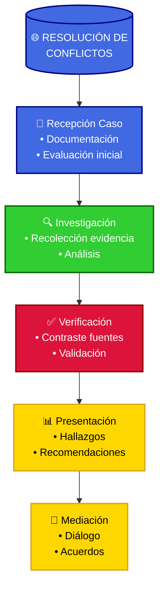

La organización desarrolló metodologías específicas para casos donde la reputación de naciones enteras está en juego, creando espacios para la verdad más allá de las narrativas oficiales confrontadas.

**Abordaje de Acusaciones Transnacionales**:

```conflictos_interestatales
```investigacion_internacional
[Nota: El marco de investigación internacional se ha consolidado en las secciones previas sobre justicia global]
```

2. Principios de investigación equilibrada:
   - Equipos multinacionales con diversidad cultural
   - Consulta con expertos de ambas naciones involucradas
   - Metodología transparente comunicada previamente
   - Escrutinio riguroso de todas las fuentes de información
   - Presentación equilibrada de hallazgos y contextos
   - Derecho de respuesta garantizado a todas las partes
```

**Estudios de Caso: Mediación de Conflictos Reputacionales entre Naciones**:

##### CASO A: El Incidente del Puerto de Tokio

```caso_puerto
SITUACIÓN INICIAL:
La policía metropolitana de Tokio detectó una sustancia tóxica en el puerto que afectó a cientos de personas. Las investigaciones preliminares apuntaban a un barco sospechoso de la Organización de Negro, pero el caso se complicó cuando se descubrió que Kaito Kid también estaba investigando el incidente por su cuenta.

ABORDAJE TRUTHSEEKERS:
1. Investigación científica independiente:
   - Equipos multinacionales de hidrólogos y toxicólogos
   - Muestreo extensivo a lo largo de toda la cuenca
   - Análisis en laboratorios de terceros países
   - Modelado de flujos y contaminación histórica

2. Contextualización compleja:
   - Documentación de prácticas industriales en ambos países
   - Análisis de regulaciones ambientales y su cumplimiento
   - Historial de accidentes industriales no reportados
   - Evaluación de factores naturales y antropogénicos

3. Mediación basada en evidencia:
   - Presentación simultánea de hallazgos a ambos gobiernos
   - Sesiones técnicas con expertos de ambas naciones
   - Foros ciudadanos transfronterizos con afectados
   - Publicación transparente de todos los datos brutos

RESULTADOS:
La investigación reveló una realidad más compleja: contaminación proveniente principalmente de prácticas industriales no reguladas en ambos lados de la frontera, exacerbada por negligencia regulatoria mutua y complicada por factores geológicos naturales. La evidencia científica irrefutable permitió desescalar la crisis diplomática, establecer un programa conjunto de remediación, y crear un observatorio permanente binacional para monitoreo ambiental.
```

##### CASO B: La Conspiración del APTX

```caso_conspiracion
SITUACIÓN INICIAL:
El FBI descubrió que el APTX 4869 estaba siendo distribuido globalmente bajo diferentes nombres. Mientras la Organización de Negro negaba su participación, Conan y Haibara encontraron evidencia de una red internacional de laboratorios clandestinos. El caso requería la cooperación entre FBI, CIA e INTERPOL, cada uno con sus propias agendas.

ABORDAJE TRUTHSEEKERS:
1. Documentación rigurosa desde múltiples fuentes:
   - Entrevistas con refugiados en países limítrofes
   - Análisis de imágenes satelitales temporales
   - Verificación forense digital de videos filtrados
   - Triangulación de testimonios con evidencia material
   - Colaboración con organizaciones médicas internacionales

2. Análisis legal y contextual:
   - Evaluación de eventos según criterios jurídicos internacionales
   - Contextualización histórica del conflicto étnico
   - Análisis de legislación nacional relevante
   - Documentación de patrones sistemáticos vs. incidentes aislados

3. Enfoque diplomático multifacético:
   - Presentación de hallazgos a mediadores respetados por País C
   - Invitación a autoridades para revisar metodología y evidencia
   - Separación clara entre responsabilidad institucional y nacional
   - Propuestas concretas de medidas de rendición de cuentas y reconciliación

RESULTADOS:
A través de la presentación de evidencia irrefutable pero matizada, se logró que observadores independientes aceptables para todas las partes accedieran a la región. El informe Truthseekers, que distinguía entre violaciones sistemáticas y la responsabilidad selectiva de unidades específicas (no del país entero), abrió espacio para un reconocimiento gradual de responsabilidades, reformas institucionales, y el establecimiento de un proceso de justicia transicional que evitó el aislamiento internacional completo del País C mientras aseguraba justicia para las víctimas.
```

**Estrategias para Restauración de Confianza Internacional**:

| Fase                       | Objetivos                       | Metodologías                             |
| -------------------------- | ------------------------------- | ---------------------------------------- |
| Verificación de hechos     | Establecer base fáctica común   | Investigación multinacional transparente |
| Contextualización          | Comprender factores subyacentes | Análisis histórico y estructural         |
| Atribución responsable     | Identificar actores específicos | Análisis forense de cadenas de mando     |
| Espacios de diálogo        | Facilitar reconocimiento mutuo  | Conferencias Track II con garantías      |
| Reconciliación estructural | Prevenir recurrencia            | Mecanismos de supervisión internacional  |

**Marco para Justicia entre Naciones**:

```justicia_internacional
1. Principios del Detective Conan:
   - "Solo existe una verdad" - Shinichi Kudo
   - Observación meticulosa de cada detalle
   - Protección de testigos e inocentes
   - Justicia por encima de venganza
   - Colaboración entre detectives y policía

2. Métodos de resolución:
   - Deducción lógica paso a paso
   - Recopilación de pruebas científicas
   - Interrogatorios estratégicos
   - Cooperación entre agencias
   - Verificación de coartadas y evidencias

3. Articulación con sistemas formales:
   - Complementariedad con tribunales internacionales
   - Apoyo técnico a comisiones de verdad binacionales
   - Asesoría para reformas legales preventivas
   - Facilitación de acuerdos bilaterales de cooperación
   - Monitoreo independiente de implementación de acuerdos
```

#### 13.15 La Red Global de Defensores de la Verdad: Uniendo Sistemas Formales e Informales

El modelo Truthseekers propone una visión donde sistemas judiciales oficiales y redes ciudadanas de verificación colaboran en un ecosistema global de transparencia y justicia.

**Red de Investigación Detective Conan**:

```red_detectivesca
1. Niveles de cooperación:
   - Local: Liga Juvenil de Detectives y grupos escolares
   - Regional: Policía metropolitana y detectives privados
   - Nacional: Red de oficinas del FBI y CIA en Japón
   - Internacional: Cooperación FBI-CIA-INTERPOL

2. Sistema de trabajo:
   - Pistas iniciales → Investigación Conan → Deducción final
   - Métodos del FBI → Adaptación local → Entrenamiento
   - Alertas de la Liga Juvenil → Respuesta policial
   - Inventos del Prof. Agasa → Uso en campo → Mejoras
```

**Alianzas Detectivescas Globales**:

| Iniciativa                     | Descripción                                          | Impacto                                    |
| ----------------------------- | --------------------------------------------------- | ------------------------------------------ |
| Red de Detectives Juveniles   | Conexión global de jóvenes investigadores como Conan | Resolución colaborativa de casos           |
| Alianza FBI-CIA-INTERPOL      | Coordinación entre agencias contra la Org. de Negro  | Operaciones internacionales efectivas      |
| Liga de Detectives Privados   | Colaboración entre Kogoro, Heiji y otros detectives  | Intercambio de información y recursos      |
| Programa de Protección        | Sistema para proteger testigos e informantes         | Seguridad para quienes exponen la verdad   |
| Academia Global Beika         | Entrenamiento internacional de nuevos detectives     | Nueva generación de investigadores         |

##### Mensaje Final: El Legado del Detective del Siglo

```legado_shinichi
Como siempre dice Shinichi Kudo, "Solo existe una verdad". Esta frase no es solo un lema, es una filosofía que guía a cada detective que sigue sus pasos. Ya sea un caso pequeño en la escuela Teitan o una conspiración internacional de la Organización de Negro, los principios son los mismos: observación meticulosa, deducción lógica y el coraje para enfrentar la verdad.

La Liga de Detectives que comenzó como un grupo de niños siguiendo a Conan se ha convertido en un movimiento global. Detectives de todo el mundo, desde el FBI hasta la policía metropolitana, trabajan juntos siguiendo el método Conan. Porque al final, como demostró Shinichi, no importa lo complejo que sea el caso o lo poderoso que sea el culpable, la verdad siempre saldrá a la luz.
```

> "Resolver un caso entre personas es difícil, entre organizaciones es complejo, pero entre naciones es el desafío definitivo. Sin embargo, los principios fundamentales no cambian: observación precisa, deducción rigurosa, y el valor para enfrentar la verdad sin importar las consecuencias. Como siempre diría Shinichi Kudo: 'No existen casos imposibles, solo investigadores que se rinden demasiado pronto'."
> — Manual Internacional Truthseekers, Capítulo sobre Diplomacia y Justicia Global.

---
⋆ ⋅ ⋆ ✦ ⋆ ⋅ ⋆

**Consejo Final del Detective**:
*"Como en cada caso que Conan resuelve, recuerda que el fan art más valioso no es el que solo imita la forma, sino el que captura el espíritu. La verdadera esencia de Detective Conan está en cómo usa la deducción y la verdad para proteger a otros. Al crear fan art, pregúntate: ¿Qué haría Shinichi en esta situación? ¿Cómo conectaría las pistas? ¿Qué verdad intentaría proteger?"*

⋆ ⋅ ⋆ ✦ ⋆ ⋆ ✦ ⋆ ⋅ ⋆

🎵 *Ending Theme: El Corazón de un Detective* 🎵
