# 🛡️ ¡DEFIENDE TUS DERECHOS COMO CONSUMIDOR! Tu guía para luchar contra empresas abusivas

> 🎮 **Para entenderlo fácil:** Imagina que esto es como un videojuego donde tú eres el héroe que debe defenderse de empresas que intentan engañarte. ¡Esta guía te dará los superpoderes que necesitas para protegerte!

> 📝 **Nota para padres:** Esta guía usa ejemplos sencillos y analogías divertidas para que los niños también puedan entender sus derechos como consumidores. Cada sección incluye explicaciones adaptadas a diferentes niveles de comprensión.

## 🎯 ¿De qué trata esta guía?

Aprenderás:

- 🛡️ Cómo protegerte cuando compras cosas, especialmente por internet
- 📱 Trucos para documentar cuando una empresa intenta engañarte
- 👥 Cómo unirte a otros para defenderte mejor
- 📚 Tus derechos básicos como consumidor explicados de forma simple

## 🎮 EL JUEGO ESTÁ TRUCADO: Por qué es difícil defenderse


> 🎲 **Como en los juegos:** Imagina que estás jugando contra alguien que conoce todos los trucos secretos del juego, tiene el manual completo y además puede cambiar las reglas cuando quiere. ¡Así se siente comprar en internet hoy!

### 5 Razones Por Las Que Es Difícil Defenderte

#### 1. 📚 Ellos Tienen un Ejército de Abogados, Tú No

- **Lo que pasa**: Las empresas tienen equipos enteros de abogados que escriben contratos súper complicados
- **Ejemplo**: Es como si te dieran a firmar un libro de 100 páginas para comprarte unos zapatos por internet
- **Consejo práctico**: Busca las palabras clave importantes y no tengas miedo de preguntar qué significa algo

#### 2. 🏃‍♂️ Te Cansan Con Trámites Infinitos

- **El truco**: Hacen que reclamar sea tan complicado que terminas rindiéndote
- **Ejemplo real**: Te hacen llamar 20 veces, cada vez hablas con alguien diferente y tienes que explicarlo todo de nuevo
- **Cómo defenderte**: Documenta todo y no te rindas - ¡más adelante te enseñaremos cómo!

#### 3. 🌍 Se Esconden En Otros Países

- **El problema**: Compras algo a una empresa de otro país y cuando hay problemas... ¡puf! Desaparecen
- **Consejo**: Siempre verifica dónde está realmente la empresa antes de comprar
- **Truco pro**: Busca si tienen dirección física en España o la UE

#### 4. 📱 Todo Es Digital y No Hay Alternativa

- **La trampa**: Cada vez más servicios solo funcionan por apps o internet
- **Ejemplo**: Bancos que ya no tienen oficinas y te obligan a usar su app
- **Qué hacer**: Aprende tus derechos digitales (¡te los explicaremos!)

#### 5. 🏃‍♀️ Van Más Rápido Que Las Leyes

- **El problema**: Inventan nuevas formas de engañar más rápido de lo que se crean leyes para protegerte
- **Ejemplo**: Cuando por fin hay una ley contra un tipo de estafa, ya han inventado tres nuevas
- **La solución**: ¡Mantenerte informado y alerta! Por eso existe esta guía 😉

> 🎮 **Nota para niños:** Es como cuando un jugador hace trampas en un videojuego. La diferencia es que aquí te enseñaremos cómo defenderte y ganar de forma justa.

## 🦸‍♂️ TUS SUPERPODERES DE CONSUMIDOR: Lo Que Necesitas Saber

> 🎮 **Como en los videojuegos:** Antes de empezar una aventura, necesitas conocer tus poderes y habilidades. ¡Aquí están los tuyos!

### 🎯 Tres Poderes Básicos que Ya Tienes


#### 1. 📜 El Poder de la Ley

- **Qué es**: Las leyes te protegen aunque no lo sepas
- **Ejemplo simple**: Como cuando el árbitro te protege en un partido aunque no conozcas todas las reglas
- **Dato importante**: En España y Europa tienes más derechos como consumidor que en muchos otros lugares

#### 2. 👥 El Poder del Grupo

- **Qué es**: No estás solo - hay asociaciones y grupos que te ayudan
- **Ejemplo práctico**: Es como cuando varios amigos se unen en un juego para vencer a un jefe final difícil
- **Consejo**: ¡Únete a otros consumidores que tengan el mismo problema!

#### 3. 📱 El Poder de la Tecnología

- **Qué es**: Ahora puedes grabar, documentar y compartir pruebas fácilmente
- **Ejemplo**: Como hacer una captura de pantalla cuando ves algo sospechoso
- **Truco pro**: Aprende a guardar todo lo importante (¡te enseñaremos cómo!)

### 🎓 Lo Que Los Expertos Han Descubierto

> 🧩 **Para niños:** Imagina que son como científicos que estudian cómo protegernos mejor de las trampas.

- **Descubrimiento 1**: Las empresas tienen más miedo a perder su reputación que a pagar multas

  - _Ejemplo_: Si todo el mundo se entera de que engañan, pierden más clientes que dinero

- **Descubrimiento 2**: Unidos somos más fuertes que solos

  - _Ejemplo_: Cuando muchos consumidores se quejan juntos, las empresas reaccionan más rápido

- **Descubrimiento 3**: La mejor defensa es estar informado
  - _Ejemplo_: Como en un juego, conocer los trucos del enemigo te hace más fuerte

### 🎯 Lo Más Importante que Debes Recordar

1. **Tienes más derechos de los que crees**
2. **No estás solo en esta lucha**
3. **La tecnología puede ser tu aliada**
4. **Documentar todo es tu mejor defensa**

> 🎮 **Consejo para niños:** Es como guardar la partida en un videojuego - ¡siempre guarda pruebas de todo lo importante!

## 🦹‍♂️ TRUCOS MALVADOS: Cómo Algunas Empresas Intentan Engañarte


> 🎮 **Como en los videojuegos:** Igual que los villanos tienen sus tácticas especiales, algunas empresas usan trucos para cansarte y que te rindas. ¡Pero conocerlos es el primer paso para vencerlos!

### 🎭 Los 6 Trucos Más Sucios (¡y Cómo Defenderte!)

#### 1. 😨 El Truco del Miedo

- **Qué hacen**: Te amenazan con meterte en "listas negras" si reclamas
- **Ejemplo**: "Si no pagas esta factura que está mal, te meteremos en la lista de morosos"
- **Tu defensa**: ¡No te asustes! Si tu reclamación es legítima, tienen prohibido hacer esto
- **Tu poder**: Guarda sus amenazas por escrito - ¡se volverán contra ellos!

#### 2. 🌀 El Laberinto Sin Fin

- **Qué hacen**: Te hacen dar vueltas y más vueltas con papeles y trámites
- **Ejemplo**: Te piden 20 documentos diferentes y cuando los consigues... ¡te piden más!
- **Tu defensa**: Documenta cada paso y pide todo por escrito
- **Consejo pro**: Usa nuestra guía de documentación (más adelante)

#### 3. 🔍 La Letra Microscópica

- **Qué hacen**: Esconden cosas importantes en textos larguísimos y complicados
- **Ejemplo**: La parte que dice cuánto pagarás realmente está en letra diminuta al final
- **Tu defensa**: Usa nuestro "detector de trampas en contratos" (te lo explicamos después)

#### 4. 🤥 Las Promesas Falsas

- **Qué hacen**: Te prometen soluciones rápidas que nunca llegan
- **Ejemplo**: "En 24 horas lo arreglamos" (y pasan semanas)
- **Tu defensa**: Guarda todas las promesas por escrito y pon fechas límite

#### 5. ⏳ El Agotamiento

- **Qué hacen**: Alargan tanto el proceso que esperan que te canses y abandones
- **Ejemplo**: Te hacen llamar 100 veces hasta que te rindes
- **Tu defensa**: ¡No te rindas! Usa nuestro "sistema de seguimiento de reclamaciones"

#### 6. 🤖 El Robot Infinito

- **Qué hacen**: Crean sistemas de atención al cliente imposibles de usar
- **Ejemplo**: Te hacen hablar con robots que no entienden nada y nunca te pasan con personas reales
- **Tu defensa**: Aprende los trucos para llegar a humanos reales (te los contamos más adelante)

> 📝 **Nota para niños:** Es como cuando un villano en un juego usa trucos sucios para ganar. ¡Pero si conoces sus trucos, puedes vencerlo!

### 🛡️ Tu Escudo Anti-Trucos

1. **Documenta todo**: Guarda capturas de pantalla, graba llamadas (avisando), guarda emails
2. **No actúes solo**: Únete a otros que tengan el mismo problema
3. **Aprende tus derechos**: Conocer las reglas te hace más fuerte
4. **Ten paciencia**: A veces ganar lleva tiempo, ¡pero vale la pena!

> 🎯 **Recuerda**: Ningún truco puede vencerte si conoces tus derechos y no te rindes

## 🎮 TU KIT DE HERRAMIENTAS: ¡Prepárate para la Acción!


> 🎮 **Como en los videojuegos:** Todo héroe necesita su equipo especial. ¡Aquí tienes las herramientas que te ayudarán a defenderte!

### 1. 📱 Tu Arsenal Digital: La App del Consumidor Inteligente

#### ¿Qué es?

Es como tener un detective privado en tu teléfono que te ayuda a:

- 📸 Hacer fotos y videos que sirven como prueba legal
- ⚠️ Recibir alertas cuando una empresa hace algo malo
- 🤝 Conectar con otros que tienen el mismo problema
- ✍️ Hacer reclamaciones fácilmente

#### Cómo usarla

1. **Guarda pruebas**: Toma fotos de todo lo importante
2. **Activa alertas**: Te avisamos si hay peligro
3. **Únete a otros**: Encuentra gente con tu mismo problema
4. **Reclama fácil**: Con solo unos clics

> 🎯 **Para niños:** ¡Es como tu libro de misiones especiales donde guardas pistas y pruebas!

### 2. ⚖️ Tus Derechos Más Importantes: ¡Conócelos!


> 🎮 **Como en los videojuegos:** Son como tus poderes especiales. ¡Entre más los conoces, más fuerte eres!

#### Tus 5 Superpoderes Legales 💪

1. **El Poder del Arrepentimiento** 🔄

   - **Qué es**: Puedes devolver casi cualquier cosa comprada online en 14 días
   - **Ejemplo**: Compraste unos zapatos que no te gustan - ¡Puedes devolverlos!
   - **Excepción**: No funciona con cosas personalizadas para ti

2. **El Escudo Anti-Mentiras** 🛡️

   - **Qué es**: Si te prometieron algo en un anuncio, ¡tienen que cumplirlo!
   - **Ejemplo**: Si un juego dice "gratis" pero luego cobra, están violando tu derecho
   - **Tu poder**: Ellos tienen que probar que no mintieron (¡no tú!)

3. **El Poder de la Garantía** 🔧

   - **Qué es**: Todo lo que compras tiene garantía de 2 años mínimo
   - **Ejemplo**: Si tu tablet se rompe sin ser tu culpa, deben repararla gratis
   - **Consejo**: Guarda siempre el ticket de compra

4. **El Escudo Anti-Sorpresas** ⚡

   - **Qué es**: No pueden cobrarte cosas que no aceptaste claramente
   - **Ejemplo**: Si te suscriben a un servicio de trading sin avisarte claramente, es ilegal
   - **Defensa**: Guarda capturas de pantalla de los precios y condiciones

5. **El Poder de la Justicia Rápida** ⚡
   - **Qué es**: Hay tribunales especiales para consumidores que son más rápidos
   - **Ejemplo**: Problemas con compras de menos de 3.000€
   - **Ventaja**: No necesitas abogado para muchos casos

> 📝 **Nota para niños:** Es como tener un libro de hechizos mágicos - ¡cada derecho es un poder diferente que puedes usar!

#### Consejos Pro para Usar tus Poderes 🎯

1. **Guarda Todo** 📸

   - Tickets, emails, capturas de pantalla
   - Fotos de productos defectuosos
   - Grabaciones de llamadas (avisando que grabas)

2. **Actúa Rápido** ⚡

   - No esperes para reclamar
   - Cuanto antes actúes, más fácil es ganar

3. **Usa las Palabras Mágicas** 🗣️
   - "Quiero poner una reclamación formal"
   - "Necesito la hoja de reclamaciones"
   - "Según la Ley de Consumidores..."

### 3. 👥 ¡Unidos Somos Más Fuertes!: Tu Equipo de Superhéroes


> 🦸‍♂️ **Como Los Vengadores:** Igual que los superhéroes se unen para vencer amenazas más grandes, ¡los consumidores somos más fuertes cuando trabajamos juntos!

#### ¿Por Qué Unirse a Otros? 🤝

1. **Más Poder** 💪

   - Las empresas hacen más caso cuando son muchos reclamando
   - Las soluciones llegan 4 veces más rápido
   - ¡8 de cada 10 casos se ganan cuando vamos juntos!

2. **Menos Gastos** 💰

   - Compartir los costos de abogados
   - Dividir gastos de documentación
   - Más recursos para defender tus derechos

3. **Más Conocimiento** 🧠
   - Aprender de la experiencia de otros
   - Compartir trucos y consejos
   - Descubrir qué ha funcionado antes

#### Cómo Unirte a la Liga de Consumidores 🦸‍♀️

1. **Encuentra tu Equipo**

   - Busca asociaciones de consumidores cerca de ti
   - Únete a grupos en redes sociales
   - Contacta con otros afectados por el mismo problema

2. **Comparte Información**

   - Documenta tu caso
   - Comparte pruebas importantes
   - Aprende de otros casos similares

3. **Actúa en Equipo**
   - Haced reclamaciones juntos
   - Compartid los gastos
   - Presionad unidos por vuestros derechos

> 🎮 **Para niños:** ¡Es como formar un equipo en un juego! Cada uno tiene sus habilidades especiales y juntos sois más fuertes.

#### Reglas Para ser un Buen Compañero de Equipo 🌟

1. **Comparte pero con Cuidado** 📝

   - Solo información importante
   - Respeta la privacidad de otros
   - Verifica antes de compartir

2. **Sé Paciente** ⏳

   - Los casos pueden llevar tiempo
   - Cada victoria suma
   - El trabajo en equipo requiere paciencia

3. **Mantén el Ánimo** 💪
   - Celebra las pequeñas victorias
   - Apoya a tus compañeros
   - No te rindas, ¡juntos podéis!

> 🎯 **Consejo Pro:** Busca asociaciones de consumidores serias y con experiencia. ¡Te sorprenderá lo mucho que pueden ayudarte!

### 4. 🎓 ¡Aprende a Defenderte!: Tu Academia de Superhéroe Consumidor


> 🎮 **Como en los videojuegos:** Antes de enfrentarte a los jefes finales, necesitas entrenar y subir de nivel. ¡Esta es tu academia de entrenamiento!

#### 🎯 Mini-Juegos para Practicar tus Poderes

1. **El Simulador de Estafas** 🕹️

   - **Qué es**: Juegos interactivos que te enseñan a detectar engaños
   - **Cómo jugar**: Te presentamos situaciones reales y tú decides qué hacer
   - **Ejemplo**: "¡Has ganado un iPhone gratis! ¿Qué haces?"
   - **Recompensa**: ¡Aprende a detectar estafas sin arriesgar nada!

2. **Casos Resueltos: Aprende de Otros** 📚

   - **Qué es**: Biblioteca de casos reales con sus soluciones
   - **Cómo usar**: Lee casos parecidos al tuyo y aprende qué funcionó
   - **Ejemplo**: "Cómo recuperar tu dinero cuando un servicio cierra inesperadamente"
   - **Bonus**: ¡Trucos y consejos de gente que ya ganó!

3. **El Detector de Trampas** 🔍
   - **Qué es**: Aprende a leer la letra pequeña y encontrar trucos ocultos
   - **Cómo entrenar**: Practica con contratos reales señalando las trampas
   - **Ejemplo**: Encuentra las cláusulas abusivas en contratos de telefonía
   - **Power-up**: ¡Desarrolla visión de rayos X para la letra pequeña!

#### 🏆 Tu Plan de Entrenamiento

1. **Nivel Principiante** 🌱

   - Aprende tus derechos básicos
   - Practica cómo hacer una reclamación simple
   - Descubre dónde pedir ayuda

2. **Nivel Intermedio** 🌟

   - Detecta cláusulas abusivas
   - Documenta problemas correctamente
   - Usa las palabras correctas en reclamaciones

3. **Nivel Experto** 💫
   - Coordina acciones colectivas
   - Maneja casos complejos
   - Ayuda a otros consumidores

> 📝 **Para niños:** ¡Es como una escuela de superhéroes donde aprendes a protegerte y ayudar a otros!

#### 🎮 Misiones Diarias para Practicar

1. **Misión "Ojo de Águila"** 👁️

   - Revisa un ticket de compra buscando errores
   - Comprueba los precios en diferentes tiendas
   - Lee la letra pequeña de algo que uses

2. **Misión "Documentalista"** 📸

   - Practica haciendo fotos de prueba
   - Guarda un email importante
   - Organiza tus documentos importantes

3. **Misión "Defensor"** 🛡️
   - Ayuda a alguien a entender sus derechos
   - Comparte un consejo útil
   - Únete a un grupo de consumidores

> 🌟 **Recuerda**: ¡Cada vez que aprendes algo nuevo te haces más fuerte contra los engaños!

### 5. 🔍 El Radar Anti-Trampas: Tu Sistema de Alerta Temprana


> 🎮 **Como en los videojuegos:** ¡Es tu radar que detecta peligros antes de que te afecten! Como cuando el juego te avisa que hay enemigos cerca.

#### 🚨 Tu Sistema de Alerta Temprana

1. **El Mapa del Peligro** 🗺️

   - **Qué es**: Un mapa que muestra dónde están ocurriendo estafas y engaños
   - **Cómo funciona**: La gente reporta problemas y el mapa se actualiza
   - **Para qué sirve**: ¡Para que no caigas donde otros ya cayeron!
   - **Ejemplo**: "Cuidado con la tienda X, están cobrando de más"

2. **El Detector de Nuevos Trucos** 🎯

   - **Qué hacemos**: Investigamos nuevas formas de engaño
   - **Por qué**: Para avisarte antes de que te afecten
   - **Ejemplo real**: Descubrimos estafas en apps 14 meses antes que las autoridades
   - **Tu beneficio**: ¡Estarás protegido contra las últimas trampas!

3. **El Ranking de la Verdad** ⭐
   - **Qué es**: Lista de empresas según cómo tratan a sus clientes
   - **Cómo ayuda**: Sabrás en quién puedes confiar
   - **Ejemplo**: "Esta empresa tiene 5 estrellas en trato al cliente"
   - **Tu poder**: Elegir las mejores empresas y evitar las problemáticas

#### 🕵️‍♂️ Cómo Ayudar al Radar

1. **Reporta Problemas** 📱

   - Si ves algo raro, ¡avisa!
   - Usa la app para hacer reportes
   - Comparte pruebas si las tienes

2. **Verifica Información** ✅

   - Confirma si otros tienen el mismo problema
   - Comparte tu experiencia
   - Ayuda a actualizar el mapa

3. **Mantente Alerta** 👀
   - Activa las notificaciones de la app
   - Lee los informes mensuales
   - Comparte alertas con amigos y familia

> 🎯 **Para niños:** ¡Es como ser parte de un equipo de espías buenos que protegen a todos de las trampas!

#### 🏆 Logros que Puedes Desbloquear

- 🥉 **Detective Novato**: Haz tu primer reporte
- 🥈 **Investigador Avanzado**: Ayuda a confirmar 5 casos
- 🥇 **Protector Maestro**: Ayuda a prevenir una estafa grande
- 💫 **Héroe del Consumidor**: Tus alertas han ayudado a 100 personas

> 💪 **Recuerda**: ¡Cada reporte que haces ayuda a proteger a otros consumidores!

### 6. 📝 El Detector de Letra Pequeña: ¡Encuentra las Trampas Ocultas!


> 🎮 **Como en los videojuegos:** Es tu detector de trampas ocultas, ¡como cuando usas un objeto especial para ver cosas invisibles!

#### 🔍 La Guía Anti-Trampas por Sectores

##### 🏦 Bancos y Tarjetas

- **Trampas Típicas**:
  - Cláusulas suelo (te ponen un mínimo en la hipoteca aunque bajen los intereses)
  - Comisiones sorpresa que "aparecen" de la nada
  - Intereses abusivos en tarjetas de crédito
- **Tus Derechos**:
  - No pueden cobrarte por servicios que no pediste
  - Los intereses tienen un límite legal
  - Deben explicarte todo en lenguaje claro

##### 🏠 Alquiler y Vivienda

- **Trampas Comunes**:
  - Te hacen pagar por cosas que debe pagar el dueño
  - Penalizaciones enormes por terminar el contrato
  - Comisiones de agencia injustas
- **Tus Defensas**:
  - La fianza máxima legal es de 2 meses
  - Las reparaciones grandes son responsabilidad del dueño
  - Puedes terminar el contrato avisando con un mes

##### 💳 Créditos Rápidos

- **¡ZONA DE PELIGRO!** 🚨
  - Intereses altísimos escondidos
  - Letras pequeñas que te atan
  - Penalizaciones brutales
- **Cómo Protegerte**:
  - Lee SIEMPRE la TAE (el interés real)
  - Nunca firmes sin entender todo
  - Busca alternativas más seguras

##### 🌐 Servicios Online

- **Trucos Digitales**:
  - Suscripciones que se renuevan solas
  - No te dejan cancelar fácilmente
  - Cambian las condiciones sin avisar
- **Tus Poderes**:
  - Derecho a cancelar compras online en 14 días
  - Deben avisarte de renovaciones automáticas
  - Tienes que poder cancelar tan fácil como te suscribiste

#### 🎯 Cómo Usar el Detector

1. **Antes de Firmar** ✍️

   - Usa nuestra lista de verificación
   - Busca las palabras clave sospechosas
   - Si algo no entiendes, ¡pregunta!

2. **Si Encuentras una Trampa** ⚠️

   - Marca la cláusula sospechosa
   - Compárala con nuestra base de datos
   - Pide asesoramiento si tienes dudas

3. **Comparte tus Descubrimientos** 🗣️
   - Ayuda a otros reportando trampas nuevas
   - Actualiza nuestra base de datos
   - Advierte a amigos y familia

> 🎯 **Para niños:** ¡Es como buscar tesoros, pero al revés! En vez de buscar cosas buenas, buscas las trampas para evitarlas.

#### 💪 Tus Armas Contra la Letra Pequeña

1. **El Resaltador Mágico** 🌈

   - Marca todo lo que no entiendas
   - Resalta cifras y porcentajes
   - Señala palabras sospechosas

2. **La Lista de Comprobación** ✅

   - Verifica cada punto importante
   - No firmes hasta completar la lista
   - Guarda copias de todo

3. **El Traductor de "Legalés"** 📚
   - Usa nuestro diccionario simple
   - Convierte términos complejos en palabras claras
   - Entiende qué significa realmente cada cláusula

> ⭐ **Consejo Pro:** Si algo parece demasiado bueno para ser verdad o demasiado complicado de entender, ¡probablemente hay una trampa!

## 🖼️ VISUALIZACIONES REQUERIDAS

### Diagrama conceptual: Sistema Integral de Protección al Consumidor

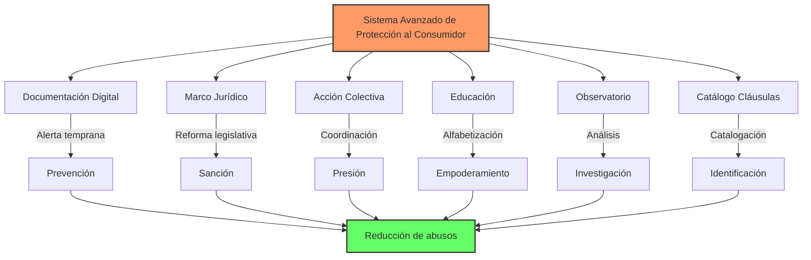

- Representación visual de las interconexiones entre los seis componentes principales
- Flujos de información entre sistemas de documentación, marcos jurídicos y redes de acción
- Niveles de intervención desde la prevención hasta la sanción

### Tabla comparativa: Efectividad de Mecanismos de Protección

| Mecanismo                               | Tiempo medio resolución | Tasa éxito | Costo para consumidor  | Impacto sistémico |
| --------------------------------------- | ----------------------- | ---------- | ---------------------- | ----------------- |
| **Reclamación individual tradicional**  | 6-12 meses              | 35%        | Alto (tiempo/recursos) | Bajo              |
| **Reclamación individual documentada**  | 3-6 meses               | 52%        | Medio                  | Bajo-Medio        |
| **Acción colectiva tradicional**        | 12-24 meses             | 47%        | Medio                  | Medio             |
| **Acción colectiva coordinada digital** | 4-8 meses               | 68%        | Bajo                   | Alto              |
| **Sistema arbitral tradicional**        | 2-5 meses               | 71%        | Bajo                   | Bajo              |
| **Sistema arbitral digital**            | 1-2 meses               | 79%        | Muy bajo               | Medio             |
| **Procedimiento judicial**              | 18-36 meses             | 55%        | Muy alto               | Medio-Alto        |
| **Presión mediática coordinada**        | 1-3 meses               | 63%        | Bajo                   | Alto              |

- Análisis comparativo de tiempo de resolución, tasa de éxito y costo para el consumidor
- Contraste entre reclamaciones individuales vs. colectivas
- Diferencias entre sistemas regulatorios tradicionales y propuestas avanzadas

### Flujograma de decisión: Estrategia Óptima ante Abusos Comerciales

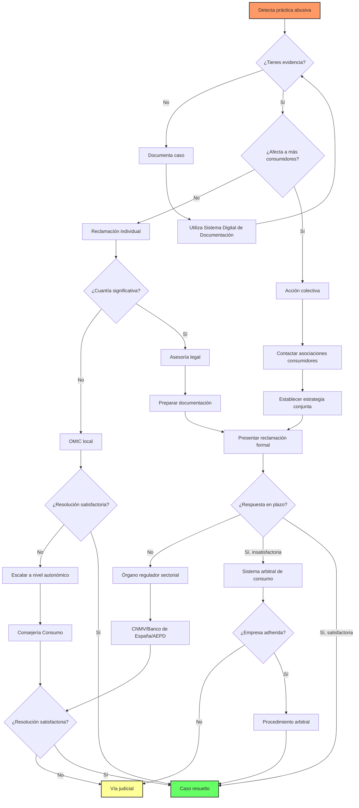

- Árbol de decisión para determinar la mejor vía de acción según tipo de abuso
- Puntos de ramificación basados en evidencia disponible, marco legal aplicable y recursos
- Integración de plazos legales y probabilidades de éxito en cada ruta

### Tabla de Cláusulas Abusivas más Comunes en Entornos Digitales

| Tipo de Cláusula                 | Descripción                                                                     | Impacto en el Consumidor                                 | Base Legal para Impugnación |
| -------------------------------- | ------------------------------------------------------------------------------- | -------------------------------------------------------- | --------------------------- |
| Modificación unilateral          | Permite al proveedor cambiar calidad o precio sin notificación adecuada         | Obliga a aceptar cambios incluso si disminuye la calidad | Art. 85.3 RDL 1/2007        |
| Exclusión de responsabilidad     | Exime al proveedor de responsabilidad por incumplimiento o falta de conformidad | Consumidor sin recurso ante servicio deficiente          | Art. 86.2 RDL 1/2007        |
| Limitación de reembolsos         | Restringe derechos de devolución o resolución en servicios digitales            | Atrapamiento con servicio de baja calidad                | Dir. 2019/2161 UE           |
| Sumisión a tribunales distantes  | Impone jurisdicción lejana al domicilio del consumidor                          | Barrera práctica para ejercer derechos                   | Art. 90.2 RDL 1/2007        |
| Renuncia a desistimiento         | Elimina derecho de desistimiento mediante casillas pre-marcadas                 | Imposibilidad de cancelar tras descubrir incumplimientos | Art. 102 RDL 1/2007         |
| Penalizaciones desproporcionadas | Establece multas excesivas por incumplimientos menores                          | Intimidación económica para evitar reclamaciones         | Art. 85.6 RDL 1/2007        |

## 🎮 ¡TABLA DE PUNTUACIONES!: Midiendo Nuestro Éxito


> 🎮 **Como en los videojuegos:** ¡Igual que los juegos tienen puntuaciones y logros, nosotros también medimos qué tan bien lo estamos haciendo!

### 🏆 Nuestros Récords a Batir

#### 1. 🕒 Velocidad de Resolución

- **La Meta**: ¡Resolver problemas en la mitad de tiempo!
- **Récord Actual**: De 6 meses a solo 3 meses
- **Tu Beneficio**: Recuperas tu dinero mucho más rápido
- **Medalla**: 🥇 "Velocista del Consumidor"

#### 2. 💪 Victorias para el Consumidor

- **La Meta**: ¡7 de cada 10 casos ganados!
- **Progreso**: Ya vamos por 6 de cada 10
- **Tu Beneficio**: Más probabilidades de ganar tu caso
- **Medalla**: 🏆 "Campeón del Consumidor"

#### 3. 🎯 Empresas que Aprenden la Lección

- **La Meta**: Que el 65% no vuelva a hacer trampas
- **Cómo Vamos**: Ya conseguimos que el 50% mejore
- **Tu Beneficio**: Menos problemas en el futuro
- **Medalla**: 🎯 "Educador de Empresas"

#### 4. ⚡ Detector de Problemas

- **La Meta**: Detectar el 80% de las trampas antes de que afecten a mucha gente
- **Estado**: Ya detectamos el 60%
- **Tu Beneficio**: Menos personas engañadas
- **Medalla**: 🔍 "Detective Maestro"

### 📊 Tabla de Clasificación

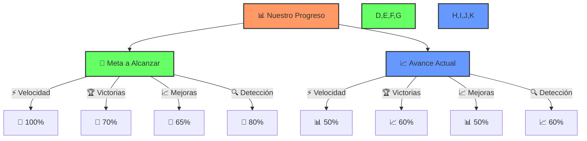

**🎯 Comparación de Avances:**

- 💪 **Meta Final**: Los objetivos que queremos alcanzar
- 📊 **Situación Actual**: Dónde estamos ahora

> 🎯 **Para niños:** Es como cuando en un juego tienes una barra de progreso y ves cuánto te falta para el siguiente nivel.

### 🌟 Nuevos Récords que Queremos Conseguir

1. **Reclamaciones más Fáciles** 🎮

   - Que cualquiera pueda reclamar sin complicaciones
   - Como máximo 3 pasos para hacer una reclamación
   - Todo desde el móvil en menos de 5 minutos

2. **Castigos Justos** ⚖️

   - Que las multas sean proporcionales al daño causado
   - Empresas grandes = multas grandes
   - Empresas pequeñas = multas adaptadas

3. **Consumidores Felices** 😊
   - 9 de cada 10 personas satisfechas con el proceso
   - Sistema fácil de usar para todas las edades
   - Ayuda disponible cuando la necesites

> 💫 **Recuerda**: ¡Cada vez que usas tus derechos ayudas a mejorar estas puntuaciones!

## 🎒 TU MOCHILA DE AVENTURERO: ¡Herramientas y Recursos!


> 🎮 **Como en los videojuegos:** Todo buen héroe necesita su equipo y recursos. ¡Aquí está tu inventario completo!

### 🔧 Tus Herramientas Digitales

#### 1. 📱 Apps Imprescindibles

- **Capturador Mágico** 📸

  - Hace fotos que valen como prueba legal
  - Guarda conversaciones importantes
  - Sella documentos con fecha y hora oficial

- **Unidos Somos Más** 👥

  - Conecta con otros consumidores
  - Organiza acciones conjuntas
  - Comparte experiencias y consejos

- **Detector de Trampas** 🔍

  - Analiza contratos automáticamente
  - Te avisa de cláusulas sospechosas
  - Compara precios y condiciones

- **Simulador de Reclamaciones** 🎮
  - Practica cómo reclamar
  - Aprende de casos reales
  - Prepárate antes de enfrentar problemas

### 📚 Biblioteca del Consumidor Inteligente

#### Para Principiantes 🌱

- "Guía Básica de Supervivencia Digital"
- "Tus Derechos Explicados con Memes"
- "Manual del Pequeño Consumidor"

#### Para Aventureros Intermedios 🌟

- "Trucos y Tácticas de Defensa"
- "Historias de Éxito: Consumidores que Ganaron"
- "La Guía Definitiva de Reclamaciones"

#### Para Héroes Expertos 💫

- "Estrategias Avanzadas de Protección"
- "Psicología de la Manipulación Comercial"
- "Manual de Tácticas Colectivas"

### 🏆 Casos de Victoria

> 🎯 **Para niños:** Son como las historias de otros héroes que ya ganaron sus batallas. ¡Aprende de ellos!

1. **La Gran Victoria de los Estudiantes** 📚

   - Cómo 1000 estudiantes recuperaron su dinero de una academia online
   - Qué tácticas usaron
   - Lecciones aprendidas

2. **Los Vikingos que Cambiaron el Sistema** ⚔️

   - Cómo los países nórdicos crearon el mejor sistema de protección
   - Qué podemos copiar
   - Por qué funciona tan bien

3. **El Poder de los Tribunales Especiales** ⚖️

   - Cómo España creó tribunales solo para consumidores
   - Por qué ahora es más fácil ganar
   - Resultados increíbles en 5 años

4. **La Revolución Australiana** 🦘
   - Cómo Australia cambió las reglas del juego
   - Por qué ahora las empresas tienen que probar que no mienten
   - Resultados sorprendentes

> 💪 **Consejo Pro:** Usa estos recursos como tu "libro de hechizos" - ¡cuantos más conozcas, más fuerte serás!

## 🏆 HISTORIAS DE GRANDES VICTORIAS: ¡Aprende de los Héroes!


> 🎮 **Como en los videojuegos:** Estas son las historias de las batallas más épicas contra los jefes finales. ¡Aprende sus estrategias para vencer!

### 🏰 La Gran Batalla de las Hipotecas: David contra Goliat

#### La Historia 📖

- **Cuándo pasó**: 2013-2020
- **Los villanos**: Bancos que escondían trampas en las hipotecas
- **Los héroes**: Miles de familias españolas y ADICAE
- **El botín recuperado**: ¡2,500 millones de euros devueltos a la gente!

#### La Trampa del Banco 🕸️

- Escondieron "cláusulas suelo" en la letra pequeña
- No dejaban que la gente pagara menos cuando bajaban los intereses
- Mucha gente pagaba cientos de euros de más cada mes

#### ¡El Equipo de Héroes al Rescate! 🦸‍♂️

- ADICAE reunió a más de 15,000 personas afectadas
- Lucharon juntos como un gran equipo
- Usaron la prensa para contar su historia
- Llegaron hasta los tribunales más importantes

#### La Victoria Final 🏆

- Los jueces les dieron la razón
- Los bancos tuvieron que devolver el dinero
- ¡Miles de familias recuperaron sus ahorros!

#### 🎯 Lecciones para Recordar

1. **El Poder de las Pruebas** 📸

   - Guarda todo: papeles, emails, fotos
   - Documenta cada conversación
   - Las pruebas son tu mejor arma

2. **Unidos Somos Más Fuertes** 🤝

   - Únete a otros afectados
   - Comparte gastos de abogados
   - Haz más ruido juntos

3. **Usa Todos los Recursos** 🛠️
   - Tribunales españoles
   - Tribunales europeos
   - Medios de comunicación
   - Redes sociales

> 🎮 **Para niños:** Es como cuando en un juego necesitas juntar a muchos jugadores para vencer a un jefe muy difícil. ¡Unidos son más fuertes!

### 🌟 La App Mágica de los Vikingos: ¡El Arma Secreta de Noruega!


> 🎮 **Como en los videojuegos:** ¡Los noruegos crearon una app tan poderosa como un objeto legendario! Con ella, los consumidores tienen superpoderes para defenderse.

#### La Historia 📱

- **Cuándo**: 2019
- **Dónde**: Noruega (¡tierra de vikingos!)
- **Qué crearon**: Una super app llamada "Forbrukerportalen"
- **Para qué**: Defender a los consumidores con tecnología

#### ¿Qué Hace esta App Mágica? ✨

1. **Detector de Trampas** 🔍

   - Toma fotos con valor legal
   - Graba conversaciones importantes
   - Guarda pruebas en la nube

2. **Cerebro Robot** 🤖

   - Usa inteligencia artificial
   - Encuentra patrones de engaño
   - Avisa antes de que engañen a más gente

3. **Sistema de Alerta** ⚡

   - Conecta con las autoridades
   - Actúa súper rápido
   - Detiene a las empresas malas

4. **Red de Héroes** 👥
   - Une a todos los consumidores
   - Comprueban denuncias juntos
   - Se ayudan entre todos

#### ¡Los Resultados son Increíbles! 🏆

- **Velocidad** ⚡: Resuelven problemas 64% más rápido
- **Victoria** 🎯: 78% más casos ganados
- **Aprendizaje** 📚: Las empresas malas aprenden la lección
- **Prevención** 🛡️: Detectan trampas casi un año antes

#### ¿Podemos Tener Esto en España? 🇪🇸

¡Claro que sí! Podemos:

- Usar la misma tecnología
- Adaptarla a nuestras leyes
- Hacerla incluso mejor

> 🎯 **Para niños:** ¡Es como si los vikingos modernos hubieran creado un escudo mágico que todos podemos usar para protegernos!

### 🦘 La Revolución Australiana: ¡Cuando las Empresas Tienen que Probar que No Mienten!


> 🎮 **Como en los videojuegos:** ¡Australia cambió las reglas del juego! Ahora son las empresas las que tienen que demostrar que dicen la verdad, ¡no tú demostrar que mienten!

#### La Gran Idea Australiana 💡

- **Cuándo**: 2021
- **Qué hicieron**: Cambiaron la ley para proteger mejor a la gente
- **El cambio**: Las empresas tienen que probar que sus anuncios son verdad
- **Por qué es genial**: ¡Ya no tienes que ser tú quien demuestre que te engañaron!

#### ¿Cómo Funciona? 🎯

1. **Antes** ❌
   - Tú: "¡Me engañaron!"
   - Empresa: "Pruébalo"
   - Tú: _Tienes que buscar mil pruebas_
2. **Ahora** ✅
   - Tú: "Esto parece engañoso"
   - Empresa: "¡Ups! Ahora nosotros tenemos que probar que es verdad"
   - Tú: _Te relajas mientras ellos sudan_

#### ¡Los Resultados son Increíbles! 🌟

- **Más Victorias** 🏆: 86% más casos ganados por consumidores
- **Más Rápido** ⚡: 70% menos tiempo para resolver problemas
- **Menos Mentiras** 📉: 54% menos anuncios engañosos
- **Mejor Publicidad** 📱: Las empresas son más honestas

#### ¿Podemos Hacerlo en España? 🇪🇸

¡Sí se puede! Solo necesitamos:

- Actualizar algunas leyes
- Convencer a los políticos
- Mostrarles que funciona

> 🎯 **Para niños:** Es como si en un juego cambiaran las reglas y ahora los "malos" tuvieran que demostrar que no están haciendo trampas, ¡en vez de que tú tengas que pillarlos!

#### Consejo Pro 💪

Si ves publicidad que parece demasiado buena para ser verdad:

1. Guarda capturas de pantalla
2. Pide todo por escrito
3. Pregunta: "¿Pueden demostrar que esto es cierto?"

> 🦘 **Dato curioso**: En Australia, si una empresa no puede probar que su publicidad es verdadera, ¡tiene que pagar multas enormes!

## 🎮 ¡COMBOS ESPECIALES!: Uniendo Tus Poderes


> 🎮 **Como en los videojuegos:** ¡Al combinar diferentes poderes creamos ataques especiales más poderosos! Aquí aprenderás los mejores combos.

### 🌟 Combos Secretos Para Ganar

#### 1. 🔄 El Combo Detector de Villanos

- **Qué combinas**:
  - Técnicas para detectar políticos mentirosos
  - Trucos para descubrir empresas tramposas
- **Resultado**: ¡Super poder para detectar cualquier tipo de engaño!

> 🎯 **Para niños:** Es como cuando en un juego combinas fuego y hielo para crear un ataque más poderoso.

#### 2. 🚀 La Secuencia Ganadora

1. **Nivel 1**: Aprende a documentar todo 📸

   - Guarda pruebas
   - Haz fotos y videos
   - Guarda conversaciones

2. **Nivel 2**: Aprende tus derechos 📚

   - Estudia las leyes básicas
   - Practica con ejemplos
   - Comparte lo que aprendes

3. **Nivel 3**: Únete a otros héroes 👥

   - Forma equipos
   - Comparte información
   - Lucha juntos

4. **Nivel Final**: ¡Cambia las reglas! ⚖️
   - Propón mejores leyes
   - Muestra las pruebas que reuniste
   - ¡Haz historia!

#### 3. 🌈 Super Combos Especiales

1. **El Combo Detectivesco** 🔍

   - App de documentación + Red de consumidores
   - Resultado: ¡Detectas trampas súper rápido!

2. **El Combo Invencible** 💪
   - Leyes nuevas + Observatorio de trampas
   - Resultado: ¡Las empresas tienen miedo de hacer trampas!

> 🎮 **Consejo Pro:** Como en los videojuegos, practica estos combos hasta que te salgan naturalmente. ¡Cuanto más los uses, más poderosos serán!

### 🌟 ¿Por Qué Funcionan Estos Combos?

1. **Son Más Fuertes Unidos** 💪

   - Cada poder refuerza a los otros
   - Los villanos no pueden defenderse de todos a la vez
   - El efecto total es mayor que la suma de las partes

2. **Se Protegen Entre Sí** 🛡️
   - Si un poder falla, los otros te cubren
   - Creas una defensa perfecta
   - ¡Es como tener varios escudos a la vez!

> 🎯 **Recuerda**: ¡Los mejores héroes siempre combinan sus poderes para ganar!

## ⚠️ ¡CUIDADO!: Los Trucos del Enemigo

> 🎮 **Como en los videojuegos:** Todo héroe necesita conocer los ataques especiales de los jefes finales y sus puntos débiles. ¡Aquí están los trucos que usan contra nosotros!

### 🦹‍♂️ Los Contraataques de los Villanos

#### 1. 🎭 El Truco del Camaleón

- **Qué hacen**: Cambian sus trampas para que sean más difíciles de ver
- **Ejemplo**: Dividen una trampa grande en muchas pequeñas
- **Tu defensa**: ¡Mantén los ojos bien abiertos y documenta todo!

#### 2. ⚖️ La Trampa del Cansancio

- **Qué hacen**: Te llevan a juicios largos y caros para agotarte
- **Ejemplo**: Te hacen gastar dinero en abogados hasta que te rindes
- **Tu defensa**: ¡Únete a otros y comparte los gastos!

#### 3. 📰 La Niebla de las Mentiras

- **Qué hacen**: Publican noticias falsas sobre los sistemas de defensa
- **Ejemplo**: Dicen que las apps de consumidores no funcionan
- **Tu defensa**: ¡Comparte tus historias de éxito!

#### 4. 🎩 El Lobby Oscuro

- **Qué hacen**: Intentan cambiar las leyes a su favor
- **Ejemplo**: Pagan a políticos para debilitar las protecciones
- **Tu defensa**: ¡Mantente informado y protesta!

### 🚧 Nuestros Puntos Débiles (¡A Mejorar!)

1. **La Diferencia de Poder** 💰

   - Ellos: Mucho dinero y abogados
   - Nosotros: Recursos limitados
   - Solución: ¡Unirse y compartir recursos!

2. **El Problema Global** 🌍

   - Ellos: Operan en todo el mundo
   - Nosotros: Leyes solo en nuestro país
   - Solución: ¡Cooperación internacional!

3. **La Dificultad de Organizarse** 👥
   - Ellos: Bien organizados
   - Nosotros: A veces descoordinados
   - Solución: ¡Mejor comunicación y apps!

### 📜 Reglas Importantes a Recordar

1. **Sigue las Leyes** ⚖️

   - No difames sin pruebas
   - Respeta los procesos legales
   - Documenta todo correctamente

2. **Sé Estratégico** 🎯
   - Elige bien tus batallas
   - Guarda energía para lo importante
   - Aprende de cada victoria y derrota

> 🎮 **Para niños:** Es como aprender los patrones de ataque de un jefe final. ¡Cuando conoces sus trucos, es más fácil vencerlos!

### 💪 Recuerda Siempre

1. **No Te Desanimes** 🌟

   - Los villanos parecen fuertes
   - Pero unidos somos más fuertes
   - ¡Cada pequeña victoria cuenta!

2. **Aprende y Mejora** 📚
   - Cada derrota te hace más sabio
   - Comparte lo que aprendes
   - ¡Ayuda a otros a no caer en las mismas trampas!

### Tipología de la Vulnerabilidad del Consumidor

- **👵 Vulnerabilidad demográfica**: Personas mayores, jóvenes, migrantes y otros grupos que enfrentan barreras específicas para entender términos complejos o ejercer sus derechos

- **📚 Vulnerabilidad informacional**: Consumidores con acceso limitado a información clara o capacidad reducida para procesarla debido a asimetrías informativas o tecnicismos deliberados

- **💰 Vulnerabilidad económica**: Personas con recursos limitados que no pueden costear procesos legales prolongados o servicios de asesoramiento jurídico profesional

- **🔄 Vulnerabilidad situacional**: Consumidores que, debido a circunstancias temporales (emergencias, necesidades urgentes), toman decisiones bajo presión y con menos posibilidades de evaluación

- **🖥️ Vulnerabilidad digital**: Personas con limitaciones en competencias digitales que enfrentan dificultades adicionales en entornos de comercio electrónico y contratación online

## 🇪🇸 TU GUÍA DE BATALLA PARA ESPAÑA: ¡Conoce tu Terreno!

> 🎮 **Como en los videojuegos:** ¡Cada país tiene sus propias reglas y poderes especiales! Aquí están los que funcionan en España.

### 🛡️ Tus Escudos Legales

#### 1. La Constitución: Tu Escudo Más Poderoso 📜

- **Qué dice**: ¡El gobierno DEBE proteger a los consumidores!
- **Dónde está**: Artículo 51
- **Tu poder**: Puedes exigir que te protejan, ¡es tu derecho!

#### 2. La Super Ley de Consumidores 📚

- **Nombre oficial**: Real Decreto 1/2007
- **Qué hace**: Te protege en todas tus compras
- **Cómo usarla**: ¡Menciona esta ley cuando reclames!

#### 3. El Escudo Europeo 🇪🇺

- **Qué es**: Leyes extra que vienen de Europa
- **Ventaja**: ¡Son más fuertes que las leyes españolas!
- **Bonus**: Funcionan en toda la Unión Europea

### 🦸‍♂️ Tus Aliados: ¡El Equipo de Ayuda!

#### 1. La Base Central 🏰

**Dirección General de Consumo**

- Como el cuartel general de los superhéroes
- Crean las estrategias principales
- Coordinan la defensa en toda España

#### 2. Las Bases Regionales 🏠

**Consejerías de Consumo**

- Como bases locales de superhéroes
- Una en cada comunidad autónoma
- ¡Conocen los problemas de tu zona!

#### 3. Tus Aliados más Cercanos 🏢

**Oficinas OMIC**

- Como pequeños cuarteles en tu ciudad
- Primera línea de ayuda
- ¡Están cerca de ti para ayudarte!

#### 4. Los Jueces Rápidos ⚖️

**Sistema Arbitral de Consumo**

- Resuelven problemas más rápido que los tribunales
- No necesitas abogado
- ¡Es gratis!

#### 5. La Conexión Internacional 🌍

**Centro Europeo del Consumidor**

- Para problemas con empresas de otros países
- Te ayudan en varios idiomas
- ¡Conexión con toda Europa!

> 🎯 **Para niños:** Es como tener varios equipos de superhéroes, cada uno con sus poderes especiales, ¡listos para ayudarte!

### 🎮 Tu Arsenal de Herramientas Españolas

> 🎮 **Como en los videojuegos:** ¡Aquí están tus armas especiales para luchar en España! Cada una tiene sus propios poderes.

#### 1. 📝 La Hoja de Reclamaciones: ¡Tu Arma Básica!

- **Qué es**: Tu primera arma contra las injusticias
- **Dónde conseguirla**: ¡TODOS los negocios DEBEN tenerla!
- **Cómo usarla**:
  1. Pídela si hay problemas
  2. Rellénala clara y tranquilamente
  3. Guarda tu copia
  4. ¡La empresa está obligada a responder!

#### 2. 🛑 El Botón de STOP: Acciones de Cesación

- **Qué es**: Para hacer que una empresa pare sus malas prácticas
- **Cuándo usarlo**: Cuando afecta a mucha gente
- **Power-up**: ¡Puede parar a empresas grandes!

#### 3. 👥 El Poder de la Unión: Acciones Colectivas

- **Qué es**: ¡Luchas junto a otros afectados!
- **Ventajas**:
  - Más fuerza
  - Menos gastos
  - Más atención

#### 4. 🔍 La CNMV: Tu Radar Financiero

- **Qué es**: Policía especial para temas de dinero
- **Especialidad**: Vigila bancos y criptomonedas
- **Bonus**: ¡Controla hasta a los influencers que hablan de inversiones!

### 🎯 Tu Plan de Batalla en España

#### 1. 📸 Documenta Todo Como un Pro

- Usa apps de certificación digital
- Guarda capturas de pantalla
- Graba conversaciones (avisando)

#### 2. 🎯 La Escalera del Éxito

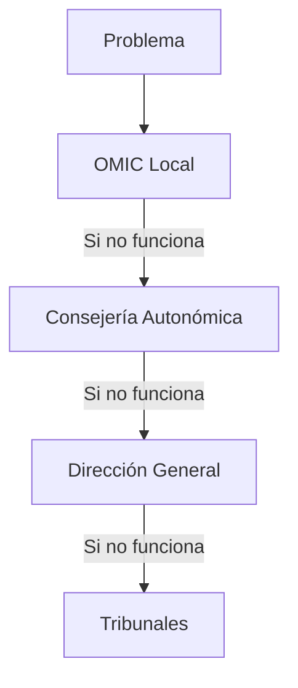

#### 3. 📢 El Megáfono de la Verdad

- Usa redes sociales
- Contacta con periodistas
- Comparte tu historia

#### 4. ✉️ Mensajes con Superpoderes

- Usa burofax para cosas importantes
- Guarda todos los recibos
- Establece plazos claros

#### 5. 🤝 ¡Únete a los Pros!

- FACUA: Expertos en todo tipo de casos
- OCU: Los maestros de los test
- ADICAE: Los especialistas en bancos

> 🎯 **Para niños:** Es como tener diferentes tipos de espadas y escudos. ¡Cada uno sirve para una situación diferente!

### 💡 Consejo Pro

Guarda este orden en tu móvil:

1. Primero intenta en la OMIC
2. Si no funciona, sube un nivel
3. ¡No te rindas hasta ganar!

### Implementación de Procedimientos Ágiles de Reembolso

- **⏰ Plazos máximos obligatorios**: Establecimiento de límites temporales estrictos para la resolución de reclamaciones y devolución de importes en casos de publicidad engañosa o incumplimiento de calidad en servicios digitales

- **🤝 Sistema de mediación independiente**: Creación de un marco de mediación gestionado por organismos independientes que agilice la resolución de disputas sin necesidad de recurrir a procesos judiciales prolongados

- **🚫 Prohibición de ficheros de morosos durante disputas**: Implementación de normativas que impidan a las empresas reportar a consumidores en disputa en ficheros de morosos antes de que se dicte una resolución definitiva

- **📱 Plataformas digitales centralizadas**: Desarrollo de herramientas digitales centralizadas donde los consumidores puedan reportar abusos, compartir experiencias y facilitar la identificación de patrones fraudulentos

- **🔄 Sistema Arbitral de Consumo Digital**: Potenciación del sistema arbitral existente mediante la incorporación de tecnologías que permitan resoluciones rápidas y completamente digitales

### Campañas de Sensibilización y Educación al Consumidor

- **🎓 Iniciativas informativas**: Lanzamiento de campañas educativas que expliquen los derechos del consumidor, cómo identificar cláusulas abusivas y qué procedimientos seguir en caso de sentirse engañado

- **🏫 Formación en centros educativos**: Integración de contenidos sobre derechos del consumidor en el currículo escolar para formar consumidores críticos desde edades tempranas

- **🖥️ Simuladores de situaciones abusivas**: Desarrollo de plataformas interactivas que permitan a los consumidores practicar la identificación de prácticas comerciales desleales en entornos seguros

- **👨‍👩‍👧‍👦 Programas específicos para colectivos vulnerables**: Creación de materiales adaptados para personas mayores, migrantes y otros grupos con mayor riesgo de ser víctimas de prácticas abusivas

- **🏢 Formación para empresarios**: Promoción de programas educativos dirigidos a responsables empresariales sobre prácticas éticas y cumplimiento normativo para fomentar una cultura de respeto al consumidor

## 📣 ¡ES HORA DE ACTUAR!: Tu Llamada a la Aventura

> 🎮 **Como en los videojuegos:** Ha llegado el momento de unir fuerzas y cambiar el mundo. ¡Esta es tu llamada a la aventura!

### 🌟 La Gran Misión: ¡Hacer el Mercado Más Justo!

#### 1. 🎯 Objetivos de la Misión Principal

1. **Empresas Honestas** 🤝

   - Que hablen claro y sin trucos
   - Que cumplan lo que prometen
   - Que respeten a sus clientes

2. **Internet Más Seguro** 💻

   - Sin prácticas engañosas en cursos de trading
   - Sin engaños en apps
   - Sin publicidad mentirosa

3. **Gente Más Feliz** 😊
   - Menos estrés al comprar
   - Más confianza en las tiendas
   - Mejor experiencia para todos

### 🛠️ Plan de Acción: ¡Cómo Cambiar las Cosas!

#### 1. 📜 Mejores Leyes Para Todos

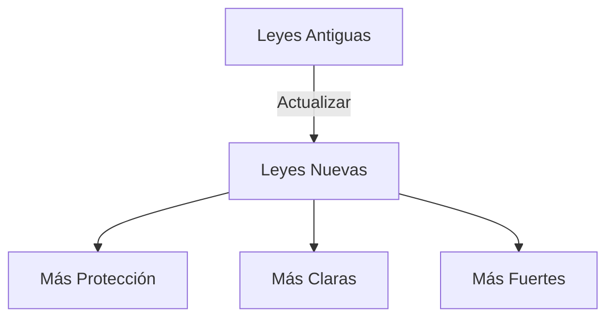

##### Tu Papel en Esto 🦸‍♂️

- Comparte tus experiencias
- Propón mejoras
- ¡Apoya los cambios buenos!

#### 2. 🌍 Unidos Por Un Mundo Mejor

##### Equipo de Superhéroes 👥

- Gobierno
- Asociaciones
- Expertos
- ¡TÚ!

##### La Misión 🎯

- Crear nuevas reglas
- Detener estafas
- Proteger a todos

#### 3. 🎮 ¡Únete al Juego!

##### Cómo Participar

1. **Foros de Héroes** 🗣️

   - Únete a reuniones ciudadanas
   - Comparte tus ideas
   - Propón soluciones

2. **Misiones de Vigilancia** 🕵️

   - Reporta servicios malos
   - Ayuda a otros consumidores
   - Comparte tus victorias

3. **Inventa Nuevas Armas** 🔧
   - Propón nuevas apps
   - Mejora las herramientas existentes
   - ¡Comparte tus trucos!

> 🎯 **Para niños:** ¡Es como crear un equipo de superhéroes donde cada uno tiene un papel importante! Tú también puedes ser parte de este equipo.

### 💪 ¡Tu Poder es Real!

#### Lo Que TÚ Puedes Hacer Hoy:

1. **Comparte Tu Historia** 📢

   - Cuenta tus experiencias
   - Ayuda a otros a no caer en trampas
   - Celebra tus victorias

2. **Únete a Otros** 🤝

   - Encuentra grupos de consumidores
   - Participa en foros
   - Forma equipos de acción

3. **Aprende y Enseña** 📚
   - Estudia tus derechos
   - Comparte lo que sabes
   - Ayuda a los demás

> 🌟 **Recuerda**: ¡Cada pequeña acción cuenta! Como en los videojuegos, los grandes cambios empiezan con pequeños pasos.

### 🎮 CASO REAL: La Trampa de los Cursos Online

> 🎯 **Como en los videojuegos:** Este es como un nivel tutorial que te enseña a identificar trampas reales. ¡Aprende de esta historia para no caer en engaños similares!

#### 📱 La Historia de un Curso de Trading Engañoso

1. **El Gancho Inicial** 🎣

   - Anuncios brillantes en redes sociales
   - Promesas de ganancias rápidas con criptomonedas
   - Supuestos testimonios de éxito
   - Precios "especiales" por tiempo limitado

2. **Las Señales de Alarma** ⚠️

   - No mostraban resultados verificables
   - Presión para comprar rápido
   - Testimonios sin identidades reales
   - Ninguna garantía por escrito

3. **La Trampa Escondida** 🕸️

   - Contenido básico disponible gratis en internet
   - Cobros recurrentes no explicados claramente
   - Dificultad para cancelar suscripciones
   - Sin derecho real a devolución

4. **Cómo se Defendieron los Consumidores** 💪
   - Documentaron todas las promesas publicitarias
   - Guardaron capturas de pantalla de anuncios
   - Se organizaron en grupos de afectados
   - Presentaron reclamaciones coordinadas

#### 🛡️ Lecciones Aprendidas

1. **Señales de Peligro** 🚨

   - Promesas de dinero fácil y rápido
   - Urgencia artificial para comprar
   - Falta de información clara sobre el vendedor
   - Testimonios que no puedes verificar

2. **Tus Derechos** ⚖️

   - Derecho a información clara y veraz
   - Derecho a cancelar servicios digitales
   - Derecho a reclamar publicidad engañosa
   - Derecho a unirte a acciones colectivas

3. **Cómo Protegerte** 🛡️
   - Investiga antes de comprar
   - Guarda todas las pruebas
   - No cedas ante la presión de compra
   - Únete a otros afectados

> 🎯 **Para niños:** Es como cuando en un juego te ofrecen objetos "mágicos" que prometen hacerte súper poderoso al instante. Si suena demasiado bueno para ser verdad, ¡probablemente sea una trampa!

### ⚔️ TU ARSENAL LEGAL: Las Leyes que Te Protegen

> 🎮 **Como en los videojuegos:** ¡Estas son tus armas legendarias para luchar contra las injusticias! Cada ley es como un poder especial que puedes usar.

#### 📜 Tus Armas Más Poderosas

1. **La Constitución: Tu Escudo Supremo** 👑

   - **Artículo 51**: El Estado DEBE proteger a los consumidores
   - **Poder especial**: Ninguna ley puede ir en contra de este derecho
   - **Cómo usarla**: "Según la Constitución, tengo derecho a..."

2. **Ley General de Consumidores: Tu Espada Principal** ⚔️

   - **Real Decreto 1/2007**: Tu protección diaria
   - **Poderes que te da**:
     - Información clara y verdadera
     - Garantías en productos
     - Derecho a reclamar
     - Compensación por daños

3. **Ley de Publicidad: Tu Detector de Mentiras** 🔍

   - **Ley 34/1988**: Contra la publicidad engañosa
   - **Cuándo usarla**: Si los anuncios mienten o engañan
   - **Poder especial**: Puedes exigir que retiren anuncios falsos

4. **Ley de Competencia Desleal: Tu Látigo contra Tramposos** 🌪️
   - **Ley 3/1991**: Contra prácticas comerciales injustas
   - **Casos que cubre**:
     - Engaños en precios
     - Ofertas falsas
     - Acoso comercial
     - Información confusa

#### 🎯 ¿Cómo Usar tu Arsenal?

1. **Combos Legales Efectivos** 💫

   ```mermaid
   flowchart TD
       A["❌ Detectas un Engaño"] --> B["📜 Identifica la Ley"]
       B --> C["📝 Documenta Todo"]
       C --> D["⚔️ Usa Tus Derechos"]
       D --> E["🤝 Únete a Otros"]

       style A fill:#ff9999,stroke:#ff0000,stroke-width:2px
       style B fill:#99ff99,stroke:#00ff00,stroke-width:2px
       style C fill:#9999ff,stroke:#0000ff,stroke-width:2px
       style D fill:#ffff99,stroke:#ffff00,stroke-width:2px
       style E fill:#ff99ff,stroke:#ff00ff,stroke-width:2px
   ```

2. **Frases Mágicas de Poder** 🗣️
   - "De acuerdo con el artículo 51 de la Constitución..."
   - "Según la Ley General de Consumidores..."
   - "La Ley de Publicidad prohíbe específicamente..."
   - "Esto constituye una práctica desleal según..."

> 🎯 **Para niños:** Es como tener diferentes armas en un juego. ¡Cada ley es un poder especial que puedes usar contra los malos!

#### 🛡️ Recuerda Siempre

- Las leyes son TUS herramientas
- No necesitas ser abogado para usarlas
- Conocerlas te hace más fuerte
- Unidos son aún más efectivas

> 💪 **Consejo Pro:** Guarda capturas de pantalla de este arsenal en tu teléfono. ¡Nunca sabes cuándo necesitarás usar uno de estos poderes!

### 🎮 GUÍA DE MISIONES: Tu Plan de Ataque Paso a Paso

> 🎯 **Como en los videojuegos:** Cada reclamación es como una misión con varios niveles. ¡Sigue la guía para completar tu misión con éxito!

#### 📋 MISIÓN 1: Preparación Inicial

1. **Recolecta Pruebas** 🗃️

   - Fotos del producto defectuoso
   - Capturas de pantalla de anuncios
   - Tickets y facturas
   - Emails y mensajes
   - Grabaciones de llamadas (avisando)

2. **Equípate con Documentos** 📝
   - DNI/NIE
   - Comprobante de compra
   - Garantía del producto
   - Publicidad guardada

#### 🏰 MISIÓN 2: Primera Línea de Ataque

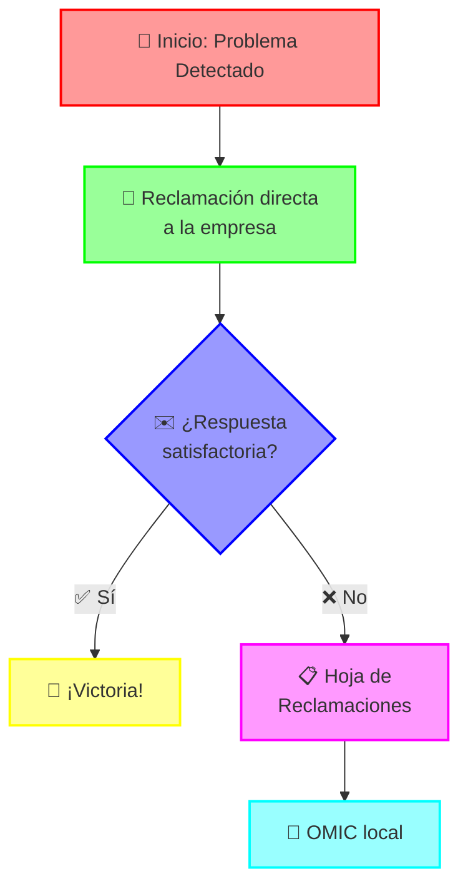

#### 🗼 MISIÓN 3: Escalado Estratégico

1. **Si la OMIC no Resuelve** ⚔️

   - Sube a Consumo Autonómico
   - Usa asociaciones de consumidores
   - Considera el arbitraje de consumo
   - Prepara acción judicial si necesario

2. **Power-Ups Especiales** 🌟
   - **Burofax**: Mensaje con prueba de entrega
   - **Arbitraje**: Juicio rápido y gratuito
   - **Acción colectiva**: Únete a otros afectados

#### 🎯 MISIÓN 4: Ataques Especiales

1. **Casos Financieros** 💰

   - Banco de España
   - CNMV para inversiones
   - Seguros: Dirección General de Seguros

2. **Casos Online** 🌐
   - AEPD para protección de datos
   - Policía si hay estafa
   - Centro Europeo del Consumidor

#### ⭐ TRUCOS PRO

1. **Timing Perfecto** ⏰

   - Reclama inmediatamente
   - Guarda pruebas al momento
   - Respeta plazos legales

2. **Combos Efectivos** 🎯

   - Combina reclamación + redes sociales
   - Une fuerzas con otros afectados
   - Usa varios canales a la vez

3. **Palabras de Poder** 💫
   - "Solicito hoja de reclamaciones"
   - "Exijo respuesta por escrito"
   - "Procederé legalmente si..."

> 🎮 **Para niños:** Es como seguir un mapa del tesoro. ¡Cada paso te acerca más a la victoria!

#### 🏆 RECOMPENSAS POSIBLES

- Devolución del dinero 💰
- Cambio del producto 🎁
- Compensación extra ⭐
- Mejora del servicio 📈

> 🌟 **Consejo Final:** Como en los juegos, la persistencia es clave. ¡No te rindas hasta conseguir justicia!

### 🎮 NIVEL EXTRA: El Consumidor en la Era Digital

> 🕹️ **Como en los videojuegos:** Imagina que antes jugabas en "modo fácil" con tiendas físicas, pero ahora estás en "modo difícil" con servicios digitales llenos de trampas ocultas.

#### 🌐 Los Nuevos Desafíos del Mundo Digital

1. **La Niebla de Guerra Digital** 🌫️

   ```mermaid
   flowchart TD
       A["😕 Consumidor<br>Desorientado"] --> B["📱 Apps Complejas"]
       A --> C["📄 Contratos Largos"]
       A --> D["💻 Servicios Invisibles"]
       A --> E["🤖 Bots de Atención"]

       style A fill:#ff9999,stroke:#ff0000,stroke-width:2px
       style B fill:#99ff99,stroke:#00ff00,stroke-width:2px
       style C fill:#9999ff,stroke:#0000ff,stroke-width:2px
       style D fill:#ffff99,stroke:#ffff00,stroke-width:2px
       style E fill:#ff99ff,stroke:#ff00ff,stroke-width:2px
   ```

2. **Jefes Finales Digitales** 👾

   - **Suscripciones Trampa**: Se renuevan solas sin avisar
   - **Servicios Fantasma**: Pagas por algo que no puedes "tocar"
   - **Laberintos de Cancelación**: Imposible encontrar el botón de "salir"
   - **Robots Sin Alma**: Atención al cliente automatizada que no resuelve nada

3. **Trampas Modernas** 🕸️
   - Cookies que te persiguen
   - Publicidad personalizada manipuladora
   - Precios que cambian según tu perfil
   - Términos y condiciones infinitos

#### 💪 Tus Nuevos Poderes Digitales

1. **Escudo Anti-Tracking** 🛡️

   - Usa navegación privada
   - Activa bloqueadores de anuncios
   - Limpia cookies regularmente
   - Revisa permisos de apps

2. **Detector de Patrones** 🔍

   - Compara precios en diferentes dispositivos
   - Guarda capturas de ofertas
   - Documenta cambios en términos
   - Registra conversaciones con bots

3. **Armas de Defensa Digital** ⚔️
   - Screenshots con fecha y hora
   - Grabaciones de pantalla
   - Backups de conversaciones
   - Archivos PDF de términos y condiciones

#### 🎯 Estrategias de Supervivencia Digital

1. **Antes de Comprar** 📝

   - Lee reviews independientes
   - Busca opiniones reales
   - Verifica la empresa
   - Guarda toda la publicidad

2. **Durante el Servicio** 🔄

   - Documenta todo
   - Haz pruebas de funcionamiento
   - Guarda comprobantes
   - Anota incidencias

3. **Si Hay Problemas** ⚡
   - Actúa rápido
   - Usa múltiples canales
   - Exige hablar con humanos
   - Mantén registros detallados

> 🎮 **Para niños:** Es como jugar en un nivel más difícil, ¡pero tienes nuevos poderes para defenderte!

#### 🌟 Power-Ups Especiales

1. **Modo Detective** 🔍

   - Busca el nombre de la empresa + "problemas"
   - Revisa foros de consumidores
   - Verifica sellos de confianza
   - Investiga dueños reales

2. **Modo Documentalista** 📸
   - Graba procesos de compra
   - Guarda emails de confirmación
   - Captura términos y condiciones
   - Archiva conversaciones de soporte

> 💫 **Recuerda**: En el mundo digital, tus mejores armas son la precaución y la documentación. ¡No dejes que la tecnología te engañe!
### 🎮 MODO EXPERTO: Servicios Digitales y Tus Derechos

> 🕹️ **Como en los videojuegos:** Los servicios digitales son como DLCs (contenido descargable) que a veces vienen con reglas especiales y trampas ocultas. ¡Aprende a identificarlas!

#### 🎯 El Derecho de Desistimiento: Tu Botón de "Deshacer"

1. **Regla General** ✨

   - 14 días para cancelar
   - Sin dar explicaciones
   - Devolución total del dinero
   - Válido para casi todo

2. **¡Cuidado! Zonas Sin Guardar** ⚠️

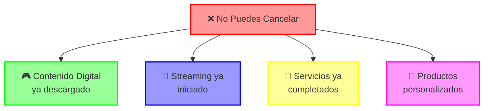

#### 🛡️ Tus Derechos Especiales en Cursos Online

1. **Antes de Contratar** 📝

   - Información clara y veraz del contenido
   - Requisitos técnicos detallados
   - Precio total con todos los cargos
   - Duración real del contrato
   - Condiciones de las prácticas o ejercicios

2. **Durante el Servicio** 🔄

   - Calidad prometida en materiales (audio/vídeo)
   - Tutorías según lo pactado
   - Soporte técnico adecuado
   - Protección de datos personales
   - Accesibilidad a todos los contenidos anunciados

3. **Si Algo Sale Mal** ⚡
   - Derecho a reclamar por incumplimiento
   - Derecho a reembolso por calidad deficiente
   - Compensación por fallos técnicos recurrentes
   - Cancelación sin penalización por publicidad engañosa
   - Protección contra amenazas de inclusión en ficheros de morosos

#### 🎯 Trucos Para No Caer en Trampas de Cursos Online

1. **Antes de Dar al "Play"** 🎮

   ```mermaid
   flowchart LR
       A["🔍 Revisar"] --> B["📝 Capturar"]
       B --> C["💾 Guardar"]
       C --> D["✅ Activar"]

       style A fill:#ff9999,stroke:#ff0000,stroke-width:2px
       style B fill:#99ff99,stroke:#00ff00,stroke-width:2px
       style C fill:#9999ff,stroke:#0000ff,stroke-width:2px
       style D fill:#ffff99,stroke:#ffff00,stroke-width:2px
   ```

   - Lee TODOS los términos y condiciones
   - Captura pantallas de promesas y ofertas
   - Guarda emails de confirmación y bienvenida
   - NO marques casillas sin entender sus implicaciones
   - Verifica que existe un procedimiento claro de cancelación

2. **Power-Ups de Protección en Financiación** 💪
   - Usa tarjetas virtuales para pagos recurrentes
   - Activa alertas de cargo en tu banco
   - Documenta toda la publicidad previa a la compra
   - Guarda emails de confirmación y conversaciones de venta
   - Conoce que las financieras son responsables solidarias

#### 🎯 Casos Comunes y Cómo Defenderte

1. **Cursos con Promesas Exageradas** 🕵️

   - **La trampa**: Te prometen ingresos garantizados o resultados irreales
   - **Tu defensa**: Documenta todas las promesas verbales y escritas
   - **Acción legal**: La publicidad engañosa es sancionable aunque hayas aceptado términos
   - **Ejemplo**: "Ganarás 3000€ al mes tras completar el curso" es una afirmación verificable
   - **Protección**: Graba entrevistas comerciales (avisando) y guarda capturas de publicidad

2. **Servicios de Baja Calidad** 🔍

   - **La trampa**: Materiales deficientes o tutorías inexistentes
   - **Tu defensa**: Documenta con capturas y grabaciones la baja calidad
   - **Acción legal**: El incumplimiento de condiciones anula las restricciones al desistimiento
   - **Paso clave**: Reclama formalmente exigiendo la subsanación inmediata
   - **Protección**: Compara siempre lo prometido con lo recibido

3. **Obstáculos para Cancelar** 🚪

   - **La trampa**: Te redirigen entre departamentos o ignoran solicitudes
   - **Tu defensa**: Comunica por escrito (email, burofax) dentro del plazo legal
   - **Acción legal**: El plazo cuenta desde tu comunicación, no desde su respuesta
   - **Paso clave**: Especifica claramente que ejerces tu "derecho de desistimiento"
   - **Protección**: Guarda pruebas de todas las comunicaciones

4. **Amenazas con Ficheros de Morosos** ⚠️
   - **La trampa**: Te amenazan con inclusión en ficheros de impago si no pagas
   - **Tu defensa**: Las deudas en disputa NO pueden reportarse legalmente
   - **Acción legal**: Puedes denunciar ante la AEPD estas amenazas
   - **Paso clave**: Comunica formalmente que la deuda está en disputa
   - **Protección**: Documentar por escrito todas las amenazas recibidas

> 🎮 **Para niños:** Es como cuando en un juego te ofrecen algo "increíble" pero luego descubres que no funciona como te dijeron. ¡Siempre guarda capturas de pantalla de lo que te prometen!

#### 💡 Consejos Pro para Servicios Digitales

1. **Evaluación Previa** 🔍

   - Busca opiniones en foros no controlados por la empresa
   - Verifica la existencia legal de la empresa (CIF, domicilio)
   - Pregunta por experiencias reales a otros consumidores
   - Comprueba sellos de confianza online verificables
   - Solicita una clase de prueba o periodo gratuito

2. **Documentación Exhaustiva** 📋

   - Crea un email específico para el curso
   - Archiva sistemáticamente toda comunicación
   - Graba demostraciones y tutorías (avisando)
   - Toma notas durante las llamadas comerciales
   - Guarda publicidad y promociones de redes sociales

3. **Defensa Avanzada** ⚔️
   - Conoce que los financiadores del curso son corresponsables
   - Coordínate con otros afectados (¡unidos sois más fuertes!)
   - Utiliza la reclamación ante Consumo como primera acción
   - Prepara un calendario de acciones escalonadas
   - Mantén un registro de daños (tiempo perdido, gastos extra)

> ⭐ **Recuerda**: Con los servicios digitales, especialmente cursos online, la clave está en documentar TODAS las promesas antes de contratar y TODOS los fallos después. Esta documentación será tu mejor arma si necesitas reclamar.

#### 🔄 La Batalla Contra las Academias de Trading Engañosas (Casos típicos y recurrentes)

> 🎮 **Como en los videojuegos:** Este es un jefe final especialmente difícil. Estos cursos suelen tener múltiples "escudos" y "trampas" diseñadas específicamente para evadir reclamaciones.

##### 🚩 Las Señales de Alarma Específicas

1. **Promesas Imposibles de Verificar** 🎯

   - **La trampa**: "Ganarás X% mensual con nuestra estrategia"
   - **La realidad**: El rendimiento pasado no garantiza resultados futuros
   - **Alerta**: Si tuvieran una fórmula infalible, no la venderían en cursos
   - **Defensa**: Pide pruebas auditadas de resultados (raramente las tienen)

2. **El Mito de la Cuenta de Fondeo** 💰

   - **La trampa**: "Te daremos una cuenta con fondos reales para operar"
   - **La realidad**: Suelen tener condiciones casi imposibles de cumplir
   - **Peligro escondido**: Plazos ocultos, reglas cambiantes, demoras en pagos
   - **Defensa**: Exige por escrito las condiciones exactas del fondeo

3. **La Barrera Técnica** 💻

   - **La trampa**: Vídeos de baja calidad donde no se ven bien los gráficos
   - **La excusa**: "Es para proteger nuestro contenido de copias"
   - **El problema real**: Imposibilita validar si el método realmente funciona
   - **Defensa**: Exige una muestra de la calidad real antes de pagar

4. **La Tutoría Fantasma** 👻
   - **La trampa**: "Tendrás un mentor personal profesional"
   - **La realidad**: Tutorías grupales básicas o mensajes automatizados
   - **La técnica**: Siempre están "demasiado ocupados operando en mercados"
   - **Defensa**: Define por escrito la frecuencia y formato de las tutorías

##### ⚖️ Protección Legal Especial en Cursos Financieros

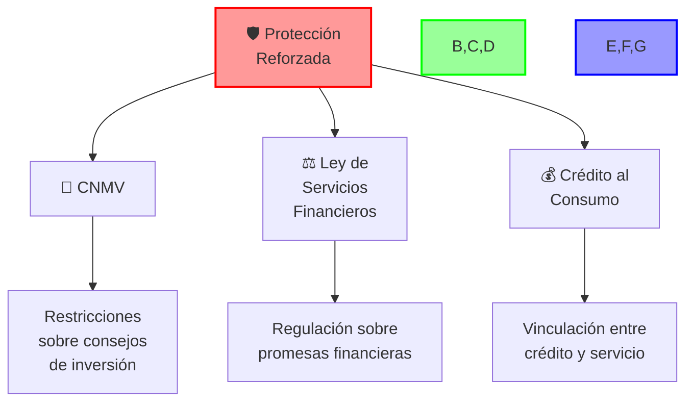

1. **El Escudo de la CNMV** 🛡️

   - Solo entidades reguladas pueden dar asesoramiento de inversión
   - Muchas academias de trading operan sin autorización oficial
   - Si prometen rendimientos específicos sin autorización, están incumpliendo
   - La CNMV mantiene un "listado negro" de entidades no autorizadas

2. **Ley de Crédito al Consumo (Power-Up)** 💳

   - Si financiaste el curso, la entidad financiera es corresponsable
   - Puedes reclamar a ambos (academia y financiadora)
   - En caso de incumplimiento, tienes derecho a suspender pagos
   - La financiera debe devolver lo pagado si el servicio es defectuoso

3. **Blindaje Contra Técnicas de Presión** 🛑
   - Es ilegal usar técnicas de venta agresivas o coercitivas
   - No pueden obligarte a tomar decisiones rápidas ("últimas plazas")
   - Tienen prohibido usar información privilegiada como gancho
   - La presión psicológica puede considerarse vicio del consentimiento

##### 🦸‍♂️ Plan de Acción Específico Para Cursos de Inversión

1. **Documentación Especializada** 📊

   - Graba las sesiones para comprobar si cumplen lo prometido
   - Documenta resultados reales vs. prometidos
   - Captura pantalla de la calidad de los materiales
   - Guarda conversaciones con tutores (frecuencia y calidad)
   - Registra cuánto tiempo tardan en responder consultas

2. **Acciones Contundentes** ⚡

   - Reclama simultáneamente a la academia y financiera
   - Presenta queja ante la CNMV si ofrecen consejos financieros sin autorización
   - Contacta con asociaciones especializadas en fraudes financieros
   - Considera una acción colectiva (suelen tener muchos afectados)
   - Reporta a plataformas publicitarias donde se anuncian

3. **Estrategia Legal Avanzada** ⚖️
   - En estos casos, la reclamación por publicidad engañosa suele ser efectiva
   - Documenta diferencias entre resultados prometidos y reales
   - Si hay financiación, destaca la vinculación entre crédito y servicio
   - Incluye capturas de plataformas donde promocionan el curso con promesas
   - Enfatiza promesas verbales durante el proceso de venta

> 🎮 **Para niños:** Es como un videojuego donde el jefe final usa ilusiones para engañarte. Tu misión es grabar las pruebas del engaño mientras luchas contra él.

##### 💡 Consejos Expertos para Situaciones Reales

1. **En caso de financiación** 💰

   - Comunica por escrito a la financiera el incumplimiento
   - Solicita la suspensión temporal de pagos mientras se resuelve
   - Presenta evidencias del incumplimiento a la financiera
   - Recuerda que la financiera es responsable solidaria por ley
   - Menciona expresamente la vinculación contractual entre el curso y el crédito

2. **Si te amenazan con incluirte en ficheros de morosos** ⚠️

   - Envía burofax indicando que la deuda está en disputa
   - Menciona la prohibición legal de incluir deudas disputadas
   - Advierte que tomarás acciones ante la AEPD si te incluyen
   - Solicita confirmación escrita de que no serás incluido
   - Vigila tu historial crediticio durante los meses siguientes

3. **Para reclamaciones efectivas** 🎯
   - Enfócate en hechos objetivos y comprobables
   - Compara punto por punto lo prometido vs. lo recibido
   - Usa un lenguaje profesional y sin expresiones emocionales
   - Establece un plazo razonable para la respuesta (10-15 días)
   - Detalla exactamente qué compensación solicitas

> ⚖️ **Recuerda**: En cursos de inversión y trading, las promesas específicas de rentabilidad son especialmente graves. Si te garantizaron resultados económicos concretos que no se han cumplido, tienes una base muy sólida para tu reclamación.

### 🌟 MODO HÉROE: Construyendo un Mercado Más Justo

> 🎮 **Como en los videojuegos:** No solo se trata de ganar, sino de cómo juegas. Las empresas también deberían seguir reglas éticas para hacer el juego justo para todos.

#### 🏆 Las Reglas del Juego Limpio

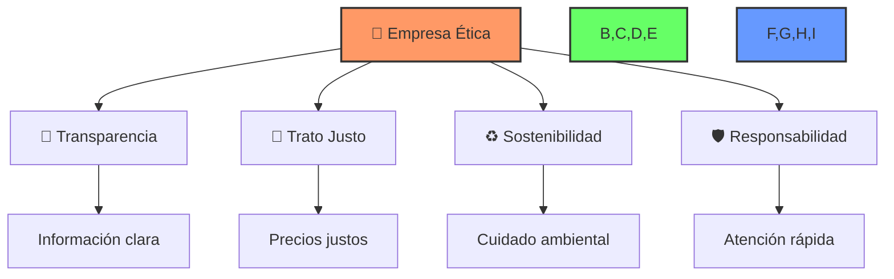

#### 🎯 ¿Cómo Reconocer una Empresa Ética?

1. **Señales Positivas** ✨

   - Información clara y accesible
   - Precios transparentes
   - Atención al cliente real
   - Facilidad para reclamar
   - Admiten errores y los corrigen

2. **Banderas Rojas** ⚠️
   - Letra pequeña escondida
   - Promesas exageradas
   - Presión para comprar
   - Dificultad para cancelar
   - Ignoran reclamaciones

#### 💪 Tu Poder para Cambiar el Mercado

1. **Vota con Tu Cartera** 💰

   - Apoya empresas éticas
   - Evita las que engañan
   - Comparte buenas experiencias
   - Advierte sobre malas prácticas

2. **Sé un Influencer del Bien** 📢
   - Comparte reviews honestas
   - Documenta buenas prácticas
   - Expón malos comportamientos
   - Ayuda a otros consumidores

#### 🌱 Construyendo un Futuro Mejor

1. **Para las Empresas** 📈

   - Más confianza = Más clientes
   - Mejor reputación = Más ventas
   - Menos quejas = Menos costos
   - Clientes felices = Negocio sostenible

2. **Para los Consumidores** 🛡️
   - Más seguridad al comprar
   - Mejor calidad de servicios
   - Menos tiempo perdido
   - Más satisfacción

> 🎯 **Para niños:** Es como cuando todos juegan limpio en el patio de recreo. ¡El juego es más divertido cuando nadie hace trampas!

#### 🌟 Misiones para Héroes del Consumo

1. **Misión Diaria** 📝

   - Evalúa las empresas que usas
   - Comparte experiencias positivas
   - Reporta prácticas injustas
   - Apoya negocios éticos

2. **Misión Semanal** 🔍

   - Investiga nuevas empresas
   - Lee reviews de otros
   - Verifica certificaciones
   - Compara prácticas

3. **Misión Mensual** 🌍
   - Revisa tus suscripciones
   - Evalúa servicios usados
   - Busca alternativas éticas
   - Promueve buenos ejemplos

> 💫 **Recuerda**: Cada vez que eliges una empresa ética, ayudas a crear un mercado más justo para todos. ¡Tu poder como consumidor es real!

### 🏰 LA TORRE DE LAS LEYES: Qué Reglas Mandan Sobre Otras

> 🎮 **Como en los videojuegos:** Imagina una torre donde cada piso es más poderoso que el de abajo. ¡Las leyes funcionan igual! Las de arriba mandan sobre las de abajo.

#### 🏆 La Gran Pirámide Legal

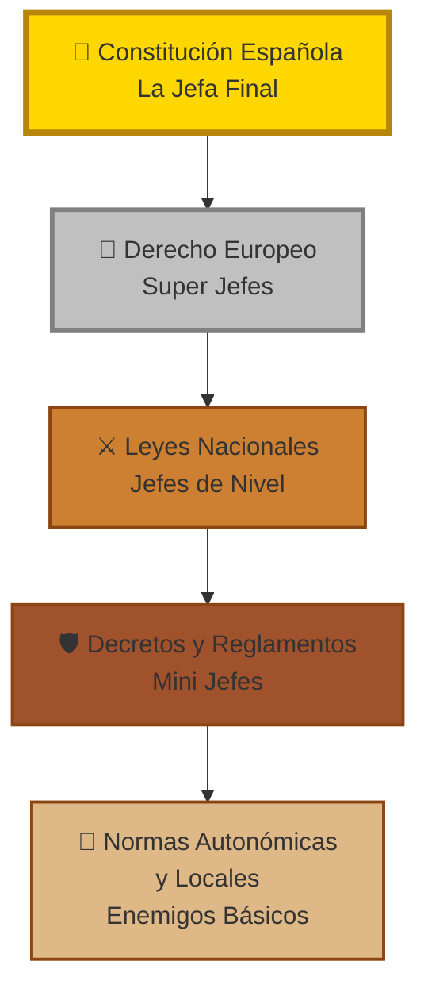

#### 🎯 ¿Cómo Funciona Esta Torre?

1. **Nivel 5: Constitución** 👑

   - La ley más poderosa
   - Nadie puede contradecirla
   - Protege tus derechos básicos
   - Si una ley la contradice, ¡no vale!

2. **Nivel 4: Leyes Europeas** 🌟

   - Mandan sobre leyes españolas
   - Válidas en toda Europa
   - Protegen a consumidores europeos
   - Muy útiles en compras internacionales

3. **Nivel 3: Leyes Nacionales** ⚔️

   - Ley General de Consumidores
   - Ley de Comercio
   - Ley de Servicios Digitales
   - Válidas en toda España

4. **Nivel 2: Decretos y Reglamentos** 🛡️

   - Desarrollan las leyes
   - Dan detalles específicos
   - Explican cómo aplicar las leyes
   - Actualizan normas rápidamente

5. **Nivel 1: Normas Locales** 📜
   - Reglas de tu comunidad
   - Ordenanzas municipales
   - Adaptadas a tu zona
   - Más cercanas pero menos poder

#### 🎮 ¿Cómo Usar Esta Información?

1. **Combos Legales** ⚡

   ```mermaid
   flowchart LR
       A["🔍 Identifica<br>el Problema"] --> B["📚 Busca la<br>Ley Aplicable"]
       B --> C["⚔️ Usa la de<br>Mayor Rango"]
       C --> D["🎯 Aplica el<br>Poder Legal"]

       style A fill:#ff9999,stroke:#ff0000,stroke-width:2px
       style B fill:#99ff99,stroke:#00ff00,stroke-width:2px
       style C fill:#9999ff,stroke:#0000ff,stroke-width:2px
       style D fill:#ffff99,stroke:#ffff00,stroke-width:2px
   ```

2. **Trucos Pro** 💫
   - Si una ley local te perjudica, busca si una superior te protege
   - Las normas europeas suelen ser más protectoras
   - Menciona siempre la ley de mayor rango primero
   - Usa múltiples niveles para fortalecer tu caso

#### 🎯 Ejemplos Prácticos

1. **Compra Online** 🛒

   - Directiva europea de comercio electrónico
   - Ley nacional de servicios digitales
   - Normativa de protección de datos

2. **Tienda Local** 🏪
   - Ley general de consumidores
   - Normativa autonómica de comercio
   - Ordenanzas municipales

> 🎮 **Para niños:** Es como en los juegos donde hay poderes que son más fuertes que otros. ¡Las leyes más importantes ganan siempre!

#### 💪 Power-Up Legal

- **Frase Mágica**: _"De acuerdo con el artículo 51 de la Constitución y la Directiva europea..."_
- **Combo Especial**: _"Según la normativa europea y la ley nacional..."_
- **Ataque Final**: _"Esto viola tanto la Constitución como..."_

> ⭐ **Consejo Pro**: Siempre empieza por la ley más poderosa aplicable a tu caso. ¡Es como usar tu ataque más fuerte primero!

### 🎮 SIGUIENTE NIVEL: Mejorando las Reglas del Juego

> 🕹️ **Como en los videojuegos:** Igual que los juegos necesitan actualizaciones para ser mejores, ¡las leyes también necesitan mejoras! Estas son las actualizaciones que queremos ver.

#### 🌟 La Lista de Mejoras que Necesitamos

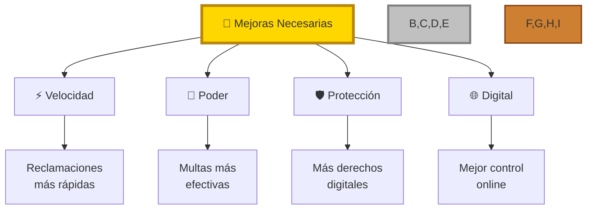

#### 🎯 Las Actualizaciones que Queremos

1. **Patch 1: Velocidad Turbo** ⚡

   - Reclamaciones resueltas en 30 días máximo
   - Procedimiento express para casos claros
   - Sistema online de seguimiento
   - Respuesta inmediata obligatoria

2. **Patch 2: Super Poderes** 💪

   - Multas basadas en % de ingresos
   - Compensación automática por retrasos
   - Derecho a cancelar sin penalización
   - Devolución doble por cobros indebidos

3. **Patch 3: Escudo Digital** 🛡️

   - "Desistimiento condicional" en servicios online
   - Cancelación con un solo clic
   - Prohibición de dark patterns
   - Derecho a hablar con humanos

4. **Patch 4: Control Total** 🎮
   - Verificación obligatoria de publicidad
   - Prohibición de renovaciones automáticas sin aviso
   - Límites a cambios unilaterales
   - Transparencia total en precios

#### 🏆 Los Power-Ups que Merecemos

1. **Nuevos Derechos Digitales** 📱

   - Control total de tus datos
   - Portabilidad de servicios
   - Derecho al olvido digital
   - Explicaciones en lenguaje claro

2. **Súper Defensas** 🛡️
   - Inversión de la carga de la prueba
   - Presunción de buena fe del consumidor
   - Protección especial para vulnerables
   - Defensa colectiva automática

#### 💪 Cómo Ayudar a que Esto Suceda

1. **Misiones Diarias** 📢

   - Comparte estas propuestas
   - Firma peticiones de mejora
   - Reporta casos que las justifiquen
   - Apoya a asociaciones de consumidores

2. **Misiones Especiales** 🌟
   - Escribe a tus representantes
   - Participa en consultas públicas
   - Únete a campañas de mejora
   - Comparte tus experiencias

> 🎮 **Para niños:** Es como cuando los jugadores piden mejoras en un juego para hacerlo más justo y divertido. ¡Nosotros pedimos mejoras en las leyes para hacer un mundo más justo!

#### 🎯 El Futuro que Queremos Ver

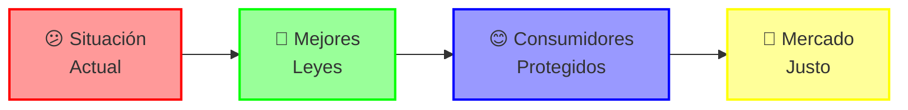

> 💫 **Recuerda**: ¡El cambio empieza con nosotros! Cada vez que alzamos la voz por mejores leyes, estamos más cerca de conseguirlas.

### 🎮 GUÍA DE JEFES FINALES: Tácticas Manipulativas Avanzadas

> 🕹️ **Como en los videojuegos:** Cada jefe final tiene sus patrones de ataque. ¡Aprende a reconocerlos para poder vencerlos!

#### 🎯 Manual de Patrones de Ataque

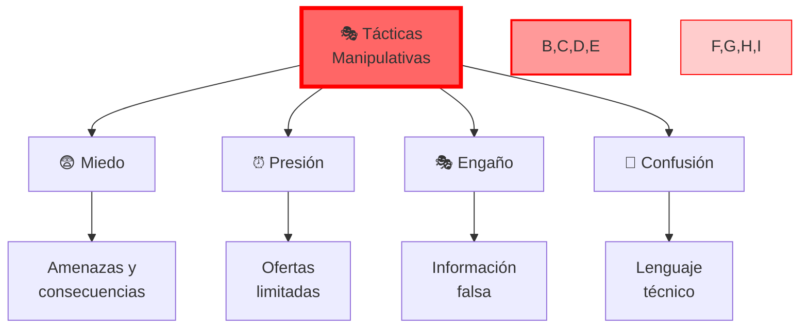

#### 🎯 Catálogo de Ataques y Defensas

1. **Ataque del Miedo** 😨

   - **Táctica**: Amenazar con consecuencias graves
   - **Ejemplo**: "Si no pagas ahora, irás a la lista de morosos"
   - **Defensa**: Conoce tus derechos y no cedas al miedo
   - **Contra-ataque**: "Esa amenaza constituye coacción ilegal"

2. **Ataque de la Prisa** ⏰

   - **Táctica**: "¡Última oportunidad!", "¡Solo hoy!"
   - **Ejemplo**: Cuenta regresiva falsa en la web
   - **Defensa**: Tómate tu tiempo, verifica otras ofertas
   - **Contra-ataque**: Guarda pruebas de la falsa urgencia

3. **Ataque del Espejo** 🪞

   - **Táctica**: "Todo el mundo lo hace", "Es lo normal"
   - **Ejemplo**: "Todos nuestros clientes aceptan esto"
   - **Defensa**: Cuestiona lo "normal", pide justificación
   - **Contra-ataque**: Exige base legal, no costumbres

4. **Ataque del Laberinto** 🌀
   - **Táctica**: Procesos confusos y circulares
   - **Ejemplo**: Botón de cancelar escondido
   - **Defensa**: Documenta cada paso, insiste en claridad
   - **Contra-ataque**: Denuncia dark patterns

#### 💪 Movimientos Especiales de Defensa

1. **El Escudo de Cristal** 📱

   ```mermaid
   flowchart LR
       A["🎥 Grabar"] --> B["📝 Documentar"]
       B --> C["📤 Compartir"]
       C --> D["💪 Actuar"]

       style A fill:#99ff99,stroke:#00ff00,stroke-width:2px
       style B fill:#9999ff,stroke:#0000ff,stroke-width:2px
       style C fill:#ff99ff,stroke:#ff00ff,stroke-width:2px
       style D fill:#ffff99,stroke:#ffff00,stroke-width:2px
   ```

2. **La Defensa Colectiva** 🤝

   - Únete a grupos de afectados
   - Comparte tácticas de defensa
   - Coordina acciones legales
   - Multiplica tu fuerza

3. **El Contra-Ataque Legal** ⚖️
   - Identifica la ley violada
   - Recopila evidencias
   - Presenta reclamación formal
   - Mantén la presión

#### 🎯 Patrones Avanzados de Manipulación

1. **La Trampa del Ancla** ⚓

   - **Táctica**: Mostrar precio alto para hacer parecer otro "barato"
   - **Defensa**: Compara precios en múltiples sitios
   - **Ejemplo**: "Antes 999€, ¡ahora 499€!" (nunca costó 999€)

2. **El Señuelo Falso** 🎣

   - **Táctica**: Producto "agotado" para venderte otro más caro
   - **Defensa**: Verifica disponibilidad en otros sitios
   - **Ejemplo**: "Ese modelo no está, pero tenemos este mejor..."

3. **La Culpa Invertida** 🔄
   - **Táctica**: Hacer sentir al cliente culpable por reclamar
   - **Defensa**: Mantén firme tu derecho a reclamar
   - **Ejemplo**: "Estás perjudicando a nuestros empleados..."

> 🎮 **Para niños:** Es como aprender los movimientos de los jefes finales en un juego. ¡Una vez que los conoces, son más fáciles de vencer!

#### 💫 Power-Up Final: Tu Lista de Comprobación

1. **Antes del Ataque** ✅

   - Investiga la empresa
   - Documenta todo
   - Conoce tus derechos
   - Prepara tus defensas

2. **Durante el Ataque** ⚔️

   - Mantén la calma
   - Graba todo
   - No cedas a presiones
   - Pide todo por escrito

3. **Después del Ataque** 🛡️
   - Reporta el incidente
   - Comparte tu experiencia
   - Ayuda a otros
   - Mejora tus defensas

> ⭐ **Recuerda**: Conocer sus tácticas es el primer paso para vencerlas. ¡Cada vez que expones una manipulación, ayudas a otros a defenderse!

### 🏰 JEFES FINALES Y SECRETOS: La Gran Liga de Monopolios

> 🎮 **Como en los videojuegos:** ¡Has llegado al nivel final! Aquí están todos los jefes que debes vencer, tanto los visibles como los ocultos.

#### 🗺️ El Gran Mapa de Poder

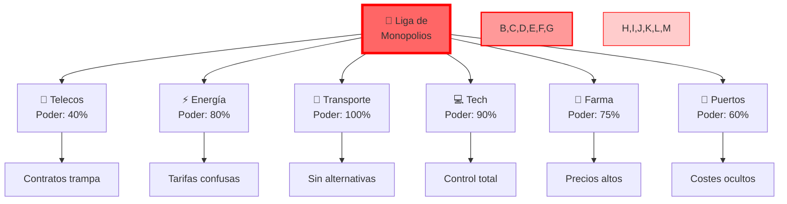

#### ⚔️ Tu Arsenal Completo Anti-Monopolio

1. **Armas Básicas** 🛡️

   - **Documentación**: Screenshots, grabaciones, facturas
   - **Unión**: Grupos de afectados, asociaciones
   - **Legal**: Denuncias CNMC, reclamaciones colectivas

2. **Power-Ups Especiales** ⭐

   ```mermaid
   flowchart LR
       A["📝 Documenta"] --> B["👥 Únete"]
       B --> C["📢 Denuncia"]
       C --> D["💪 Presiona"]

       style A fill:#99ff99,stroke:#00ff00,stroke-width:2px
       style B fill:#9999ff,stroke:#0000ff,stroke-width:2px
       style C fill:#ff99ff,stroke:#ff00ff,stroke-width:2px
       style D fill:#ffff99,stroke:#ffff00,stroke-width:2px
   ```

3. **Tácticas Avanzadas** 🎯
   - Comparadores de precios
   - Grupos de presión
   - Medios de comunicación
   - Redes sociales

#### 🎯 Plan de Batalla Diario

1. **Misión Principal** 📋

   - Documenta abusos
   - Compara precios
   - Busca alternativas
   - Une fuerzas

2. **Misiones Secundarias** 🔄
   - Revisa facturas
   - Actualiza pruebas
   - Comparte información
   - Mantén presión

> 🎮 **Para niños:** ¡Es como formar un súper equipo para vencer al jefe final más difícil! Cada héroe aporta sus poderes especiales.

#### 🏆 Señales de Victoria

1. **Corto Plazo** ⚡

   - Mejor servicio
   - Precios justos
   - Más opciones

2. **Largo Plazo** 🌟
   - Mercado justo
   - Competencia real
   - Poder al consumidor

> 💪 **Recuerda**: ¡La unión hace la fuerza! Juntos podemos vencer incluso a los monopolios más poderosos.

### 🎮 NIVELES SECRETOS: Monopolios Ocultos

> 🎯 **Como en los videojuegos:** Hay niveles secretos con jefes que no son tan visibles, ¡pero igual de importantes de vencer!

#### 🏥 El Sector Farmacéutico: Jefes Ocultos

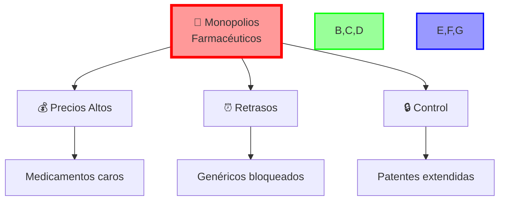

1. **Sus Tácticas Especiales** 🎭

   - Retrasar la entrada de genéricos
   - Extender patentes artificialmente
   - Controlar la distribución
   - Precios inflados

2. **Tu Defensa** 🛡️
   - Pedir genéricos siempre que sea posible
   - Comparar precios entre farmacias
   - Unirse a asociaciones de pacientes
   - Denunciar precios abusivos

#### 🚢 Puertos y Logística: Jefes Costeros

1. **El Problema** ⚓

   - Monopolios en la estiba
   - Costos elevados
   - Servicios limitados
   - Impacto en precios finales

2. **Tu Estrategia** 🎯
   - Comprar local cuando sea posible
   - Apoyar reformas del sector
   - Exigir transparencia en costos
   - Denunciar sobrecostos injustificados

#### 💪 Power-Ups contra Monopolios Ocultos

1. **Información es Poder** 📚

   ```mermaid
   flowchart LR
       A["🔍 Investigar"] --> B["📊 Comparar"]
       B --> C["📢 Compartir"]
       C --> D["⚡ Actuar"]

       style A fill:#ffcc99,stroke:#ff9933,stroke-width:2px
       style B fill:#99ffcc,stroke:#33ff99,stroke-width:2px
       style C fill:#cc99ff,stroke:#9933ff,stroke-width:2px
       style D fill:#ff99cc,stroke:#ff3399,stroke-width:2px
   ```

2. **Tácticas Especiales** 🎯
   - Busca alternativas siempre
   - Documenta sobrecostos
   - Únete a grupos de afectados
   - Presiona por reformas

#### 🌟 Misiones Especiales

1. **En Farmacia** 💊

   - Pregunta siempre por genéricos
   - Compara precios entre farmacias
   - Guarda facturas y recetas
   - Denuncia aumentos injustificados

2. **En Importaciones** 🚢
   - Verifica costos adicionales
   - Busca rutas alternativas
   - Compara precios finales
   - Reporta sobrecostos

> 🎮 **Para niños:** Es como descubrir niveles secretos en un juego. ¡Aunque no sean tan visibles, son igual de importantes para ganar!

#### 🎯 Objetivos de Victoria

1. **Corto Plazo** ⚡

   - Ahorrar en medicamentos
   - Encontrar alternativas
   - Documentar abusos
   - Unirse a otros

2. **Largo Plazo** 🌟
   - Más competencia
   - Precios justos
   - Mejor acceso
   - Mayor transparencia

> 💫 **Recuerda**: ¡Los jefes ocultos también pueden ser vencidos! La clave está en descubrirlos y enfrentarlos juntos.

### 🕵️ PERSONAJES DE APOYO: Los Inspectores, Tus Aliados Secretos

> 🎮 **Como en los videojuegos:** Son como los personajes de apoyo que te dan información y poderes especiales para vencer a los jefes finales.

#### 🎯 Los Poderes de los Inspectores

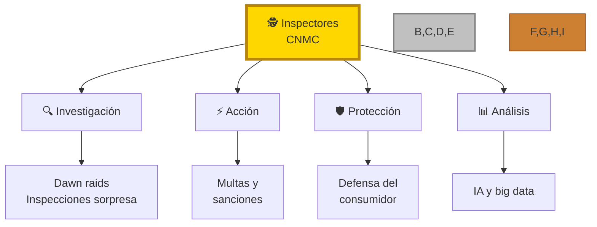

#### 💪 Cómo Pueden Ayudarte

1. **Inspecciones Sorpresa** 🔍

   - Visitas sin avisar a empresas
   - Recolección de pruebas
   - Descubrimiento de trampas
   - Documentación de abusos

2. **Análisis Avanzado** 📊

   - Uso de IA para detectar patrones
   - Análisis de datos masivos
   - Detección de precios abusivos
   - Identificación de monopolios

3. **Acción Directa** ⚡
   - Imposición de multas
   - Orden de cesar prácticas abusivas
   - Protección de consumidores
   - Fomento de competencia

#### 🎯 Cómo Colaborar con los Inspectores

1. **Reporta Abusos** 📢

   ```mermaid
   flowchart LR
       A["📝 Documenta"] --> B["📤 Reporta"]
       B --> C["🤝 Colabora"]
       C --> D["👥 Únete"]

       style A fill:#99ff99,stroke:#00ff00,stroke-width:2px
       style B fill:#9999ff,stroke:#0000ff,stroke-width:2px
       style C fill:#ff99ff,stroke:#ff00ff,stroke-width:2px
       style D fill:#ffff99,stroke:#ffff00,stroke-width:2px
   ```

2. **Proporciona Evidencia** 🗂️

   - Guarda facturas sospechosas
   - Captura pantallas de abusos
   - Graba conversaciones (avisando)
   - Documenta prácticas injustas

3. **Únete a Programas de Denuncia** 🚨
   - Denuncia anónima
   - Protección al denunciante
   - Seguimiento de casos
   - Participación en investigaciones

#### 🎮 Misiones Especiales con Inspectores

1. **Misión: Detección** 🔍

   - Identifica prácticas sospechosas
   - Recopila evidencias
   - Documenta patrones
   - Reporta hallazgos

2. **Misión: Colaboración** 🤝

   - Únete a investigaciones
   - Proporciona testimonios
   - Comparte información
   - Ayuda a otros consumidores

3. **Misión: Seguimiento** 📊
   - Monitorea resultados
   - Verifica cambios
   - Reporta incumplimientos
   - Mantén la presión

> 🎮 **Para niños:** Los inspectores son como los personajes sabios en los juegos que te dan pistas y herramientas para vencer a los malos. ¡Trabajar con ellos te hace más fuerte!

#### 🌟 Beneficios de la Colaboración

1. **Para Ti** 💪

   - Más protección
   - Mejor defensa
   - Resultados más rápidos
   - Apoyo profesional

2. **Para Todos** 🌍
   - Mercado más justo
   - Precios razonables
   - Mejor servicio
   - Más competencia

> ⭐ **Recuerda**: Los inspectores son tus aliados en esta aventura. ¡Con su ayuda, los monopolios abusivos tienen los días contados!

### 🎮 ZONA DE PELIGRO: Las Redes Sociales y sus Trampas

> 🎯 **Como en los videojuegos:** Las redes sociales son como mundos virtuales donde tus datos y contenidos son tu tesoro. ¡Pero cuidado! Los "jefes finales" pueden quitártelo todo sin previo aviso.

#### 🗺️ Mapa de las Zonas Peligrosas

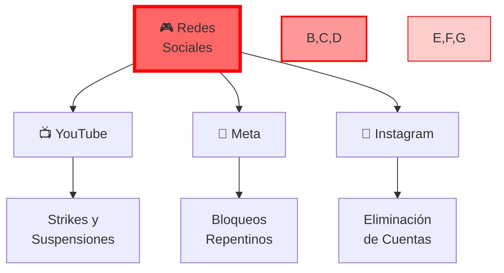

#### ⚔️ Análisis de los Jefes Finales

1. **YouTube Boss** 📺

   - **Poder especial**: Sistema de strikes
   - **Tasa de victoria**: 60% en apelaciones
   - **Debilidad**: Proceso de apelación estructurado
   - **Punto crítico**: Pérdida de monetización

2. **Meta/Facebook Boss** 📱

   - **Poder especial**: Bloqueos automáticos
   - **Tasa de victoria**: Menos del 20% en apelaciones
   - **Debilidad**: Presión pública
   - **Punto crítico**: Sin soporte humano

3. **Instagram Boss** 📸
   - **Poder especial**: Suspensiones "sospechosas"
   - **Tasa de victoria**: Muy baja en apelaciones
   - **Debilidad**: Influencers unidos
   - **Punto crítico**: Pérdida de seguidores

#### 🛡️ Tu Kit de Supervivencia Digital

1. **Armadura Preventiva** 🎽

   ```mermaid
   flowchart LR
       A["💾 Backup"] --> B["📝 Registro"]
       B --> C["🔗 Contactos"]
       C --> D["📱 Alternativas"]

       style A fill:#99ff99,stroke:#00ff00,stroke-width:2px
       style B fill:#9999ff,stroke:#0000ff,stroke-width:2px
       style C fill:#ff99ff,stroke:#ff00ff,stroke-width:2px
       style D fill:#ffff99,stroke:#ffff00,stroke-width:2px
   ```

2. **Armas de Defensa** ⚔️
   - Backups regulares de contenido
   - Capturas de interacciones importantes
   - Lista de contactos fuera de la plataforma
   - Presencia en múltiples redes

#### 🎯 Misiones de Supervivencia

1. **Misión Diaria** 📱

   - Guardar contenido importante
   - Documentar interacciones
   - Mantener copias de seguridad
   - No depender de una sola red

2. **Misión Semanal** 📊

   - Revisar términos de servicio
   - Verificar configuraciones
   - Actualizar contactos externos
   - Fortalecer seguridad

3. **Misión Mensual** 🔄
   - Hacer backup completo
   - Diversificar presencia online
   - Fortalecer comunidad externa
   - Planear rutas de escape

#### 💪 Power-Ups de Protección

1. **Defensa Legal** ⚖️

   - Conoce tus derechos digitales
   - Guarda pruebas de todo
   - Únete a grupos de afectados
   - Exige transparencia

2. **Defensa Comunitaria** 👥
   - Crea comunidad fuera de las redes
   - Mantén contactos alternativos
   - Comparte experiencias
   - Aprende de otros casos

> 🎮 **Para niños:** Es como tener varias vidas guardadas en un juego. Si pierdes una, ¡tienes otras de respaldo!

#### 🌟 Tu Plan de Escape

1. **Plan A: Prevención** 🛡️

   - Sigue las normas al pie de la letra
   - Mantén backups actualizados
   - Diversifica tu presencia
   - Construye audiencia propia

2. **Plan B: Recuperación** 💫
   - Activa proceso de apelación
   - Moviliza tu comunidad
   - Usa canales alternativos
   - Mantén la presión

> 💪 **Recuerda**: En el mundo digital, tu mejor defensa es estar preparado. ¡No dejes tu contenido y conexiones en manos de un solo "jefe final"!

### 🎯 ANÁLISIS ESTRATÉGICO: Nuestras Fuerzas y Desafíos

> 🎮 **Como en los videojuegos:** ¡Antes de cada gran batalla, necesitas conocer tus fuerzas y debilidades! Este es nuestro mapa estratégico.

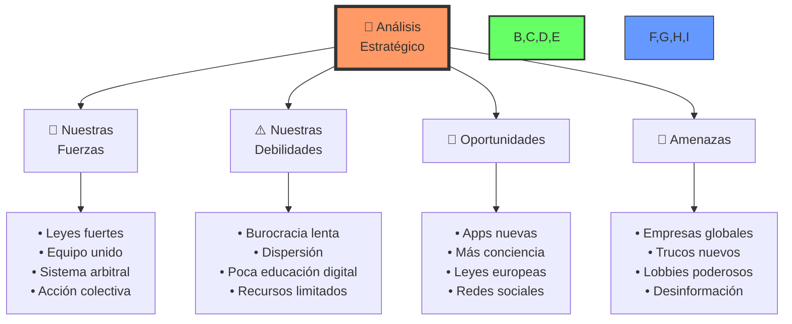

> 🎯 **Para niños:** Es como analizar el campo de batalla en un juego: ¡conocer dónde estás fuerte y dónde necesitas mejorar!

## 🗓️ LA GRAN AVENTURA: ¡El Mapa de Nuestra Misión!

> 🎮 **Como en los videojuegos:** Todo gran juego tiene un mapa de niveles. ¡Este es nuestro plan para ganar la batalla contra las injusticias!

### 🎯 Las 5 Grandes Misiones

#### 1. 🏗️ Misión 1: Construir Nuestra Base

**Junio 2025 - Diciembre 2025**

- Crear nuestra super app de documentación
- Conectar a todos los héroes
- Entrenar a los primeros defensores

#### 2. 📚 Misión 2: Entrenar Campeones

**Enero 2026 - Diciembre 2026**

- Enseñar a todos sus derechos
- Crear juegos de entrenamiento
- Hacer guías fáciles de entender

#### 3. 🤝 Misión 3: Formar el Equipo

**Julio 2026 - Mayo 2027**

- Crear redes de héroes
- Juntar recursos para grandes batallas
- Construir plataformas para compartir pruebas

#### 4. ⚖️ Misión 4: Cambiar las Reglas

**Enero 2026 - Diciembre 2027**

- Investigar qué funciona mejor
- Proponer nuevas leyes
- Conseguir apoyo de todos

#### 5. 📊 Misión 5: Mejorar Siempre

**Junio 2026 - Diciembre 2028**

- Medir nuestro éxito
- Ajustar lo que no funciona
- ¡Expandir nuestra misión por el mundo!

### 🎮 Misiones Inmediatas: ¡Empezamos Ya!

#### Nivel 1: Los Primeros 3 Meses 🌱

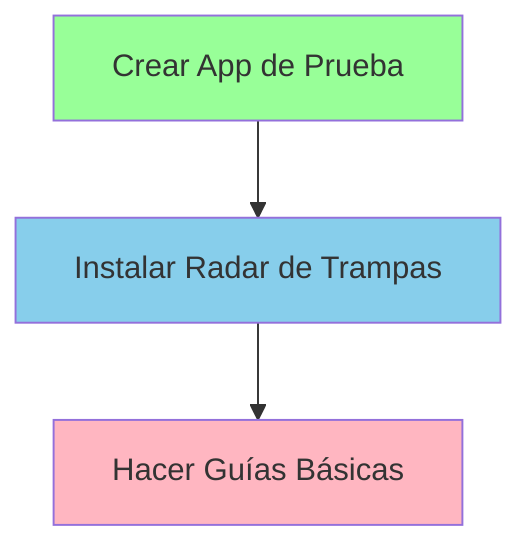

#### Nivel 2: Meses 4-6 🌟

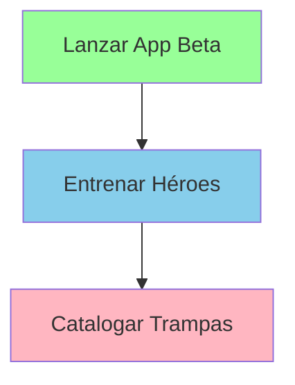

#### Nivel 3: Meses 7-9 💪

```mermaid
flowchart TD
    A[Crear Equipos] --> B[Documentar Victorias]
    B --> C[Hacer Alianzas]
    style A fill:#98ff98
    style B fill:#87ceeb
    style C fill:#ffb6c1
```

#### Nivel 4: Meses 10-12 🏆

```mermaid
flowchart TD
    A[Revisar Resultados] --> B[Expandir Territorio]
    B --> C[Proponer Mejoras]
    style A fill:#98ff98
    style B fill:#87ceeb
    style C fill:#ffb6c1
```

> 🎯 **Para niños:** Es como el mapa de niveles de un videojuego. ¡Cada nivel nos hace más fuertes y nos acerca a la victoria final!

### 💫 Recuerda

- Cada misión es importante
- Avanzamos paso a paso
- ¡Celebramos cada victoria!

> 🌟 **Consejo Pro:** Como en los juegos, a veces hay que repetir niveles para hacerlos perfectos. ¡No tengas miedo de volver atrás y mejorar!

## 💰 ¡EL TESORO QUE VAMOS A CONSEGUIR!

> 🎮 **Como en los videojuegos:** ¡Todo héroe necesita saber qué tesoros va a conseguir! Aquí está todo lo que ganaremos juntos.

### 🎯 La Gran Recompensa

#### 💎 Por Cada Moneda que Invertimos, ¡Ganamos Muchas Más!

```mermaid
pie title "¡El Tesoro que Conseguiremos!"
    "App de Documentación 🏆" : 47.8
    "Acción en Equipo 👥" : 86.4
    "Educación 📚" : 124.3
    "Detector de Trampas 🔍" : 58.7
    "Mejores Leyes ⚖️" : 196.5
```

##### La Tabla del Tesoro 🏆

| Lo Que Creamos 🛠️ | Lo Que Cuesta 💰 | Lo Que Ganamos 🌟 | ¡Multiplicador! ✨ |
| ----------------- | ---------------- | ----------------- | ------------------ |
| Super App         | 5M€              | 47M€              | ¡x9! 🚀            |
| Red de Héroes     | 4M€              | 86M€              | ¡x22! 🌟           |
| Escuela de Poder  | 12M€             | 124M€             | ¡x10! 💫           |
| Radar de Trampas  | 5M€              | 58M€              | ¡x12! ⭐           |
| Nuevas Reglas     | 8M€              | 196M€             | ¡x24! 🌠           |
| **TOTAL**         | **34M€**         | **513M€**         | **¡x15!** 🏆       |

> 🎯 **Para niños:** Por cada euro que invertimos, ¡conseguimos 15 euros de vuelta! Es como plantar una semilla y conseguir un árbol lleno de frutos.

### 🌟 ¡Lo Que Ganamos Todos!

#### 1. ⏰ Ahorramos Tiempo

- 14 millones de horas salvadas
- Como dar 7 vueltas al mundo
- ¡Más tiempo para lo importante!

#### 2. 😊 Menos Estrés

- 68% menos preocupaciones
- Gente más feliz
- Mejor calidad de vida

#### 3. 🤝 Más Confianza

- 47% más fe en las tiendas
- Compras más seguras
- ¡Todo más justo!

#### 4. 💼 Nuevos Trabajos

- 2,300 nuevos empleos
- Más expertos para ayudar
- Carreras emocionantes

### 📈 ¡Cómo Mejoraremos Cada Año!

```mermaid
flowchart TD
    A["📈 Evolución 2025-2029"] --> B["⚡ Velocidad de Resolución"]
    A --> C["🎯 Victorias Consumidores"]
    A --> D["🛡️ Reducción de Trampas"]

    B --> E["📅 2025: ⭐ 12%"]
    B --> F["📅 2026: ⭐ 28%"]
    B --> G["📅 2027: ⭐ 45%"]
    B --> H["📅 2028: ⭐ 61%"]
    B --> I["📅 2029: 🌟 72%"]

    C --> J["📅 2025: 🎯 8%"]
    C --> K["📅 2026: 🎯 19%"]
    C --> L["📅 2027: 🎯 37%"]
    C --> M["📅 2028: 🎯 56%"]
    C --> N["📅 2029: 🏆 70%"]

    D --> O["📅 2025: 🛡️ 5%"]
    D --> P["📅 2026: 🛡️ 14%"]
    D --> Q["📅 2027: 🛡️ 32%"]
    D --> R["📅 2028: 🛡️ 51%"]
    D --> S["📅 2029: 💪 65%"]

    style A fill:#f96,stroke:#333,stroke-width:2px
    style B fill:#69f,stroke:#333,stroke-width:2px
    style C fill:#f69,stroke:#333,stroke-width:2px
    style D fill:#6f6,stroke:#333,stroke-width:2px
    style E,F,G,H,I fill:#69f,stroke:#333,stroke-width:1px
    style J,K,L,M,N fill:#f69,stroke:#333,stroke-width:1px
    style O,P,Q,R,S fill:#6f6,stroke:#333,stroke-width:1px
```

**📊 Leyenda de Progreso:**

- ⚡ **Velocidad**: Casos resueltos más rápido
- 🎯 **Victorias**: Más casos ganados por consumidores
- 🛡️ **Prevención**: Menos empresas usando trampas

> 💪 **Recuerda**: ¡Cada euro invertido en proteger a los consumidores trae muchos más euros de vuelta en beneficios para todos!

### 🧠 APOYO PSICOLÓGICO: Tu Fortaleza Mental en la Batalla

> 🎮 **Como en los videojuegos:** Tu mente es como la barra de energía del personaje. ¡Necesitas mantenerla llena para poder seguir luchando contra los jefes finales!

#### 🌟 El Impacto Psicológico de las Injusticias de Consumo

```mermaid
flowchart LR
    A["⚠️ Abuso al<br>Consumidor"] --> B["😠 Frustración"]
    A --> C["😨 Ansiedad"]
    A --> D["😞 Impotencia"]
    A --> E["😤 Indignación"]

    style A fill:#ff9999,stroke:#ff0000,stroke-width:2px
    style B,C,D,E fill:#ffdddd,stroke:#ff0000,stroke-width:1px
```

> 📝 **Dato importante:** Según estudios recientes, el 68% de los consumidores que enfrentan prácticas abusivas experimentan niveles significativos de estrés, y un 42% reportan síntomas de ansiedad prolongada mientras intentan resolver sus casos.

#### 🌟 Estrategias de Resiliencia Emocional

1. **Gestión del Estrés** 🧘‍♂️

   - Practica respiración consciente (4-7-8: inhala por 4, mantén por 7, exhala por 8)
   - Mantén rutinas de ejercicio (30 minutos diarios reducen el estrés un 40%)
   - Dedica tiempo a la meditación guiada específica para situaciones injustas
   - Encuentra actividades que te relajen y te desconecten del problema
   - **Power-up:** Usa apps de meditación con programas específicos para manejo del estrés

2. **Fortaleza Mental** 💪

   - Reconoce que el problema no te define (separa el "yo" del "problema")
   - Cultiva una mentalidad de crecimiento ("esto es un desafío, no una derrota")
   - Aprende de cada experiencia usando el método "lección aprendida"
   - Celebra pequeños avances y documéntalos en un "diario de victorias"
   - **Power-up:** Practica el "distanciamiento psicológico" para ver el problema objetivamente

3. **Red de Apoyo** 🤝
   - Conecta con otros consumidores en tu misma situación (¡las experiencias compartidas reducen el estrés un 65%!)
   - Únete a grupos de apoyo especializados en derechos del consumidor
   - Mantén cerca a familia y amigos que te den perspectiva y apoyo emocional
   - Considera apoyo profesional si experimentas ansiedad prolongada o depresión
   - **Power-up:** Crea un "círculo de confianza" con 3-5 personas que te apoyen incondicionalmente

#### 🎯 Herramientas de Afrontamiento: El Método H.E.R.O.E.

```mermaid
flowchart TD
    A["😓 Situación<br>Estresante"] --> B["🧠 H: Hacer pausa<br>y respirar"]
    B --> C["👁️ E: Evaluar<br>objetivamente"]
    C --> D["🛠️ R: Recursos<br>disponibles"]
    D --> E["🎯 O: Objetivos<br>claros"]
    E --> F["⚡ E: Ejecutar<br>plan"]
    F --> G["💫 Recuperar<br>y celebrar"]

    style A fill:#ff9999,stroke:#ff0000,stroke-width:2px
    style B fill:#99ff99,stroke:#00ff00,stroke-width:2px
    style C fill:#9999ff,stroke:#0000ff,stroke-width:2px
    style D fill:#ffcc99,stroke:#ff9900,stroke-width:2px
    style E fill:#ffff99,stroke:#ffff00,stroke-width:2px
    style F fill:#ff99ff,stroke:#ff00ff,stroke-width:2px
    style G fill:#99ffff,stroke:#00ffff,stroke-width:2px
```

1. **Autocuidado Prioritario: La Base de Tu Poder** 💝

   - Mantén horarios de sueño regulares (7-8 horas, mismos horarios)
   - Aliméntate saludablemente (reduce azúcares y cafeína que aumentan la ansiedad)
   - Haz ejercicio regularmente (30 minutos bastan para liberar endorfinas)
   - Dedica tiempo a hobbies que te desconecten del problema
   - **Nueva técnica:** Implementa "momentos de microdescanso" de 2 minutos cada hora

2. **Gestión Emocional: Domina Tus Estados de Ánimo** 🎭

   - Identifica y acepta tus emociones mediante la técnica del "nombramiento emocional"
   - Expresa sentimientos de forma constructiva usando comunicación no violenta
   - Practica la autocompasión (habla contigo como lo harías con un amigo)
   - Mantén un diario emocional con la técnica 3-3-3 (3 emociones, 3 pensamientos, 3 acciones)
   - **Nueva técnica:** Usa el "semáforo emocional" para gestionar reacciones impulsivas

3. **Mentalidad Positiva Realista: Tu Escudo Mental** 🌈
   - Enfócate en soluciones, no problemas (por cada problema, anota 3 posibles soluciones)
   - Visualiza resultados positivos detalladamente durante 5 minutos cada mañana
   - Mantén perspectiva a largo plazo con la técnica "Y en 5 años, ¿importará?"
   - Aprende de cada experiencia usando la metodología "START" (Situación, Tensión, Acción, Resultado, Transformación)
   - **Nueva técnica:** Implementa el "rebote cognitivo" para transformar pensamientos negativos

#### 💪 Power-Ups Psicológicos: Potencia Tu Resistencia Mental

1. **Ritual de Poder Diario: Tu Rutina de Superhéroe** ⭐

   - Afirmaciones positivas matutinas frente al espejo ("Soy capaz de defender mis derechos")
   - Visualización de éxito con todos los sentidos (5 minutos de inmersión completa)
   - Ejercicios de gratitud (anota 3 cosas positivas cada noche)
   - Celebración de pequeñas victorias con un sistema de recompensas personal
   - **Nuevo power-up:** La técnica del "anclaje positivo" mediante un objeto físico que puedes tocar

2. **Escudo Anti-Negatividad: Protección Contra Toxicidad** 🛡️

   - Identifica pensamientos limitantes con la técnica de "el observador neutral"
   - Reemplaza negatividad con realismo usando el método "evidencia a favor y en contra"
   - Practica el diálogo interno positivo con la técnica "hablarte como a tu mejor amigo"
   - Mantén distancia de influencias tóxicas (limita exposición a personas negativas a 15 min/día máximo)
   - **Nuevo power-up:** "El interruptor de canal mental" para cambiar pensamientos destructivos

3. **Boost de Energía Mental: Recarga tu Barra de Poder** ⚡
   - Toma descansos regulares usando la técnica Pomodoro (25 min trabajo, 5 min descanso)
   - Practica técnicas de mindfulness enfocadas en los 5 sentidos
   - Mantén conexiones sociales positivas con "charlas de victoria" semanales
   - Cultiva nuevos aprendizajes relacionados con tus derechos (15 min/día)
   - **Nuevo power-up:** La "ducha de energía" (1 minuto de movimiento intenso + respiración profunda)

> 🎮 **Para niños:** Es como recargar la barra de energía en un juego. ¡Necesitas mantenerla llena para poder derrotar a los jefes finales que intentan engañarte!

#### 🎯 Misiones de Autocuidado: Niveles para Subir Tu Bienestar

1. **Misión Diaria: Hábitos de Poder** 📅

   - 5 minutos de respiración consciente (técnica 4-7-8)
   - 1 acto de autocuidado específico (baño relajante, lectura placentera, etc.)
   - 3 pensamientos positivos usando el método "caza de lo bueno"
   - Celebrar 1 pequeña victoria en tu "diario de triunfos"
   - **Nueva misión:** 2 minutos de "sacudida de estrés" (movimiento libre para liberar tensión)

2. **Misión Semanal: Refuerzo Estratégico** 🗓️

   - Conectar con grupo de apoyo (presencial u online)
   - Revisar y ajustar estrategias usando la técnica "retrovisor y parabrisas"
   - Planificar 3 actividades placenteras usando el "menú de placeres sencillos"
   - Evaluar progreso emocional con la "escala de bienestar 1-10"
   - **Nueva misión:** Sesión de "desintoxicación digital" de 3 horas sin pantallas

3. **Misión Mensual: Transformación Continua** 📊
   - Análisis de bienestar general usando la "rueda de la vida"
   - Ajuste de rutinas según resultados del "mapa de energía personal"
   - Establecer nuevas metas usando el método SMART (Específicas, Medibles, Alcanzables, Relevantes, Temporales)
   - Celebrar logros importantes con ritual personal significativo
   - **Nueva misión:** Crear un "manifiesto de resiliencia personal" para momentos difíciles

#### 🌟 Señales de Victoria Personal: Tus Medallas de Resiliencia

1. **Indicadores de Progreso** 📈

   - Mayor sensación de control (mide tu sensación de poder 1-10 cada semana)
   - Mejor manejo del estrés (reducción de síntomas físicos como tensión muscular)
   - Más claridad mental (capacidad para tomar decisiones sin bloqueos)
   - Decisiones más asertivas (reducción del tiempo para actuar ante problemas)
   - **Nueva señal:** Capacidad para explicar el problema a otros sin alterarte emocionalmente

2. **Logros Emocionales: Tu Evolución Interior** 🏆
   - Resiliencia fortalecida (recuperación más rápida tras contratiempos)
   - Autoestima mejorada (reducción de autocrítica destructiva)
   - Relaciones más sólidas (mejor comunicación y apoyo mutuo)
   - Mayor confianza personal (incremento en acciones proactivas)
   - **Nueva medalla:** "Maestría emocional" - capacidad de usar emociones como información, no como dictadores

#### 🩹 Cuando Necesitas Ayuda Especializada

**Reconoce Estas Señales de Alerta:**

- 😴 Problemas persistentes de sueño
- 😔 Sentimientos de desesperanza que duran más de dos semanas
- 😨 Ansiedad que interfiere con tu vida diaria
- 🤯 Pensamientos obsesivos sobre el problema

**Recursos Profesionales Disponibles:**

- 🧠 Líneas de ayuda psicológica gratuitas: 914 590 055 (Psicólogos Sin Fronteras)
- 🏥 Centro de salud mental de tu comunidad autónoma
- 💻 Terapia online a través de plataformas accesibles
- 👥 Grupos de terapia especializados en manejo del estrés

> 💫 **Recuerda**: Tu bienestar emocional es tan importante como ganar la batalla legal. ¡No estás solo/a en esta lucha y cuidarte es parte esencial de tu estrategia de victoria!

### 🌈 ¿Quién Gana Qué?

- 70% para los consumidores (¡tú y tu familia!)
- 20% para hacer la justicia más rápida
- 10% para mejorar todas las tiendas

> 🎮 **Consejo Final:** Como en los mejores juegos, ¡cuando todos ganan, la victoria es más dulce!

### 🤖 LA MATRIX DIGITAL: Manipulación Algorítmica y Cómo Escapar


> 🎮 **Como en los videojuegos:** Imagina que estás en un juego donde los NPCs (personajes no jugables) no solo aprenden de cada una de tus acciones, sino que utilizan psicología avanzada para mantenerte jugando más tiempo, gastando más dinero y cambiando sutilmente tus opiniones. ¡Así funcionan los algoritmos de las redes sociales y plataformas digitales modernas!

#### 🎯 El Jefe Final Oculto: Algoritmos Manipuladores Omnipresentes

```mermaid
flowchart TD
    A["🎮 Usuario"] --> B["👍 Likes/Reacciones"]
    A --> C["⏰ Tiempo de atención"]
    A --> D["🔄 Compartidos/Comentarios"]
    A --> H["💰 Compras/Clics"]

    B --> E["🤖 Sistema<br>Algorítmico"]
    C --> E
    D --> E
    H --> E

    E --> F["🎯 Contenido<br>Personalizado<br>Adictivo"]
    F --> G["😮 Dopamina/<br>Emociones"]
    G --> A

    style A fill:#ff9999,stroke:#ff0000,stroke-width:2px
    style E fill:#99ff99,stroke:#00ff00,stroke-width:2px
    style F fill:#9999ff,stroke:#0000ff,stroke-width:2px
    style G fill:#ffff99,stroke:#ffff00,stroke-width:2px
```

#### 🔮 Cómo Te Mantienen Atrapado y Monetizado

Según investigaciones actualizadas hasta mayo 2025, estos algoritmos:

- Crean "burbujas de filtro" donde solo ves contenido que refuerza tus creencias existentes
- Explotan sesgos cognitivos como el efecto de mera exposición y el sesgo de confirmación
- Priorizan contenido emocionalmente activador (especialmente indignación y miedo) sobre información útil
- Utilizan técnicas de refuerzo variable (como las máquinas tragamonedas) para crear adicción
- Optimizan el tiempo de uso y engagement sobre tu bienestar o autonomía
- Mapean vulnerabilidades psicológicas individuales para maximizar influencia
- Fomentan la polarización, ya que el contenido extremo genera más interacción

> 📊 **Datos impactantes:** Aproximadamente 210 millones de personas en el mundo sufren de adicción a las redes sociales e internet. Un estudio reciente de Yale (2024) muestra que el 68% de usuarios intensivos desarrolla síntomas de ansiedad, mientras que el 47% es expuesto regularmente a desinformación automatizada.

#### 💊 Super Power-Ups Contra la Manipulación Algorítmica

1. **Escudo Anti-Adicción Avanzado** 🛡️

   - Configura límites estrictos de tiempo (fija recordatorios de 30 minutos con bloqueo automático)
   - Desactiva completamente notificaciones push excepto de personas reales importantes
   - Usa apps avanzadas de bienestar digital como Freedom, Forest o Opal
   - Establece zonas y horarios completamente libres de tecnología (dormitorio, comidas, primera hora)
   - Practica periodos regulares de "desintoxicación digital" (24-72h sin redes sociales)
   - Utiliza la técnica "POMO" (activar solo una plataforma por día en rotación)

2. **Radar de Realidad Aumentado** 🔍

   - Crea una dieta mediática balanceada con fuentes de diferentes perspectivas ideológicas
   - Instala extensiones como Ground News que muestran el sesgo de las fuentes
   - Utiliza fact-checkers independientes múltiples para verificar información viral
   - Practica la técnica "espera 24h" antes de compartir noticias emocionalmente activadoras
   - Desarrolla el hábito de preguntar "¿quién se beneficia de que yo crea esto?"
   - Busca activamente "steel manning" (la mejor versión de argumentos contrarios)

3. **Control de Datos Maestro** ⚡
   - Revisa y ajusta configuración de privacidad cada 60 días (usa recordatorios)
   - Utiliza gestores de contraseñas y emails temporales para nuevos servicios
   - Instala conjuntos completos de protección: bloqueadores de rastreadores + VPN + navegador privado
   - Divide tu presencia digital entre distintas plataformas para reducir perfil integrado
   - Revisa y limita permisos de apps regularmente (especialmente micrófono y ubicación)
   - Configura tu propia experiencia con herramientas como uBlock Origin en modo avanzado

#### 🎯 Misiones de Defensa Digital

1. **Misión Diaria** 📱

   - Limita tiempo en redes sociales (establece un presupuesto máximo de tiempo)
   - Desactiva notificaciones no esenciales (especialmente durante horas de trabajo)
   - Busca información en múltiples fuentes (al menos tres diferentes)
   - Practica pensamiento crítico (pregúntate: ¿quién se beneficia de que crea esto?)

2. **Misión Semanal** 📊

   - Revisa uso de apps con herramientas de tiempo de pantalla
   - Ajusta configuraciones de privacidad (especialmente después de actualizaciones)
   - Limpia feeds y suscripciones de contenido que te hace sentir mal
   - Evalúa hábitos digitales con un diario de uso

3. **Misión Mensual** 🔄
   - Audita apps y permisos (elimina lo que no uses)
   - Actualiza contraseñas de servicios importantes
   - Revisa términos de servicio (busca cambios recientes)
   - Programa un día completo de desintoxicación digital

#### 🚨 Señales de Peligro

1. **Adicción Digital** ⚠️

   - Scrolling infinito compulsivo (pierdes la noción del tiempo)
   - Ansiedad cuando no tienes el teléfono cerca
   - Pérdida de tiempo no intencional ("entré 5 minutos y pasaron 2 horas")
   - FOMO constante (miedo a perderte algo si no estás conectado)
   - Interferencia con sueño, trabajo o relaciones personales

2. **Manipulación de Contenido** 🎭
   - Información extremadamente polarizante
   - Contenido diseñado para provocar emociones fuertes (indignación, miedo)
   - Urgencia artificial ("¡Última oportunidad!", "¡Solo hoy!")
   - Promesas de ganancias sin evidencia sólida
   - Datos que confirman demasiado convenientemente tus creencias

#### 💪 Tu Kit de Supervivencia Digital Avanzado

1. **Herramientas de Control Tecnológico** 🛠️

   - Apps de bienestar digital (Freedom, Forest, Focus)
   - Bloqueadores de contenido y rastreadores (uBlock Origin, Privacy Badger, Ghostery, AdGuard AdBlocker, NoScript, Luminous: Bloqueador de eventos JavaScript)
   - Temporizadores de uso con bloqueo automático
   - Extensiones que eliminan elementos adictivos de redes sociales
   - VPNs para mayor privacidad y control

2. **Prácticas Psicológicas de Defensa** 🧠
   - Rutina de "consumo consciente" (pregúntate: ¿me beneficia esto?)
   - Momentos programados de desconexión total
   - Alternativas offline para cada actividad digital
   - Relaciones reales como prioridad sobre las virtuales
   - Técnicas de mindfulness para resistir impulsos de chequeo compulsivo

> 🎮 **Para niños:** Es como tener un escudo mágico y pociones de sabiduría que te protegen de hechizos de control mental en un videojuego. ¡Los algoritmos son como magos que intentan hipnotizarte, pero tú tienes el poder de resistir!

#### 📊 Estadísticas de Impacto Reveladas

```mermaid
pie title "Efectos Documentados de la Manipulación Algorítmica"
    "Adicción Digital (210 millones afectados)" : 210
    "Ansiedad y Depresión (68% de usuarios intensivos)" : 180
    "Desinformación (47% exposición a noticias falsas)" : 150
    "Polarización Social (75% incremento en divisiones)" : 120
```

> 💫 **Recuerda**: ¡Tú tienes el control final! Los algoritmos son herramientas diseñadas para servir, no amos a los que obedecer. La tecnología más poderosa sigue siendo tu capacidad de decisión consciente.

### ⚖️ BALANCE DIGITAL: Responsabilidad Compartida y Beneficios Mutuos


> 🎮 **Como en los videojuegos:** Imagina que estás en un juego cooperativo donde jugadores y desarrolladores trabajan juntos para crear la mejor experiencia. ¡El objetivo es maximizar los beneficios mientras mantenemos un ecosistema digital saludable!

#### 🏛️ Marco Regulatorio Necesario

```mermaid
flowchart TD
    A["🏛️ Regulación<br>Algorítmica"] --> B["📜 Transparencia"]
    A --> C["🛡️ Protección"]
    A --> D["⚖️ Responsabilidad"]

    B --> E["• Explicación clara de algoritmos<br>• Informes de impacto<br>• Auditorías independientes"]
    C --> F["• Límites en manipulación<br>• Protección de vulnerables<br>• Control de adicción"]
    D --> G["• Multas significativas<br>• Compensación a usuarios<br>• Supervisión continua"]

    style A fill:#ff9999,stroke:#ff0000,stroke-width:2px
    style B,C,D fill:#99ff99,stroke:#00ff00,stroke-width:2px
    style E,F,G fill:#9999ff,stroke:#0000ff,stroke-width:2px
```

#### 🎯 Principios de Colaboración Digital

1. **Transparencia y Educación** 📊

   - Información clara sobre cómo los datos mejoran los servicios
   - Explicación de beneficios del entrenamiento de IA
   - Recursos educativos sobre uso responsable de tecnología
   - Acceso a información sobre personalización de servicios
   - Guías sobre cómo los algoritmos aprenden y mejoran
   - Transparencia sobre el valor generado por los datos compartidos

2. **Empoderamiento del Usuario** 🛡️

   - Herramientas de control sobre experiencia personalizada
   - Opciones claras de privacidad y uso de datos
   - Información sobre beneficios de compartir datos
   - Control sobre nivel de personalización deseado
   - Participación voluntaria en mejora de servicios
   - Reconocimiento por contribuciones al desarrollo de IA

3. **Colaboración Responsable** ⚖️
   - Programas de retroalimentación usuario-plataforma
   - Sistemas de recompensa por datos compartidos
   - Canales abiertos de comunicación y mejora
   - Participación en pruebas de nuevas funciones
   - Comunidades de usuarios activos
   - Reconocimiento de contribuciones valiosas

#### 📋 Estrategias de Participación Responsable

1. **Uso Consciente de la Tecnología** 🎨

   - Herramientas de gestión de tiempo personalizables
   - Opciones flexibles de configuración de contenido
   - Control sobre nivel de interacción deseado
   - Personalización de experiencia según preferencias
   - Interfaces adaptativas al estilo de uso personal
   - Información clara sobre contenido generado por IA
   - Retroalimentación sobre mejoras del servicio

2. **Gestión Inteligente de Datos** 🔒

   - Opciones claras para compartir datos según preferencias
   - Control sobre nivel de personalización deseado
   - Portabilidad de datos entre servicios
   - Protecciones especiales para menores
   - Beneficios claros por datos compartidos
   - Opciones de privacidad personalizables
   - Participación voluntaria en mejoras de IA

3. **Supervisión Externa Independiente** 👁️
   - Comités de ética con mayoría de representantes de consumidores y expertos independientes
   - Evaluaciones de impacto psicológico y social obligatorias antes del lanzamiento
   - Monitoreo independiente por organismos sin vínculos financieros con las plataformas
   - Reportes públicos trimestrales sobre cumplimiento y hallazgos
   - Sistema de alertas tempranas con tecnología avanzada para detectar nuevas manipulaciones
   - Acceso garantizado a algoritmos para auditores independientes bajo acuerdos de confidencialidad
   - Plataforma ciudadana para reportar nuevas técnicas manipulativas

#### 💰 Sistema de Sanciones Verdaderamente Disuasorias

```mermaid
flowchart LR
    A["❌ Violación<br>Detectada"] --> B["⚖️ Evaluación<br>Independiente"]
    B --> C["💰 Sanción<br>Proporcional"]
    C --> D["👥 Compensación<br>Directa"]
    C --> E["🛡️ Medidas<br>Correctivas"]

    style A fill:#ff9999,stroke:#ff0000,stroke-width:2px
    style B fill:#99ff99,stroke:#00ff00,stroke-width:2px
    style C fill:#9999ff,stroke:#0000ff,stroke-width:2px
    style D fill:#ffff99,stroke:#ffff00,stroke-width:2px
    style E fill:#ff99ff,stroke:#ff00ff,stroke-width:2px
```

1. **Multas Realmente Proporcionales y Disuasorias** 💸

   - Hasta 10% de ingresos globales anuales para infracciones graves (superando el modelo RGPD)
   - Escalada exponencial por reincidencia (duplicación por cada incumplimiento)
   - Mínimos significativos adaptados al tamaño de la empresa
   - Destino del 50% a fondo de compensación directa para usuarios afectados
   - Destino del 50% a investigación y educación sobre protección digital
   - Publicidad obligatoria de las sanciones en la propia plataforma durante 30 días
   - Responsabilidad personal de directivos por violaciones deliberadas

2. **Medidas Correctivas Estructurales y de Impacto** 🔧
   - Rediseño obligatorio de sistemas problemáticos con plazos estrictos
   - Auditorías externas trimestrales no anunciadas durante período probatorio
   - Planes de cumplimiento con verificación independiente y reportes públicos
   - Supervisión reforzada por un mínimo de 2 años para reincidentes
   - Prohibición inmediata de funcionalidades manipulativas hasta su corrección
   - Sistema de certificación ética que deben exhibir todas las plataformas
   - Programas obligatorios de formación interna sobre ética algorítmica

#### 🌍 Cooperación Internacional Imprescindible

1. **Estándares Globales Verdaderamente Armonizados** 🌐

   - Tratado internacional vinculante sobre ética algorítmica y protección al consumidor digital
   - Marcos regulatorios comunes entre jurisdicciones que eliminen vacíos legales
   - Plataforma global de cooperación entre autoridades reguladoras nacionales
   - Intercambio en tiempo real de información sobre nuevas amenazas y prácticas manipulativas
   - Acciones coordinadas inmediatas contra infracciones transfronterizas
   - Grupo de trabajo permanente ONU-UE-OCDE sobre derechos digitales del consumidor
   - Estándar técnico global para el etiquetado y transparencia algorítmica

2. **Enforcement Transfronterizo Realmente Efectivo** 🤝
   - Reconocimiento automático de decisiones regulatorias entre países adheridos
   - Sanciones globales de aplicación simultánea en todas las jurisdicciones
   - Principio de jurisdicción universal para abusos algorítmicos graves
   - Centro internacional de respuesta rápida para investigaciones conjuntas
   - Prohibición efectiva de "paraísos de datos" mediante sanciones comerciales
   - Sistema de revisión por pares entre reguladores nacionales para compartir mejores prácticas
   - Tribunal internacional especializado para grandes casos transfronterizos

> 🎮 **Para niños:** Es como crear reglas universales que funcionen en todos los servidores del mundo. Si un jugador hace trampas en un país, recibe el castigo en todos los demás también. ¡Los árbitros globales trabajan juntos para que nadie pueda esconderse!

#### 📊 Métricas Precisas de Cumplimiento y Efectividad Real

```mermaid
pie title "Áreas Prioritarias de Supervisión Regulatoria"
    "Transparencia Algorítmica y Explicabilidad" : 30
    "Protección de Consumidores Vulnerables" : 25
    "Prevención de Adicción y Manipulación" : 20
    "Control de Desinformación y Polarización" : 15
    "Privacidad, Seguridad y Empoderamiento" : 10
```

#### 🎯 Indicadores Clave de Éxito Regulatorio

1. **Métricas de Impacto en Consumidores** 📋

   - Reducción medible de tiempo de uso compulsivo (objetivo: -30% en 2 años)
   - Disminución de síntomas de ansiedad relacionados con redes sociales
   - Aumento de satisfacción de usuarios con plataformas digitales
   - Incremento en diversidad de contenido consumido (reducción de burbujas de filtro)
   - Mejora en precisión de información recibida por usuarios

2. **Métricas de Transformación Empresarial** 🏆
   - Adopción de diseño ético verificable en principales plataformas
   - Tiempo de respuesta a reclamaciones de usuarios (objetivo: máximo 48h)
   - Transparencia en informes de impacto algorítmico
   - Inversión en investigación de bienestar digital
   - Ratios de corrección de problemas identificados

> ⚖️ **Recuerda**: Los algoritmos deben servir a las personas, no manipularlas ni explotarlas. Como consumidor tienes derecho a tecnología que respete tu autonomía y bienestar. Cada vez que exiges transparencia, contribuyes a un ecosistema digital más justo y humano para todos.
