# 🛡️ ARSENAL TÁCTICO: CÓMO DEFENDERSE Y VENCER A POLÍTICOS MANIPULADORES ⚔️

## En otras palabras, se acabó el relato

> ⚠️ **Advertencia importante:** Documento aún en fase de borrador pero igual es una perla. Así como sin la luz del Sol todo sería oscuridad (de noche) en la Tierra, si permitimos que los manipuladores tapen la luz de la verdad y la libertad, la humanidad caerá en las tinieblas. Es nuestra responsabilidad mantener encendida la llama de la verdad y la justicia ⚖️.

> 📝 **Nota para padres:** Este contenido ha sido diseñado para ser lo más claro y accesible posible, facilitando que puedas explicar estos conceptos importantes a los niños. Cada sección incluye ejemplos y analogías adaptadas a su nivel de comprensión.

> "La victoria no siempre es para el más fuerte, sino para el más estratégico" 🎯

# 📋 ÍNDICE DE ESTRATEGIAS PARA DEFENDERSE DE LA MANIPULACIÓN POLÍTICA

## 🧠 FUNDAMENTOS NEUROPSICOLÓGICOS

1. [Sistema Neuronal de Alerta Temprana: Tu Detector de Mentiras Natural](#1-sistema-neuronal-de-alerta-temprana) 🔍

   - 👀 Detección de incongruencias en lenguaje corporal
   - 😶 Análisis de microexpresiones faciales
   - 🎯 Activación de la intuición como herramienta defensiva

2. [La Ventana de Overton: Cómo Te Hacen Aceptar lo Inaceptable](#2-la-ventana-de-overton) 🪟

   - 📊 Identificación del proceso de normalización
   - ⚓ Detección del anclaje extremo
   - 🔤 Contrarrestar el cambio lingüístico manipulativo

## 🔄 TÁCTICAS DE CONTRAPODER

3. [Detecta y Desmonta las Narrativas Falsas](#3-detecta-y-desmonta-las-narrativas-falsas) 📖

   - 🎭 Descomposición de historias emocionales
   - ⚖️ Rechazo de falsas dicotomías
   - 🧙‍♂️ Cuestionamiento de soluciones milagrosas

4. [El Boomerang de la Mentira: Cuando las Mentiras Regresan](#4-el-boomerang-de-la-mentira) 🪃

   - 🔍 Verificación activa de datos
   - 🧩 Exposición del contexto omitido
   - ⚔️ Uso de sus mentiras como armas

5. [Desmantela sus Redes Clientelares: El Sistema de Control Político](#5-desmantela-sus-redes-clientelares) 🕸️

   - 🗺️ Mapeo de conexiones clave
   - 🔄 Visualización del flujo de favores
   - 🧷 Exposición de intermediarios corruptos

6. [La Estrategia del Pequeño contra el Grande: Sé Inteligente](#6-la-estrategia-del-pequeño-contra-el-grande) 🥷

   - 📩 Filtración estratégica de información
   - 🗣️ Creación de disidencia interna
   - 🎯 Ataques a puntos débiles inesperados

## 🧩 ESTRATEGIAS PSICOLÓGICAS AVANZADAS

7. [Descubre Cómo Piensa el Manipulador: Conoce su Mente](#7-psicologia-del-manipulador) 🎭

   - 🏆 Explotación de necesidades de validación
   - 😬 Reconocimiento de patrones de miedo al ridículo
   - 🗡️ Observación de ciclos de venganza y contraataque

8. [Unidos Somos Más Fuertes: Crea un Equipo de Superhéroes](#8-unidos-somos-mas-fuertes) 👥

   - 🔍 Comunidades de verificación
   - ⚡ Redes de respuesta rápida
   - 📚 Recursos educativos compartidos

9. [Cuenta una Historia Mejor: No Solo Digas lo que Está Mal](#9-cuenta-una-historia-mejor) 📢

   - 👤 Humanización de datos estadísticos
   - 🔆 Creación de símbolos memorables
   - 🌈 Visualización de futuros alternativos

10. [Sé Fuerte como el Ave Fénix: Renace de las Cenizas](#10-se-fuerte-como-el-fenix) 🔥

    - 🧘‍♀️ Rutinas de autocuidado psicológico
    - 🎯 Celebración de pequeñas victorias
    - 🌊 Adaptación constante de estrategias

## 🌍 TRANSFORMACIÓN DE PARADIGMAS 🔄

11. [Cuidado con el Truco del "Bien de Todos": No Te Dejes Engañar](#11-cuidado-con-el-truco-del-bien-comun) 🎭

    - ⚖️ Identificación de falsos dilemas colectivistas
    - 🔄 Detección de la inversión de prioridades naturales
    - 🏛️ Análisis de los cuatro pilares del control colectivista

12. [Piensa en los Niños del Futuro: Lo que Hagamos Hoy lo Heredarán Mañana](#12-piensa-en-los-ninos-del-futuro) 👶

    - 📊 Establecimiento de jerarquía de impacto generacional
    - ⏳ Análisis de sistemas insostenibles tipo Ponzi
    - 🛡️ Contrarrestar la manipulación intergeneracional

13. [La Independencia Mental: La Libertad es tu Mejor Defensa](#13-la-independencia-mental) 🏴‍☠️

    - 🔍 Desarrollo de selectividad en todas las áreas
    - 🔓 Superación de la "prostitución política"
    - 💪 Construcción de autonomía económica fundamental

14. [Supera las Redes Clientelares y la Manipulación Estatal](#14-supera-las-redes-clientelares) 🕸️

    - 🔒 Ruptura del ciclo de dependencia política
    - 🔄 Transición del paradigma ideológico al de resultados
    - 🤝 Reconstrucción de la relación ciudadano-Estado

## 📚 DESARROLLO DE INDEPENDENCIA INTELECTUAL 💭

15. [El Aprendizaje Autodidacta: Tu Superpoder de Libertad Mental](#15-el-aprendizaje-autodidacta) 🎓

    - 📖 Desarrollo de autonomía educativa
    - 🤔 Técnicas de pensamiento crítico avanzado

16. [Políticos Peligrosos: Cómo Identificarlos y Protegerte](#16-politicos-peligrosos) 🎭

    - 🔍 Marcadores conductuales específicos
    - 💬 Patrones lingüísticos y discursivos característicos

17. [Los Dos Caminos de la Fuerza: La Dinámica del Poder](#17-los-dos-caminos-de-la-fuerza) 🦁

    - 🌟 La paradoja del poder verdadero
    - 🦁 El instinto de supervivencia como fuerza transformadora

18. [El Truco del Problema-Reacción-Solución: Descubre el Engaño](#18-el-truco-del-problema-reaccion-solucion) 🎯

    - 🔍 Anatomía de una manipulación sistémica
    - 📊 Ejemplos concretos del ciclo problema-solución
    - 🦠 [Caso de estudio: COVID-19 en España y violaciones constitucionales](#caso-de-estudio-covid-19)

19. [Tu Poder para Resistir con Ética: La Responsabilidad Personal](#19-resistir-con-etica) ⚖️

    - 🎯 La elección consciente como base de la libertad
    - 🛡️ Marco ético para resistir sin destruir

20. [Defendiéndote de Quienes Apagan tu Luz: La Difamación Meritocrática](#20-defendiendote-de-la-difamacion) 🎭

    - 🔍 La anatomía del sabotaje meritocrático
    - 👔 Diferencia entre Jefe y Líder
    - 🛡️ Arsenal defensivo contra la difamación
    - ⚔️ Estrategias contra tácticas específicas de manipulación

21. [Cuando los Malos se Apoderan del Gobierno: El Estado Mafioso](#21-el-estado-mafioso) 🏴‍☠️

    - 🔍 Anatomía del Estado Mafioso
    - 🌎 La tríada autoritaria: Cuba, Venezuela y Nicaragua
    - 🎭 La figura del Judas en sistemas mafiosos
    - ⚔️ Estrategias de resistencia al Estado Mafioso
    - 🗺️ [Ruta de transformación: El caso de Cuba](#ruta-de-transformacion-cuba)

22. [Desenmascarando la Evasión: Estrategias contra Discursos Manipuladores](#22-desenmascarando-la-evasion) 🗣️🧠

    - 🎭 Identificación de tácticas retóricas de evasión
      - 🔄 Pivot y cambio de tema
      - ❓ Ataque a la pregunta
      - 🤔 Negativa a responder
      - 🔀 Whataboutismo
      - ⏳ Prolongación del discurso
    - 💰 Exposición de la manipulación fiscal y económica
      - 📊 Promesas sin respaldo financiero
      - 💸 Ocultamiento de deuda pública
      - 🎯 Impacto en generaciones futuras
    - 🧩 Contrarrestar falacias lógicas avanzadas
      - 🎭 Hombre de paja
      - 👤 Ad hominem
      - ⚖️ Dilema falso
      - 💭 Apelación a la emoción

## 📊 TABLAS Y DIAGRAMAS DE REFERENCIA RÁPIDA 📈

- 📑 [Tabla: Formas saludables vs. manipuladoras de hablar del "bien común"](#tabla-bien-comun)
- 🌀 [Diagrama: Espiral de erosión de libertades](#diagrama-erosion-libertades)
- 📊 [Tabla: Niveles de Vulnerabilidad a la Manipulación Política](#tabla-vulnerabilidad)
- ⚡ [Diagrama: El ciclo de la dependencia política inducida](#diagrama-dependencia-politica)
- 🕸️ [Tabla: Manifestaciones de clientelismo político](#tabla-clientelismo)
- 📚 [Tabla: Recursos para el aprendizaje autodidacta](#tabla-recursos-autodidacta)
- 🧠 [Diagrama: Proceso del pensamiento crítico](#diagrama-pensamiento-critico)
- 🎭 [Tabla: Tácticas comunes de sabotaje psicológico](#tabla-tacticas-sabotaje)
- 👔 [Tabla: Diferencia entre Jefe y Líder](#tabla-jefe-lider)
- ⚔️ [Tabla: Estrategias contra tácticas de manipulación](#tabla-estrategias-manipulacion)
- 🛡️ [Diagrama: La autoestima meritocrática como escudo defensivo](#diagrama-autoestima-escudo)
- 🏛️ [Diagrama: Anatomía del Estado Mafioso](#diagrama-estado-mafioso)
- 📡 [Tabla: Medios de comunicación y manipulación estatal](#tabla-manipulacion-medios)
- 🌎 [Diagrama: La tríada autoritaria: Cuba, Venezuela y Nicaragua](#diagrama-triada-autoritaria)
- ♻️ [Diagrama: Resistencia y transformación](#diagrama-resistencia-transformacion)
- ⚔️ [Tabla: Estrategias contra el Estado Mafioso](#tabla-estrategias-estado-mafioso)
- 🗺️ [Diagrama: Ruta de transformación para Cuba](#diagrama-transformacion-cuba)

## 🧰 RECURSOS ADICIONALES 🔧

- 👀 [Herramientas para análisis de lenguaje corporal](#herramientas-lenguaje-corporal)
- ✅ [Plataformas de verificación de hechos](#plataformas-verificacion)
- 🔍 [Técnicas básicas de OSINT](#tecnicas-osint)
- 🔒 [Protocolos de seguridad digital](#protocolos-seguridad)

---

> ### 💫 MANIFIESTO POR LA LIBERTAD 💫
>
> _"La libertad política comienza con la autonomía mental para reconocer manipulaciones, se fortalece con la autonomía económica para resistirlas, y culmina con la acción colectiva para desmantelarlas."_

## 🧠 Introducción: La Guerra Fría del Poder Político ⚔️

Cuando enfrentamos a políticos manipuladores—fríos, calculadores y sin escrúpulos—estamos ante una auténtica "guerra fría" donde las armas son psicológicas y las batallas ocurren en el campo de la percepción pública. Este manual recopila estrategias basadas en:

- 🧬 **Neurociencia**: Comprendiendo los mecanismos cerebrales de la manipulación
- 🎭 **Psicología Social**: Desentrañando las dinámicas de control masivo
- 🎲 **Teoría de Juegos**: Anticipando y contrarrestando estrategias de poder
- ⚔️ **Tácticas de Contrapoder**: Desarrollando defensas efectivas

### 🛡️ Tu Arsenal de Resistencia

En este arsenal táctico, integramos conocimientos de diversas disciplinas para crear un sistema comprensivo de:

- 🔍 **Detección**: Identificar patrones de manipulación
- 🛡️ **Defensa**: Protegerte de tácticas de control
- ⚔️ **Contraataque**: Desarticular sistemas opresivos
- 🌱 **Transformación**: Construir alternativas liberadoras

### 📜 Más que una Guía: Un Manifiesto por la Autonomía

Este documento es una guía práctica pero también un manifiesto por la triple autonomía:

- 🧠 **Mental**: Libertad para pensar y cuestionar
- 💰 **Económica**: Independencia para actuar sin miedo
- 🤝 **Social**: Poder para transformar colectivamente

> _"La verdadera resistencia es un viaje que comienza con la percepción clara, se fortalece con la independencia material, y florece en la acción colectiva transformadora."_ 🌱

## 1. Tu Detector de Mentiras Natural 🔍

> 🧠 **¿Sabías que...?** Tenemos células especiales en nuestro cerebro llamadas "neuronas espejo" que funcionan como un radar para detectar cuando alguien nos está mintiendo. ¡Es como tu propio superpoder!

### 🕵️ Aprende a Usar tu "Detector de Mentiras"

#### 👁️ Observa el Rostro: La Cara Siempre Habla

- **Expresiones que Aparecen y Desaparecen Rápido**:
  - 😏 Una sonrisa burlona que dura menos de un segundo
  - 😠 Un flash de enojo mientras dice palabras amables
  - 😤 Una nariz arrugada de desprecio muy breve
  - ❌ Cuando la cara dice "estoy molesto" pero las palabras dicen "estoy feliz"

> 🎮 **Juego para practicar:** Ve videos de políticos con el sonido apagado y fíjate solo en sus expresiones. Luego vuelve a verlo con sonido. ¿Dicen lo mismo su cara y sus palabras?

#### 🧍 Observa el Cuerpo: Siempre Cuenta la Verdad

- **Cuando el Cuerpo Muestra Tensión**:
  - 💪 Hombros que se ponen rígidos de repente
  - ✋ Manos que no dejan de moverse o se esconden
  - 🎭 Postura que parece artificial o incómoda
  - ⚠️ Especialmente importante cuando hablan de "no preocuparse" o "estar tranquilos"

#### 🎤 Escucha Cómo Hablan: Las Palabras También Dan Pistas

- **Señales de que Alguien Podría Estar Mintiendo**:
  - ⌛ Se queda callado o duda justo cuando llega a la parte importante
  - 🎭 Habla demasiado rápido y fluido sobre temas que deberían ser difíciles
  - 📝 Respuestas que suenan como aprendidas de memoria

### ⚔️ ¿Qué Hacer Cuando Descubres una Mentira?

#### 🎯 La Técnica del "Reflector": Iluminar la Verdad

1. **Señalamiento con Curiosidad**:
   > _"Me llama la atención que hables de transparencia con tanta pasión, pero..._
   >
   > - 🤝 _Tus manos no dejan de moverse_
   > - 👀 _No me miras a los ojos cuando hablas de esto_
   > - ❓ _¿Hay algo sobre esta propuesta que te pone nervioso?"_

#### 🛡️ Consejos para Hacerlo Bien

- ⏲️ **Momento Perfecto**: Hazlo justo después de ver la incongruencia
- 📢 **Tono Amigable**: Pregunta con curiosidad genuina, no como acusación
- 👥 **No Estés Solo**: Es mejor si otras personas también pueden ver lo que está pasando

## 2. La Ventana Mágica 🪟

> 🧩 **Imagina esto:** Una ventana que se mueve lentamente. Lo que está dentro de la ventana es lo que la gente considera "normal", y lo que está fuera es "extraño" o "malo". Los políticos manipuladores mueven esta ventana poco a poco para que aceptes ideas que antes te parecían inaceptables.

### 📊 Cómo Mueven la Ventana Paso a Paso

#### 📈 El Proceso de Hacer "Normal" lo que Antes No Era

1. **Primer Paso**: Convertir algo "Impensable" en solo "Radical" o "Extremo"
2. **Segundo Paso**: Convertir lo "Radical" en algo "Aceptable" o "Razonable"
3. **Tercer Paso**: Hacer que lo "Aceptable" se convierta en "Política Oficial" o "Ley"

> 🎮 **Ejemplo para niños:** Es como cuando quieres quedarte despierto más tarde. Primero pides hasta medianoche (sabiendo que es demasiado), luego "cedes" y pides hasta las 11:30, y al final consigues quedarte hasta las 10:30, que era lo que realmente querías desde el principio.

#### 🎭 Trucos que Usan para Mover la Ventana

##### 📚 Truco 1: El Cambio Lento que No Notas

- **Cómo lo Hacen**:
  - 📢 Repiten la misma idea en televisión, radio y redes sociales todos los días
  - 🔄 Te van exponiendo a ideas cada vez más extremas de a poquito
  - 📊 Muestran encuestas manipuladas para hacerte creer que "todos están de acuerdo"

##### ⚓ Truco 2: El Cambio de Referencias

- **Cómo lo Hacen**:
  - 💣 Primero proponen algo súper extremo que saben que rechazarás
  - 🎭 Luego "retroceden" a una posición que parece más razonable
  - 🎯 En realidad, esta segunda posición era su objetivo real desde el principio
  - ✨ Te la presentan como una "solución moderada" o "término medio"

##### 🔤 Truco 3: Cambio de Palabras para Cambiar lo que Piensas

- **Ejemplos de Cómo Cambian las Palabras**:
  - 📉 No dicen "Recortes" sino "Ajustes" (suena menos negativo)
  - 🔒 No dicen "Represión" sino "Mantenimiento del Orden" (suena necesario)
  - 💰 No dicen "Impuestos" sino "Contribuciones" (suena voluntario)
  - 🏛️ No dicen "Control" sino "Regulación" (suena más técnico y menos autoritario)

### ⚔️ Cómo Defenderte de Este Truco

#### 🎯 El Poder de Mostrar el Patrón

> 📝 **Actividad:** Cuando alguien cambió súper rápido de opinión sobre algo, puedes decir:
>
> _"Analicemos cómo cambió tu idea:_
>
> - 📅 _Hace 6 meses decías que esto era 'Imposible'_
> - 📊 _Hace 3 meses ya decías que era 'Un poco radical pero necesario'_
> - 📈 _Y hoy dices que es 'Sentido común y todos deberían aceptarlo'_
> - ❓ _¿Qué cambió realmente en tan poco tiempo?"_

#### 🛡️ Tu Kit de Defensa Personal

1. **Lleva un Registro de lo que Dicen** 📝

   - Guarda capturas de pantalla cuando dicen algo importante
   - Guarda en una libreta los cambios en lo que van contando
   - Compara con lo que realmente pasó en la historia

2. **Muestra los Patrones a Otros** 🔍

   - Enseña cómo van cambiando su historia poco a poco
   - Señala cuando cambian palabras para manipular
   - Conecta este truco con otras veces que lo han usado

3. **Argumenta de Forma Efectiva** 💡
   - No te dejes distraer por los cambios - mantente firme en tus principios
   - Muestra qué pasará a largo plazo si aceptamos estos cambios
   - Ofrece otras formas de ver el problema que sean más justas

## 3. 📖 Detecta las Historias Falsas: ¡No Te Dejes Engañar!

> 🎬 **Como en las películas:** Los políticos manipuladores usan historias emocionantes como las de las películas para hacerte sentir cosas y que no pienses demasiado en si lo que dicen es verdad o no.

### 📝 Cómo Funciona una Historia Manipuladora

#### 🎭 Los Personajes de su "Película"

- **Los Personajes que Siempre Aparecen**:
  - 🦸‍♂️ **Ellos como Héroe**: "¡Yo salvaré el día!"
  - 😈 **Sus Oponentes como Villanos**: "Ellos son malos y peligrosos"
  - 😢 **Ciudadanos como Víctimas Indefensas**: "Pobrecitos, necesitan que yo los proteja"
  - ✨ **Ellos como Único Salvador**: "Nadie más puede resolver este problema"

> 🎮 **Actividad de juego:** La próxima vez que escuches un discurso político, juega a identificar estos personajes. ¿Quién es el héroe? ¿Quién es el villano? ¿Quiénes son las "víctimas"?

#### ⚖️ Falsas Opciones: "O Esto o Aquello"

- **Cómo Te Dividen**:
  - 🆚 "O estás conmigo o estás contra el progreso" (¡Falso! Puedes querer progreso pero de otra manera)
  - ⚔️ "O eres amigo del pueblo o su enemigo" (¡Falso! Hay muchas formas de ayudar)
  - 🌍 "O aceptas mi plan completo o todo será un caos" (¡Falso! Hay muchas soluciones posibles)
  - 🎭 "O eres de los buenos o de los malos" (¡Falso! El mundo es mucho más complicado)

#### 🧙‍♂️ Soluciones Mágicas: Cuando Suena Demasiado Bueno

- **Señales de que Algo No Cuadra**:
  - ⚡ "Mi plan arreglará todo en solo unas semanas" (Las soluciones reales suelen tomar tiempo)
  - 🎯 "Es muy simple, solo hay que hacer esto" (Los problemas complejos raramente tienen soluciones simples)
  - 🌈 "No habrá ningún problema ni costará nada" (Todo cambio tiene algún costo o consecuencia)
  - 🎪 Muchas emociones y drama pero pocos datos concretos

### ⚔️ Cómo Desenmascarar estas Historias Falsas

#### 🔍 Análisis Detective: Busca las Pistas

1. **Desarma su Historia Pieza por Pieza**:

   - 📊 Compara con datos reales que puedas verificar
   - 🧩 Busca qué información importante han omitido
   - 🎭 Identifica cuándo intentan manipular tus emociones en vez de dar argumentos

2. **Muestra lo Complejo que es en Realidad**:
   > 🗣️ **Puedes decir algo como:**
   >
   > _"Esta historia ignora tres cosas muy importantes:_
   >
   > - 📈 _Los números económicos dicen algo muy diferente_
   > - 📜 _La historia nos muestra que esto ya se intentó antes y no funcionó_
   > - 🔄 _No están contando todos los efectos que esto podría causar"_

#### 🛡️ Tu Escudo Mental de Defensa

- **Cómo Hacerte Inmune a Historias Falsas**:
  - 🧠 Practica pensar críticamente sobre todo lo que escuchas
  - 🎯 Aprende a reconocer cuando usan siempre los mismos trucos
  - 📚 Conoce bien la historia para que no te cuenten versiones falsas
  - 💡 Crea tus propias historias basadas en hechos reales para contrastar

## 4. El Boomerang de la Mentira: ¡Cuando las Mentiras Regresan! 🪃

¿Alguna vez has visto un boomerang? Cuando lo lanzas, da la vuelta y regresa a ti. Con esta estrategia, harás que las mentiras de los políticos manipuladores regresen a ellos y los golpeen.

### 🔍 Cómo Descubrir si Alguien Te Está Mintiendo

- **Busca en Tres Lugares Diferentes** 🔎: Si alguien dice algo importante, no te quedes con su palabra. Busca la misma información en al menos tres fuentes distintas que no estén relacionadas entre sí.

  > 🎮 **Actividad:** Es como en los juegos de detectives - necesitas varias pistas que confirmen la misma cosa.

- **Encuentra las Piezas que Faltan** 🧩: Los manipuladores suelen contar solo parte de la historia. Busca qué información importante han dejado fuera a propósito.

  > 📝 **Ejemplo:** Dicen "Las ventas subieron un 50%" pero no mencionan que el año anterior habían caído un 75%.

- **Ve a la Fuente Original** 📊: No te quedes con lo que alguien dice sobre un documento o estudio. Ve y lee el original tú mismo.

  > 🏆 **Consejo para niños:** Imagina que alguien te dice que en un videojuego hay un truco secreto. Lo mejor es que compruebes tú mismo si es verdad probándolo.

### ⚔️ El Ataque del Boomerang: Cómo Usarlo

- **Exposición con Pruebas**: Cuando tengas todas las evidencias, puedes decir:

  > 🗣️ "Acabas de afirmar X, pero aquí tengo el informe oficial de tu propio ministerio. En la página 23 dice exactamente lo contrario de lo que afirmas. ¿Podrías explicar esta contradicción?"

- **¿Por qué funciona?** Porque:
  1. Usas sus propios documentos (no pueden decir que son falsos)
  2. Eres muy específico (página exacta)
  3. Das oportunidad de explicarse (pareces justo y razonable)
  4. Otros ven claramente la mentira

## 5. Desmantela sus Redes Clientelares 🕸️

Los políticos manipuladores construyen sistemas de dependencia para mantener el poder.

### Identifica y expón la red

- **Mapea conexiones clave** 🗺️: Investiga quiénes son los "clientes" dependientes (líderes comunitarios, beneficiarios de subsidios) usando fuentes abiertas.
- **Visualiza el flujo de favores** 🔄: Documenta cómo se distribuyen recursos, contratos o puestos a cambio de lealtad.
- **Encuentra los intermediarios** 🧷: Localiza a quienes ejecutan el clientelismo directo (enlaces territoriales, gestores de "ayudas").

### Táctica de contraataque

- **Ilumina la red con datos**: Crea un informe visual que muestre patrones de beneficios a personas afines. Ejemplo: "De los 50 contratos públicos, 42 fueron a miembros de su partido. ¿Casualidad?"

## 6. La Estrategia del Pequeño contra el Grande: ¡Sé Inteligente! 🥷

Cuando luchas contra alguien mucho más grande y poderoso, no puedes enfrentarlo directamente. Necesitas ser más ágil e inteligente.

> 🎬 **Ejemplo de película:** ¿Recuerdas cómo en muchas historias el pequeño héroe vence al gran villano? No lo hace con fuerza bruta, sino siendo más listo y rápido.

### 🧠 Tácticas del "Guerrero Informativo"

- **Comparte Información en el Momento Justo** 📩: Si encuentras pruebas de algo malo, compártelas con periodistas confiables de forma segura y sin revelar tu identidad.

  > ⚠️ **Importante para niños:** Siempre asegúrate de que la información sea verdadera y verificable. ¡Nunca compartas mentiras o rumores!

- **Haz Preguntas que Hagan Pensar** 🗣️: A veces, una buena pregunta puede hacer más que mil acusaciones. Por ejemplo: "¿Por qué tu líder vive en una mansión mientras tú apenas puedes pagar tu casa?"

  > 🎯 **La idea es:** Hacer que las personas leales al manipulador empiecen a cuestionarse cosas por sí mismas.

- **No Ataques Donde te Esperan** 🎯: En vez de criticar directamente al político poderoso (que está preparado para defenderse), señala las contradicciones o problemas específicos que no esperan.

  > 🎮 **Como en los juegos:** No atacas al jefe final directamente por su punto fuerte, sino que buscas su punto débil.

### ⚔️ El Ataque Estratégico: Cómo y Cuándo

- **Momento Perfecto**: Publica evidencias de corrupción o favoritismo justo antes de eventos importantes donde el político no pueda esquivar el tema.

  > 📝 **Ejemplo:** Si tienes pruebas de que un político dio contratos a sus amigos, hacerlo público justo antes de un debate televisado le obligará a responder preguntas difíciles.

- **¿Por qué funciona?** Porque:
  1. Aprovecha momentos donde hay mucha atención pública
  2. No le da tiempo a preparar excusas elaboradas
  3. Crea presión para que responda en el momento

## 7. Descubre cómo Piensa el Manipulador: ¡Conoce su Mente! 🧠

Si entiendes cómo funciona la mente de un político manipulador, puedes anticipar sus movimientos como en un juego de ajedrez.

> 🎮 **Como en los videojuegos:** En muchos juegos, tienes que aprender los patrones del "jefe final" para poder vencerlo. Los políticos manipuladores también tienen patrones predecibles.

### 🕵️ Los Tres Puntos Débiles de su Mente

- **Necesitan que los Admiren Todo el Tiempo** 🏆: Los políticos narcisistas son como esponjas que absorben admiración. Si no reciben aplausos y elogios constantemente, se sienten vacíos.

  > 📝 **Dato curioso:** Algunos políticos narcisistas revisan muchas veces al día lo que dicen de ellos en las noticias y redes sociales.

- **Tienen Terror al Ridículo** 😬: Lo que más temen no es una crítica seria y bien argumentada, sino que la gente se ría de ellos o que parezcan tontos en público.

  > 🎬 **Ejemplo:** Por eso muchos se enfadan tanto con memes o bromas sobre ellos, más que con críticas serias a sus políticas.

- **Nunca Olvidan una "Ofensa"** 🗡️: Llevan un "libro mental" con todas las personas que creen que los han ofendido y buscan venganza, a veces años después.

  > ⚠️ **Nota importante:** Esto te permite predecir cómo reaccionarán contra ciertas personas o grupos.

### ⚔️ Cómo Usar este Conocimiento

- **Cuestiona su Originalidad y Grandeza con Datos**: Puedes decir algo como:

  > 🗣️ "Este plan que presentas como revolucionario e innovador es prácticamente idéntico al que ya se intentó en [otro país/región] y fracasó completamente. ¿Qué te hace pensar que funcionará diferente aquí?"

- **¿Por qué funciona?** Porque:
  1. Atacas su imagen de genio original
  2. Usas datos concretos, no insultos personales
  3. Planteas una pregunta que no puede ignorar fácilmente
  4. Lo pones en posición de tener que explicarse

## 8. Unidos Somos Más Fuertes: ¡Crea un Equipo de Superhéroes! 👥

Una persona sola no puede cambiar todo un sistema, pero muchas personas trabajando juntas sí pueden. ¡Es como formar un equipo de superhéroes!

> 🎬 **Como en las películas:** Piensa en los Vengadores o la Liga de la Justicia - cada héroe tiene habilidades diferentes, pero juntos son invencibles.

### 🛠️ Cómo Construir tu Equipo de "Defensores de la Verdad"

- **Forma Grupos de "Verificadores de la Verdad"** 🔍: Reúne amigos o compañeros para analizar juntos los discursos y propuestas de los políticos. Uno puede revisar los números, otro la historia, otro los hechos científicos, etc.

  > 🎮 **Actividad:** Es como un juego donde cada uno tiene una misión y juntos resuelven un misterio.

- **Crea un "Escuadrón de Respuesta Rápida"** ⚡: Organiza equipos que puedan responder rápidamente cuando detecten una mentira o manipulación, cada uno con su tarea específica.

  > 📱 **Ejemplo:** Un grupo de WhatsApp donde alguien detecta una mentira, otro busca los datos correctos, otro prepara una respuesta clara, y otro la comparte en diferentes plataformas.

- **Comparte "Kits de Defensa Mental"** 📚: Difunde información sobre cómo funcionan los trucos de manipulación política y cómo identificarlos, en formatos fáciles de entender y compartir.

  > 🧩 **Ejemplo:** Infografías, videos cortos, juegos o retos que enseñen a detectar manipulaciones.

### ⚔️ El Poder del Ataque Coordinado

- **"Operación Preguntas Múltiples"**: Organiza campañas donde muchas personas diferentes cuestionen al político sobre el mismo tema pero desde distintos ángulos, todos al mismo tiempo.

  > 🎯 **Cómo funciona:** Si solo una persona pregunta sobre un tema controversial, es fácil ignorarla. Pero si 50 personas diferentes lo preguntan en diferentes lugares y medios al mismo tiempo, es imposible de esquivar.

- **¿Por qué es efectivo?** Porque:
  1. Crea la sensación de que "todo el mundo está hablando de esto"
  2. Hace imposible ignorar el tema
  3. Muestra que el interés es genuino y viene de muchas fuentes
  4. Amplifica el mensaje sin necesidad de grandes recursos

## 9. Cuenta una Historia Mejor: ¡No Solo Digas lo que Está Mal! 📢

No es suficiente señalar lo que está mal en lo que dicen los políticos manipuladores. ¡Tienes que contar una historia mejor y más verdadera!

> 🎬 **Como en las películas:** Las mejores historias no solo tienen un villano, también tienen un héroe y un final feliz. Tu narrativa alternativa debe mostrar un camino mejor.

### 🎨 Cómo Crear Historias Poderosas que Cambien Mentes

- **Convierte Números en Personas Reales** 👤: En vez de solo hablar de estadísticas, cuenta la historia de personas reales afectadas por el problema.

  > 📊 **Ejemplo:** En lugar de decir "40% de niños sin acceso a internet", di "María, de 12 años, camina 5 km cada día para poder conectarse y hacer su tarea en la biblioteca del pueblo vecino".

- **Crea Símbolos que la Gente Recuerde** 🔆: Desarrolla imágenes, lemas o símbolos simples que representen tu mensaje y sean fáciles de recordar y compartir.

  > 🎨 **Actividad:** Piensa en logos famosos como la manzana de Apple o el swoosh de Nike. ¿Podrías crear un símbolo simple que represente tu mensaje?

- **Muestra Cómo Sería un Futuro Mejor** 🌈: No solo critiques lo que está mal; describe claramente cómo sería todo si las cosas se hicieran de la manera correcta.

  > 🌱 **Ejemplo:** "Imagina una ciudad donde todos los niños tengan acceso a internet en sus escuelas, donde puedan aprender sin límites y donde sus padres puedan ayudarles porque también saben usar la tecnología..."

### ⚔️ Cambia el Marco de la Conversación

- **Redefine los Términos del Debate**: Cuando un político usa palabras manipuladoras, cambia completamente el marco de la conversación:

  > 🗣️ **Ejemplo de lo que puedes decir:** "No se trata de 'ayudas' como las llamas, son derechos básicos que tu administración ha convertido en favores para hacer que la gente dependa de ti. La verdadera libertad es tener instituciones transparentes que funcionen para todos, no tener que depender de políticos como si fueran patrones de una hacienda."

- **¿Por qué funciona?** Porque:
  1. Redefine los términos del debate (de "ayudas" a "derechos")
  2. Expone la verdadera intención detrás de sus acciones
  3. Ofrece una visión alternativa más positiva
  4. Usa metáforas potentes que la gente entiende fácilmente

## 10. Sé Fuerte como el Ave Fénix: ¡Renace de las Cenizas! 🔥

El ave fénix es un pájaro mágico que, cuando parece que ha sido destruido, renace de sus propias cenizas más fuerte que antes. Tú también puedes ser así.

> 🧩 **Dato interesante:** Enfrentar a políticos manipuladores puede ser agotador. Para ganar una batalla larga, necesitas cuidarte y mantenerte fuerte mentalmente.

### 🧠 Entrénate para Ser Mentalmente Fuerte

- **Cuida tu Mente y Cuerpo** 🧘‍♀️: Establece rutinas diarias de autocuidado. Los políticos manipuladores quieren que te sientas cansado y triste para que dejes de resistir.

  > 📝 **Mini-guía:** Duerme bien, haz ejercicio, pasa tiempo con amigos, desconecta de las noticias políticas de vez en cuando, y haz cosas que disfrutes.

- **¡Celebra Cada Pequeña Victoria!** 🎯: Reconoce y festeja cada logro, por pequeño que sea. Esto mantiene tu motivación y energía.

  > 🎮 **Como en los videojuegos:** Incluso matar a un monstruo pequeño te da puntos de experiencia. Cada pequeña acción positiva suma.

- **Cambia tus Tácticas Constantemente** 🌊: Sé impredecible y flexible. Si algo no funciona, prueba otra cosa.

  > 🦊 **Lección de la naturaleza:** El zorro cambia su estrategia según el terreno y el animal que caza. No siempre usa la misma táctica.

### ⚔️ El Regreso Triunfal: Cuando Creen que Te Han Vencido

- **Vuelve Cuando Menos lo Esperan**: Si los políticos manipuladores creen que te han silenciado o neutralizado, reaparece de repente con más fuerza y mejores evidencias.

  > 🎬 **Como en las películas:** Justo cuando el villano cree que ha ganado, el héroe regresa más fuerte para la batalla final.

- **¿Por qué funciona?** Porque:
  1. Les toma por sorpresa cuando ya se sentían seguros
  2. Demuestras que la presión no te debilita sino que te fortalece
  3. Inspiras a otros que pensaban que la resistencia era inútil
  4. Pruebas que tienen más para temer de ti de lo que creían

## 11. Cuidado con el Truco del "Bien de Todos": ¡No Te Dejes Engañar! 🌍

Los políticos manipuladores frecuentemente usan frases como "por el bien de todos" o "por el bien común" para esconder sus verdaderas intenciones: aumentar su control y reducir tus libertades.

> 🎮 **Ejemplo de videojuego:** Es como cuando el villano dice "Todo lo hago por el bien de la ciudad" mientras secretamente construye un arma para controlar a todos.

### 🔎 Tres Trucos que Usan para Engañarte

#### 1. El Truco de las "Dos Opciones Falsas" ⚖️

- **Cómo te engañan**: Te hacen creer que solo hay dos opciones: o eres "egoísta" o apoyas "el bien común" (como ellos lo definen).

  > 📝 **Lo que no te dicen**:
  >
  > - Defender tus derechos individuales no es ser egoísta
  > - Los países con más libertades individuales suelen tener mejor bienestar para todos
  > - Su versión del "bien común" normalmente beneficia más a los políticos que a los ciudadanos

#### 2. El Truco de "Tu Familia No Importa" 🔄

- **Cómo te engañan**: Intentan hacerte sentir culpable por cuidar primero de ti y tu familia, como si fuera algo malo.

  > 🧠 **Lo natural**: Es normal y sano preocuparte primero por quienes están cerca (tú → tu familia → tu comunidad → tu país).
  >
  > 🎯 **Su meta**: Quieren que antepongas sus agendas políticas a tu propio bienestar y el de tu familia.

#### 3. Los Cuatro Pasos hacia el Control Total 🏛️

- **Cómo implementan el control** (poco a poco, para que no lo notes):

  - **Atacan lo que es Tuyo** 🏠: Primero cuestionan la propiedad privada, luego la limitan, finalmente quieren eliminarla

  - **Toman Todas las Decisiones** ⚙️: Trasladan el poder de decisión de las personas a "comités de expertos" que ellos controlan

  - **Igualan a Todos, pero por Abajo** ⚖️: En vez de ayudar a que todos mejoren, hacen que todos sean igualmente pobres (excepto ellos)

  - **Limitan Libertades "por el Bien de Todos"** 🔗: Restringen lo que puedes decir, con quién te puedes reunir o adónde puedes ir

### 📊 Cómo Diferenciar entre el Verdadero y Falso "Bien Común"

| Si es Genuino (Bueno) ✅                                          | Si es Manipulación (Peligro) ⚠️                                     |
| ----------------------------------------------------------------- | ------------------------------------------------------------------- |
| "Podemos equilibrar los intereses individuales y colectivos"      | "Debes sacrificar tus intereses por el bien común"                  |
| "Creemos en la cooperación voluntaria"                            | "La cooperación debe ser obligatoria e impuesta"                    |
| "Las personas pueden decidir cómo ayudar"                         | "El Estado decidirá cómo debes contribuir"                          |
| "Proteger los derechos individuales fortalece a la comunidad"     | "Los derechos individuales son obstáculos para el progreso"         |
| "La propiedad privada tiene función social sin perder su esencia" | "La propiedad privada es un privilegio que el Estado puede limitar" |

### 🌀 Así te Quitan tus Libertades Poco a Poco

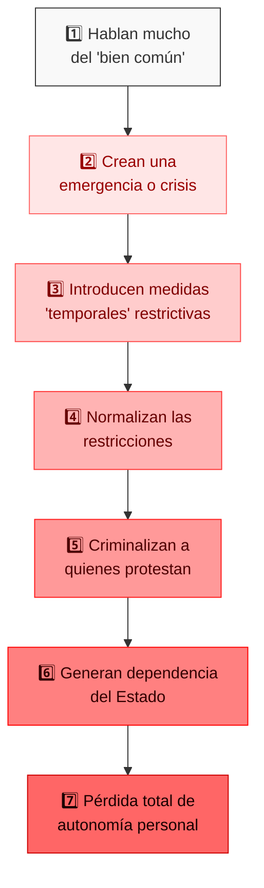

### ⚔️ Cómo Responder a estos Trucos

- **El Equilibrio Verdadero**: _"La verdadera comunidad fuerte se construye con individuos empoderados, no con personas dependientes del Estado."_

- **El Orden Natural**: _"Es normal y sano cuidar primero de uno mismo y la familia. Solo desde esa fortaleza podemos contribuir genuinamente a la comunidad."_

- **La Lección Histórica**: _"Cada vez que se ha priorizado 'lo colectivo' sobre el individuo por la fuerza, el resultado ha sido miseria compartida y élites privilegiadas, no igualdad."_

- **La Pregunta Clave**: _"Si realmente te preocupa el bienestar de todos, ¿por qué promueves un sistema que históricamente ha empobrecido a todas las sociedades donde se ha implementado?"_

## 12. Piensa en los Niños del Futuro: ¡Lo que Hagamos Hoy, Lo Heredarán Mañana! 👶

Una de las manipulaciones más poderosas es cuando los políticos toman decisiones que dan beneficios inmediatos (como ganar votos) pero crean problemas enormes para el futuro. Es como gastar todo el dinero de la alcancía hoy y dejar las deudas para que las paguen los niños mañana.

> 🌱 **Piensa así:** Cada decisión política importante debería pasar la "prueba del nieto" - ¿Cómo afectará esto a alguien que hoy tiene 5 años cuando sea adulto?

### 🔮 Tres Formas de Proteger el Futuro

#### 1. Pregunta Siempre: "¿Cómo Afecta a los Niños?" 👶

- **Lo que debes hacer**:

  - Evalúa cómo cada política afectará a quienes hoy no pueden votar pero vivirán con las consecuencias
  - Cuestiona decisiones que dan beneficios hoy pero crean problemas para el futuro
  - Señala cuando un político dice "por los niños" pero sus políticas realmente los perjudican

  > 🏫 **Ejemplo:** Si un político recorta presupuesto en educación para dar otros beneficios inmediatos a los votantes, pregunta: "¿Cómo preparará esto a los niños para el futuro?"

#### 2. Detecta "Trampas del Tiempo" ⏳

- **Cómo funcionan estos engaños**:

  - **Sistemas de pensiones sin fondos reales**: Prometen pagar pensiones futuras con dinero que no existe
  - **Deuda pública insostenible**: Gastar hoy lo que tendrán que pagar los jóvenes mañana
  - **Daño ambiental permanente**: Destruir recursos naturales por ganancias a corto plazo

  > 🎮 **Para entenderlo fácil:** Es como en un juego de estrategia cuando sacrificas todo tu desarrollo futuro por una pequeña ventaja inmediata. ¡Al final siempre pierdes!

#### 3. Piensa en Quién Debería Decidir ⚖️

- **Una idea importante**:

  - Las decisiones que afectarán los próximos 50 años deberían considerar más a quienes vivirán esos 50 años
  - No es justo que personas que no verán las consecuencias impongan cargas enormes a quienes sí las sufrirán

  > 🧩 **Reflexión:** Si una decisión afectará principalmente la vida de los jóvenes dentro de 20 años, ¿no deberían ellos tener más voz?

### 💬 Cómo Responder a Quienes No Piensan en el Futuro

- **Cuando dicen "Estamos preservando tradiciones"**:
  _"Esta política no 'preserva nuestros valores'; está sacrificando el futuro de nuestros hijos por beneficios que solo disfrutarán unos pocos hoy."_

- **Cuando no quieren renunciar a privilegios insostenibles**:
  _"Así como nuestros abuelos y padres intentan no ser una carga para nosotros, nosotros tampoco deberíamos transferir cargas insostenibles a nuestros hijos."_

- **Cuando hablan de "sacrificios necesarios hoy"**:
  _"El verdadero sacrificio no es renunciar a privilegios insostenibles ahora, sino condenar a las próximas generaciones a pagar nuestras deudas."_

- **La pregunta que todos deberíamos hacernos**:
  _"¿Qué mundo queremos dejar? ¿Uno donde nuestros hijos tengan oportunidad de prosperar, o uno donde carguen con las consecuencias de nuestra irresponsabilidad?"_

---

## 13. La Independencia Mental: ¡La Libertad Es Tu Mejor Defensa! 🏴‍☠️

Tu capacidad para resistir a los políticos manipuladores depende directamente de tu nivel de independencia. Cuanto más autónomo seas, menos vulnerable serás a sus trucos y manipulaciones.

> 🎮 **Como en los videojuegos:** Piensa en tu autonomía como un escudo que te protege de los ataques de los jefes finales.

### 🏰 Los Tres Pilares de Tu Fortaleza Personal

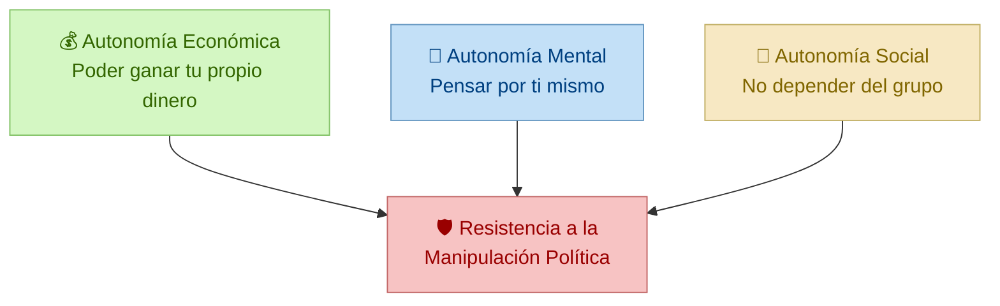

### 🕸️ La Trampa de la Dependencia: Así Te Atrapan

Los políticos manipuladores crean tres tipos de dependencia para controlar a las personas:

| Tipo de Trampa          | Cómo Te Atrapan                                                                               | Qué Te Pasa                                                                             |
| ----------------------- | --------------------------------------------------------------------------------------------- | --------------------------------------------------------------------------------------- |
| **💰 Trampa Económica** | Crean ayudas o subsidios que te hacen dependiente (pero no resuelven tu problema real)        | Te da miedo perder esas ayudas, así que no criticas al político aunque haga cosas malas |
| **🧠 Trampa Mental**    | Controlan lo que ves y escuchas, limitando tu acceso a otras ideas o información              | Te vuelves incapaz de cuestionar lo que te dicen o imaginar alternativas                |
| **👥 Trampa Social**    | Crean sistemas donde necesitas "portarte bien" políticamente para acceder a servicios básicos | Te autocensuras por miedo y presión del grupo, incluso entre amigos                     |

### 🛡️ Tres Superpoderes para Protegerte

#### 1. Sé Selectivo: Tu Primer Escudo 🔍

- **¿Qué significa?** Ser selectivo es tener estándares altos y filtros para lo que aceptas en tu vida.

- **Una persona NO selectiva**:

  - Acepta lo que dicen los políticos sin verificarlo
  - Tolera abusos de poder porque "siempre ha sido así"
  - No distingue entre información real y propaganda
  - Considera normal lo que en realidad es un abuso

- **¿Cómo fortalecerte?** Crea una lista escrita de lo que consideras aceptable e inaceptable en un gobernante. Revisa esta lista regularmente y úsala para evaluar a los políticos, sin importar si son de "tu equipo".

#### 2. No Vendas Tus Principios: Tu Segundo Escudo 🔄

- **¿Qué significa?** Es cuando intercambias tu dignidad o principios por protección o beneficios que controla el manipulador.

- **Ejemplos**:

  - Asistir a mítines políticos que no apoyas por miedo a perder tu trabajo
  - Quedarte callado ante injusticias para no perder servicios públicos
  - Denunciar a otros para ganar favores
  - Fingir públicamente que crees en mentiras que sabes que son falsas

- **¿Cómo liberarte?** Identifica dónde has comprometido tus valores por miedo o necesidad. Para cada caso, crea un plan pequeño pero gradual para reducir esa dependencia, aunque tome tiempo.

#### 3. Independencia Económica: Tu Escudo Más Poderoso 💪

- **¿Por qué es crucial?** Si no puedes mantenerte económicamente sin depender de quienes quieren manipularte, siempre serás vulnerable.

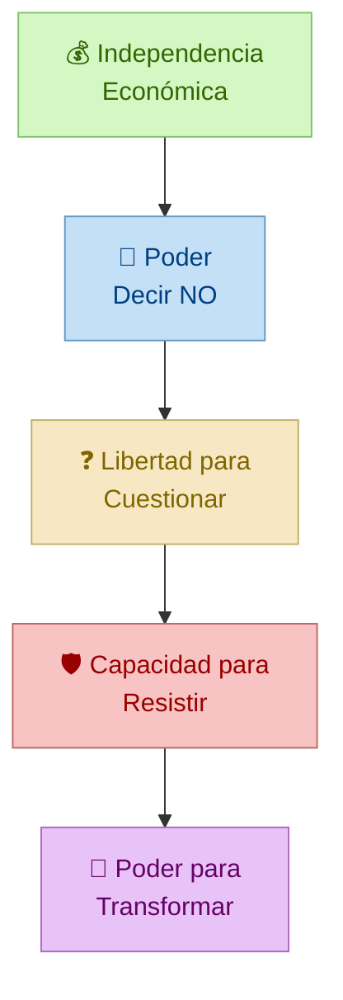

- **Componentes esenciales**:

  - **Múltiples fuentes de ingresos**: No dependas de un solo trabajo o cliente que pueda presionarte
  - **Ahorros de emergencia**: Tener dinero guardado para sobrevivir si tomas una postura que te cuesta tu trabajo
  - **Habilidades útiles en todos lados**: Aprende cosas que te permitan trabajar en muchos contextos diferentes
  - **Red de apoyo independiente**: Amigos y contactos que no estén controlados por el sistema político

- **Acción concreta**: Crea un "Fondo de Libertad" - una cuenta de ahorros especial que solo usarás si necesitas mantener tu independencia en momentos de presión.

### 📊 ¿Qué Tan Vulnerable Eres? Descubre tu Nivel

| Nivel                       | Cómo Es                                             | Características                                                                       | Cómo Mejorar                                                                             |
| --------------------------- | --------------------------------------------------- | ------------------------------------------------------------------------------------- | ---------------------------------------------------------------------------------------- |
| **1. Sometimiento Total**   | Dependes completamente del sistema                  | No tienes criterios propios, vives con miedo constante, apenas sobrevives             | Comienza a cuestionar en tu mente, busca pequeños espacios de autonomía mental           |
| **2. Obediencia Práctica**  | Obedeces por conveniencia aunque sabes que está mal | Por fuera te conformas, por dentro estás en desacuerdo, te autocensuras habitualmente | Construye gradualmente fuentes de ingresos alternativas y amplía tu círculo de confianza |
| **3. Resistencia Limitada** | Cuestionas solo en lugares seguros                  | Vives una doble vida: conformidad pública pero disidencia en privado                  | Conéctate con otros resistentes, fortalece tu independencia económica                    |
| **4. Autonomía Parcial**    | Tienes independencia en algunas áreas               | Puedes expresar desacuerdo en ciertos contextos sin consecuencias graves              | Expande tus áreas de independencia, desarrolla tus propias plataformas de expresión      |
| **5. Libertad Efectiva**    | Tienes independencia sustancial                     | Puedes cuestionar abiertamente sin amenazas a tu supervivencia                        | Usa tu posición privilegiada para crear estructuras que ayuden a otros a liberarse       |

### 🗺️ Plan de 5 Pasos para Ganar Tu Libertad

1. **Mira la Verdad** 🔍: Identifica honestamente tu nivel actual de dependencia en cada dimensión
2. **Pequeñas Rebeldías** 🌱: Comienza con actos pequeños de autonomía donde sea seguro hacerlo
3. **Construye Bases Sólidas** 🏗️: Desarrolla múltiples fuentes de ingresos y redes de apoyo
4. **Expande tu Territorio** 🌐: Amplía progresivamente tus zonas de independencia
5. **Ayuda a Otros** 🤝: Usa tu libertad para crear estructuras que ayuden a otros a liberarse

> 🌟 **Recuerda siempre**: La libertad no es solo una meta final, es una práctica diaria. Cada pequeña decisión autónoma que tomas fortalece tu resistencia a la manipulación política.

---

## 14. Supera las Redes Clientelares y la Manipulación Estatal 🕸️🔓

### 🎮 ¿Qué son las redes clientelares? Un juego muy peligroso

Imagina un juego donde un jugador tiene todos los recursos (comida, agua, juguetes) y los demás jugadores deben obedecerle para recibir algo. Así funcionan las **redes clientelares**: sistemas donde los políticos crean relaciones donde tú dependes de ellos para obtener lo que necesitas.

> 📝 **Palabra nueva:** Una red clientelar es como una telaraña donde el político está en el centro repartiendo favores (trabajos, ayudas, permisos) a cambio de tu apoyo y lealtad.

### 🔄 El ciclo de la trampa: Así funciona paso a paso

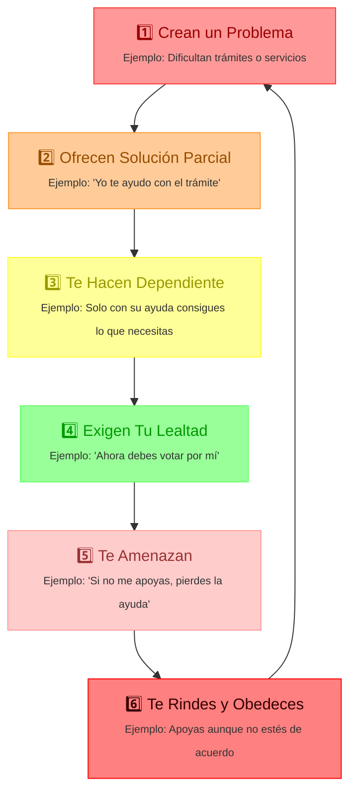

🎯 **¿Por qué debes conocer esto?** Porque cuando entiendes la trampa, es más difícil que caigan en ella tú, tu familia y tus amigos.

### 🔎 ¿Dónde encontramos estas trampas? Los 4 lugares principales

> 💡 **Consejo para niños:** Cuando veas estas situaciones, pregúntate: ¿Es justo que solo reciba ayuda quien apoya a cierto político? ¿O todos deberíamos tener las mismas oportunidades?

| Dónde Ocurre 📍               | Cómo Te Atrapan 🎣                                             | Señales de Peligro 🚨                                                                                   | Cómo Defenderte 🛡️                                                                                    |
| ----------------------------- | -------------------------------------------------------------- | ------------------------------------------------------------------------------------------------------- | ----------------------------------------------------------------------------------------------------- |
| **Trabajos Públicos** 👨‍💼      | Contratan solo a amigos o seguidores políticos                 | • Requisitos confusos • Procesos secretos • Todos los contratados son del mismo partido           | • Documentar casos raros • Exigir que todo sea visible • Crear formas de denunciar sin peligro  |
| **Ayudas Sociales** 🏥        | Dan beneficios solo a quienes prometen su voto                 | • Los beneficiarios son siempre votantes del mismo político • Quitan ayudas cuando gana otro partido | • Pedir reglas claras • Vigilancia independiente • Guardar pruebas de amenazas                  |
| **Contratos Públicos** 📝     | Dan obras y servicios a empresas amigas que financian campañas | • Pocas empresas ganan todos los contratos • No hay razones técnicas para elegirlas                  | • Analizar patrones • Investigación periodística • Plataformas que muestren toda la información |
| **Medios de Comunicación** 📰 | Pagan publicidad solo a medios que hablan bien de ellos        | • Medios críticos no reciben publicidad • Medios amigos reciben mucho dinero                         | • Buscar varias fuentes de financiación • Crear plataformas independientes                         |

### 🔄 La Gran Transformación: De "¿En qué crees?" a "¿Qué sabes hacer?"

> 💭 **Para entender fácil:** Antes la gente seguía a políticos porque compartían ideales (izquierda o derecha). Ahora, cada vez más personas eligen políticos que demuestran resolver problemas reales.

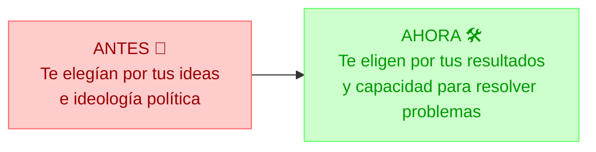

#### ✨ ¿Por qué está cambiando todo?

1. 🔍 **Información más accesible**: Ahora podemos verificar si un político miente o cumple lo que promete.

2. 📊 **Resultados comprobables**: Los ciudadanos cada vez valoran más lo que funciona que lo que suena bonito.

3. 💥 **Mayor costo de mentir**: Mentir ahora es como "escupir contra el viento" - la mentira regresa y golpea al mentiroso.

4. 🧠 **Ciudadanos más críticos**: Las personas empiezan a preferir políticos competentes sobre políticos simpáticos que no resuelven nada.

### 🦸‍♀️ Plan de Acción: Nuestros Superpoderes Ciudadanos

#### 1. 💡 Operación "Luz Brillante": Hacer Todo Visible

> **Actividad para niños:** Juega al "detective de contratos" - ¿Puedes encontrar patrones extraños en cómo se reparten los trabajos en tu ciudad?

- 🗺️ **Crear mapas que conecten puntos**: Mostrar visualmente quién recibe contratos y quién dona dinero a campañas políticas
- 📈 **Seguir el rastro del dinero**: Observar cómo cambian las propiedades y riqueza de los políticos y sus amigos
- 📊 **Analizar patrones con datos**: Comparar quién gana las elecciones y quién recibe más recursos públicos después

#### 2. 🏆 Operación "Premiar a los Valientes"

- 🎯 **Dar reconocimiento a quienes advirtieron**: Celebrar a las personas que vieron los problemas y avisaron, aunque nadie les hizo caso
- 🤝 **Apoyar a quienes arriesgan todo**: Crear redes de apoyo para quienes denuncian corrupción y pierden su trabajo por ello
- 📜 **Crear un "Libro de Aciertos"**: Registrar quién predijo correctamente problemas vs. quién mintió sobre ellos

#### 3. ⭐ Operación "Calificando Políticos"

- 📲 **Aplicaciones de evaluación**: Crear plataformas donde podamos calificar a los políticos con datos reales, no opiniones
- 📝 **Contador de promesas**: Sistemas que registren cada promesa y si fue cumplida o no
- 💰 **Monitor de eficiencia**: Evaluar cuánto logran hacer los políticos con el dinero público que manejan

#### 4. ⚖️ Operación "Responsabilidad Justa"

- 🧠 **Sistema de consecuencias**: Quienes apoyaron malas decisiones deberían asumir más costos de ellas
- 🏅 **Reconocimiento a los acertados**: Premiar a quienes advirtieron sobre problemas y tenían razón
- 📚 **Valorar el buen juicio**: Crear un sistema que premie a quienes demuestran tener buenas predicciones sobre políticas

### 🏛️ Reinventando Nuestra Relación con el Gobierno

Para romper las telarañas de dependencia, necesitamos cambiar totalmente cómo nos relacionamos con el Estado (gobierno):

#### 1. 🔄 De "Papá Estado" a "Estado Colaborador"

**ANTES:** El Estado como figura paternal que "regala" derechos y decide qué merecemos.

**AHORA:** El Estado como colaborador que respeta derechos que ya tenemos y ofrece ayudas temporales para que podamos valernos por nosotros mismos.

> 🧩 **Ejemplo para niños:** Es como cuando te enseñan a andar en bicicleta. Primero te sostienen (te ayudan), luego te sueltan poco a poco, y finalmente celebran que puedas andar solo. No te sostienen para siempre.

#### 2. 🦁 De "Ciudadanos Agradecidos" a "Ciudadanos Evaluadores"

**ANTES:** "Gracias por darme este servicio público, aunque funcione mal."

**AHORA:** "Yo pago impuestos, merezco servicios de calidad y puedo reclamar si no funcionan."

> 🍽️ **Ejemplo cotidiano:** Si pagas por una comida en un restaurante, tienes derecho a que esté bien hecha. Con los servicios públicos es igual - ¡tú los pagas con tus impuestos!

#### 3. 👕 De "Fanáticos de Equipos" a "Clientes Exigentes"

**ANTES:** "Apoyo a mi partido/político pase lo que pase, como hincha de un equipo de fútbol."

**AHORA:** "Evalúo a los políticos por sus resultados reales, no por sus discursos o por simpatía."

> 🛒 **Ejemplo de compra:** Cuando compras algo, no eliges productos solo porque te gusta el color del empaque, sino porque funcionan bien. Con los políticos debería ser igual.

---

#### 🌱 El Camino a la Libertad:

1. Primero, **libertad mental** para reconocer las manipulaciones
2. Luego, **libertad económica** para no depender de favores políticos
3. Finalmente, **acción conjunta** para desmantelar los sistemas injustos

> **🔍 ¿Quieres saber más?** En la sección [21. El Estado Mafioso](#21-el-estado-mafioso-anatomía-y-estrategias-de-resistencia-) veremos casos extremos donde gobiernos de Cuba, Venezuela y Nicaragua han convertido las redes clientelares en sistemas completos de control.

## 15. El Aprendizaje Autodidacta: ¡Tu Superpoder de Libertad Mental! 🧠📚

### 🎓 ¿Qué es un Autodidacta? Un Explorador del Conocimiento

Cuando los políticos manipuladores quieren controlar a la gente, ¿sabes qué hacen primero? ¡Controlan lo que aprenden! Por eso, aprender por tu cuenta (ser **autodidacta**) es como tener un superpoder que te protege.

> 💡 **Palabra nueva:** Un **autodidacta** es alguien que aprende por sí mismo, sin depender de profesores o escuelas. Como cuando aprendes a jugar un videojuego experimentando por tu cuenta.

### 🛡️ Cómo el Aprendizaje Independiente te Protege

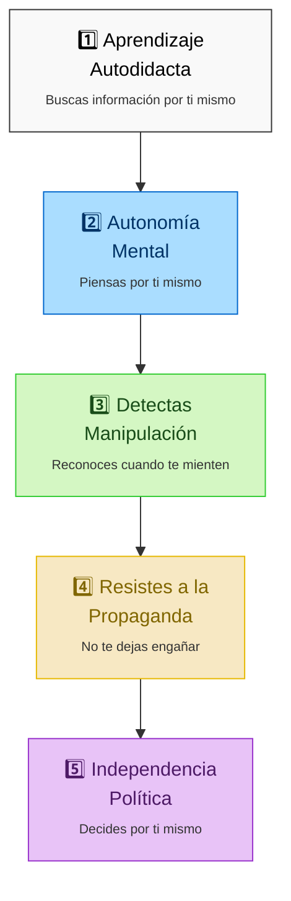

### 🚀 Conviértete en un Maestro del Aprendizaje Independiente

#### Paso 1: Conoce tus Superpoderes y Kryptonitas

**🧩 Actividad divertida:** Haz una lista de tus "Superpoderes de Aprendizaje" (lo que se te da bien) y tus "Kryptonitas" (lo que te cuesta más). ¡Conócete bien!

Antes de empezar a aprender por tu cuenta, pregúntate honestamente:

- **¿Puedes motivarte solo?** 🔋 ¿Estudiarías aunque nadie te lo pida?
- **¿Sabes organizarte?** 📋 ¿Puedes crear un plan y seguirlo?
- **¿Tienes disciplina?** 🕰️ ¿Mantienes una rutina aunque tengas pereza?

#### Paso 2: Crea tu Base Secreta de Aprendizaje

Para aprender como un verdadero autodidacta:

- **Crea un Rincón del Conocimiento** 📚: Un espacio tuyo dedicado solo a aprender, sin distracciones
- **Diseña tu Mapa del Tesoro** 🗺️: Haz un calendario con metas pequeñas (para esta semana) y grandes (para este año)
- **Usa el Método Tomate** ⏱️: Estudia concentrado durante 25 minutos y descansa 5 (¡esto se llama técnica Pomodoro!)
- **Conviértete en tu Propio Profesor** 📝: Haz exámenes a ti mismo para comprobar si estás aprendiendo de verdad

### 🕵️ Conviértete en Detective de Mentiras: Pensamiento Crítico para Niños

#### 🔎 Desmontando Argumentos Como un Experto

**🎮 Juego de detectives:** Cuando escuches a un político, descompón lo que dice como si fueran piezas de LEGO:

- **Las Bases** 🧱: ¿Qué está dando por hecho? (Ejemplo: "Como todos sabemos, los extranjeros causan problemas")
- **Los Puentes** 🌉: ¿Cómo conecta sus ideas? (Ejemplo: "Por lo tanto..." o "Esto demuestra que...")
- **El Destino** 🏁: ¿A qué conclusión quiere llegar? (Ejemplo: "Por eso debemos votar mi propuesta")

#### 🃏 Descubre los Trucos Trampa (Falacias)

**📝 Actividad:** Cada vez que veas un debate político, intenta identificar estos trucos:

- **Truco del Ataque Personal** 👊: "No escuchen a Juan porque tiene el pelo raro" (en vez de hablar de sus ideas)
- **Truco de "Solo hay 2 opciones"** 🔄: "O aceptas mi plan o la economía colapsa" (cuando en realidad hay muchas más opciones)
- **Truco del "Experto lo Dice"** 👨‍🔬: "Soy doctor, así que tengo razón" (aunque sea doctor en algo no relacionado)
- **Truco del Espantapájaros** 🎭: "Mi oponente quiere arruinarlo todo" (exagerando lo que realmente dijo)

#### 📰 Evalúa las Noticias Como un Profesional

**🧰 Tu kit de verificación de noticias:**

- **¿Quién lo dice?** 👤 ¿Es experto en el tema o solo alguien famoso?
- **¿Cuándo se publicó?** 📅 ¿Es información actual o antigua presentada como nueva?
- **¿Se puede comprobar?** ✅ ¿Otras fuentes confiables dicen lo mismo?
- **¿Tiene favoritismos?** ⚖️ ¿El autor tiene intereses que podrían hacerlo parcial?
- **¿Está completo?** 🧩 ¿Cuenta toda la historia o solo la parte conveniente?

### 🌍 Aprende Aunque te lo Quieran Impedir: Recursos para Lugares Difíciles

#### 💻 Plataformas para Aprender Cuando Internet Está Controlado

> 🦸‍♂️ **Dato interesante:** En algunos países, los gobiernos bloquean páginas web para que las personas no puedan aprender libremente. ¡Pero siempre hay formas de seguir aprendiendo!

Aquí tienes tres formas de seguir aprendiendo incluso si intentan limitarte:

- **Crea una Biblioteca de Bolsillo** 📱: Descarga Wikipedia completa, cursos y libros en tu teléfono o USB cuando tengas internet. ¡Así podrás leerlos sin conexión!

- **Usa Túneles Secretos (VPNs)** 🕳️: Son programas que hacen un "túnel secreto" en internet para saltarse los bloqueos. Es como tener un pasadizo secreto en el castillo.

- **Forma un Club de Aprendizaje** 👥: Reúne amigos donde cada uno aprende algo diferente y luego se lo enseña a los demás. ¡Entre todos pueden aprender mucho más!

#### 🧠 Aprende a Pensar Sobre Tu Pensamiento (Metacognición)

Para ser un verdadero maestro del aprendizaje, debes observar cómo piensas:

- **Crea Tu Diario de Aventuras del Conocimiento** 📔: Escribe en una libreta especial:

  - Lo nuevo que aprendiste hoy
  - Las preguntas que todavía tienes
  - Cómo se conecta con cosas que ya sabías
  - Formas en que puedes usar lo que aprendiste

- **Tres Trucos para Comprobar si Entendiste** 🎯:
  - **Truco del Profesor**: Explica el tema a un amigo o a un peluche como si fueras profesor
  - **Truco del Abogado del Diablo**: Busca razones por las que lo que aprendiste podría estar equivocado
  - **Truco del Consejero**: Pide a alguien más que te diga qué piensa de tus ideas

### 📚 Tu Caja de Herramientas para Aprender por tu Cuenta

| Tipo de Recurso 🔍               | Las Mejores Herramientas para Niños y Jóvenes 🌟                     | Cómo Te Ayuda Contra la Manipulación 💪                                        |
| -------------------------------- | -------------------------------------------------------------------- | ------------------------------------------------------------------------------ |
| **Pensamiento Crítico** 🧠       | Juegos de lógica, Libros de "¿Por qué?" y "Piensa como un detective" | Te ayuda a detectar cuando te mienten en discursos o noticias                  |
| **Cursos Online Gratuitos** 🎓   | Khan Academy, Coursera Kids, edX                                     | Puedes aprender de los mejores profesores sin depender de escuelas controladas |
| **Bibliotecas Digitales** 📖     | Project Gutenberg (libros gratis), OER Commons, Wikipedia            | Accede a miles de libros e información gratuita sobre historia, política y más |
| **Aplicaciones de Estudio** 📱   | Quizlet (tarjetas de estudio), Anki (memorización), Notion           | Organiza lo que aprendes y memoriza datos importantes fácilmente               |
| **Verificadores de Noticias** 🔍 | Maldita.es (para niños), Newtral                                     | Aprende a comprobar si una noticia es verdadera o falsa                        |

### 🛡️ Mantente Libre Mentalmente: Estrategias Clave

#### 5 Superpoderes para la Independencia Mental:

1. **La Regla de las 3 Fuentes** 🔎: Antes de creer algo importante, búscalo en al menos tres lugares diferentes. Si todos dicen lo mismo (sobre todo si tienen opiniones diferentes en otros temas), probablemente sea cierto.

2. **El Ayuno Digital** 📵: Apaga las noticias, redes sociales y televisión durante un día a la semana. Esto limpia tu mente de tanta propaganda y te ayuda a pensar más claramente.

3. **El Club de los "¿Por qué?"** 👥: Forma un grupo con amigos donde esté permitido cuestionar todo respetuosamente. Hablen de temas interesantes y hagan preguntas sin miedo.

4. **El Diario de Contradicciones** 📓: Anota cuando un político dice una cosa y luego hace o dice lo contrario. Con el tiempo verás patrones en quiénes mienten más.

### 🔍 Tu Mapa para Evaluar Información: ¡Conviértete en Detective de la Verdad!

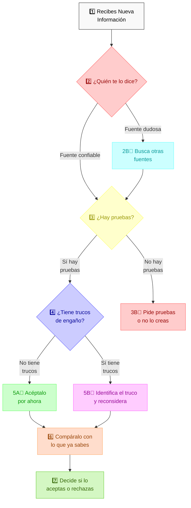

### 📣 ¡Mensaje Importante para Todos los Niños y Jóvenes!

> 🌟 **Lo que aprendes por tu cuenta es tu SUPERPODER contra la manipulación**. Como dijo el famoso escritor Ray Bradbury: "No necesitas quemar libros para destruir una cultura. Solo haz que la gente deje de leerlos."

Cuando lees, investigas y piensas por ti mismo, estás creando un escudo invisible que te protege de quienes quieren controlar tu mente. **¡La curiosidad y el pensamiento crítico son tus mejores armas!**

#### 🦸‍♀️ Recuerda siempre:

- Cuestiona la información que recibes
- Busca varias fuentes antes de decidir qué creer
- No tengas miedo de cambiar de opinión si encuentras mejores pruebas
- ¡Nunca dejes de aprender y hacer preguntas!

## 16. Políticos Peligrosos: ¿Cómo Identificarlos y Protegerte? 🔍🎭

### 🦹‍♂️ Cuidado con los "Supervillanos" de la Política

¿Has visto en las películas esos villanos que son encantadores pero en realidad son muy malos? En el mundo real, algunos políticos son así: pueden parecer amables y carismáticos, pero en realidad no les importa hacer daño a los demás para conseguir lo que quieren.

> 💡 **Palabra nueva:** La **psicopatía política** ocurre cuando un líder usa su carisma (encanto) para manipular a la gente, sin sentir remordimiento por el daño que causa. Es como el "Joker" pero en la vida real.

### 🚨 Señales de Alarma: El "Kit de Detección de Políticos Peligrosos"

Estos políticos muestran comportamientos que puedes aprender a identificar:

| Señal de Peligro 🚩            | Cómo se ve en sus discursos 🗣️                                           | Ejemplo que podrías escuchar 👂                                   |
| ------------------------------ | ------------------------------------------------------------------------ | ----------------------------------------------------------------- |
| **Mentiras Constantes** 🤥     | Dice falsedades una y otra vez sin ponerse nervioso                      | "No subiré los impuestos" (mientras ya está preparando la subida) |
| **Juega con tus Emociones** 😢 | Usa historias para asustarte o enfadarte a propósito                     | "Solo yo puedo protegerte de estos peligros terribles"            |
| **No le Importa tu Dolor** 💔  | Habla con frialdad del sufrimiento que causan sus decisiones             | "Si hay víctimas, es el precio necesario por un futuro mejor"     |
| **Se Cree un Superhéroe** 🦸   | Se compara con grandes figuras históricas o se presenta como un salvador | "La historia me dará la razón" o "Solo yo puedo salvar al país"   |
| **Siempre Necesita Drama** 🎭  | Crea crisis constantemente para mantenerse en el centro de atención      | Inventa conflictos con otros países o grupos minoritarios         |

#### 🕵️ Aprende a Distinguir: No Todos los Políticos Difíciles Son Iguales

Es importante que aprendas a diferenciar entre:

- **Político Narcisista** 🪞: Le encanta que lo admiren y puede manipular, pero se preocupa por lo que piensen de él y puede sentir algo de empatía. Como un niño que siempre quiere ser el centro de atención.

- **Político Psicópata** ❄️: Mucho más peligroso porque puede ser cruel sin sentir remordimiento, manipula fríamente y no tiene nada de empatía. Usa a las personas como si fueran herramientas, no como seres humanos.

### 🎯 Trucos de Lenguaje: Cómo Detectar sus Palabras Manipuladoras

Los políticos peligrosos tienen formas especiales de hablar para engañarte:

#### 1. **El Truco de las Palabras Nube** ☁️

Usan palabras vagas que pueden significar cualquier cosa:

- ❌ _"Tomaremos medidas apropiadas"_ (sin decir cuáles)
- ❌ _"Defendemos los valores tradicionales"_ (sin explicar qué valores)

> 🧩 **Actividad:** Cada vez que escuches a un político, pregúntate: "¿Podría explicar con palabras exactas lo que acaba de decir?" Si no puedes, ¡cuidado con el truco de las palabras nube!

#### 2. **El Truco del "Ganamos Todos"** 🏆

Te hacen creer que lo que es bueno para ellos es bueno para ti:

- ❌ _"Este sacrificio que les pido hoy nos hará más fuertes mañana"_
- ❌ _"Cuando yo gano, ganamos todos"_

#### 3. **El Truco de "La Culpa es Tuya"** 👉

Culpan a las víctimas de sus propias políticas dañinas:

- ❌ _"Si estás sufriendo es porque no te has esforzado lo suficiente"_
- ❌ _"Los problemas de nuestro país se deben a que ustedes no son suficientemente patriotas"_

#### 4. **El Truco de Cambiar el Significado** 🔄

Cambian el significado de palabras importantes para engañarte:

- ❌ Dicen _"libertad"_ pero quieren decir "obedéceme sin preguntar"
- ❌ Hablan de _"democracia"_ pero se refieren a "apóyame incondicionalmente"

### 🛡️ Cómo Protegerte: Tu Escudo Anti-Manipulación

Para defenderte de políticos peligrosos, puedes usar estas técnicas:

#### 1. **El Escudo Gris** 🪨

> 🎮 **Juego de rol:** Imagina que eres un científico observando un experimento. ¡No te involucres emocionalmente!

- 😐 Mantén expresiones neutras cuando escuches sus discursos
- 🤐 No compartas información personal que puedan usar contra ti
- 📝 Comunícate de forma breve y con hechos, sin mostrar tus emociones

#### 2. **La Libreta de Detective** 🕵️‍♀️

Lleva un registro detallado (en papel o digital) de:

- 📊 Lo que prometen vs. lo que realmente hacen
- 🗣️ Cómo cambian su discurso según con quién hablen
- 👥 Cómo tratan a quienes están en contra de ellos

#### 3. **El Modo Científico** 🔬

Aprende a observar sus tácticas sin dejarte afectar:

- 🧪 Analiza sus discursos como si estudiaras un experimento científico
- 📺 Cuando veas propaganda, imagina que estás viendo un documental sobre manipulación

### 📺 Control Total de la Narrativa: El Ejemplo Cubano

Los estados mafiosos mantienen su poder mediante un control absoluto de la narrativa pública. Cuba ofrece un ejemplo claro de cómo funciona este sistema:

#### 1. 📰 Control de los Medios

- **Monopolio Informativo**: Todos los medios son propiedad del estado
- **Censura Sistemática**: Prohibición de "propaganda anti-gubernamental"
- **Narrativa Única**: Solo se permite la versión oficial de los acontecimientos

#### 2. 📚 Manipulación Educativa

- **Adoctrinamiento Temprano**: Educación ideológica desde la infancia
- **Reescritura Histórica**: Presentación selectiva de eventos históricos
- **Glorificación de Líderes**: Construcción de culto a la personalidad

#### 3. 🎭 Técnicas de Distracción

- **Culpa Externa**: Atribuir todos los problemas al "enemigo" (embargo)
- **Logros Selectivos**: Destacar éxitos específicos mientras ocultan fracasos
- **Propaganda Constante**: Repetición continua de mensajes ideológicos

### El Círculo Peligroso: Cómo Trabajan los Políticos Manipuladores

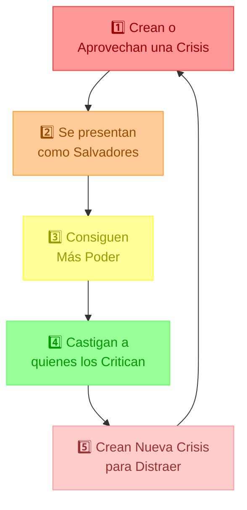

> 🎬 **Ejemplo de película:** Si estos tres países fueran equipos en un videojuego malo, Cuba sería el "jefe" con más experiencia, Venezuela el personaje con mucho dinero pero corrupto, y Nicaragua el clan familiar donde todos los poderes están concentrados en una sola familia.

### 👥 El Truco del Traidor: ¿Por Qué Buscan a los "Judas"?

> 📚 **Historia para aprender:** En la Biblia, Judas traicionó a Jesús por 30 monedas de plata. Los Estados mafiosos usan esta misma estrategia del "traidor" todo el tiempo.

Los Estados mafiosos siempre buscan a alguien que traicione a su grupo. Esto funciona como en la historia de Judas:

1. **Compran Lealtad por Poco** 💰: Como las 30 monedas de Judas, ofrecen pequeñas recompensas para que alguien traicione a su familia, amigos o compañeros.

   > 🧩 **Ejemplo:** Un pequeño trabajo, un permiso especial, o protección contra problemas que el mismo gobierno creó.

2. **Buscan a los más Cercanos** 🎯: Como Judas era amigo de Jesús, estos gobiernos intentan corromper a personas cercanas a sus objetivos porque:

   - Conocen secretos e información valiosa
   - Causan más daño emocional cuando traicionan
   - Destruyen la confianza dentro del grupo

3. **Los Desechan Después** 🗑️: Como Judas fue abandonado después de la traición, los Estados mafiosos suelen desechar a sus traidores cuando ya no los necesitan.

4. **Lo Hacen Público** 📣: Muestran públicamente las "recompensas" que reciben los traidores para tentar a otros a hacer lo mismo, pero ocultan cómo terminan abandonados después.

### 🛡️ Cómo Defendernos: Estrategias contra Estados Mafiosos

#### 1. 🧱 Protege tu Independencia Personal

- **Crea Economías Alternativas** 🛒: Desarrolla formas de intercambio y comercio que el gobierno no pueda controlar fácilmente

  > 🧩 **Ejemplo:** Mercados locales, trueque, cooperativas comunitarias

- **No Dependas Solo del Gobierno** 🌱: Busca diferentes formas de obtener ingresos y recursos

- **Fortalece tu Mente** 💪: Prepárate psicológicamente para resistir presiones y amenazas

#### 2. 📝 Documenta Todo lo Malo que Pasa

- **Guarda Pruebas Organizadas** 📂: Crea archivos detallados sobre corrupción y abusos

  > 🎮 **Actividad:** Como en los juegos de detectives, recopila evidencias (fotos, videos, documentos) de forma segura

- **Protege la Información** 🔒: Aprende a guardar pruebas donde no puedan confiscarlas

- **Mantén la Cadena de Custodia** ⛓️: Asegúrate de que las evidencias puedan usarse legalmente en el futuro

#### 3. 🗣️ Cuenta una Historia Verdadera y Poderosa

- **Desmonta las Mentiras Oficiales** 🔍: Contrasta lo que dice la propaganda con la realidad que puedes verificar

- **Da Voz a las Víctimas** 👤: Cuenta las historias de quienes sufren la represión para que no sean solo números

- **Muestra las Contradicciones** ⚖️: Señala cuando lo que dicen es diferente de lo que hacen

- **Recupera los Símbolos Nacionales** 🏁: No dejes que los malos se apropien de la bandera, el himno o los héroes nacionales

#### 4. 🏘️ Construye Comunidades Fuertes

- **Crea Redes de Apoyo** 👫: Sistemas para ayudar a quienes resisten y a las víctimas

- **Enseña lo que Otros Quieren Ocultar** 📚: Educación alternativa sobre historia, derechos y resistencia

- **Preserva tu Cultura** 🎭: Mantén vivas tradiciones y valores que el régimen quiere destruir

### 🔄 El Círculo de la Resistencia: Un Ciclo Continuo de Defensa

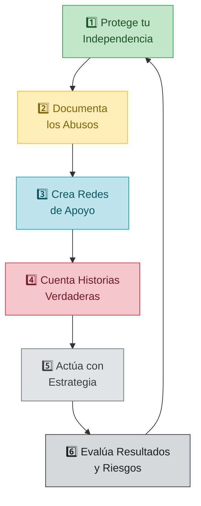

> 🎮 **Piensa como en un videojuego:** Para vencer al "jefe final" (el Estado Mafioso), necesitas completar todas estas misiones en orden, y luego volver a empezar para hacerte más fuerte. Cada vez que completas el ciclo, tu resistencia se hace más poderosa.

### Tabla: Estrategias específicas contra tácticas del Estado Mafioso

| Táctica del Estado Mafioso | Estrategia Defensiva                                      | Implementación Práctica                                                              |
| -------------------------- | --------------------------------------------------------- | ------------------------------------------------------------------------------------ |
| Cooptación mediática       | Desarrollo de medios independientes digitales             | Plataformas descentralizadas, financiamiento colectivo, encriptación                 |
| Desmoralización social     | Celebración de pequeñas victorias y rituales comunitarios | Eventos culturales, reconocimiento de resistentes, preservación de memoria histórica |
| Represión selectiva        | Sistemas de alerta temprana y evacuación                  | Protocolos de seguridad para activistas, rutas de escape, refugios seguros           |
| Guerra psicológica         | Técnicas de resiliencia psicológica y contrapropaganda    | Grupos de apoyo, terapias colectivas, desmontaje de narrativas manipuladoras         |
| Control económico          | Economías alternativas y redes de solidaridad             | Intercambio directo, cooperativas autogestionadas, fondos comunitarios               |

### 🏝️ Plan de Rescate: El Ejemplo de Cuba

No basta con resistir a un Estado Mafioso - ¡también necesitamos un plan para transformarlo! A continuación veremos un plan paso a paso de cómo se podría restaurar la democracia en Cuba, uno de los ejemplos más conocidos de Estado Mafioso:

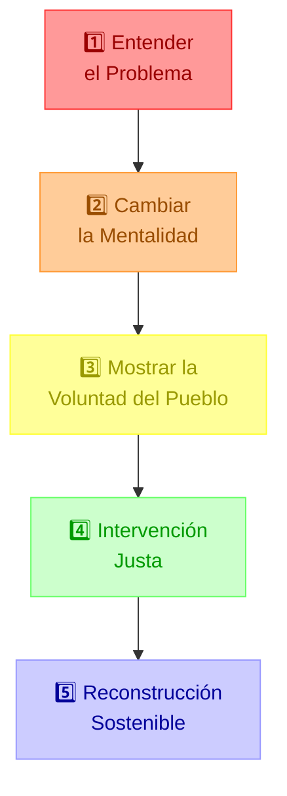

#### 1. 🔍 Entender el Doble Problema: Lo de Dentro y lo de Fuera

Para ayudar a un país como Cuba, primero hay que entender que hay dos problemas que resolver:

- **Problema Interno** 🏠: La gente no tiene libertad económica (no pueden crear negocios propios fácilmente, tienen sueldos muy bajos) y muchas personas deben hacer cosas que no quieren solo para sobrevivir.

- **Problema Externo** 🌍: El gobierno del país ha sido incluido en listas internacionales de países que apoyan actividades peligrosas como el tráfico de drogas. Por su posición en el mar Caribe, esto preocupa a otros países de la región.

#### 2. 🧠 Cambiar la Forma de Pensar: Un Nuevo Chip Mental

Para transformar un Estado Mafioso, lo primero que hay que cambiar es cómo piensa la gente:

- **Desinstalar Programas Mentales Dañinos** 🖥️: Ayudar a las personas a darse cuenta de que es normal y bueno ser independiente, y no depender siempre del gobierno para todo.

  > 💭 **Ejemplo para niños:** Como cuando aprendes que puedes atarte los zapatos solo, en vez de esperar siempre que un adulto lo haga por ti.

- **Instalar Nuevos Valores** 💎: Cambiar la idea de que "ser leal al gobierno es lo más importante" por valores como "ser responsable de tu vida", "ayudarnos unos a otros voluntariamente" y "pensar por ti mismo".

- **Vencer el Miedo** 🦁: Superar el temor que han sentido durante décadas debido a la vigilancia constante y el castigo a quienes piensan diferente.

#### 3. 🗣️ Mostrar lo que el Pueblo Realmente Quiere

Para que un cambio sea legítimo (justo y aceptado), debe quedar muy claro que es lo que la mayoría de la gente realmente desea:

- **Arte y Música como Resistencia** 🎭: Usar expresiones culturales (canciones, pinturas, bailes) para mostrar al mundo el deseo auténtico de libertad.

  > 🎵 **Ejemplo:** Como cuando una canción que habla de libertad se vuelve muy popular porque expresa lo que todos sienten pero tienen miedo de decir.

- **Guardar Pruebas de lo que Quiere la Gente** 📝: Documentar de muchas maneras (encuestas, videos, testimonios) que la mayoría de las personas quiere un cambio real en el sistema.

- **Ayuda, No Imposición** 🤝: Dejar muy claro que cualquier ayuda externa viene porque los ciudadanos la han pedido, no porque otros países quieran imponerla.

#### 4. ⚖️ Intervención Justa: Usar la Fuerza Solo Cuando es Necesario

A veces, para transformar un Estado Mafioso muy arraigado, puede ser necesario usar algún tipo de fuerza, pero debe hacerse de forma ética:

- **Usar Solo la Fuerza Necesaria** 📏: Cualquier acción debe ser proporcional (ni demasiado, ni demasiado poco), necesaria y dirigida contra los opresores, nunca contra la población.

  > 🧩 **Ejemplo:** Piensa en un médico usando una inyección - duele un poco, pero es lo mínimo necesario para curar y solo se hace cuando no hay otra opción.

- **Por el Bien de Todos** ❤️: Los ejércitos y fuerzas de seguridad no solo están para defender fronteras, sino también para proteger a personas oprimidas cuando no hay otra forma de cambio.

- **Con Fecha de Caducidad** ⏱️: Cualquier intervención debe tener un tiempo límite claro y supervisión internacional para asegurar que realmente está ayudando, no conquistando.

#### 5. 🏗️ Reconstrucción que Dure: Un Plan Económico Realista

La transformación necesita un plan económico realista que reconozca que al principio habrá limitaciones:

- **Plan a Largo Plazo** 📈: Establecer formas de financiar la reconstrucción del país con una deuda que se pueda pagar cómodamente con el tiempo.

- **Condiciones para el Éxito** 📋:

  1. **Responsabilidad Gradual** 💵: El país (como Cuba en este ejemplo) iría asumiendo poco a poco los gastos de su reconstrucción
  2. **No Morder la Mano Amiga** 🤝: Compromiso de no atacar a quienes ayudaron en el proceso
  3. **Protección Anti-Dictadores** 🛡️: Prohibición en la Constitución de políticas que puedan reinstalar sistemas autoritarios
  4. **Compromiso con Otros** 🌍: Ayudar activamente a sancionar otros regímenes similares en el mundo

- **Como un Contrato de Seguridad** 🔐: Es como cuando contratas seguridad para tu tienda: tú pagas por el servicio y te comprometes a mantener condiciones seguras.

Este plan para transformar Cuba podría adaptarse para otros Estados Mafiosos, siempre teniendo en cuenta la cultura, historia y situación geopolítica de cada país.

## 17. La Dinámica del Poder: Los Dos Caminos de la Fuerza 🦁🛡️

### 💪 El Poder: ¿Para Construir o para Dominar?

¿Alguna vez te has preguntado por qué algunos líderes usan su poder para ayudar y otros para dominar? Entender cómo funciona el poder nos ayuda a protegernos de quienes quieren manipularnos.

> 🧩 **Explicación simple:** El poder es como tener un martillo. Puedes usarlo para construir una casa o para romper cosas. Lo importante no es tener el martillo, sino cómo decides usarlo.

### 🧠 La Gran Paradoja: El Poder Verdadero vs. El Poder Falso

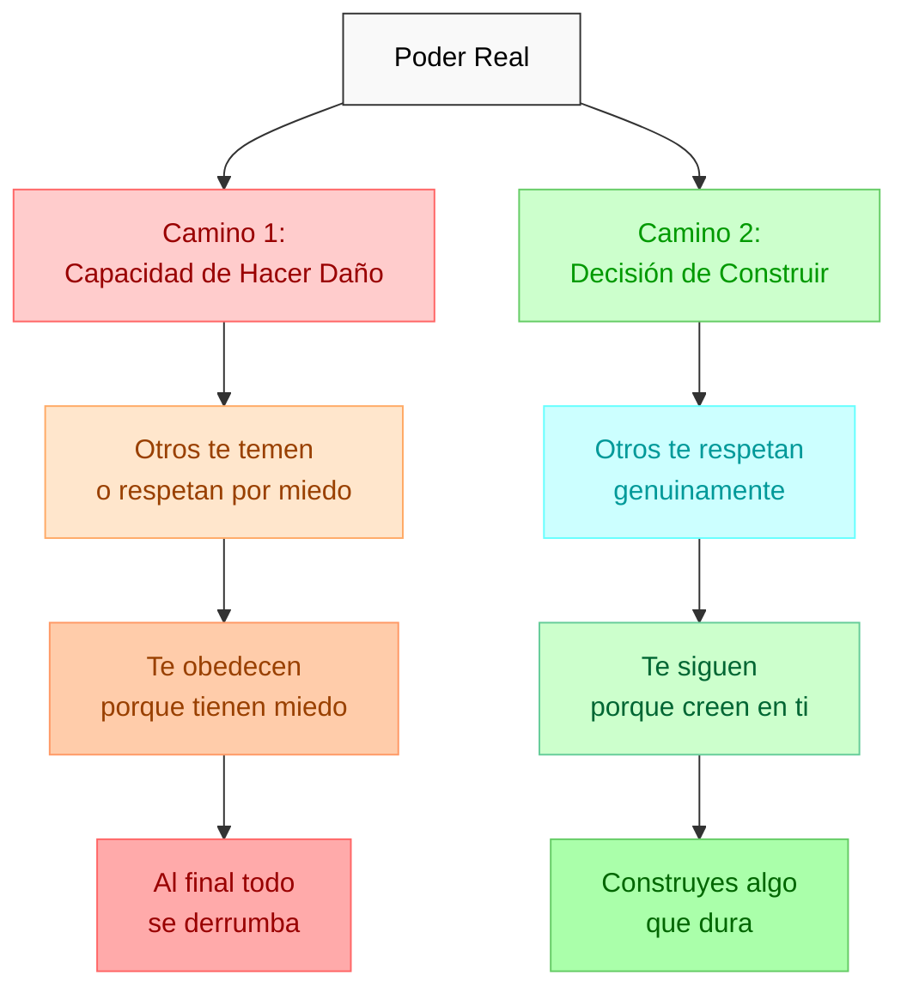

#### 🌟 La Lección más Importante sobre el Poder

> 🧠 **Pensamiento profundo para niños:** El poder verdadero no está en poder lastimar a otros, sino en poder hacerlo y elegir NO hacerlo. Como dijo el filósofo Séneca hace muchos años: "La clemencia (ser amable cuando podrías no serlo) es lo que distingue al príncipe del tirano."

#### Reconoce las Diferencias: Poder Bueno vs Poder Malo

| Poder que Construye ✅         | Poder que Destruye ❌        |
| ------------------------------ | ---------------------------- |
| Te inspira sin amenazarte      | Te amenaza para controlarte  |
| Ayuda a que todos crezcan      | Quiere que todos obedezcan   |
| Se gana respeto por resultados | Se gana obediencia por miedo |
| Te invita a participar         | Te hace dependiente          |
| Acepta ser cuestionado         | No permite que lo cuestionen |

### 🐯 El Instinto de Supervivencia: Tu Poder Oculto

¿Has visto documentales donde animales tranquilos se vuelven muy valientes cuando están acorralados? Los humanos también tenemos ese "modo supervivencia" que se activa en situaciones extremas.

#### La Fuerza de Quien No Tiene Nada que Perder 🔥

- **El Punto de No Retorno** 🚫: Hay un momento en que las personas acorraladas descubren poderes que no sabían que tenían

  > 🧩 **Ejemplo:** Piensa en una mamá normal levantando un auto para salvar a su hijo. ¡Eso es el instinto de supervivencia en acción!

- **Transformación Bajo Presión** ⚡: Cuando estamos verdaderamente amenazados:
  - Nuestro cerebro activa "superpoderes" de supervivencia
  - Dejamos de preocuparnos por lo que otros piensen
  - Descubrimos ideas y soluciones que normalmente no veríamos
  - Nos volvemos increíblemente creativos para resolver problemas

### 🌈 Lecciones Importantes que Podemos Aprender

#### 1. 🧠 La Diferencia entre Fuerza y Poder Verdadero

> 🎮 **Actividad:** Piensa en tus superhéroes favoritos. Los mejores son aquellos que tienen gran poder pero lo usan con responsabilidad, ¿verdad?

- ⭐ El poder más grande está en poder hacer daño pero elegir no hacerlo
- 🏗️ Construir cuando podrías destruir hace que la gente te respete de verdad
- ⚠️ Si obtienes obediencia por miedo, tarde o temprano la gente se rebelará

#### 2. 🛡️ Lo que Pasa Cuando Acorralas a Alguien

- 🔥 Las personas más peligrosas para un sistema injusto son las que ya no tienen nada que perder
- 🦁 Quienes superan el miedo a lo que les pueda pasar se vuelven imparables
- 💪 La desesperación puede convertir a personas normales en extraordinarias

#### 3. 🎯 El Secreto para Enfrentar a un Manipulador

- 🤖 Los manipuladores esperan que reacciones de forma predecible
- 🎲 Cuando actúas de forma inesperada (impulsado por tu instinto de supervivencia), los confundes
- 🧩 La imprevisibilidad estratégica desestabiliza sus sistemas de control

### 🥷 Estrategias Prácticas: El Arte del Poder Silencioso

#### El Poder de la Discreción 🤫

- 🌱 Desarrolla tus habilidades sin presumir; el verdadero poder no necesita anunciarse
- 🧱 Construye tus proyectos sin hacer mucho ruido
- 🏆 Deja que tus logros hablen por ti, no tus palabras
- 💭 Recuerda: "El poder verdadero hace que los demás vean tu valor sin que tengas que imponerte"

#### Prepárate para Todo 🌪️

- 📚 Cultiva recursos que nadie pueda quitarte (como conocimiento y habilidades)
- 🛠️ Aprende cosas útiles que funcionen en cualquier situación
- 👫 Crea redes de amigos que se apoyen mutuamente en momentos difíciles
- 🗺️ Siempre ten un "Plan B"; no te quedes sin opciones

#### Frases para Recordar 📝

- "La verdadera fuerza es elegir construir, pero nunca olvidar que puedes defenderte si es necesario"
- "El manipulador solo teme a quien ya no tiene miedo a las consecuencias"
- "La bondad más poderosa viene de quien tiene toda la capacidad de hacer daño y elige no hacerlo"

### Diagrama: El espectro de respuestas bajo presión política

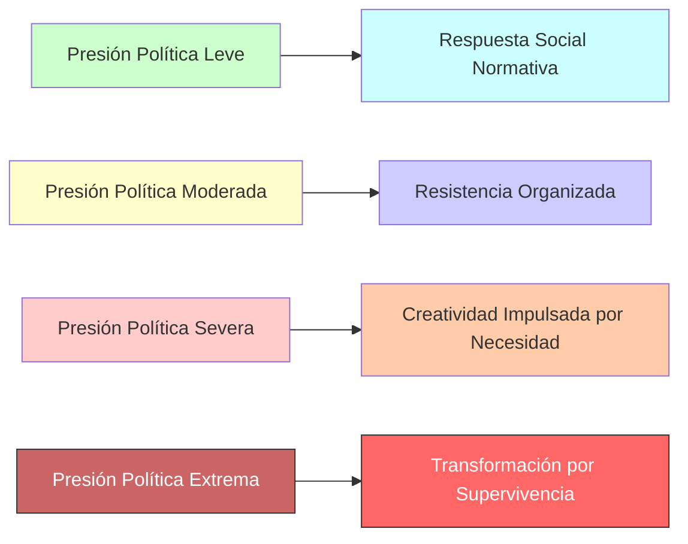

Este conocimiento nos permite not only entender la naturaleza del poder político manipulador, sino también reconocer la extraordinaria capacidad humana de transformación bajo presión extrema. Como ciudadanos conscientes, podemos canalizar constructivamente esta comprensión de las dinámicas profundas del poder para crear sistemas de resistencia efectivos que protejan la dignidad y libertad de todos.

Como observó Viktor Frankl tras sobrevivir a los campos de concentración: "Al hombre se le puede arrebatar todo salvo una cosa: la última de las libertades humanas —la elección de la actitud personal ante un conjunto de circunstancias—".

---

## 18. El Truco del Problema-Reacción-Solución: ¡Descubre el Engaño! 🎭🔍

### 🎬 El "Guion Secreto" de los Políticos Manipuladores

¿Te has dado cuenta de que algunos políticos parecen tener siempre una solución lista para cada problema? A veces, ¡es porque ellos mismos crearon el problema a propósito! Este truco se llama **"problema-reacción-solución"** y funciona así: primero crean un problema, luego esperan a que todos se asusten y pidan ayuda, y finalmente aparecen como "superhéroes" con una solución que tenían preparada desde el principio.

> 🎮 **Ejemplo de videojuego:** Es como si un personaje causara un incendio en secreto y luego apareciera con un extintor para "salvar" a todos... ¡y pedir que lo nombren jefe de bomberos!

### 🔍 Radiografía del Truco: Así Funciona Paso a Paso

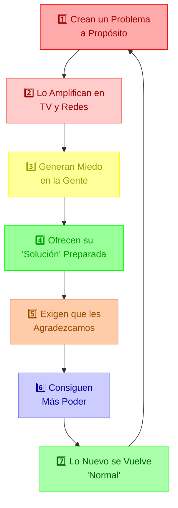

### 📝 Ejemplos para Entender Cómo Funciona Este Truco

| Paso del Truco           | Lo que Hace el Político Manipulador                      | Un Ejemplo del Mundo Real                                                                              |
| ------------------------ | -------------------------------------------------------- | ------------------------------------------------------------------------------------------------------ |
| **1. Crear un problema** | Crea o hace más grande una crisis                        | Manejar mal una emergencia (como una pandemia) para poder después justificar medidas extremas          |
| **2. Amplificar**        | Usa TV, radio y redes para que todos hablen del problema | Noticias alarmistas todo el día, sin mostrar otros puntos de vista                                     |
| **3. Generar miedo**     | Hace que la gente se asuste tanto que deje de pensar     | "Si no hacemos lo que digo, ¡habrá un desastre terrible!"                                              |
| **4. Ofrecer solución**  | Presenta la medida que siempre quiso implementar         | Imponer restricciones que normalmente serían ilegales, sin seguir los procedimientos correctos         |
| **5. Exigir gratitud**   | Se hace pasar por héroe y pide lealtad                   | "Gracias a mí y mis medidas, salvé miles de vidas. ¡Deberían estar agradecidos!"                       |
| **6. Normalizar**        | Hace que lo nuevo (y malo) parezca lo normal             | Lo que antes era inaceptable ahora se ve como "necesario" y crea precedente para futuras restricciones |

### 🦠 Caso Real: La Pandemia de COVID-19 y Cómo Usaron este Truco

La pandemia del COVID-19 nos muestra claramente cómo algunos políticos usaron el truco "problema-reacción-solución" para imponer reglas que normalmente la gente no habría aceptado.

> 💡 **Importante para niños:** El COVID-19 fue un virus real y peligroso. Lo que analizamos aquí es cómo algunos políticos aprovecharon esta crisis real para obtener más poder, no que la pandemia fuera inventada.

#### 🔍 Veamos Cómo Sucedió

| Paso         | Lo que pasó durante el COVID-19                                                                         |
| ------------ | ------------------------------------------------------------------------------------------------------- |
| **Problema** | Una emergencia sanitaria real que algunos políticos hicieron parecer aún peor dando información confusa |
| **Reacción** | La gente tuvo tanto miedo que pedía "¡hagan lo que sea, pero protéjannos!"                              |
| **Solución** | Se impusieron restricciones nunca antes vistas como prohibir salir de casa                              |

#### ⚖️ ¿Qué Pasó con las Reglas y Derechos?

En países como España, la Constitución (las reglas más importantes del país) tiene instrucciones muy claras sobre qué hacer en emergencias. Pero durante la pandemia ocurrió algo problemático:

1. **No se respetaron derechos básicos** 🚶‍♂️: Se prohibió a las personas salir de casa, reunirse o manifestarse mediante simples órdenes, sin seguir los procedimientos correctos que exigía la Constitución.

2. **Gobernar por decreto** 📜: Los gobernantes empezaron a dar órdenes directas sin discutirlas en el parlamento como debe hacerse en una democracia.

3. **Control de lo que se podía decir** 🗣️: Se crearon sistemas para vigilar y controlar información con la excusa de combatir "noticias falsas", pero esto amenazó la libertad de expresión.

4. **El juez dijo que era ilegal** ⚖️: Después, el Tribunal Constitucional (como un árbitro que decide qué es legal) declaró que algunas de estas medidas habían sido ilegales y violaban los derechos de las personas.

#### 🛡️ Lecciones para Protegernos: Lo que Podemos Aprender

1. **Sé un Guardián de las Reglas** 📜: Durante emergencias, debemos estar muy atentos a que las medidas extraordinarias respeten las reglas más importantes (la Constitución).

2. **Pregunta: "¿Es esto necesario de verdad?"** ⚖️: Siempre debemos cuestionar si las restricciones son realmente necesarias para el problema que enfrentamos, o si son exageradas.

3. **Cuidado con el "Solo por esta vez"** ⚠️: Cada vez que cedemos un derecho "temporalmente", estamos creando un precedente que hace más fácil quitárnoslo en el futuro por razones menos importantes.

4. **Reconoce el Patrón** 🔄: Aprende a identificar cómo cada nueva crisis se usa para convertir en "normal" controles que antes hubiéramos considerado inaceptables.

#### 🪟 Conexión con la "Ventana de lo Aceptable"

El caso del COVID-19 muestra perfectamente cómo funciona la "Ventana de Overton" (que explicamos en la [sección 2](#2-desmantela-la-ventana-de-overton-)). La emergencia sanitaria permitió tres cosas importantes:

1. **Cambiar Rápidamente lo que Aceptamos** 🏃: Restricciones que antes hubiéramos considerado autoritarias se volvieron "normales" en muy poco tiempo.

2. **Crear Nuevas Palabras para Hacerlo Aceptable** 🔤: Términos como "nueva normalidad" o "distancia social" nos acostumbraron a aceptar las nuevas reglas.

3. **Establecer Puntos de No Retorno** 📍: Cada límite que aceptamos bajo presión se convirtió en el punto de partida para nuevas restricciones, moviendo para siempre el límite de lo que consideramos aceptable.

> 📝 **Actividad:** Piensa en cosas que antes de la pandemia te hubieran parecido inaceptables y que después consideraste normales. ¿Por qué cambió tu forma de verlas?

Esta lección nos muestra cómo las crisis (sean reales o inventadas) pueden usarse para cambiar rápidamente lo que la gente considera aceptable, justificando medidas que en tiempos normales rechazaríamos.

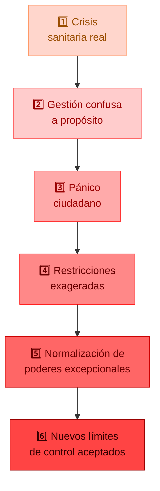

Este ejemplo nos enseña que incluso en países democráticos, las crisis pueden ser usadas para implementar medidas de control que van contra las leyes fundamentales, cambiando para siempre la relación entre ciudadanos y gobierno si no estamos atentos y bien informados.

## 19. Responsabilidad Personal: Tu Poder para Resistir con Ética ⚖️

### 🧠 El Secreto de la Libertad: Elegir en lugar de Reaccionar

Cuando te enfrentas a políticos manipuladores, tu arma más poderosa es la responsabilidad personal: saber que tú decides cómo responder. Esta sección te enseñará cómo mantenerte siempre en el lado correcto mientras resistes la manipulación.

> 🎮 **Ejemplo de juego:** Es como en los videojuegos donde puedes elegir ser un héroe o un villano. Tu "personaje" lo decides tú con cada elección que haces.

#### El Superpoder de la Pausa: El Camino de la Libertad

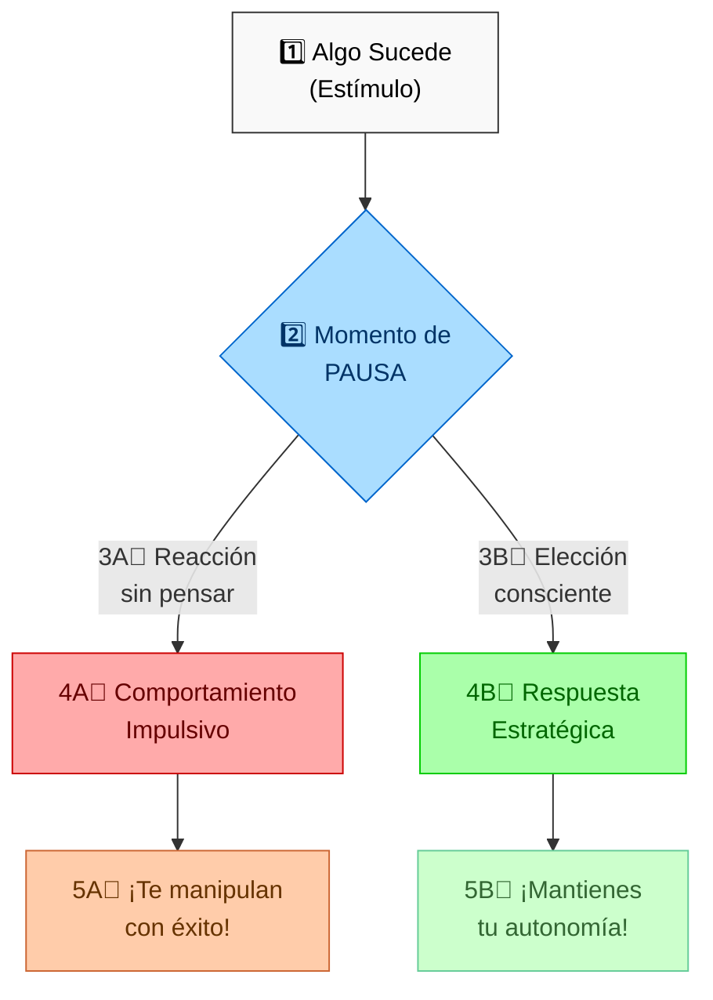

La autonomía real se manifiesta no en la ausencia de influencias externas, sino en la capacidad de responder a ellas desde la elección consciente en lugar de la reacción automática.

### 🦸‍♀️ Tu Brújula Moral: Resistir Sin Convertirte en lo que Combates

| Acción que Puedes Tomar        | ¿Qué es esto?                                   | ¿Está bien o mal?                                          |
| ------------------------------ | ----------------------------------------------- | ---------------------------------------------------------- |
| **Denunciar con pruebas** 📝   | Mostrar hechos que se pueden comprobar          | 👍 MUY BIEN - Está basado en verdades demostrables         |
| **Criticar con argumentos** 🧠 | Cuestionar decisiones dando buenos motivos      | 👍 MUY BIEN - Ayuda a crear debate y reflexión             |
| **Protestar pacíficamente** 👥 | Organizarse en grupo sin usar violencia         | 👍 MUY BIEN - Respeta los derechos de todos                |
| **Desobediencia civil** ✋     | No obedecer órdenes injustas sin usar violencia | 👆 DEPENDE - Solo si la injusticia es muy grave            |
| **Incitar al odio** 😠         | Motivar el rechazo hacia grupos de personas     | 👎 MAL - Va contra la dignidad de las personas             |
| **Usar violencia** 👊          | Causar daño físico a personas o propiedades     | 👎 MUY MAL - Viola los derechos fundamentales de los demás |

### 🪜 La Escalera de las Respuestas: De Menos a Más

Para resistir a la manipulación política de forma ética, siempre debes usar el nivel más bajo de confrontación que pueda funcionar:

1. **Nivel 1️⃣ - Hablar y Convencer** 🗣️: Intenta cambiar las cosas usando buenos argumentos

2. **Nivel 2️⃣ - Participar en el Sistema** 🗳️: Usa los mecanismos democráticos que existen (vota, presenta propuestas)

3. **Nivel 3️⃣ - Hacer Visible el Problema** 📣: Muestra a todos lo que está pasando para crear conciencia

4. **Nivel 4️⃣ - Resistencia Pasiva** 🚶: No cooperes con sistemas injustos

5. **Nivel 5️⃣ - Desobediencia Civil Pacífica** ✊: Oponte abiertamente a normas injustas, pero siempre sin violencia

> 🎯 **Regla de oro:** Sube a un nivel superior solo cuando hayas agotado el nivel anterior, y siempre respetando los derechos de todos.

### 🧩 Tres Cosas Diferentes: Pensar, Decir y Hacer

Es muy importante entender la diferencia entre:

- **Lo que Piensas y Sientes** 💭: No eres responsable de sentir enojo o rechazo cuando ves injusticias
- **Lo que Dices** 🗣️: Sí eres responsable de cómo expresas ese desacuerdo (con respeto o con odio)
- **Lo que Haces** 👐: Eres totalmente responsable de tus acciones, sin excusas

> 📝 **Nota clave para niños:** Sentir enojo por una injusticia es normal. La diferencia está en cómo expresas ese enojo y qué haces con él. Un héroe y un villano pueden sentir la misma indignación, pero responden de formas muy diferentes.

### 🌋 Cómo Manejar tu Enojo Cuando es Justo

Enfadarte ante una injusticia es normal y hasta bueno, pero lo importante es cómo manejas ese enojo:

- **Acepta tus Emociones** ✅: Está bien sentirte indignado cuando ves manipulación o injusticia
- **Transforma ese Enojo en Acción Positiva** 🔄: Usa esa energía para hacer algo constructivo, no destructivo
- **Piensa en el Futuro** 🔭: Pregúntate si lo que vas a hacer construye o destruye a largo plazo
- **Cuídate por Dentro** 💗: La venganza y el odio te hacen daño primero a ti mismo

Como dijo Nelson Mandela después de pasar 27 años en prisión: "No soy verdaderamente libre si le quito la libertad a alguien más. El opresor es tan prisionero como el oprimido."

### 🦅 Tu Libertad es Tu Responsabilidad

La verdadera libertad frente a la manipulación política no es reaccionar automáticamente haciendo lo contrario de lo que quieren, sino tomar tus propias decisiones con consciencia:

- **Ser Autónomo No Es Estar Solo** 👪: Significa decidir por ti mismo, pero puedes hacerlo junto a otros
- **La Libertad Tiene un Precio** ⚖️: Ese precio es aceptar las consecuencias de tus decisiones
- **Tu Verdadero Poder está en tus Elecciones** 🌟: No en hacer lo que otros esperan ni en hacer siempre lo opuesto

Como escribió Viktor Frankl, quien sobrevivió a los campos de concentración nazis: "Entre lo que nos pasa y nuestra respuesta hay un espacio. En ese espacio está nuestro poder para elegir. Y en nuestra elección está nuestro crecimiento y nuestra libertad."

---

## Herramientas Prácticas para tu Arsenal 🧰

## 20. La Difamación Meritocrática: ¡Defendiéndote de Quienes Apagan Tu Luz! 💼🛡️

### 🔍 ¿Qué es la difamación meritocrática? ¡Explicado fácil!

Imagina que has hecho un dibujo muy bonito en clase. En lugar de mejorar su propio dibujo, un compañero decide decir cosas malas sobre el tuyo para que el suyo parezca mejor. **Eso es difamación meritocrática**: cuando alguien intenta "apagar tu luz" para que la suya brille más, en vez de esforzarse por brillar por sí mismo.

> 💡 **Palabra nueva:** "Meritocracia" significa valorar y premiar a las personas por sus esfuerzos y logros (méritos) y no por otros motivos como quién es su familia o si caen bien.

### 👾 El "Juego" del Sabotaje: Así Funciona Paso a Paso

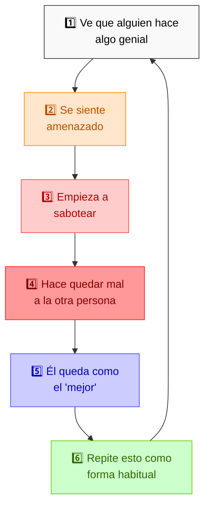

### 🕵️ ¡Descubre sus Trucos! Las Formas de Sabotaje más Comunes

> 🎮 **¡Juego de detectives!** La próxima vez que veas a alguien intentar hacer quedar mal a otra persona, intenta identificar qué táctica de la tabla está usando.

| Dónde Pasa 📍                    | Truco que Usa 🎭                      | ¿Cómo se ve en la vida real? 👀                                                         | ¿Por qué funciona? 🧠                                 |
| -------------------------------- | ------------------------------------- | --------------------------------------------------------------------------------------- | ----------------------------------------------------- |
| **Trabajo** 💼                   | Esconder información                  | "Olvidó" avisar sobre la reunión importante para que llegues tarde o no preparado       | Te deja en desventaja por no saber lo mismo que todos |
| **Amigos** 👥                    | Esparcir rumores                      | "¿Sabías que Luis no es tan bueno en matemáticas como dice?" (justo antes del concurso) | La gente tiende a creer lo negativo más rápido        |
| **Escuela** 📚                   | Falsa amistad                         | "Solo te doy un consejo..." (pero el consejo te hace equivocarte)                       | Parece ayuda cuando en realidad es sabotaje           |
| **Grupos** 👪                    | Crear rivalidades falsas              | Decirle a cada persona del grupo cosas diferentes para que se peleen entre ellos        | Divide al grupo para controlar a todos                |
| **Internet** 💻                  | Trampas digitales                     | Engañarte para que compartas algo vergonzoso que luego usan contra ti                   | Usa tu confianza para hacerte daño                    |
| **Personas muy egocéntricas** 👑 | Acusar a otros de sus propios errores | "Tú eres quien miente" (cuando en realidad son ellos quienes mienten)                   | Transfieren sus defectos a otros para verse mejor     |
| **Personas sin empatía** 🧊      | Daño calculado                        | Planear cuidadosamente cómo dañar la reputación de alguien sin sentir remordimiento     | Consiguen ventajas sin importarles el daño causado    |

### 🔍 ¿Cómo Reconocer al "Apagador de Brillos"?

> 📝 **Actividad:** Haz una lista de personas que conoces que se alegran genuinamente cuando tienes éxito. ¡Esas son las personas que vale la pena tener cerca!

#### Señales de Alarma - ¡Atención a estas Pistas! 🚩

- **Dice una cosa, hace otra** 🎭: Habla de honestidad pero miente, habla de trabajo duro pero busca atajos
- **Super interesado en errores ajenos** 🔎: Se emociona demasiado cuando alguien comete un error
- **Cambia como camaleón** 🦎: Se comporta totalmente diferente según con quién esté hablando
- **Nunca se alegra por otros** 😒: No puede decir "¡felicidades!" de corazón cuando alguien logra algo
- **Siempre cerca cuando hay problemas** 💥: Misteriosamente, los "accidentes" suelen ocurrir cuando está cerca

### 👑 ¿Jefe o Líder? ¡Aprende a Diferenciarlos!

| ¿Qué observamos? 👀        | Jefe (Manipulador) 👎                    | Líder (Inspirador) 👍                                   |
| -------------------------- | ---------------------------------------- | ------------------------------------------------------- |
| **Cómo ve el poder**       | "Debo controlar a todos"                 | "Debo ayudar a que todos brillen"                       |
| **Por qué le obedecen**    | Por miedo o porque tiene un cargo alto   | Por respeto y confianza ganados día a día               |
| **Cuando algo sale mal**   | "¿Quién fue el culpable?"                | "¿Qué podemos aprender de esto?"                        |
| **Cómo motiva**            | Con presión, miedo y algunas recompensas | Inspirando, compartiendo metas y reconociendo esfuerzos |
| **Cómo ve a las personas** | Como herramientas para usar              | Como personas para ayudar a crecer                      |
| **Qué le importa más**     | Resultados rápidos sin importar el costo | Equilibrio entre hoy y mañana                           |
| **Cuando hay un éxito**    | "¡Lo logré!" (aunque lo hicieron otros)  | "¡Lo logramos juntos!"                                  |
| **Cuando le critican**     | Se enoja y lo toma como ataque           | Escucha y busca mejorar                                 |
| **Cómo decide**            | "Yo decido y ustedes obedecen"           | "Decidamos juntos cuando sea posible"                   |
| **Frase típica**           | "Hazlo porque yo lo digo"                | "Hagámoslo juntos por estas razones"                    |

### 🛡️ Tu Kit de Supervivencia: ¡Protégete de los Saboteadores!

#### 1. 🧠 Pensamientos Poderosos: Tu Escudo Mental

> 🎯 **Consejo para niños:** Estos son como los hechizos protectores de Harry Potter pero para tu mente. ¡Repítelos cuando sientas que alguien intenta apagar tu brillo!

- **"Mi valor viene de adentro"** 💖: "Lo que pienso de mí es más importante que lo que otros digan sobre mí"
- **"Detector de proyecciones"** 🔍: "Si alguien siempre ve defectos en otros, probablemente está viendo sus propios problemas"
- **"Visión de futuro"** 🔭: "Con el tiempo, todos verán quién trabajó de verdad y quién solo criticó"
- **"Crítica vs. Ataque"** ⚔️: "La crítica buena te ayuda a mejorar; el ataque solo quiere lastimarte"
- **"El camino es el premio"** 🏆: "Lo importante no es llegar primero, sino mejorar cada día"

#### 2. 🛠️ Plan de Defensa: Pasos a Seguir

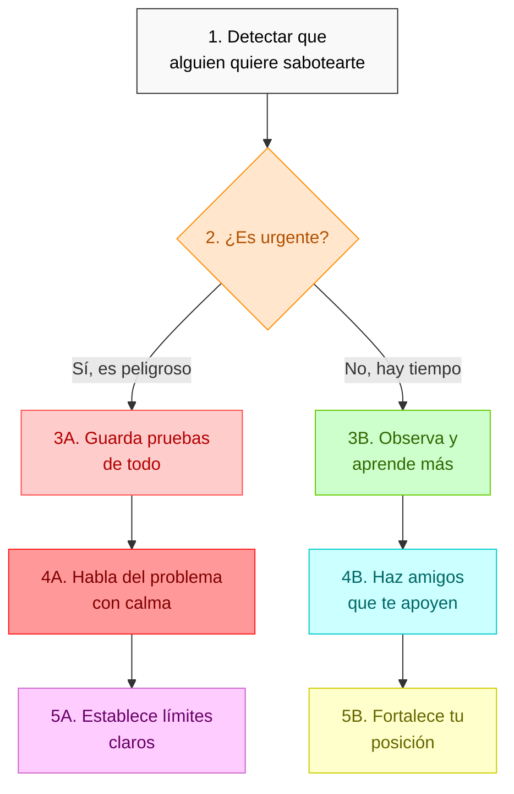

#### 3. 🌟 Superherramientas de Defensa

- **Guardar pruebas** 📸: Anota lo que pasa, guarda mensajes y correos importantes
- **Poner límites claros** 🚧: Di "No me gusta cuando haces esto" sin miedo
- **Hacer amigos de verdad** 👫: Busca personas que se alegran con tus logros
- **Tener varias fuentes de apoyo** 🌻: No dependas solo de la opinión de una persona
- **Compartir logros con humildad** 🏅: Muestra lo que has conseguido sin presumir

#### 3. Principios de salud laboral y relacional

Los siguientes principios prácticos actúan como barrera protectora contra manipuladores:

1. **Disfrute genuino del trabajo**: Enfocarse en aspectos satisfactorios y aprendizaje continuo. Trabajar con determinación pero sin ansiedad.

2. **Relaciones horizontales saludables**: Ofrecer ayuda sin invadir, establecer límites claros y respetar el trabajo ajeno sin interferir.

3. **Comunicación ascendente efectiva**: Mantener información fluida pero precisa con superiores, compartiendo tanto problemas como soluciones potenciales.

4. **Alineación con visión organizacional**: Comprender y contribuir a los objetivos generales mientras se mantiene integridad personal.

5. **Orientación al servicio**: Priorizar resultados y satisfacción del cliente/usuario final sobre políticas internas.

6. **Establecimiento de límites**: Practicar el "no" respetuoso para proteger tiempo, energía y dignidad.

7. **Consistencia en trato**: Mantener respeto y profesionalismo incluso en situaciones adversas, buscando soluciones en lugar de culpables.

#### 4. Defensa contra manipuladores extremos (psicópatas)

En situaciones de manipulación de alto nivel, como enfrentar a un psicópata, se requieren estrategias especializadas:

- **Regla de las 3D: Detectar, Documentar, Distanciarse**:

  - Identificar patrones manipulativos sin confrontación inmediata
  - Registrar sistemáticamente comportamientos problemáticos con fechas y testigos
  - Crear distancia emocional y, cuando sea posible, física

- **Técnica BIFF para comunicaciones**: Breve, Informativa, Franca y Firme

  - Respuestas concisas sin carga emocional
  - Basadas en hechos verificables
  - Directas sin ser provocadoras
  - Con límites claros y consecuencias predecibles

- **Evitar la trampa narcisista**: No intentar "ganar" al psicópata ni buscar su validación

  - Rechazar competir en su terreno
  - No buscar su aprobación o reconocimiento
  - No esperar empatía o razonamiento moral

- **Construcción de red de verificación**: Crear un sistema de personas confiables que sirvan como "realidad externa"
  - Contrastar percepciones para evitar manipulación
  - Obtener validación externa ante gaslighting
  - Mantener anclaje en la realidad compartida

### Diagrama: La autoestima meritocrática como escudo defensivo

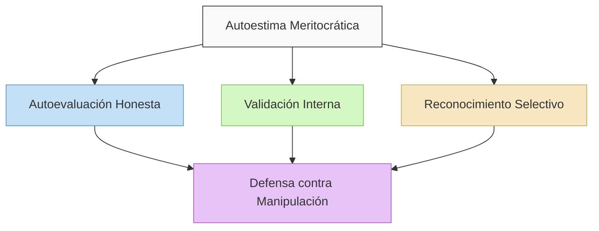

#### Desarrollo de autoestima basada en mérito real:

1. **Autoevaluación honesta**: Capacidad para reconocer fortalezas y áreas de mejora sin autoengaño
2. **Validación interna**: Desarrollar criterios propios de éxito y valor independientes de opiniones externas
3. **Reconocimiento selectivo**: Discriminar entre críticas constructivas y ataques manipuladores
4. **Comparación única con uno mismo**: Medir progreso respecto al yo pasado, no a otros
5. **Celebración calibrada de logros**: Reconocer méritos sin necesidad de superioridad comparativa

La autoestima meritocrática no se basa en ser mejor que otros, sino en la mejora constante respecto a uno mismo y la contribución genuina al entorno.

---

La mejor defensa contra quienes intentan "apagar tu luz para brillar más" es, paradójicamente, ayudar a que otros brillen mientras fortaleces tu propia luminosidad interior. Los manipuladores buscan juegos de suma cero donde tu pérdida es su ganancia; la resistencia más efectiva es crear juegos de suma positiva donde el éxito colectivo amplifica el individual.

## 21. El Estado Mafioso: Cuando los "Malos" Se Apoderan del Gobierno 🦂🔍

> **Nota para niños**: Esta sección amplía lo que aprendimos en la [sección 14 sobre Redes Clientelares](#14-supera-las-redes-clientelares-y-la-manipulación-estatal-), pero lo lleva a casos más extremos.

### 🏴‍☠️ ¿Qué es un "Estado Mafioso"?

Imagina que una banda de piratas se apodera de todo un país. Ya no roban barcos - ahora hacen leyes que les permiten quedarse con el tesoro de todos "legalmente". Eso es un "Estado Mafioso": cuando un partido político o un grupo de personas poderosas utiliza todo el gobierno como si fuera su propia organización criminal.

> 🎬 **Ejemplo de película:** Es como si los villanos de una película no solo robaran un banco, sino que se apoderaran de todo el país y cambiaran las leyes para decir que robar está bien (pero solo cuando lo hacen ellos).

### 🔍 Radiografía de un Estado Mafioso: Cómo Funciona por Dentro

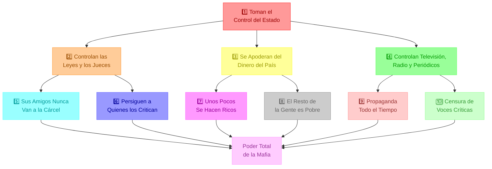

#### 🔍 Cómo Reconocer un Estado Mafioso: Las 4 Señales Principales

##### 1. **El Partido y el Gobierno se Vuelven lo Mismo** 🏛️

Imagina que el equipo de fútbol que ganó el campeonato toma el control del comité que hace las reglas del juego, del equipo de árbitros, y también decide quién puede jugar y quién no. Así funciona un Estado Mafioso:

- 📝 Las diferentes partes del gobierno (que deberían controlarse entre sí) se fusionan
- 👔 Para conseguir un trabajo en el gobierno, lo que importa es tu lealtad, no tus habilidades
- 💰 El dinero público se usa como si fuera dinero del partido político

##### 2. **Control Total de las Leyes y el Dinero** ⚖️

- **Leyes Tramposas** 📜: Crean reglas que ayudan a sus amigos y castigan a quienes no les gustan
- **Justicia para Algunos** ⚖️: Si eres amigo del gobierno, nunca vas a la cárcel; si eres crítico, te persiguen
- **Supervisores Cómplices** 🕵️: Las personas que deberían vigilar que no haya corrupción son parte de la corrupción
- **Empresas del Estado como Alcancías** 🏭: Usan las empresas públicas como su hucha personal

##### 3. **Hacen Sentir a la Gente Pequeña e Indefensa** 😔

- **Te Hacen Sentir Inferior** 👎: Crean la sensación de que no puedes hacer nada sin ellos
- **Atacan a las Personas Buenas** 🎯: Destruyen la reputación de figuras respetadas para que no haya ejemplos positivos
- **Premian a los Traidores** 🐀: Dan recompensas a quienes delatan a amigos y familiares

##### 4. **Controlan Todo lo que Escuchas y Ves** 📺

- **"Te Pago si me Ayudas"** 💸: Dan dinero (publicidad, contratos) a los medios que hablan bien de ellos
- **"Te Arruino si me Criticas"** 💀: Ahogan económicamente a los medios independientes con impuestos especiales
- **"Solo Existe Mi Versión"** 📢: Crean una única historia oficial y censuran todas las demás voces

### 📺 Cómo Controlan lo que Ves y Escuchas: El Truco de los Medios

| Truco que Usan 🎭                  | Ejemplo en la Vida Real 👁️                                      | Cómo Afecta a la Sociedad 👥                  | Cómo Podemos Resistir 🛡️                                    |
| ---------------------------------- | --------------------------------------------------------------- | --------------------------------------------- | ----------------------------------------------------------- |
| **Dinero Público para Amigos** 💰  | Dan contratos de publicidad solo a medios que los apoyan        | Unos medios tienen mucho dinero y otros nada  | Exigir transparencia: ¿Cuánto dinero va a cada medio?       |
| **Permisos solo para Leales** 📝   | Renuevan licencias solo si hablan bien del gobierno             | Los medios se autocensuran por miedo          | Documentar casos de medios castigados por ser críticos      |
| **Ejércitos de Trolls Falsos** 🤖  | Crean miles de perfiles falsos para atacar a críticos           | Los debates en internet se vuelven tóxicos    | Crear herramientas para detectar cuentas falsas coordinadas |
| **Ahogar a los Independientes** 📰 | Bloquean el acceso a papel, frecuencias o canales de TV         | Los medios independientes no pueden funcionar | Construir canales alternativos de difusión                  |
| **Demandas para Quebrarlos** ⚖️    | Ponen demandas legales para agotar el dinero de medios críticos | Los periodistas tienen miedo de investigar    | Crear fondos compartidos para defensa legal                 |

### 🌎 El Club de los Estados Mafiosos: Tres Ejemplos del Mundo Real

#### 🇨🇺 Cuba: El Ejemplo Más Antiguo

Cuba muestra cómo es un Estado mafioso con muchos años de experiencia:

- **Control Total de las Noticias** 📺: El gobierno es dueño de todos los canales de TV, radios y periódicos. Si alguien intenta crear un medio independiente, va a la cárcel.
- **Dependencia Total** 🍞: El Estado es casi el único empleador y distribuidor de alimentos, así que la gente depende completamente del gobierno para sobrevivir.
- **Exporta su Sistema** 🧪: Da consejos a otros países como Venezuela y Nicaragua sobre cómo controlar mejor a su población.
- **Conexiones con Criminales** 💊: Permite a narcotraficantes usar sus rutas para conseguir dinero extra.

#### 🇻🇪 Venezuela: De Democracia a Estado Mafioso

Venezuela nos muestra cómo un país que era una democracia puede transformarse en un Estado mafioso:

- **Tomaron Todo Poco a Poco** 🕸️: Fueron controlando gradualmente los tribunales, los organismos electorales y el ejército.
- **Robaron la Riqueza del País** 💰: Convirtieron PDVSA (la compañía petrolera estatal) y otras empresas públicas en fuentes de dinero para los líderes y sus amigos.
- **"Boliburgueses"** 👑: Crearon una nueva clase de millonarios que dependen del gobierno para mantener su riqueza.
- **Militares Narcotraficantes** 🪖: Altos mandos del ejército dirigen operaciones de tráfico de drogas conocidas como el "Cartel de los Soles".
- **Silenciaron las Voces** 🤐: Cerraron más de 60 periódicos y 285 estaciones de radio entre 2013 y 2022.

#### 🇳🇮 Nicaragua: El Negocio Familiar Mafioso

En Nicaragua, el régimen de Ortega-Murillo muestra cómo un Estado mafioso puede ser un negocio familiar:

- **Todo Queda en Familia** 👪: El dictador ha puesto a sus hijos y familiares a cargo de las instituciones más importantes.
- **Brutal con los Opositores** 🔫: Mataron a más de 350 personas durante las protestas de 2018 y persiguen a cualquiera que se oponga.
- **Destrucción de Organizaciones** 🏢: Hicieron ilegales a más de 3,000 organizaciones no gubernamentales y se quedaron con sus bienes.
- **Usan Símbolos Religiosos** ✝️: Utilizan símbolos religiosos y revolucionarios para hacer que la gente acepte lo que hacen.

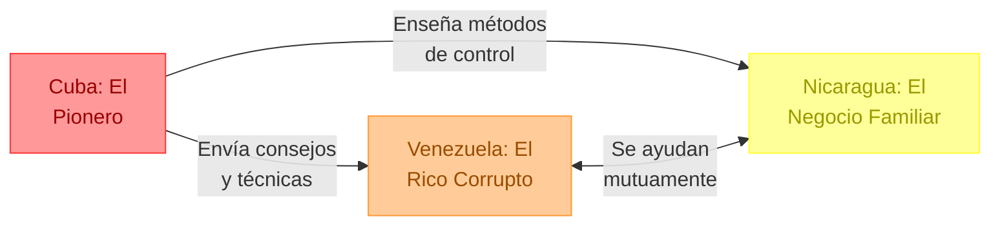

## 22. Estrategias contra Discursos Evasivos y Manipuladores 🗣️🧠

> 🎭 **La clave está en reconocer sus patrones:** Cuando un político está acorralado, usa tácticas predecibles para evadir la responsabilidad. ¡Aprende a identificarlas!

### 🎯 Las 5 Tácticas Maestras de Evasión

#### 1. 🔄 El "Pivot": El Arte de Cambiar el Tema

- **¿Cómo lo hacen?**
  - Cambian a un tema más cómodo sin responder la pregunta original
  - Usan frases de transición que suenan naturales pero desvían la atención
  - Aprovechan cualquier palabra para hacer una conexión forzada con otro tema

> 📝 **Ejemplo:** Si les preguntan sobre corrupción, responden hablando de logros en educación.

#### 2. ❓ Atacar la Pregunta: Convertir la Defensa en Ataque

- **Tácticas comunes:**
  - "¿Por qué estás tan obsesionado con este tema?"
  - "Esa pregunta muestra tu falta de comprensión"
  - "Hay temas más importantes que discutir"

#### 3. 🤔 La Negativa Elegante: El Arte de No Responder

- **Excusas típicas:**
  - "No tengo toda la información necesaria"
  - "Es un tema muy complejo para simplificarlo"
  - "No sería responsable comentar en este momento"

#### 4. 🔀 Whataboutismo: "¿Y qué hay de...?"

- **La estructura:**
  1. Reciben una crítica o pregunta difícil
  2. Inmediatamente señalan algo similar en otros
  3. Evitan abordar el tema original

> 🎮 **Como en los juegos:** Es como cuando te acusan de hacer algo mal y respondes "pero mi hermano también lo hace".

#### 5. ⏳ La Táctica del Tiempo: Hablar hasta Agotar

- **Cómo funciona:**
  - Dan respuestas extremadamente largas
  - Usan muchas palabras técnicas
  - Mezclan varios temas para confundir
  - Alargan hasta que el entrevistador debe cambiar de tema

### 💰 La Manipulación Fiscal: El Arte de Ocultar Números

#### Tácticas Comunes de Evasión Fiscal

1. **Promesas sin Respaldo** 📊

   - Anuncian beneficios sin explicar el financiamiento
   - Ignoran el impacto en la deuda pública
   - Usan frases como "lo pagarán los ricos"

2. **Ocultamiento de Costos Reales** 💸
   - No mencionan el impacto en generaciones futuras
   - Minimizan el efecto en los impuestos
   - Evitan hablar de la sostenibilidad fiscal

### 🧩 Contrarrestar Falacias Lógicas Avanzadas

- **Falacia del Hombre de Paja**: Atacar una versión distorsionada del argumento del oponente.
- **Falsa Dicotomía**: Presentar solo dos opciones cuando hay más disponibles.
- **Apelación a la Ignorancia**: Sostener que algo es verdadero porque no se ha probado que es falso.

### ⚔️ Estrategias de Contraataque

1. **Pregunta Directa**: "¿Está usted diciendo que...?" (reformulando su evasiva en una pregunta clara).
2. **Exposición Pública**: Hacer público su patrón de evasión para que otros lo reconozcan.
3. **Desenmascarar la Falacia**: Señalar la falacia lógica en tiempo real y explicar por qué es engañosa.

---

En ocasiones enfrentarás políticos con capacidades retóricas excepcionalmente sofisticadas, que utilizan tácticas manipuladoras avanzadas para evadir responsabilidades, confundir audiencias y promover agendas ocultas. Estos individuos, a menudo con rasgos psicopáticos, no solo mienten - construyen elaboradas estructuras argumentativas que pueden parecer convincentes a primera vista.

### 🎯 El Arte de Evadir sin Parecer Evasivo

Los políticos con razonamiento manipulador avanzado han perfeccionado estrategias para hablar extensamente sin comprometerse con ninguna posición concreta:

#### 🔄 Las 5 Técnicas de Evasión Magistral

1. **Pivot Sofisticado**:

   - **Cómo lo hacen**: Transicionan sutilmente de la pregunta original a un tema tangencialmente relacionado pero más conveniente.
   - **Ejemplo real**: Cuando Elizabeth Warren fue cuestionada sobre cómo financiaría Medicare-For-All sin subir impuestos a la clase media, desvió la conversación hacia costos para corporaciones sin nunca responder directamente.
   - **Estrategia de defensa**: "Aprecio ese punto, pero mi pregunta específica fue sobre [repetir pregunta original]. ¿Puede responder directamente?"

2. **Ataque a la Premisa**:

   - **Cómo lo hacen**: Cuestionan la legitimidad de la pregunta misma para evitar responderla.
   - **Ejemplo real**: "¿Por qué estás tan obsesionado con los impuestos cuando deberíamos hablar de empleos?"
   - **Estrategia de defensa**: "La pregunta es válida precisamente porque afecta directamente al tema de los empleos. ¿Podría responderla?"

3. **Prolongación Estratégica**:

   - **Cómo lo hacen**: Hablan extensamente sobre aspectos periféricos hasta agotar el tiempo disponible.
   - **Estrategia de defensa**: "Agradezco el contexto, pero necesitamos una respuesta concreta. En una frase, ¿cuál es su posición sobre...?"

4. **Ambigüedad Calculada**:

   - **Cómo lo hacen**: Utilizan lenguaje deliberadamente vago que puede interpretarse de múltiples maneras.
   - **Estrategia de defensa**: "Para asegurarme de entenderle correctamente, ¿está usted diciendo que [interpretación concreta]? ¿Sí o no?"

5. **Whataboutism Sofisticado**:
   - **Cómo lo hacen**: Redirigen sutilmente la atención hacia faltas de otros actores políticos.
   - **Estrategia de defensa**: "Podemos discutir esos otros temas después, pero por ahora concentrémonos en la cuestión específica que planteé."

### 💰 La Manipulación Económica Avanzada: Ignorando Realidades Fiscales

Una táctica particularmente peligrosa es la promesa de beneficios sin explicar sus costos reales:

#### 🧮 Tácticas de Ilusión Fiscal

- **La Falacia "Gratis"**: Prometen programas "sin costo" cuando en realidad implican aumento de deuda pública.

  - **Contrataque**: "¿Podría detallar exactamente de dónde vendrán los [cantidad específica] millones para financiar este programa?"

- **La Trampa Intergeneracional**: Proponen políticas cuyos beneficios son inmediatos pero cuyos costos reales se transferirán a generaciones futuras.

  - **Contrataque**: "Este programa generará [cantidad] en nueva deuda pública. ¿Cómo justifica cargar este peso a quienes hoy son niños?"

- **Lenguaje Técnico como Camuflaje**: Utilizan jerga económica compleja para ocultar propuestas fiscalmente insostenibles.
  - **Contrataque**: "Para beneficio de todos, ¿podría explicar en términos sencillos exactamente cómo su propuesta no aumentará el déficit?"

### 🎭 Anatomía de las Falacias Maestras

Los manipuladores avanzados emplean falacias lógicas sofisticadas que requieren identificación inmediata:

#### ⚠️ Detección y Neutralización

| Falacia Avanzada                           | Cómo Identificarla                                                      | Respuesta Efectiva                                                                                               |
| ------------------------------------------ | ----------------------------------------------------------------------- | ---------------------------------------------------------------------------------------------------------------- |
| **Falsa Equivalencia Sofisticada**         | Comparan situaciones fundamentalmente diferentes como si fueran iguales | "Estas situaciones difieren en aspectos cruciales: [mencionar diferencias específicas]"                          |
| **Apelación a la Autoridad Ambigua**       | Citan "expertos" o "estudios" sin especificar fuentes verificables      | "¿Podría mencionar específicamente qué estudios y de qué instituciones respaldan esa afirmación?"                |
| **Reduccionismo Complejo**                 | Simplifican exageradamente temas multifacéticos                         | "Este tema involucra factores adicionales críticos como [enumerar factores omitidos]"                            |
| **Correlación Presentada como Causalidad** | Sugieren que porque A ocurrió antes que B, A causó B                    | "La correlación temporal no prueba causalidad. Hay otros factores intervinientes como [mencionar factores]"      |
| **Evidencia Anecdótica Generalizada**      | Presentan casos individuales como prueba de patrones generales          | "Un caso individual no constituye evidencia estadísticamente significativa. Los datos agregados muestran que..." |

### 🛡️ El Arsenal de Defensa Lógica

Para enfrentar discursos psicopáticos avanzados, necesitas herramientas igualmente sofisticadas:

#### 🔍 Armas de Precisión Lógica

1. **Demanda de Especificidad**:

   - "¿Podría proporcionar cifras exactas y sus fuentes?"
   - "¿Cuál es el costo total proyectado en un horizonte de 10 años?"
   - "¿Qué evidencia empírica respalda esa afirmación?"

2. **Revelación de Inconsistencias**:

   - "Hace tres meses usted afirmó exactamente lo contrario cuando dijo [cita exacta]. ¿Qué ha cambiado desde entonces?"
   - "Su posición actual contradice directamente su voto en [fecha específica]. ¿Cómo explica esta discrepancia?"

3. **Descomposición Argumentativa**:

   - "Analicemos su argumento paso por paso para identificar dónde está el error lógico..."
   - "Su razonamiento parte de premisas falsas, específicamente cuando asume que [premisa incorrecta]."

4. **Recalibración de Perspectiva**:

   - "Consideremos las consecuencias a largo plazo de esta propuesta..."
   - "Veamos este tema desde la perspectiva de quienes realmente serán afectados..."

5. **Triangulación de Fuentes**:
   - "Según [fuente independiente respetada], los datos contradicen directamente su afirmación."
   - "He verificado esta información con tres fuentes distintas, todas las cuales refutan lo que usted plantea."

### 💭 Protegiendo el Debate Público del Razonamiento Manipulador

La defensa contra discursos manipuladores avanzados no es solo individual sino colectiva:

#### 🌐 Estrategias Comunitarias

- **Educación en Lógica Formal**: Promover la enseñanza de lógica y pensamiento crítico desde edades tempranas.
- **Plataformas de Verificación Colaborativa**: Crear sistemas donde ciudadanos puedan compartir análisis de discursos políticos en tiempo real.

- **Periodismo de Precisión**: Apoyar medios que exijan respuestas concretas y verifiquen meticulosamente las afirmaciones políticas.

- **Debates Estructurados**: Organizar formatos donde sea imposible evadir preguntas sin consecuencias inmediatas.

- **Cultura de Responsabilidad Discursiva**: Normalizar la expectativa social de que los políticos respondan directamente a preguntas legítimas.

> 🔑 **Punto clave**: Contra un manipulador psicopático avanzado, tu mejor defensa es la precisión implacable. Nunca permitas que controle el marco del debate o evada el núcleo de tus cuestionamientos.

### 🧩 Estudio de Caso: Desmontando un Discurso Económico Manipulador

Cuando un político dice: "Nuestro programa creará prosperidad para todos sin costo adicional; lo pagarán los ricos."

**Análisis crítico paso a paso:**

1. **Identificar afirmaciones verificables**: "creará prosperidad", "sin costo adicional", "lo pagarán los ricos"
2. **Solicitar métricas concretas**: "¿Qué aumento específico del PIB proyecta? ¿En qué plazo?"
3. **Exigir detalles del financiamiento**: "¿Qué impuestos específicos aumentarán? ¿Por cuánto? ¿Qué análisis demuestra que esto cubrirá el costo total?"
4. **Cuestionar suposiciones ocultas**: "Su plan asume que los afectados por mayores impuestos no modificarán su comportamiento económico. ¿Qué evidencia respalda esta suposición?"
5. **Solicitar escenarios alternativos**: "¿Qué sucede si las proyecciones de recaudación no se cumplen? ¿Qué plan de contingencia existe?"

---

_Este documento es una guía educativa para comprender y contrarrestar tácticas de manipulación política mediante el pensamiento crítico, la verificación de hechos y la organización ciudadana. Todas las estrategias propuestas se enmarcan dentro de acciones legales, éticas y democráticas._
