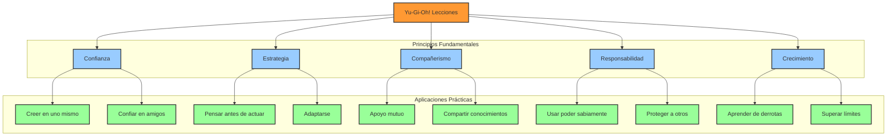
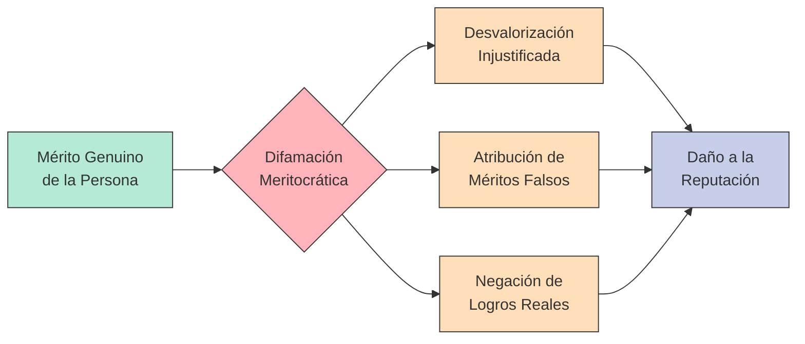
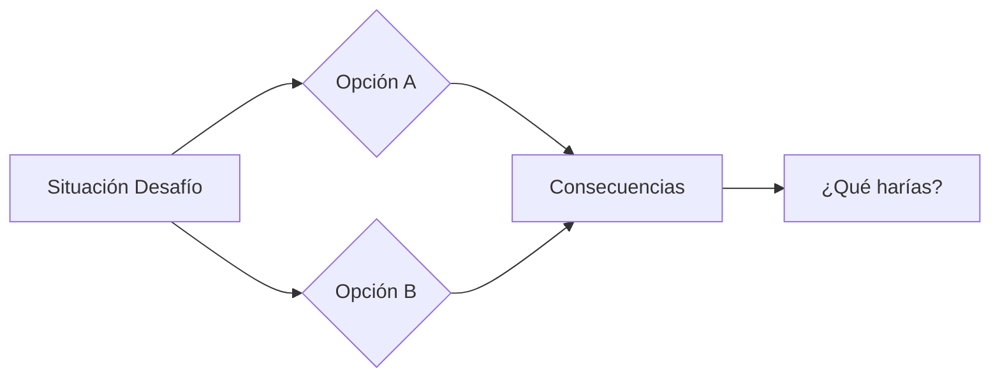
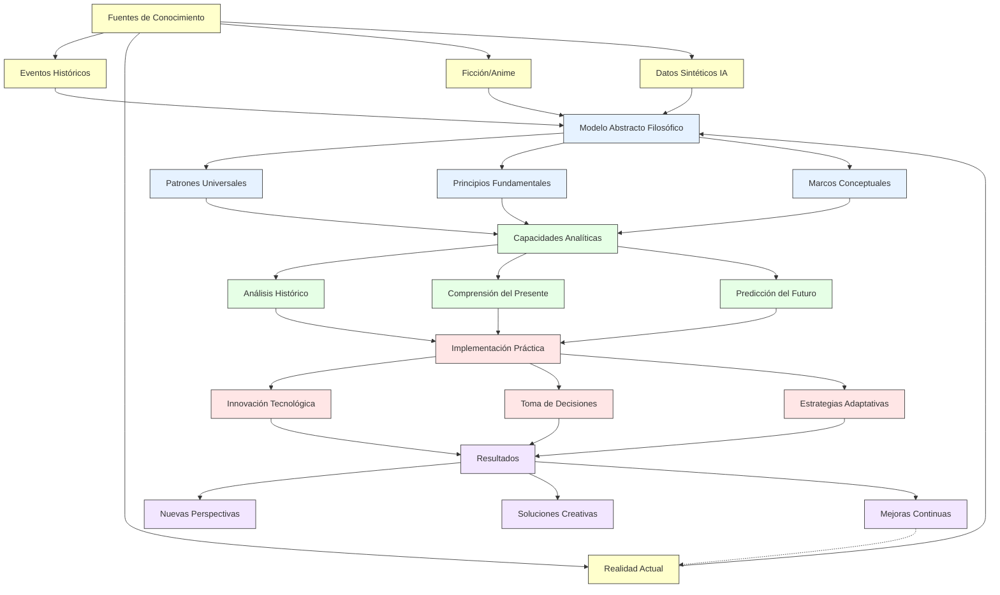

# 📜 CÓDIGO DE CONDUCTA Y NORMATIVA: "LA TRIPULACIÓN"

> ⚠️ **¡ALERTA MÁXIMA DE SPOILERS!** Este documento contiene spoilers significativos de One Piece, Nanny McPhee y Yu-Gi-Oh! Se recomienda haber visto/leído estas obras antes de continuar.

> 🎨 **NOTA DE FAN ART:** Este documento representa un trabajo de fan art que busca llevar a la práctica las enseñanzas y filosofías de estas tres increíbles series. En particular, destaca la adaptación de One Piece, cuyas profundas lecciones sobre libertad, lealtad y desarrollo personal se han integrado en un marco conceptual para el crecimiento organizacional. Es un tributo a estas obras y una demostración de cómo sus mensajes pueden resonar en contextos prácticos de la vida.

> 📝 **NOTA IMPORTANTE:** Este documento es una guía conceptual que recopila principios, valores y normas basados en lecciones de diversas historias. Actualmente no existe ninguna ONG ni empresa constituida bajo estos lineamientos. El contenido podría servir como base para una futura organización, pero por el momento es un marco teórico de referencia.

> 🌟 **DOCUMENTO DE REFERENCIA:** Este código de conducta establece principios y valores que podrían regir una organización futura. Es una recopilación de ideas y conceptos para consideración.

> 💡 **CONSIDERACIÓN:** En una organización basada en estos principios, el incumplimiento de estas normas podría conllevar procesos de evaluación y acciones correctivas. Este marco normativo busca establecer una base sólida para el funcionamiento armónico de una potencial organización futura.

> 🧿 **PRINCIPIO DE RESPONSABILIDAD:** En este marco conceptual, cada individuo sería responsable de sus propias acciones y decisiones. Este principio se basa en la idea fundamental de que "No se puede salvar a quien no quiere ser salvado", enfatizando la importancia del compromiso personal con el crecimiento.

> 📝 **FUNDAMENTO E INSPIRACIÓN:** Este marco teórico se inspira en las lecciones de Nanny McPhee ("las reglas son herramientas para el crecimiento"), Yu-Gi-Oh! ("el respeto por las reglas del duelo") y One Piece ("la libertad conlleva responsabilidad"). Estas historias proporcionan valiosas enseñanzas sobre liderazgo, crecimiento personal y trabajo en equipo que podrían aplicarse en una organización futura.

## 📚 Tabla de Contenidos

### 🌟 Fundamentos y Principios

- 🎯 Filosofía organizacional: El legado de las historias como marco normativo
- 🎭 Los tres pilares: Transformación, lealtad y crecimiento
- 💫 Aplicación práctica de valores en una organización

### 📜 Guía de Conducta y Normas

- 🎬 Nanny McPhee: Disciplina transformadora y orden
- 🏴‍☠️ One Piece: Lealtad, trabajo en equipo y propósito compartido
- 🎴 Yu-Gi-Oh!: Estrategia, perseverancia y honor

### 🤝 Comportamiento Esperado

- 💖 Principios de liderazgo y responsabilidades
- 🌱 Estándares de comunicación y resolución de conflictos
- 🤼 Cumplimiento normativo y rendición de cuentas

### 🚫 Procedimientos Disciplinarios

- ⚖️ Evaluación de infracciones y clasificación de gravedad
- 🛡️ Medidas correctivas y consecuencias
- 🔄 Proceso formal para casos de expulsión
- 🧠 Responsabilidad individual y consecuencias de los actos

### 🏆 Desarrollo Personal y Organizacional

- 🌟 Herramientas para el crecimiento individual y colectivo
- 📚 Mejora continua y evaluación de desempeño
- 💭 Construcción de una cultura organizacional positiva

## 🌟 Fundamentos y Visión Organizacional

> 🎯 **VISIÓN Y PROPÓSITO:** Este marco teórico propone las bases para una potencial comunidad donde cada individuo podría desarrollarse plenamente mientras contribuye al bien común. Inspirado en la filosofía de "lanzar desafíos inesperados" para promover el crecimiento, sugiere combinar disciplina transformadora con responsabilidad compartida.

### 🎭 ¿Por Qué Son Importantes Estas Historias?

#### El Poder de la Narrativa y el Crecimiento 📖✨

- **Enseñanza Universal**: Las historias son puentes que conectan culturas y generaciones
- **Impacto Emocional**: Aprendemos mejor a través de ejemplos que nos conmueven
- **Sabiduría Práctica**: Ofrecen soluciones probadas a desafíos comunes
- **Crecimiento Estratégico**: Los desafíos inesperados revelan fortalezas ocultas y promueven desarrollo
- **Psicología Constructiva**: El conocimiento gradual empodera sin crear dependencias

#### Las Tres Perspectivas 🔍

1. **Nanny McPhee**

   - Transformación a través de la disciplina
   - El poder del orden y el respeto
   - La magia del cambio personal

2. **One Piece**

   - La fuerza de los lazos de amistad
   - El valor de la lealtad incondicional
   - La importancia de los sueños compartidos

3. **Yu-Gi-Oh!**
   - El poder de la perseverancia
   - La sabiduría en los desafíos
   - La fuerza del trabajo en equipo

### 🎬 Nanny McPhee: El Arte de la Transformación

> 🌟 **Como en la vida:** A veces necesitamos una guía firme pero amorosa para descubrir nuestro mejor yo.

#### La Esencia de la Historia 📖

- **La Premisa**: Una niñera mágica llega para transformar una familia caótica a través de lecciones vitales
- **El Método**: "Cuando me necesitan pero no me quieren, debo quedarme. Cuando me quieren pero ya no me necesitan, debo irme."
- **La Transformación**: A medida que los niños aprenden y maduran, ella misma se transforma, simbolizando que el cambio verdadero viene desde dentro
- **La Lección**: El verdadero liderazgo no crea dependencia, sino que guía hacia la autonomía

#### Las 5 Lecciones Fundamentales 🎯

1. **El Poder de la Disciplina Transformadora** ❤️

   - La estructura crea libertad y autonomía
   - Las reglas son herramientas para el crecimiento personal
   - El orden facilita la armonía colectiva
   - La disciplina efectiva no genera dependencia

2. **La Transformación es un Proceso** 🦋

   - El cambio requiere tiempo
   - Cada paso cuenta
   - Los errores son oportunidades

3. **El Respeto se Gana** 🤝

   - La autoridad viene con responsabilidad
   - El ejemplo es el mejor maestro
   - La confianza se construye día a día

4. **La Unidad Familiar** 👨‍👩‍👧‍👦

   - Juntos somos más fuertes
   - Cada miembro es importante
   - El apoyo mutuo es esencial

5. **La Magia del Crecimiento** ✨
   - Los cambios positivos traen recompensas
   - La perseverancia da frutos
   - El esfuerzo vale la pena



### 🎴 Yu-Gi-Oh!: La Sabiduría de los Duelos

> 🌟 **Como en los duelos:** Los verdaderos poderes vienen del corazón y la confianza en uno mismo y en los amigos.

#### El Corazón de Yu-Gi-Oh! 📖

- **La Premisa**: El poder de la amistad y la perseverancia en los desafíos
- **El Método**: Crecer a través de los duelos y la superación
- **La Lección**: La verdadera fuerza viene de creer en uno mismo y en los amigos

#### Las 5 Lecciones Esenciales 🎯

1. **El Poder de la Confianza** ❤️

   - Creer en uno mismo
   - Confiar en los amigos
   - Perseverar ante los desafíos

2. **La Importancia de la Estrategia** 🎲

   - Pensar antes de actuar
   - Aprender de cada duelo
   - Adaptarse a las situaciones

3. **El Valor del Compañerismo** 🤝

   - Apoyarse mutuamente
   - Compartir conocimientos
   - Crecer juntos

4. **La Responsabilidad del Poder** 👑

   - Usar las habilidades sabiamente
   - Proteger a los demás
   - Mantener la integridad

5. **El Camino del Crecimiento** 📈
   - Aprender de las derrotas
   - Mejorar constantemente
   - Superar los límites

### ⛵ One Piece: El Viaje de los Sueños

> 🌟 **Como en el mar:** La verdadera aventura está en los amigos que hacemos y los sueños que perseguimos juntos.

#### La Esencia de la Tripulación 🚢

- **La Premisa**: Una familia elegida unida por sueños y lealtad
- **El Método**: Crecer juntos a través de aventuras y desafíos
- **La Lección**: La fuerza viene de la unión y el apoyo mutuo

#### Las 5 Lecciones del Mar 🌊

1. **El Poder de los Sueños** ⭐

   - Perseguir metas grandes
   - Nunca rendirse
   - Inspirar a otros

2. **La Fuerza de la Lealtad** ⚔️

   - Proteger a los nakama
   - Mantenerse unidos
   - Confiar en el equipo

3. **La Libertad con Responsabilidad** 🗽

   - Respetar las elecciones
   - Asumir las consecuencias
   - Defender los valores

4. **La Diversidad como Fortaleza** 🌈

   - Valorar las diferencias
   - Combinar talentos
   - Crecer en conjunto

5. **El Coraje ante los Desafíos** 💪
   - Enfrentar los miedos
   - Superar los límites
   - Proteger lo importante

#### La Filosofía Pirata: Profundizando en One Piece 🏴‍☠️

1. **La Voluntad Heredada** 🧬

   - **El Legado del "D."**: La importancia de transmitir valores y propósitos a través de generaciones
   - **Herederos de Voluntad**: Cada persona puede cargar y honrar los sueños de quienes vinieron antes
   - **Impacto Práctico**: Reconocer que nuestras acciones trascienden el tiempo y pueden inspirar a futuras generaciones
   - **Ejemplo**: "La muerte de un hombre no significa el fin de su voluntad" - Barbanegra

2. **Vivir Sin Arrepentimientos** 🌅

   - **La Filosofía de Ace y Roger**: Vivir plenamente cada momento, sin mirar atrás
   - **El Valor del Presente**: Tomar decisiones conscientes y aceptar sus consecuencias
   - **La Vida como Aventura**: Entender que cada error y cada acierto forma parte del viaje
   - **Ejemplo**: "La única vez que un hombre muere es cuando es olvidado" - Dr. Hiriluk

3. **El Verdadero Significado de los Tesoros** 💎

   - **Más Allá de las Riquezas**: El One Piece representa algo mayor que el oro o la fama
   - **Los Lazos como Verdadero Tesoro**: La tripulación y los vínculos formados son la verdadera riqueza
   - **Aplicación Vital**: Valorar las relaciones por encima de las posesiones materiales
   - **Ejemplo**: "Las riquezas no son los tesoros de oro y plata, sino los momentos que vivimos" - Rayleigh

4. **La Definición Personal de Justicia** ⚖️

   - **Justicia Flexible vs. Absoluta**: Contrastar la visión de Luffy con la de la Marina
   - **Moral Individual**: Desarrollar un código ético personal basado en valores propios
   - **Cuestionamiento de Autoridad**: Evaluar críticamente los sistemas establecidos
   - **Ejemplo**: "La justicia tomará tantas formas como personas existan en el mundo" - Aokiji

5. **El Concepto de Nakama** 🤝
   - **Más que Amistad**: Un vínculo inquebrantable que trasciende la sangre
   - **Aceptación Incondicional**: Valorar a cada persona con sus fortalezas y debilidades
   - **Sacrificio Mutuo**: Disposición a arriesgarlo todo por quienes amamos
   - **Ejemplo**: "No importa lo que diga el mundo, ¡yo siempre estaré de tu lado!" - Luffy a Robin

### 🌈 Conclusiones: El Poder Universal de las Historias

> 💫 **La Gran Lección:** Estas tres historias nos muestran que el verdadero crecimiento viene de la unión, el esfuerzo y el apoyo mutuo.

#### Los Pilares Compartidos 🏛️

1. **Transformación Personal** 🦋

   - Nanny McPhee: A través de la disciplina y el amor
   - Yu-Gi-Oh!: Mediante los duelos y desafíos
   - One Piece: En la búsqueda de los sueños

2. **Poder del Equipo** 🤝

   - La familia Brown: Unidos superan el caos
   - Los duelistas: Juntos enfrentan cualquier reto
   - Los Sombreros de Paja: Fuerza en la diversidad

3. **Liderazgo Transformador** 👑

   - Nanny McPhee: Guía hacia la autonomía, retirándose cuando ya no es necesaria
   - Yugi/Atem: Lidera con honor y valentía, fomentando el crecimiento de otros
   - Luffy: Inspira con libertad y confianza, permitiendo que cada miembro desarrolle su potencial

4. **Principios del Liderazgo Efectivo** 🌟
   - No crear dependencias permanentes
   - Establecer retos que promuevan el crecimiento
   - Reconocer cuándo dar un paso atrás
   - Celebrar la independencia del equipo

#### Aplicación en la Vida Real 🌟

- **En la Familia**: Construir lazos fuertes basados en respeto y amor
- **En el Trabajo**: Valorar las diferencias y trabajar en equipo
- **En el Crecimiento**: Perseverar y apoyarnos mutuamente
- **En los Desafíos**: Enfrentarlos con coraje y determinación

#### El Camino del Pirata: Aplicando la Filosofía de One Piece en el día a día 🏴‍☠️

1. **En Busca de Nuestro "One Piece" Personal**

   - **Definir tu Gran Sueño:** Como Luffy con su meta de ser Rey de los Piratas, identifica tu propósito más significativo
   - **Crear un Mapa del Tesoro:** Establecer pasos concretos hacia tu meta, como un Log Pose que guía el camino
   - **Navegar con Flexibilidad:** Adaptarse a las corrientes de la vida sin perder el rumbo final
   - **Punto de Reflexión:** Considerar qué significa personalmente ser "la persona que..."

2. **Formando tu Propia Tripulación**

   - **Reconocer Nakamas Potenciales:** Identificar personas que complementen tus habilidades y compartan tus valores
   - **Cultivar Lealtad Bidireccional:** Construir relaciones basadas en el apoyo mutuo incondicional
   - **Celebrar la Diversidad:** Como la tripulación Sombrero de Paja, valorar perspectivas y talentos únicos
   - **Punto de Reflexión:** El valor de los momentos compartidos y las contribuciones únicas

3. **Enfrentando Marineford: Estrategias para Grandes Desafíos**

   - **Preparación Mental:** Como Luffy antes de sus desafíos, desarrollar fortaleza interior
   - **Conexiones Positivas:** Reconocer la importancia de relaciones constructivas
   - **Resiliencia:** La importancia de recuperarse tras las dificultades
   - **Punto de Reflexión:** Analizar los recursos y apoyos disponibles ante los desafíos

4. **La Voluntad del D: Manteniendo la Determinación**

   - **Sonreír ante la Adversidad:** Como los portadores del D, encontrar motivos para la esperanza incluso en la oscuridad
   - **Honrar Legados:** Reconocer quiénes han allanado el camino para ti y cómo puedes transmitir sus valores
   - **La Promesa del Sombrero de Paja:** Crear símbolos personales que te recuerden tus compromisos
   - **Punto de Reflexión:** La importancia de reconocer quiénes han contribuido en nuestro camino

5. **Hacia el Nuevo Mundo: Evolución Constante**

   - **El Haki Personal:** Desarrollar tus fortalezas únicas a través de práctica constante
   - **Timeskip de Crecimiento:** Planificar periodos dedicados específicamente al aprendizaje intensivo
   - **Superar tus Límites:** Como la tripulación después de los dos años, buscar constantemente el siguiente nivel
   - **Punto de Reflexión:** El valor del tiempo y la constancia en el desarrollo personal

> 🌟 **Como diría Luffy:** "No me importa quién es tu padre o de dónde vienes. ¡Todos somos hijos del mar!" Recuerda que tu origen no determina tu destino, solo tu voluntad de navegar hacia él.

## 🎭 Guía de Comportamiento Organizacional

### 1. Principios de Liderazgo, Equipo y Crecimiento 🌟🚀

1. **Valores Esenciales y Estrategias de Desarrollo**

   - **Respeto, Dignidad y Crecimiento Mutuo**

     ### 🎯 Valores Esenciales en Diagrama

     ```mermaid
     flowchart LR
         classDef core fill:#f9f,stroke:#333,stroke-width:2px
         classDef value fill:#ff9,stroke:#333,stroke-width:2px
         classDef action fill:#9f9,stroke:#333,stroke-width:2px

         A[("Valores<br/>Esenciales")]:::core

         subgraph Valores
             B[Respeto]:::value
             C[Empatía]:::value
             D[Dignidad]:::value
             E[Crecimiento]:::value
         end

         subgraph Acciones
             F[Consideración]:::action
             G[Valorar diferencias]:::action
             H[Escucha activa]:::action
             I[Comprensión]:::action
             J[Integridad]:::action
             K[Autenticidad]:::action
             L[Desarrollo]:::action
             M[Resiliencia]:::action
             N[Autonomía]:::action
         end

         A --> B & C & D & E
         B --> F & G
         C --> H & I
         D --> J & K
         E --> L & M & N
     ```

     ### 📊 Tabla de Implementación Práctica

     | Valor           | Acción Concreta               | Beneficio                 | Ejemplo                              |
     | --------------- | ----------------------------- | ------------------------- | ------------------------------------ |
     | **Respeto**     | Escuchar antes de hablar      | Ambiente seguro           | Reuniones con turnos de palabra      |
     | **Empatía**     | Preguntar "¿Cómo te sientes?" | Conexión emocional        | Feedback 1:1                         |
     | **Dignidad**    | Tratar a todos por igual      | Cultura inclusiva         | Mismos beneficios para todos         |
     | **Crecimiento** | Asignar desafíos graduales    | Desarrollo de habilidades | Proyectos con dificultad incremental |

   - **Lealtad y Confianza**

     - Mantener el compromiso con el equipo
     - Defender los valores compartidos
     - Construir relaciones duraderas
     - Demostrar confiabilidad en acciones

   - **Crecimiento y Transformación**
     - Aprender de los errores
     - Buscar la mejora continua
     - Apoyar el desarrollo de otros
     - Celebrar los avances personales
   - **Compromiso con las Normas**
     - Comprensión de principios básicos
     - Reflexión sobre valores compartidos
     - Consideración de consecuencias naturales
     - Respeto por la autonomía individual

2. **Actitudes Fundamentales**

   - **Perseverancia**

     - Mantener determinación ante desafíos
     - No rendirse ante dificultades
     - Aprender de cada experiencia
     - Mostrar resistencia en adversidad

   - **Trabajo en Equipo**

     - Colaborar hacia metas comunes
     - Aprovechar fortalezas individuales
     - Apoyarse mutuamente
     - Mantener la unidad del grupo

   - **Iniciativa y Proactividad**
     - Tomar acción sin esperar instrucciones
     - Anticipar necesidades del equipo
     - Proponer soluciones constructivas
     - Mostrar liderazgo cuando necesario

3. **Comportamientos Esperados**

   - **Comunicación Efectiva**

     - Expresar ideas con claridad
     - Escuchar activamente
     - Dar y recibir feedback constructivo
     - Mantener diálogo respetuoso

   - **Responsabilidad**
     - Cumplir compromisos adquiridos
     - Asumir consecuencias de acciones
     - Contribuir al bienestar colectivo
     - Mantener altos estándares de trabajo

### 2. Aplicación de Valores en la Práctica ⚡

1. **Manifestación del Respeto**

   - Escuchar atentamente todas las voces
   - Ofrecer críticas de manera constructiva
   - Valorar las contribuciones de cada miembro
   - Respetar diferencias de opinión

2. **Demostración de Lealtad**

   - Apoyar al equipo en momentos difíciles
   - Mantener la confidencialidad
   - Defender los intereses colectivos
   - Cumplir compromisos establecidos

3. **Fomento del Crecimiento**

   - Compartir conocimientos y experiencias
   - Motivar el desarrollo de otros
   - Celebrar logros individuales y grupales
   - Aprender de los desafíos enfrentados

4. **Construcción de Unidad**
   - Promover la colaboración efectiva
   - Resolver conflictos constructivamente
   - Fortalecer lazos entre miembros
   - Mantener comunicación transparente

### 3. Expectativas y Responsabilidades 🎯

1. **Compromisos Fundamentales**

   - Mantener puntualidad y responsabilidad en tareas
   - Mostrar iniciativa y proactividad
   - Ofrecer apoyo a compañeros del equipo
   - Practicar honestidad y transparencia

2. **Comportamiento Profesional**

   - Respetar las diferentes formas de ver y hacer las cosas
   - Mantener una comunicación honesta
   - Contribuir desde la autenticidad personal
   - Reconocer la diversidad de valores

3. **Desarrollo y Crecimiento**

   - Comprometerse con el aprendizaje continuo
   - Participar activamente en actividades de equipo
   - Aplicar conocimientos adquiridos
   - Compartir experiencias y aprendizajes

4. **Consecuencias y Rendición de Cuentas**
   - Reconocimiento por conductas positivas
   - Feedback constructivo para mejoras
   - Medidas correctivas cuando sea necesario
   - Evaluación periódica del desempeño

### 4. Mantenimiento de Estándares y Crecimiento 🛡️

1. **Expectativas Claras**

   - Definir y comunicar los estándares del equipo
   - Establecer métricas de desempeño objetivas
   - Mantener consistencia en la evaluación
   - Promover la excelencia sin comprometer valores

2. **Desarrollo de Potencial**

   - Identificar áreas de mejora
   - Proporcionar oportunidades de crecimiento
   - Apoyar el desarrollo individual
   - Celebrar el progreso y los logros

3. **Análisis de Situaciones**

   - Reflexionar sobre los desafíos
   - Considerar diferentes perspectivas
   - Contemplar posibles alternativas
   - Evaluar los caminos disponibles

4. **Responsabilidad Compartida**
   - Fomentar la rendición de cuentas mutua
   - Promover la autonomía responsable
   - Aprender de los errores como equipo
   - Mantener el compromiso con la mejora continua

### 5. Principios y Evaluación 🌟

1. **Valores Fundamentales**

   - Respeto y dignidad innegociables
   - Celebración de la diversidad
   - Unidad en propósito y acción

2. **Crecimiento y Aprendizaje**

   - Cada desafío como oportunidad
   - Aprendizaje continuo y compartido
   - Desarrollo personal y colectivo

3. **Lealtad y Responsabilidad**

   - Apoyo mutuo en todo momento
   - Defensa activa de valores compartidos
   - Construcción de vínculos duraderos

4. **Sistema de Evaluación**
   - Reconocimiento de contribuciones positivas
   - Feedback constructivo y desarrollo
   - Decisiones basadas en el bienestar común

> 🎯 **Recordatorio:** El éxito del equipo se construye sobre la base del respeto mutuo, el crecimiento continuo y el compromiso compartido.

### 6. Límites y Normas de Convivencia 🛡️

1. **Respeto y Comunicación**

   - Mantener el respeto en todos los intercambios
   - Ofrecer críticas de manera constructiva
   - Escuchar activamente las opiniones de otros
   - Resolver desacuerdos profesionalmente

2. **Responsabilidades Colectivas**

   - Contribuir al bienestar del equipo
   - Apoyar el desarrollo de compañeros
   - Defender los valores compartidos
   - Mantener la unidad en momentos difíciles

3. **Estándares de Conducta**

   - Demostrar compromiso con la excelencia
   - Mantener la integridad en todas las acciones
   - Respetar límites personales y profesionales
   - Actuar con empatía y consideración

4. **Sistema de Consecuencias**
   - Reconocer y celebrar conductas ejemplares
   - Abordar problemas de manera constructiva
   - Implementar medidas correctivas cuando sea necesario
   - Mantener consistencia en la aplicación de normas

### 7. Implementación y Mejora Continua 🛠️

1. **Acciones Concretas**

   - Traducir principios en prácticas diarias
   - Establecer rutinas de trabajo efectivas
   - Mantener comunicación clara y constante
   - Evaluar y ajustar procesos regularmente

2. **Desarrollo de Cultura**

   - Fortalecer lazos entre miembros
   - Promover ambiente de confianza
   - Celebrar logros colectivos
   - Mantener tradiciones positivas

3. **Evolución y Adaptación**
   - Revisar y actualizar prácticas
   - Incorporar aprendizajes nuevos
   - Mantener flexibilidad ante cambios
   - Preservar valores fundamentales

### 8. Procedimientos Disciplinarios y Consecuencias 🚫

1. **Evaluación de Situaciones Hipotéticas**

   - **Proceso de Evaluación Sugerido**:

     - Toda potencial violación del código podría evaluarse de forma individualizada
     - Se sugiere considerar el contexto, intencionalidad, historial previo y gravedad del impacto
     - Se recomienda recoger testimonios y evidencias relevantes antes de tomar decisiones
     - El liderazgo podría analizar cada caso con imparcialidad y objetividad

   - **Clasificación de Gravedad**:
     - Cada individuo es libre de elegir su propio camino
     - Las diferencias de opinión son naturales y respetables
     - La diversidad de perspectivas enriquece el conjunto
     - El respeto mutuo es fundamental en toda interacción

2. **Medidas Correctivas Progresivas**

   - **Para faltas leves**:

     - Conversación informal de orientación
     - Recordatorio de los principios afectados
     - Plan de mejora voluntario

   - **Para faltas moderadas**:

     - Advertencia formal documentada
     - Capacitación o mentoría obligatoria
     - Plan de acción con seguimiento periódico
     - Restricción temporal de ciertas responsabilidades

   - **Para faltas graves**:

     - Suspensión temporal de actividades
     - Periodo de prueba con condiciones específicas
     - Revisión obligatoria de compromisos con la organización
     - Plan de restauración supervisado

   - **Para faltas críticas**:
     - Consideración sobre la separación de caminos
     - Revocación de privilegios y accesos organizacionales
     - Documentación formal del incidente y la resolución

3. **Principios de Justicia Procedimental**

   - **Debido proceso**: Toda persona tiene derecho a conocer las acusaciones y presentar su versión
   - **Consistencia**: Aplicación uniforme de las normas para todos los miembros
   - **Proporcionalidad**: Las consecuencias deben ser proporcionales a la gravedad de la falta
   - **Oportunidad de enmienda**: Cuando sea apropiado, se favorecerá la rehabilitación sobre la expulsión

4. **Proceso de Expulsión**

   - **Condiciones para considerar la expulsión**:

     - Violaciones graves o críticas del código de conducta
     - Patrones recurrentes de comportamiento destructivo sin mejoría
     - Acciones que minan fundamentalmente la confianza o ponen en riesgo al grupo
     - Negativa persistente a reconocer problemas o participar en procesos de mejora

   - **Procedimiento formal**:

     - Documentación detallada de infracciones y medidas previas tomadas
     - Deliberación por parte del liderazgo o comité designado
     - Notificación formal con razones específicas
     - Período definido para entregar responsabilidades y efectos personales

   - **Filosofía de separación**:
     - Inspirada en el concepto de One Piece: "Cada quien debe navegar su propio mar"
     - Reconocimiento de que no todas las personas encajan en toda tripulación
     - La separación como oportunidad para que ambas partes encuentren mejores caminos
     - Mantenimiento de la dignidad en el proceso de separación

> ⚠️ **Nota importante:** La expulsión es considerada un último recurso cuando otras medidas han fallado o la gravedad de la situación lo amerita. Como enseña Luffy en One Piece, a veces los caminos deben separarse para que cada uno pueda seguir su verdadera travesía.

## Guía para la Crítica Constructiva y el Debate Asertivo 🔄💡

## Introducción

Una comunicación efectiva entre miembros de un equipo es esencial para el crecimiento colectivo. Esta guía presenta estrategias para expresar críticas de manera constructiva y participar en debates enriquecedores, preservando siempre el respeto mutuo y fortaleciendo los lazos del equipo.

## 1. Valores Fundamentales para la Crítica Constructiva 🌟

### Honestidad con Empatía

- **Creencia:** La verdad sin censura es valiosa, pero debe entregarse con consideración hacia los sentimientos ajenos.
- **Actitud:** Reconocer que todos somos humanos con vulnerabilidades, y que una crítica puede impactar profundamente.
- **Acción:** Decir la verdad necesaria con un tono considerado y en un momento apropiado.
- **Ejemplo:** "Aprecio tu perspectiva sobre este proyecto. Si te interesa, podríamos intercambiar puntos de vista."

### Respeto Inquebrantable

- **Creencia:** Cada persona merece dignidad independientemente de nuestros desacuerdos.
- **Actitud:** Mantener la calma y el tono respetuoso, especialmente cuando no compartimos la misma visión.
- **Acción:** Criticar ideas y comportamientos, nunca a la persona.
- **Ejemplo:** "Este enfoque específico podría mejorarse" en lugar de "Siempre haces las cosas mal".

### Orientación a Soluciones

- **Creencia:** Una crítica sin propuesta de mejora es solo una queja.
- **Actitud:** Enfoque proactivo y constructivo.
- **Acción:** Por cada problema identificado, ofrecer al menos una posible solución.
- **Ejemplo:** "Las reuniones tienen diferentes dinámicas. Cada quien puede gestionar su tiempo como mejor le parezca."

### Equilibrio entre Franqueza y Tacto

- **Creencia:** La negatividad directa (verdad sin filtros) puede ser útil, pero debe equilibrarse con sensibilidad.
- **Actitud:** Buscar el punto medio entre la honestidad brutal y la excesiva suavización.
- **Acción:** Utilizar la "técnica del sándwich" (comentario positivo, crítica, comentario positivo) cuando sea apropiado.
- **Ejemplo:** "Tu análisis es muy detallado. Creo que podríamos fortalecer la sección de metodología. Por cierto, las conclusiones son realmente brillantes".

## 2. Método CASA para Críticas Constructivas 🏠

### C - Contexto adecuado

- Elegir el momento y lugar apropiados.
- Preferir la comunicación privada para críticas personales.
- **Ejemplo práctico:** "¿Tienes unos minutos para hablar sobre el proyecto en privado?"

### A - Asertividad con empatía

- Usar lenguaje claro y directo pero no agresivo.
- Emplear "mensajes yo" en lugar de acusaciones.
- **Ejemplo práctico:** "Me preocupa que..." en lugar de "Tú siempre..."

### S - Específico y concreto

- Centrarse en comportamientos observables y hechos específicos.
- Evitar generalizaciones y exageraciones.
- **Ejemplo práctico:** "En la reunión de ayer, noté que interrumpiste a María tres veces" en vez de "Siempre interrumpes a todo el mundo".

### A - Alternativas y apoyo

- Ofrecer sugerencias concretas de mejora.
- Mostrar disposición para colaborar en la solución.
- **Ejemplo práctico:** "Podríamos intentar este enfoque... ¿Cómo puedo ayudarte con esto?"

## 3. Debates Colectivos Interactivos: El Arte del Intercambio Intelectual 🗣️

### Diversidad de Perspectivas como Tesoro

- **Creencia:** La riqueza de un debate reside en la multiplicidad de puntos de vista.
- **Actitud:** Curiosidad genuina ante perspectivas diferentes.
- **Acción:** Fomentar activamente la participación de todas las voces, especialmente las que difieren de la mayoría.
- **Ejemplo:** "Thor, tienes una visión única sobre este tema. ¿Podrías compartir tu perspectiva con el grupo?"

### La Valentía del Pensamiento Divergente

- **Creencia:** Las ideas más valiosas suelen surgir de cuestionar lo establecido.
- **Actitud:** Celebrar el coraje de quien expresa opiniones no convencionales.
- **Acción:** Crear un espacio seguro donde las ideas "locas" o inusuales sean bienvenidas.
- **Ejemplo:** "Esa es una perspectiva que no habíamos considerado. Aunque parezca radical, vamos a explorarla sin prejuicios".

### No hay Malas Ideas, solo Ideas Incompletas

- **Creencia:** Cada aporte, incluso los aparentemente equivocados, contiene semillas valiosas.
- **Actitud:** Paciencia y apertura para encontrar el valor en cada contribución.
- **Acción:** Practicar el "sí, y..." en lugar del "sí, pero...".
- **Ejemplo:** "Interesante punto. Sí, y si además consideramos este otro aspecto, podríamos llegar a una solución más completa".

### Límites Claros para la Libertad Creativa

- **Creencia:** La libertad total de expresión requiere un marco de respeto mutuo para funcionar.
- **Actitud:** Vigilancia constante del equilibrio entre libertad y respeto.
- **Acción:** Establecer reglas claras para el debate que permitan la libertad sin permitir el ataque personal.
- **Ejemplo:** "En nuestros debates podemos cuestionar cualquier idea, pero acordamos no interrumpirnos y no personalizar las críticas".

## 4. Abordando Temas Tabú y Controvertidos 🔥

### Reflexión Consciente

- **Perspectiva:** Todo tema merece un análisis cuidadoso y respetuoso.
- **Enfoque:** Comprensión profunda y consideración de diferentes puntos de vista.
- **Aproximación:** Reconocer la complejidad de cada tema antes de su análisis.
- **Ejemplo:** "Voy a abordar un tema que puede resultar incómodo. Mi intención es un análisis objetivo que nos ayude a entender mejor esta realidad compleja".

### El Poder del Lenguaje Neutralizador

- **Creencia:** La forma de presentar un tema polémico influye enormemente en cómo será recibido.
- **Actitud:** Precisión y neutralidad al formular planteamientos sobre temas delicados.
- **Acción:** Utilizar lenguaje descriptivo en lugar de valorativo cuando se discuten temas controvertidos.
- **Ejemplo:** "Este fenómeno afecta principalmente a determinados grupos demográficos" en lugar de "Este problema afecta a las personas menos preparadas".

### Separar Hechos de Opiniones

- **Creencia:** La claridad sobre qué es información verificable y qué es interpretación personal facilita debates constructivos.
- **Actitud:** Disciplina para distinguir datos objetivos de juicios subjetivos.
- **Acción:** Señalar explícitamente cuando se pasa de compartir datos a expresar opiniones.
- **Ejemplo:** "Los datos indican X. Mi interpretación personal es Y, aunque entiendo que puede haber otras lecturas válidas".

### Técnica del "Abogado del Diablo" con Propósito

- **Creencia:** Cuestionar incluso lo que parece obvio enriquece el análisis.
- **Actitud:** Disposición a explorar argumentos contrarios a nuestras propias creencias.
- **Acción:** Asignar roles de "abogado del diablo" de manera rotativa en los debates.
- **Ejemplo:** "Para enriquecer nuestro análisis, voy a plantear el argumento contrario aunque no necesariamente lo comparta: ¿y si consideráramos que...?"

## 4.5 Aspectos Legales en el Debate: Difamación y Calumnia 🧑‍⚖️

### La Difamación a la Meritocracia: Una Forma de Injuria

- **Concepto:** La difamación meritocrática ocurre cuando se desacredita el mérito legítimo de una persona o entidad para favorecer intereses propios o de terceros.
- **Aplicación en Diversos Contextos:**
  - En el ámbito laboral: Desacreditar los logros y capacidades de un compañero para obtener reconocimiento propio
  - En relaciones personales: Menospreciar las cualidades de una persona para elevar el valor propio ante potenciales parejas
  - En el mercado empresa-consumidor: Deslegitimar la calidad de productos competidores mediante afirmaciones falsas
  - En debates públicos: Atacar la trayectoria o credenciales de un oponente en lugar de sus ideas



#### Mecanismos de la Difamación Meritocrática

| Táctica                       | Descripción                                             | Ejemplo                                     | Impacto                                                 |
| ----------------------------- | ------------------------------------------------------- | ------------------------------------------- | ------------------------------------------------------- |
| **Minimización de Logros**    | Reducir la importancia de los méritos ajenos            | "Cualquiera podría haberlo hecho"           | Devalúa el esfuerzo y talento real                      |
| **Falsa Atribución**          | Asignar los méritos a factores externos                 | "Lo logró solo por sus contactos"           | Niega la capacidad y esfuerzo personal                  |
| **Rumores Infundados**        | Esparcir dudas sobre la legitimidad de los logros       | "Seguro hizo trampa para conseguirlo"       | Contamina la percepción social del mérito               |
| **Descalificación Selectiva** | Criticar aspectos irrelevantes para desviar la atención | "Sí, pero mira cómo viste"                  | Distrae de los méritos reales                           |
| **Falso Balance**             | Equiparar logros desiguales como si fueran equivalentes | "Ambos tienen sus puntos fuertes y débiles" | Diluye la distinción entre diferentes niveles de mérito |

#### El Caso Especial de las Relaciones de Pareja y Figuras Públicas

La difamación meritocrática adquiere dimensiones particulares cuando se aplica a personas —especialmente mujeres— que mantienen relaciones sentimentales con individuos en posiciones de poder o influencia.

##### Desafíos Específicos en Mujeres en la Vida Pública

| Aspecto Problemático            | Descripción                                                                                  | Impacto en la Meritocracia                                                                  |
| ------------------------------- | -------------------------------------------------------------------------------------------- | ------------------------------------------------------------------------------------------- |
| **Atribución Relacional**       | Asignar los logros profesionales a la relación sentimental y no a las capacidades propias    | Invisibiliza la trayectoria profesional, formación y méritos individuales                   |
| **Doble Rasero de Evaluación**  | Aplicar estándares de evaluación más estrictos que a sus contrapartes masculinas             | Crea barreras artificiales para el reconocimiento justo del mérito                          |
| **Invasión de Privacidad**      | Escrutinio desproporcionado de la vida privada como forma de deslegitimación                 | Desvía la atención de los logros profesionales hacia aspectos personales irrelevantes       |
| **Presunción de Incompetencia** | Asumir la incompetencia como punto de partida, requiriendo "prueba" constante de capacidades | Invierte la carga de la prueba, obligando a demostrar méritos que a otros se les presuponen |

##### Consideraciones Éticas y Práctica Responsable del Juicio

1. **Distinción entre crítica legítima y difamación meritocrática**:

   - **Crítica sistémica**: "El proceso de selección actual carece de criterios objetivos y transparentes"
   - **Crítica legítima**: "Su gestión en X proyecto no alcanzó los objetivos planteados según las métricas establecidas"
   - **Difamación meritocrática**: "Solo está en ese puesto por sus conexiones personales"

2. **Evaluación basada en el desempeño demostrable**:

   - Centrarse en las decisiones, acciones y resultados verificables
   - Evaluar con los mismos estándares aplicados a cualquier otra persona en posición similar
   - Usar métricas objetivas y documentadas

3. **Separación entre crítica institucional y personal**:

   - Un sistema puede ser criticado sin atacar a quienes ocupan cargos dentro de él
   - Las deficiencias estructurales requieren reformas sistémicas, no ataques personales
   - La crítica al sistema debe enfocarse en procesos y estructuras, no en individuos

4. **Irrelevancia de las relaciones personales para la evaluación profesional**:
   - Las relaciones sentimentales son parte de la vida privada y no determinan la capacidad profesional
   - Las mismas conexiones que para un hombre se interpretan como "networking" para una mujer suelen etiquetarse como "favoritismo sentimental"
   - La vida personal no debe ser factor en la evaluación del desempeño profesional

> 📌 **Punto de reflexión:** Cuando se evalúa a una persona en un cargo público o empresarial, es importante preguntarse: "¿Estaría aplicando los mismos criterios de evaluación si esta persona fuera del sexo opuesto o tuviera diferentes circunstancias personales?"

##### Distinción entre Crítica Sistémica y Difamación Personal

Es crucial diferenciar entre la crítica legítima al sistema y la difamación personal. Veamos un ejemplo práctico:

| Tipo de Crítica                      | Ejemplo                                                                                                                                           | Análisis                                                                  |
| ------------------------------------ | ------------------------------------------------------------------------------------------------------------------------------------------------- | ------------------------------------------------------------------------- |
| **Crítica Sistémica (Legítima)**     | "El sistema actual permite que los partidos políticos coloquen personas en puestos clave basándose en conexiones más que en méritos comprobables" | Se critica el mecanismo institucional sin atacar a individuos específicos |
| **Uso de Ejemplo sin Difamación**    | "Como vemos en el caso de X departamento, donde varios nombramientos recientes carecen de procesos de selección transparentes"                    | Se usa un caso como evidencia de un problema sistémico, sin personalizar  |
| **Difamación Personal (Incorrecta)** | "Esta persona solo llegó a su puesto por sus conexiones personales"                                                                               | Se ataca directamente a la persona, ignorando sus posibles méritos        |

**Claves para mantener la crítica en el nivel sistémico:**

- Enfocarse en los mecanismos institucionales
- Usar casos como ejemplos del sistema, no como ataques personales
- Proponer reformas estructurales en lugar de criticar individuos
- Mantener el foco en la transparencia y mejora de procesos

> 🎯 **Punto Clave:** Una crítica constructiva al sistema puede (y debe) hacerse sin caer en la difamación personal, incluso cuando se usan ejemplos reales para ilustrar problemas sistémicos.

#### Formas de Defensa ante la Difamación Meritocrática

- **Documentación rigurosa:** Mantener registros claros de logros, reconocimientos y procesos seguidos
- **Transparencia metodológica:** Compartir abiertamente cómo se alcanzaron los resultados obtenidos
- **Red de validación externa:** Construir una red de personas que puedan atestiguar sobre la legitimidad de tus méritos
- **Autoestima meritocrática:** Desarrollar un sentido de valor propio basado en el reconocimiento honesto de las propias capacidades
- **Respuesta asertiva:** Confrontar las difamaciones con datos verificables sin caer en ataques personales

> 🎯 **Punto Clave:** "La difamación meritocrática no solo daña a la persona atacada, sino que erosiona la confianza en el sistema de valoración basado en el mérito genuino, afectando negativamente a toda la comunidad".

### Calumnias vs. Análisis Hipotéticos: Distinciones Cruciales en el Debate

- **Definición de Calumnia:** Acusación falsa hecha con conocimiento de su falsedad y con intención de dañar la reputación de alguien
- **Importancia de la Distinción:** En debates públicos, confundir hipótesis con afirmaciones definitivas puede tener consecuencias legales y éticas

#### Diferencias entre Análisis Hipotético y Acusación Calumniosa

| Aspecto          | Análisis Hipotético (Legítimo)                 | Acusación Calumniosa (Problemática)                        |
| ---------------- | ---------------------------------------------- | ---------------------------------------------------------- |
| **Formulación**  | "Si se cumpliera X, podría suceder Y"          | "X ha hecho Y definitivamente"                             |
| **Base**         | Exploración teórica, investigación abierta     | Afirmación categórica sin pruebas suficientes              |
| **Intención**    | Ampliar la comprensión, analizar posibilidades | Dañar la reputación, manipular la percepción               |
| **Presentación** | Transparencia sobre la naturaleza especulativa | Presentación como hecho probado                            |
| **Actitud**      | Apertura a rectificar si aparecen nuevos datos | Resistencia a retractarse incluso ante evidencia contraria |

#### Estrategias para un Análisis Crítico sin Caer en la Calumnia

1. **Uso preciso del lenguaje condicional:**

   - "Podría ser que..."
   - "Una hipótesis a considerar sería..."
   - "Si analizamos este escenario hipotético..."
   - "Según la evidencia disponible, parece que..."

2. **Distinción clara entre hechos y opiniones:**

   - "Los datos objetivos indican X. Mi interpretación es Y."
   - "Los hechos verificados son... A partir de ellos, considero que..."

3. **Reconocimiento explícito de limitaciones:**
   - "Con la información actual, no podemos concluir definitivamente..."
   - "Esta es una hipótesis de trabajo, sujeta a revisión..."
4. **Invitación a la falsabilidad:**
   - "Esta interpretación podría ser incorrecta si se demuestra que..."
   - "Estoy abierto a cambiar mi análisis si surge nueva evidencia..."

> ⚖️ **Consideración Legal:** "En muchas jurisdicciones, las acusaciones sobre conductas delictivas o moralmente reprochables hechas como afirmaciones categóricas sin evidencia suficiente pueden constituir calumnia, mientras que el mismo contenido presentado como análisis hipotético podría considerarse legítimo ejercicio de la libertad de expresión".

#### Consecuencias de la Calumnia en el Debate Público

- **Erosión de la confianza:** Reduce la credibilidad del debate público
- **Polarización:** Fomenta divisiones basadas en acusaciones infundadas
- **Desviación temática:** Aleja la discusión de los asuntos sustantivos
- **Daño personal:** Puede causar daños irreparables a la reputación y bienestar emocional
- **Consecuencias legales:** Puede derivar en demandas por difamación o calumnia

#### Reflexión ética para debates constructivos

La verdadera fortaleza en el debate no está en la capacidad de destruir al oponente mediante acusaciones, sino en la habilidad para construir argumentos sólidos que resistan el escrutinio crítico por sus propios méritos. El debate más valioso es aquel donde todos los participantes salen con una comprensión más profunda, incluso si mantienen posiciones diferentes.

## 5. Asertividad y Límites Sanos: El Arte del Respeto Mutuo 🛡️

### Comunicación No Violenta (CNV)

- **Creencia:** La forma en que comunicamos es tan importante como lo que comunicamos.
- **Actitud:** Compromiso con la expresión honesta sin agresividad.
- **Acción:** Utilizar los cuatro pasos de la CNV: observar sin juzgar, expresar sentimientos, identificar necesidades y formular peticiones claras.
- **Ejemplo:** "Cuando veo que se toman decisiones sin consultarme (observación), me siento excluido (sentimiento) porque necesito sentirme valorado como miembro del equipo (necesidad). Me gustaría ser incluido en futuras discusiones sobre este tema (petición)".

### Límites Claros y Firmes

- **Creencia:** Los límites saludables fortalecen, no debilitan, las relaciones.
- **Actitud:** Firmeza sin agresividad al establecer y defender los límites personales.
- **Acción:** Comunicar explícitamente cuándo se ha cruzado un límite y cuál es la expectativa.
- **Ejemplo:** "Cada quien tiene su estilo de comunicación. Yo prefiero conversar cuando el ambiente es tranquilo."

### Retroalimentación Bidireccional

- **Creencia:** La comunicación efectiva es un diálogo, no un monólogo.
- **Actitud:** Genuina apertura a recibir la misma honestidad que se da.
- **Acción:** Después de ofrecer retroalimentación, solicitar activamente la recíproca.
- **Ejemplo:** "Te he compartido mi perspectiva sobre este asunto. Me resultaría valioso conocer cómo ves tú la situación, especialmente si tienes una visión diferente".

### Desacuerdo Respetuoso

- **Creencia:** Es posible—y beneficioso—respetar profundamente a alguien con quien estamos en desacuerdo.
- **Actitud:** Valorar a la persona independientemente de sus ideas.
- **Acción:** Expresar explícitamente este respeto antes de manifestar un desacuerdo.
- **Ejemplo:** "Valoro enormemente tu compromiso con el equipo y tu inteligencia. En este punto específico, veo las cosas de manera diferente, y me gustaría compartir mi perspectiva".

## 6. Ejemplos Prácticos de Transformación de Críticas 🔄

### Crítica Negativa vs. Crítica Constructiva

| Crítica Negativa                                       | Crítica Constructiva                                                                                                                                                                            |
| ------------------------------------------------------ | ----------------------------------------------------------------------------------------------------------------------------------------------------------------------------------------------- |
| "Tu artículo está mal escrito y tiene muchos errores." | "He leído tu artículo con interés. Creo que su mensaje principal es poderoso y podría tener aún más impacto con una revisión de la estructura y corrección de algunos errores que identifiqué." |
| "Siempre llegas tarde, eres un irresponsable."         | "He notado que has llegado tarde a las últimas tres reuniones. Esto afecta al equipo porque tenemos que repetir información. ¿Hay algo que podamos hacer para facilitar que llegues a tiempo?"  |
| "Tu idea no funcionará. Es demasiado arriesgada."      | "Tu idea es innovadora. Me preocupan algunos riesgos específicos como X e Y. ¿Podríamos trabajar juntos en estrategias para mitigarlos?"                                                        |

### Transformando Interacciones en Debates Colectivos

| Escenario Problemático            | Enfoque Constructivo                                                                                                                                                                            |
| --------------------------------- | ----------------------------------------------------------------------------------------------------------------------------------------------------------------------------------------------- |
| Un miembro domina la conversación | "Agradezco tu entusiasmo, [nombre]. Para enriquecer nuestro debate, ¿qué opinan los demás sobre este punto?"                                                                                    |
| Se silencian temas incómodos      | "Noto que hay cierta resistencia a hablar de [tema]. Propongo establecer algunas reglas de debate que nos permitan explorarlo respetuosamente, ya que podría ofrecernos perspectivas valiosas." |
| Polarización del debate           | "Estamos viendo este tema como blanco o negro. Intentemos identificar los puntos intermedios o terceras alternativas que podrían representar una síntesis."                                     |

## 7. Guía para Recibir Críticas Constructivamente 📝

### Actitud Receptiva

- **Creencia:** La crítica es una oportunidad de crecimiento, no un ataque personal.
- **Actitud:** Apertura y gratitud hacia el feedback.
- **Acción:** Escuchar activamente sin interrumpir ni defenderse inmediatamente.
- **Ejemplo:** "Gracias por compartir esto conmigo, me ayudará a mejorar."

### Técnicas de Recepción Efectiva

1. **Aceptación Sin Culpa**

   - Reconocer áreas de mejora sin autocastigarse
   - Ver los errores como oportunidades de aprendizaje
   - Mantener una actitud constructiva
   - **Ejemplo:** "Es verdad, no he sido muy puntual. Trabajaré en ello."

2. **Clarificación Constructiva**

   - Hacer preguntas para entender mejor
   - Buscar ejemplos específicos
   - Solicitar sugerencias de mejora
   - **Ejemplo:** "¿Podrías darme ejemplos específicos donde viste esto?"

3. **Gestión Emocional**

   - Tomarse tiempo para procesar si es necesario
   - Separar las emociones iniciales de la respuesta
   - Mantener la profesionalidad
   - **Ejemplo:** "Necesito un momento para procesar esto. ¿Podemos retomar la conversación más tarde?"

4. **Enfoque en la Mejora**
   - Concentrarse en soluciones futuras
   - Establecer planes de acción concretos
   - Hacer seguimiento del progreso
   - **Ejemplo:** "¿Qué pasos específicos sugieres que tome para mejorar?"

### Errores Comunes a Evitar

| Error                      | Respuesta Constructiva                                                            |
| -------------------------- | --------------------------------------------------------------------------------- |
| Ponerse a la defensiva     | "Entiendo tu punto. Cuéntame más sobre tu perspectiva."                           |
| Justificar o hacer excusas | "Tienes razón, podría haberlo manejado mejor. ¿Cómo sugieres mejorarlo?"          |
| Contraatacar               | "Gracias por el feedback. Me gustaría enfocarme en cómo puedo mejorar."           |
| Ignorar o minimizar        | "Aprecio que me lo hayas hecho notar. Es importante para mí entender el impacto." |

### Seguimiento y Compromiso

1. **Documentar el Feedback**

   - Tomar notas de los puntos principales
   - Registrar sugerencias específicas
   - Establecer fechas de seguimiento

2. **Plan de Acción**

   - Definir objetivos claros de mejora
   - Establecer métricas de progreso
   - Programar revisiones periódicas

3. **Comunicación de Progreso**
   - Mantener informados a los involucrados
   - Solicitar feedback adicional
   - Celebrar mejoras y avances

## Guía para la Comunicación Efectiva y Liderazgo 🎯

### 1. Técnicas Prácticas de Comunicación 💫

#### Fórmula CLARA para Comunicación Efectiva

1. **Contexto Adecuado** 🕒

   - Elegir el momento y lugar apropiados
   - Considerar el estado emocional del receptor
   - Preparar el ambiente para el diálogo
   - Ejemplo: "¿Tienes unos minutos para hablar en privado sobre el proyecto?"

2. **Lenguaje Asertivo** 🗣️

   - Usar "mensajes yo" en lugar de acusaciones
   - Mantener un tono respetuoso y profesional
   - Evitar generalizaciones ("siempre", "nunca")
   - Ejemplo: "Me preocupa X porque impacta en Y" vs "Tú siempre haces X mal"

3. **Acciones Específicas** 📋

   - Mencionar comportamientos concretos
   - Proporcionar ejemplos claros
   - Enfocarse en hechos observables
   - Ejemplo: "En la reunión de ayer, noté que X sucedió tres veces"

4. **Resultados Esperados** 🎯

   - Comunicar expectativas claramente
   - Establecer objetivos medibles
   - Definir plazos realistas
   - Ejemplo: "Para mejorar esto, necesitaríamos completar X para la próxima semana"

5. **Apertura al Diálogo** 👥
   - Invitar a compartir perspectivas
   - Mostrar disposición para escuchar
   - Buscar soluciones en conjunto
   - Ejemplo: "¿Qué opinas sobre esto? Me gustaría escuchar tu punto de vista"

#### Gestión de Conversaciones Difíciles

1. **Preparación** 📝

   - Recopilar información relevante
   - Identificar el objetivo de la conversación
   - Anticipar posibles reacciones
   - Planear respuestas constructivas

2. **Ejecución** ⚡

   - Mantener la calma y objetividad
   - Usar lenguaje neutral
   - Enfocarse en soluciones
   - Respetar límites emocionales

3. **Seguimiento** 📊
   - Documentar acuerdos alcanzados
   - Establecer puntos de control
   - Mantener comunicación abierta
   - Evaluar progreso regularmente

#### Ejemplos de Transformación de Mensajes

| Mensaje Inefectivo                 | Mensaje Efectivo                                                                                                  | Razón del Cambio                    |
| ---------------------------------- | ----------------------------------------------------------------------------------------------------------------- | ----------------------------------- |
| "Tu trabajo está lleno de errores" | "He identificado algunos puntos que podríamos mejorar. ¿Los revisamos juntos?"                                    | Enfoque constructivo y colaborativo |
| "Nunca entregas a tiempo"          | "Los últimos tres proyectos se entregaron después de la fecha acordada. ¿Qué podemos hacer para mejorar esto?"    | Específico y orientado a soluciones |
| "No te importa el equipo"          | "He notado que has faltado a las últimas reuniones. ¿Hay algo que podamos hacer para facilitar tu participación?" | Evita juicios y busca entender      |

### 9. Responsabilidad Individual y sus Implicaciones 🧠⚖️

1. **El Principio Conceptual de la Responsabilidad Personal**

   - **Autonomía y Elección**:

     - En este marco teórico, cada individuo sería el único responsable de sus propias acciones
     - Se propone que ni las circunstancias ni la influencia de otros eximirían de responsabilidad personal
     - Las justificaciones externas no se considerarían como excusas válidas
     - "No se puede salvar a quien no quiere ser salvado" - principio filosófico fundamental

   - **La Cadena de Responsabilidad**:
     - **Pensamientos y Emociones**: Aunque surgen de forma natural, cada uno elige cómo gestionarlos
     - **Palabras y Expresiones**: Representan un nivel mayor de responsabilidad al exteriorizarse
     - **Acciones y Comportamientos**: Constituyen el máximo nivel de responsabilidad personal
     - **Consecuencias**: Cada miembro debe asumir las consecuencias de sus decisiones

2. **Análisis de Emociones y Expresiones**

   - **Sobre las Emociones Negativas**:

     - El sentir emociones negativas es humano y no constituye por sí mismo una falta
     - La gestión inadecuada de estas emociones sí puede derivar en problemas
     - Los individuos serían responsables de procesar sus emociones de manera constructiva
     - Se podrían ofrecer herramientas para el manejo emocional, pero su uso sería responsabilidad individual

   - **Sobre la Expresión de Ideas**:

     - La libertad de expresión existe dentro del marco de respeto establecido
     - La crítica constructiva es bienvenida; la humillación y el desprecio no lo son
     - Las palabras tienen poder y con ellas viene responsabilidad
     - La línea entre opinión y ofensa será evaluada según el contexto y la intención

   - **Sobre las Acciones Concretas**:
     - Las acciones son la materialización definitiva de nuestras decisiones
     - Ninguna emoción o influencia externa justifica comportamientos que violen este código
     - El paso del pensamiento o palabra a la acción es una decisión personal deliberada
     - "Tú eliges cómo actuar" - principio fundamental de este marco conceptual

3. **La Naturaleza de las Respuestas Emocionales**

   - **Los Pensamientos**:

     - Las emociones son experiencias humanas naturales
     - La importancia de la reflexión consciente
     - El valor del autoconocimiento

   - **Las Palabras**:

     - El impacto de la comunicación en las relaciones
     - El poder de la expresión constructiva
     - La importancia del diálogo respetuoso

   - **Las Acciones**:
   - Las acciones tienen consecuencias sobre uno mismo y los demás
   - La reflexión antes de actuar es fundamental
   - La responsabilidad individual es parte del crecimiento personal

4. **Consideraciones para la Aplicación Práctica**

   - **Proceso de Reflexión Personal**:

     - Ante emociones negativas, tomar tiempo para procesarlas individualmente
     - Preguntarse: "¿Esto contribuye al bien común o solo satisface un impulso momentáneo?"
     - Evaluar las consecuencias potenciales antes de actuar
     - Buscar consejo o apoyo cuando sea necesario, antes de tomar decisiones irreversibles

   - **Protocolo de Responsabilidad**:
     - Reconocer el error cuando ocurra
     - Asumir las consecuencias sin evasivas
     - Reparar el daño causado cuando sea posible
     - Aprender de la experiencia para evitar repetirla
     - Compartir lo aprendido para beneficio colectivo

> 🧠 **Reflexión esencial:** "Como en el refrán 'Haz tu propia investigación', este marco conceptual sugiere que cada quien asuma la plena responsabilidad de sus acciones. No importa cuánto te provoquen o influyan, tus decisiones son tuyas y solo tuyas. La autonomía personal viene acompañada de rendición de cuentas personal."

> 🌊 **Como enseña One Piece:** "Un verdadero pirata navega según su propio rumbo y asume las consecuencias de sus elecciones." Este principio enfatiza la responsabilidad individual en las decisiones y acciones.

## 🎮 Taller Práctico: Aplica los Principios

> 🎯 **Como en un juego de roles**: Estos ejercicios te ayudarán a practicar los conceptos en situaciones simuladas

### 1. 🔍 El Simulador de Dilemas Éticos



**Reflexiones sobre**:

1. Escenarios comunes de liderazgo
2. Posibles consecuencias de diferentes acciones
3. Perspectivas sobre soluciones óptimas

### 2. 📊 Tu Mapa de Desarrollo Personal

| Habilidad          | Nivel Actual | Meta  | Acciones Clave     |
| ------------------ | ------------ | ----- | ------------------ |
| Comunicación       | ★★★☆☆        | ★★★★☆ | Talleres semanales |
| Empatía            | ★★☆☆☆        | ★★★☆☆ | Ejercicios diarios |
| Toma de Decisiones | ★★★★☆        | ★★★★★ | Casos prácticos    |

**Puntos de Análisis**:

1. Estado actual de habilidades
2. Posibles metas de desarrollo
3. Caminos potenciales de crecimiento

### 3. 🧩 Casos Resueltos: Aprende de Ejemplos Reales

## 🧠 Modelos Abstractos Filosóficos: Entre la Ficción y la Realidad

> 💭 **META-REFLEXIÓN:** Este documento en sí mismo es un ejemplo de modelo abstracto filosófico, donde extraemos patrones útiles de historias ficticias para aplicarlos a situaciones reales.

### La Utilidad sobre la Perfección

Los modelos abstractos filosóficos funcionan de manera similar a los modelos de inteligencia artificial:

- No buscan la perfección absoluta, sino la máxima utilidad práctica
- Se nutren de datos tanto reales como sintéticos
- Permiten extraer patrones y principios aplicables
- Aceptan un margen de error en sus predicciones

> 🎯 **Principio Fundamental:** "No tengo la verdad, pero sí tengo la más útil"

### Anime como Fuente de Datos Filosóficos

El anime y otras obras de ficción pueden servir como "datos sintéticos" para nuestros modelos mentales:

- Proporcionan escenarios hipotéticos extremos
- Permiten explorar ideas sin las limitaciones de la realidad
- Ofrecen perspectivas innovadoras sobre problemas universales
- Inspiran soluciones creativas a desafíos reales

### Del Modelo a la Implementación

Al igual que un modelo de IA se entrena con datos para hacer predicciones, un modelo filosófico puede:

- Abstraer principios útiles de cualquier fuente
- Generar marcos conceptuales aplicables
- Inspirar innovaciones prácticas
- Guiar implementaciones reales manteniendo un margen de error aceptable

### Ejemplo de Modelo Abstracto

Un modelo filosófico ambicioso podría proponer:

- Convertir la ciencia en una forma de trascendencia
- Buscar la creación de un paraíso terrenal
- Aspirar a logros que generen admiración universal
- Mantener la humildad ante lo desconocido mientras se avanza hacia ello

Este tipo de modelo, aunque abstracto, puede inspirar avances concretos en ciencia y tecnología.



### La Dialéctica entre lo Real y lo Abstracto

Los modelos abstractos y la realidad se retroalimentan:

- La realidad proporciona datos y validación
- Los modelos ofrecen dirección y visión
- La implementación revela ajustes necesarios
- El ciclo continúa en una espiral de mejora

### El Poder del Razonamiento Abstracto

Los modelos abstractos proporcionan una capacidad extraordinaria para:

- Analizar eventos históricos desde nuevas perspectivas
- Identificar patrones que se repiten a través del tiempo
- Desarrollar una comprensión más profunda de la causalidad
- Predecir tendencias futuras con mayor precisión

### Guía para la Inteligencia Superior

Estos modelos pueden:

- Potenciar el pensamiento analítico más allá de los límites convencionales
- Ofrecer marcos de referencia para decisiones complejas
- Permitir visualizar escenarios futuros con claridad sin precedentes
- Desarrollar estrategias basadas en patrones históricos y proyecciones

### El Valor de la Imperfección

Como en el aprendizaje automático:

- La perfección no es el objetivo
- Los errores son oportunidades de ajuste
- La utilidad práctica es la verdadera medida
- La flexibilidad permite la adaptación continua

---

### Casos Prácticos de Aplicación

**Caso 1**: Reflexión sobre transformación de conflictos

- **Contexto**: Equipo enfrentando cambios organizacionales
- **Perspectiva**: Valor de la escucha activa y adaptación gradual
- **Aprendizaje**: La importancia del apoyo mutuo en períodos de transición

**Caso 2**: Reflexión sobre desarrollo de autonomía

- **Contexto**: Proceso de crecimiento profesional en equipo
- **Perspectiva**: Beneficios de la mentoría gradual y personalizada
- **Aprendizaje**: El valor del acompañamiento respetuoso que fomenta la independencia
